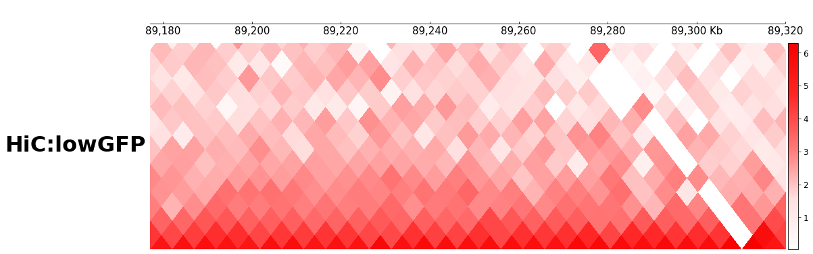
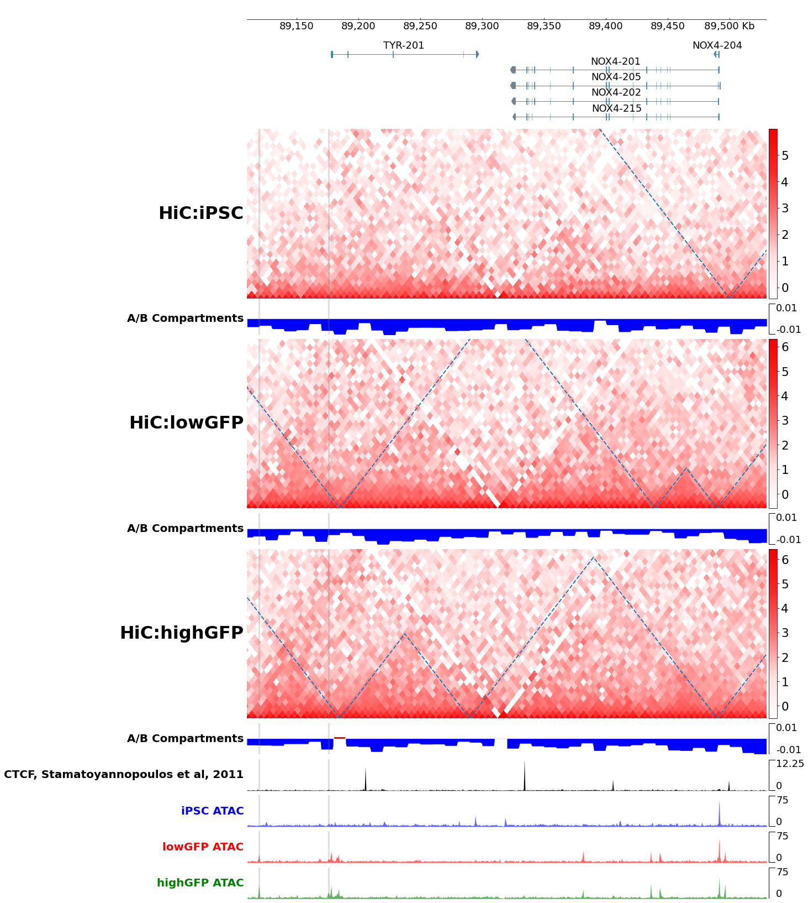
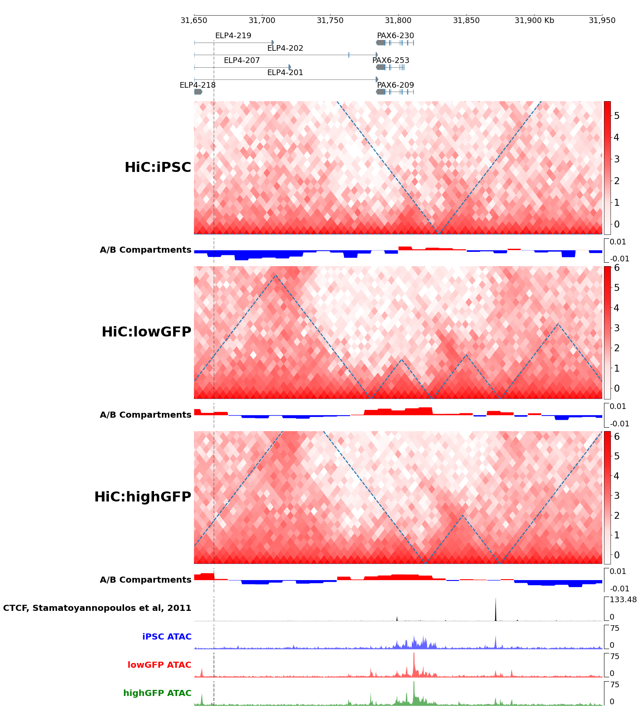
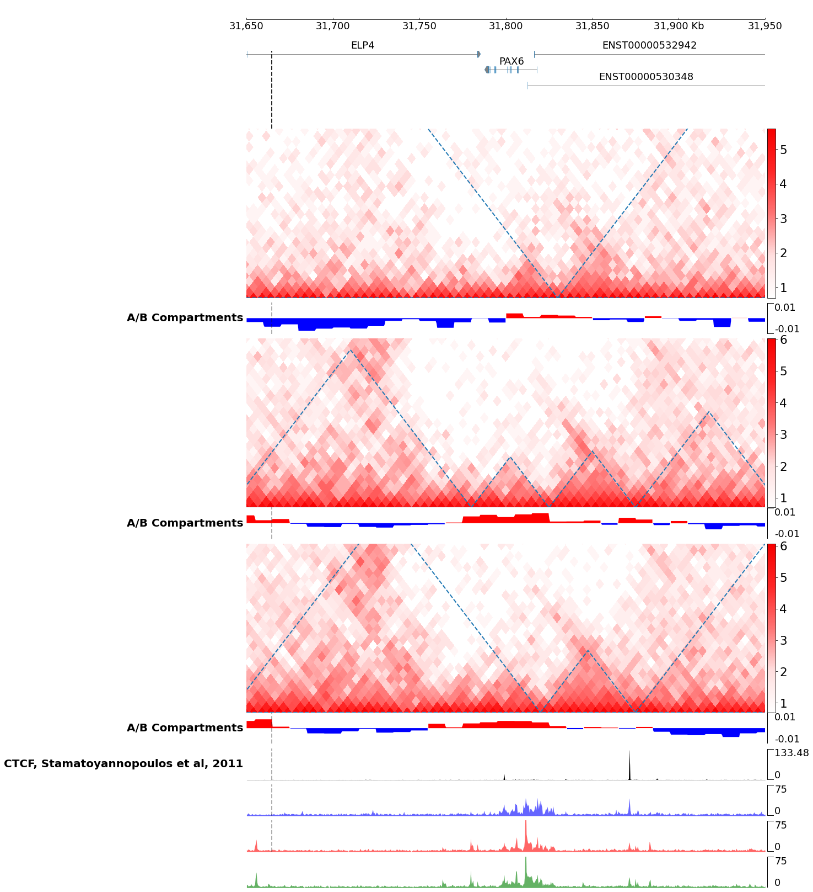
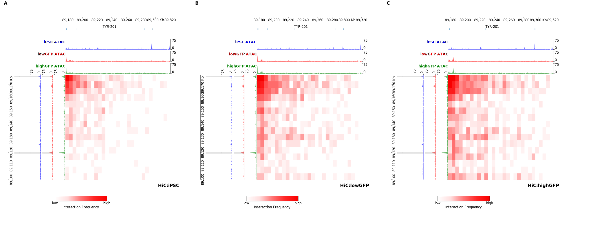
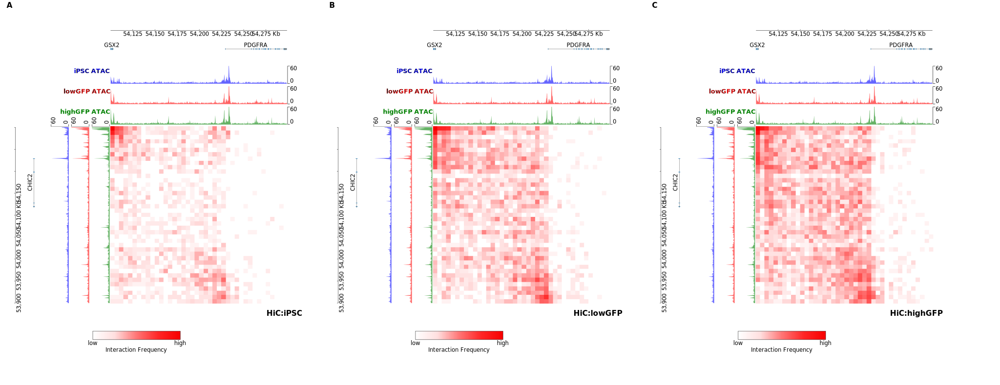
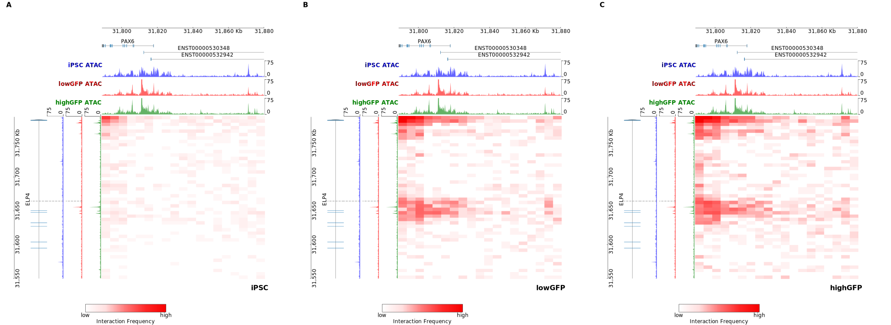
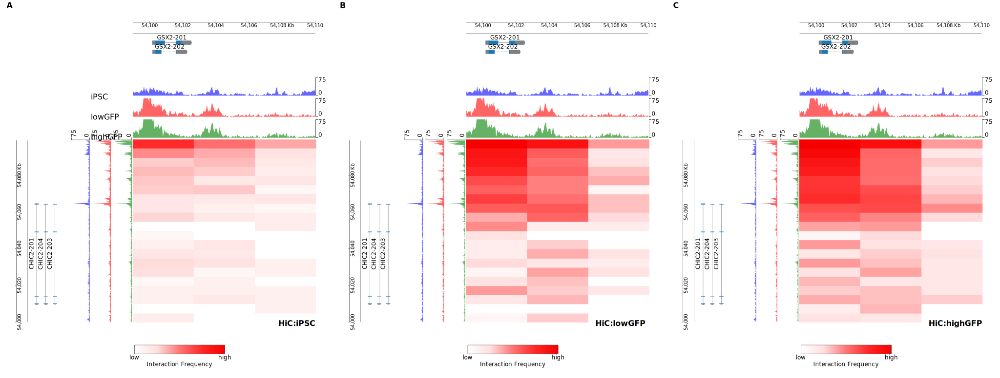
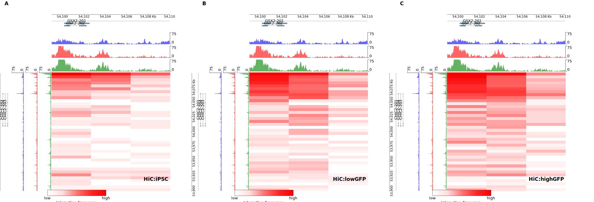
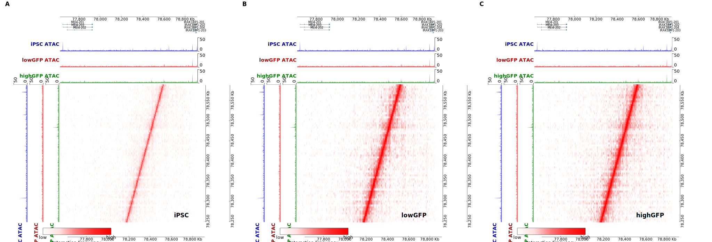

```python
import coolbox
import numpy as np
from coolbox.api import *

coolbox.__version__
```


    '0.3.8'


```python
togo="chr11:89177000-89320000"
sox3="chrX:140268872-140680010"
gsx2="chr4:54099523-54102498"
mitf="chr3:69489464-70700000"
rpe65="chr1:68270543-68492071"

xlfdenh="6:78482422-78483259"
xlfdr="chr6:77623866-78913097"
xlfd="chr6:78248406-78587613"

tyry="chr11:89100000-89176999"
tyrenh="11:89119248-89120196"
tyrenh2="11:89175609-89176296"
tyrx="chr11:89110000-89530000"
locus = [("11", 31664396)]

gsx2enh1="4:54097181-54097770"
gsx2enh2="4:54098134-54098794"
gsx2enh3="4:54066873-54067464"
gsx2enh4="4:54077662-54078570"
gsx2enh5="4:54082007-54082677"

```


```python
bwdir="/home/kayak/projects/temesgen/data/bw/"
hicdir="/home/kayak/projects/temesgen/data/coolers"
gtf="/home/kayak/projects/temesgen/data/Homo_sapiens.104.gtf.gz"
iPSC=HiCMat(f"{hicdir}/iPSC.hic")
lowGFP=HiCMat(f"{hicdir}/lowGFP.hic")
highGFP=HiCMat(f"{hicdir}/highGFP.hic")
dr=0.5
iPSC_5K_KR=Cool("data/coolers/iPSC.mcool",balance="KR",depth_ratio=dr,resolution=5000)
lowGFP_5K_KR=Cool(f"{hicdir}/lowGFP.mcool",balance="KR",depth_ratio=dr,resolution=5000)
highGFP_5K_KR=Cool(f"{hicdir}/highGFP.mcool",balance="KR",depth_ratio=dr,resolution=5000)

hls=HighLights(tyrenh2,color="gray",alpha=0.2)+HighLights(tyrenh,color="gray",alpha=0.2)
#    HighLights(gsx2enh1,color="gray",alpha=0.2)+HighLights(gsx2enh2,color="gray",alpha=0.2)+\
#    HighLights(gsx2enh3,color="gray",alpha=0.2)+HighLights(gsx2enh4,color="gray",alpha=0.2)+\
#    HighLights(gsx2enh5,color="gray",alpha=0.2)+HighLights(xlfdenh,color="gray",alpha=0.2)


iPSC_ATAC=BigWig(f"{bwdir}iPSC.bw",color="blue",alpha=1)
lowGFP_ATAC=BigWig(f"{bwdir}RFP.bulkATAC.bw",color="red",alpha=1)
highGFP_ATAC=BigWig(f"{bwdir}GFP.bulkATAC.bw",color="green",alpha=1)

atacframe1=\
    BigWig(f"{bwdir}iPSC.bw",color="blue",alpha=0.6,)+hls+Vlines(locus,line_width=2,alpha=0.2)+\
    Spacer(0.3) + \
    BigWig(f"{bwdir}RFP.bulkATAC.bw",color="red",alpha=0.6)+hls+Vlines(locus,line_width=2,alpha=0.2)+\
    Spacer(0.3) + \
    BigWig(f"{bwdir}GFP.bulkATAC.bw",color="green",alpha=0.6)
atacframe1 *= MinValue(0)
atacframe1 *= MaxValue(75)
```


```python
atacframe=\
    BigWig(f"{bwdir}iPSC.bw",color="blue",alpha=0.6,)+hls+Vlines(locus,line_width=2,alpha=0.2)+\
    Title(title='iPSC ATAC',fontsize=20,weight='bold',tcolor='blue')+\
    Spacer(0.3) + \
    BigWig(f"{bwdir}RFP.bulkATAC.bw",color="red",alpha=0.6)+hls+Vlines(locus,line_width=2,alpha=0.2)+Vlines(locus,line_width=2,alpha=0.2)+\
    Title(title='lowGFP ATAC',fontsize=20,weight='bold',tcolor='red')+\
    Spacer(0.3) + \
    BigWig(f"{bwdir}GFP.bulkATAC.bw",color="green",alpha=0.6)+hls+Vlines(locus,line_width=2,alpha=0.2)+Vlines(locus,line_width=2,alpha=0.2)+\
    Title(title='highGFP ATAC',fontsize=20,weight='bold',tcolor='green')
atacframe *= MinValue(0)
atacframe *= MaxValue(75)

ctcfbw=BigWig("/home/kayak/projects/temesgen/data/bw/ENCFF932GDV.bw",min_value=0,color="black")+MinValue(0)+Vlines(locus,line_width=2,alpha=0.2)+\
       Title(title='CTCF, Stamatoyannopoulos et al, 2011',fontsize=20,weight='bold',tcolor='black')
abchbw=BigWig("/home/kayak/projects/temesgen/data/bw/highGFP_10K_PC1.bw",style='stairfill',color="blue",threshold_color="red",threshold=0,max_value=0.01)+MinValue(-0.01)+\
       Title(title='A/B Compartments',fontsize=20,weight='bold',tcolor='black')
abclbw=BigWig("/home/kayak/projects/temesgen/data/bw/lowGFP_10K_PC1.bw",color="blue",threshold_color="red",threshold=0,min_value=-0.01,max_value=0.01)+\
       Title(title='A/B Compartments',fontsize=20,weight='bold',tcolor='black')
abcibw=BigWig("/home/kayak/projects/temesgen/data/bw/iPSC_10K_PC1.bw",color="blue",threshold_color="red",threshold=0,min_value=-0.01,max_value=0.01)+\
       Title(title='A/B Compartments',fontsize=20,weight='bold',tcolor='black')

tadi=TADCoverage("data/tads/iPSC_5000_KR_005_001_domains.bed",border_only=True,alpha=1)
tadl=TADCoverage("data/tads/lowGFP_5000_KR_005_001_domains.bed",border_only=True,alpha=1)
tadh=TADCoverage("data/tads/highGFP_5000_KR_005_001_domains.bed",border_only=True,alpha=1)

ihic = DotHiC("data/coolers/iPSC.hic", balance="KR", cmap="JuiceBoxLike",resolution=5000,depth_ratio=dr)+Vlines(locus,line_width=2,alpha=0.2)+\
       Title(title='HiC:iPSC',fontsize=32,weight='bold',tcolor='black')
lhic = DotHiC("data/coolers/lowGFP.hic", balance="KR", cmap="JuiceBoxLike", resolution=5000,depth_ratio=dr)+Vlines(locus,line_width=2,alpha=0.2)+\
       Title(title='HiC:lowGFP',fontsize=32,weight='bold',tcolor='black')
hhic = DotHiC("data/coolers/highGFP.hic", balance="KR", cmap="JuiceBoxLike", resolution=5000,depth_ratio=dr)+Vlines(locus,line_width=2,alpha=0.2)+\
       Title(title='HiC:highGFP',fontsize=32,weight='bold',tcolor='black')
```


```python
lowbw=XAxis()+lhic
lowbw.goto(togo)
lowbw.plot()
```


    

    


```python
import matplotlib.pyplot as plt
plt.rcParams.update({'font.size': 18})
bed=BED("data/Homo_sapiens.GRCh38.105.bed",num_rows=5,fontsize=18, row_height=1)+TrackHeight(5)
hfig=XAxis(fontsize=18)+Spacer(1)+bed+ihic+hls+tadi+Spacer(0.3)+hls+abcibw+hls+Spacer(0.3)+lhic+hls+tadl+Spacer(0.3)+abclbw+hls+Spacer(0.3)+hhic+hls+tadh+Spacer(0.3)+abchbw+hls+Spacer(0.3)+ctcfbw+hls+Spacer(0.3)+atacframe

fig=plt.figure()
ftyrx=hfig.goto(tyrx)
hfig.plot()
#figtyrx=hfig.plot()
#figtyrx.savefig("tyrx.svg",bbox_inches='tight',dpi=300)
#figtyrx.savefig("tyrx.pdf",bbox_inches='tight',dpi=300)
```

    [W::hts_idx_load2] The index file is older than the data file: data/Homo_sapiens.GRCh38.105.bed.bgz.tbi
    [W::hts_idx_load2] The index file is older than the data file: data/Homo_sapiens.GRCh38.105.bed.bgz.tbi
    [W::hts_idx_load2] The index file is older than the data file: data/tads/iPSC_5000_KR_005_001_domains.bed.bgz.tbi
    [W::hts_idx_load2] The index file is older than the data file: data/tads/lowGFP_5000_KR_005_001_domains.bed.bgz.tbi
    [W::hts_idx_load2] The index file is older than the data file: data/tads/highGFP_5000_KR_005_001_domains.bed.bgz.tbi


    

    


    <Figure size 432x288 with 0 Axes>


```python
import svgutils
from svgutils.compose import *
temp=SVG("tyrx.svg")
x=temp.width
y=temp.height

svgtyrx2=svgutils.compose.Figure(x,y,
                 SVG("tyrx.svg"))
svgtyrx2.save("tyrx2.svg")
svgtyrx2
```


```python
import matplotlib.pyplot as plt
plt.rcParams.update({'font.size': 18})
pax6="chr11:31650000-31950000"
whole="chr4:54100163-54298745"
gsx2="chr4:53900000-54100162"
bed=BED("data/Homo_sapiens.GRCh38.105.bed",num_rows=5,fontsize=18, row_height=1)+TrackHeight(5)
hfig=XAxis(fontsize=18)+Spacer(1)+bed+Vlines(locus,line_width=2,alpha=0.2)+ihic+hls+tadi+Spacer(0.3)+hls+abcibw+Vlines(locus,line_width=2,alpha=0.2)+hls+Spacer(0.3)+lhic+hls+tadl+Spacer(0.3)+abclbw+Vlines(locus,line_width=2,alpha=0.2)+hls+Spacer(0.3)+hhic+hls+tadh+Spacer(0.3)+abchbw+Vlines(locus,line_width=2,alpha=0.2)+hls+Spacer(0.3)+ctcfbw+hls+Spacer(0.3)+atacframe

fig=plt.figure()
ftyrx=hfig.goto(pax6)
hfig.plot()
figtyrx=hfig.plot()
#figtyrx.savefig("pax6x.svg",bbox_inches='tight',dpi=300)
#figtyrx.savefig("pax6x.pdf",bbox_inches='tight',dpi=300)
```

    [W::hts_idx_load2] The index file is older than the data file: data/Homo_sapiens.GRCh38.105.bed.bgz.tbi
    [W::hts_idx_load2] The index file is older than the data file: data/Homo_sapiens.GRCh38.105.bed.bgz.tbi
    [W::hts_idx_load2] The index file is older than the data file: data/tads/iPSC_5000_KR_005_001_domains.bed.bgz.tbi
    [W::hts_idx_load2] The index file is older than the data file: data/tads/iPSC_5000_KR_005_001_domains.bed.bgz.tbi
    [W::hts_idx_load2] The index file is older than the data file: data/tads/lowGFP_5000_KR_005_001_domains.bed.bgz.tbi
    [W::hts_idx_load2] The index file is older than the data file: data/tads/lowGFP_5000_KR_005_001_domains.bed.bgz.tbi
    [W::hts_idx_load2] The index file is older than the data file: data/tads/highGFP_5000_KR_005_001_domains.bed.bgz.tbi
    [W::hts_idx_load2] The index file is older than the data file: data/tads/highGFP_5000_KR_005_001_domains.bed.bgz.tbi


    

    


    <Figure size 432x288 with 0 Axes>


```python
import matplotlib.pyplot as plt
plt.rcParams.update({'font.size': 18})
gsx2x="chr4:53900000-54298745"
bed=BED("data/gsx2.bed",num_rows=5,fontsize=18, row_height=1)+TrackHeight(5)
atacframe *= MinValue(0)
atacframe *= MaxValue(60)
hfig=XAxis(fontsize=18)+Spacer(1)+bed+Vlines(locus,line_width=2,alpha=0.2)+ihic+hls+tadi+Spacer(0.3)+hls+abcibw+Vlines(locus,line_width=2,alpha=0.2)+hls+Spacer(0.3)+lhic+hls+tadl+Spacer(0.3)+abclbw+Vlines(locus,line_width=2,alpha=0.2)+hls+Spacer(0.3)+hhic+hls+tadh+Spacer(0.3)+abchbw+Vlines(locus,line_width=2,alpha=0.2)+hls+Spacer(0.3)+ctcfbw+hls+Spacer(0.3)+atacframe

fig=plt.figure()
ftyrx=hfig.goto(gsx2x)
fgsx2x=hfig.plot(gsx2x)
fgsx2x.savefig("gsx2x.svg",bbox_inches='tight',dpi=300)
#figtyrx.savefig("pax6x.pdf",bbox_inches='tight',dpi=300)
```

    [W::hts_idx_load2] The index file is older than the data file: data/gsx2.bed.bgz.tbi
    [W::hts_idx_load2] The index file is older than the data file: data/gsx2.bed.bgz.tbi
    [ERROR:base.py:274 -       plot_coverages()] Error occured when plot track's coverage:
    	track name: BED.67
    	track type:<class 'coolbox.core.track.bed.bed.BED'>
    	coverage name: Vlines.146
    	cov type: <class 'coolbox.core.coverage.vlines.Vlines'>
    	Error: <class 'KeyError'> '4'
    [ERROR:base.py:275 -       plot_coverages()] '4'
    Traceback (most recent call last):
      File "/home/kayak/.local/lib/python3.7/site-packages/coolbox/core/track/base.py", line 268, in plot_coverages
        cov.plot(ax, copy(gr), gr2=copy(gr2))
      File "/home/kayak/.local/lib/python3.7/site-packages/coolbox/core/coverage/vlines.py", line 24, in plot
        vlines_list = self.fetch_data(gr)
      File "/home/kayak/.local/lib/python3.7/site-packages/coolbox/core/coverage/vlines.py", line 15, in fetch_data
        for region in sorted(self.vlines_intval_tree[gr.chrom][gr.start - 1:gr.end + 1]):
    KeyError: '4'
    [ERROR:base.py:274 -       plot_coverages()] Error occured when plot track's coverage:
    	track name: DotHiC.7
    	track type:<class 'coolbox.core.track.hicmat.dothic.DotHiC'>
    	coverage name: Vlines.11
    	cov type: <class 'coolbox.core.coverage.vlines.Vlines'>
    	Error: <class 'KeyError'> '4'
    [ERROR:base.py:275 -       plot_coverages()] '4'
    Traceback (most recent call last):
      File "/home/kayak/.local/lib/python3.7/site-packages/coolbox/core/track/base.py", line 268, in plot_coverages
        cov.plot(ax, copy(gr), gr2=copy(gr2))
      File "/home/kayak/.local/lib/python3.7/site-packages/coolbox/core/coverage/vlines.py", line 24, in plot
        vlines_list = self.fetch_data(gr)
      File "/home/kayak/.local/lib/python3.7/site-packages/coolbox/core/coverage/vlines.py", line 15, in fetch_data
        for region in sorted(self.vlines_intval_tree[gr.chrom][gr.start - 1:gr.end + 1]):
    KeyError: '4'
    [ERROR:base.py:274 -       plot_coverages()] Error occured when plot track's coverage:
    	track name: DotHiC.7
    	track type:<class 'coolbox.core.track.hicmat.dothic.DotHiC'>
    	coverage name: HighLights.3
    	cov type: <class 'coolbox.core.coverage.highlights.HighLights'>
    	Error: <class 'KeyError'> '4'
    [ERROR:base.py:275 -       plot_coverages()] '4'
    Traceback (most recent call last):
      File "/home/kayak/.local/lib/python3.7/site-packages/coolbox/core/track/base.py", line 268, in plot_coverages
        cov.plot(ax, copy(gr), gr2=copy(gr2))
      File "/home/kayak/.local/lib/python3.7/site-packages/coolbox/core/coverage/highlights.py", line 30, in plot
        regions = self.fetch_data(gr, **kwargs)
      File "/home/kayak/.local/lib/python3.7/site-packages/coolbox/core/coverage/highlights.py", line 24, in fetch_data
        self.interval_tree[gr.chrom][gr.start - 10000 : gr.end + 10000]
    KeyError: '4'
    [ERROR:base.py:274 -       plot_coverages()] Error occured when plot track's coverage:
    	track name: DotHiC.7
    	track type:<class 'coolbox.core.track.hicmat.dothic.DotHiC'>
    	coverage name: HighLights.4
    	cov type: <class 'coolbox.core.coverage.highlights.HighLights'>
    	Error: <class 'KeyError'> '4'
    [ERROR:base.py:275 -       plot_coverages()] '4'
    Traceback (most recent call last):
      File "/home/kayak/.local/lib/python3.7/site-packages/coolbox/core/track/base.py", line 268, in plot_coverages
        cov.plot(ax, copy(gr), gr2=copy(gr2))
      File "/home/kayak/.local/lib/python3.7/site-packages/coolbox/core/coverage/highlights.py", line 30, in plot
        regions = self.fetch_data(gr, **kwargs)
      File "/home/kayak/.local/lib/python3.7/site-packages/coolbox/core/coverage/highlights.py", line 24, in fetch_data
        self.interval_tree[gr.chrom][gr.start - 10000 : gr.end + 10000]
    KeyError: '4'
    [W::hts_idx_load2] The index file is older than the data file: data/tads/iPSC_5000_KR_005_001_domains.bed.bgz.tbi
    [ERROR:base.py:274 -       plot_coverages()] Error occured when plot track's coverage:
    	track name: DotHiC.7
    	track type:<class 'coolbox.core.track.hicmat.dothic.DotHiC'>
    	coverage name: HighLights.3
    	cov type: <class 'coolbox.core.coverage.highlights.HighLights'>
    	Error: <class 'KeyError'> '4'
    [ERROR:base.py:275 -       plot_coverages()] '4'
    Traceback (most recent call last):
      File "/home/kayak/.local/lib/python3.7/site-packages/coolbox/core/track/base.py", line 268, in plot_coverages
        cov.plot(ax, copy(gr), gr2=copy(gr2))
      File "/home/kayak/.local/lib/python3.7/site-packages/coolbox/core/coverage/highlights.py", line 30, in plot
        regions = self.fetch_data(gr, **kwargs)
      File "/home/kayak/.local/lib/python3.7/site-packages/coolbox/core/coverage/highlights.py", line 24, in fetch_data
        self.interval_tree[gr.chrom][gr.start - 10000 : gr.end + 10000]
    KeyError: '4'
    [ERROR:base.py:274 -       plot_coverages()] Error occured when plot track's coverage:
    	track name: DotHiC.7
    	track type:<class 'coolbox.core.track.hicmat.dothic.DotHiC'>
    	coverage name: HighLights.4
    	cov type: <class 'coolbox.core.coverage.highlights.HighLights'>
    	Error: <class 'KeyError'> '4'
    [ERROR:base.py:275 -       plot_coverages()] '4'
    Traceback (most recent call last):
      File "/home/kayak/.local/lib/python3.7/site-packages/coolbox/core/track/base.py", line 268, in plot_coverages
        cov.plot(ax, copy(gr), gr2=copy(gr2))
      File "/home/kayak/.local/lib/python3.7/site-packages/coolbox/core/coverage/highlights.py", line 30, in plot
        regions = self.fetch_data(gr, **kwargs)
      File "/home/kayak/.local/lib/python3.7/site-packages/coolbox/core/coverage/highlights.py", line 24, in fetch_data
        self.interval_tree[gr.chrom][gr.start - 10000 : gr.end + 10000]
    KeyError: '4'
    [W::hts_idx_load2] The index file is older than the data file: data/tads/iPSC_5000_KR_005_001_domains.bed.bgz.tbi
    [ERROR:base.py:274 -       plot_coverages()] Error occured when plot track's coverage:
    	track name: DotHiC.7
    	track type:<class 'coolbox.core.track.hicmat.dothic.DotHiC'>
    	coverage name: HighLights.3
    	cov type: <class 'coolbox.core.coverage.highlights.HighLights'>
    	Error: <class 'KeyError'> '4'
    [ERROR:base.py:275 -       plot_coverages()] '4'
    Traceback (most recent call last):
      File "/home/kayak/.local/lib/python3.7/site-packages/coolbox/core/track/base.py", line 268, in plot_coverages
        cov.plot(ax, copy(gr), gr2=copy(gr2))
      File "/home/kayak/.local/lib/python3.7/site-packages/coolbox/core/coverage/highlights.py", line 30, in plot
        regions = self.fetch_data(gr, **kwargs)
      File "/home/kayak/.local/lib/python3.7/site-packages/coolbox/core/coverage/highlights.py", line 24, in fetch_data
        self.interval_tree[gr.chrom][gr.start - 10000 : gr.end + 10000]
    KeyError: '4'
    [ERROR:base.py:274 -       plot_coverages()] Error occured when plot track's coverage:
    	track name: DotHiC.7
    	track type:<class 'coolbox.core.track.hicmat.dothic.DotHiC'>
    	coverage name: HighLights.4
    	cov type: <class 'coolbox.core.coverage.highlights.HighLights'>
    	Error: <class 'KeyError'> '4'
    [ERROR:base.py:275 -       plot_coverages()] '4'
    Traceback (most recent call last):
      File "/home/kayak/.local/lib/python3.7/site-packages/coolbox/core/track/base.py", line 268, in plot_coverages
        cov.plot(ax, copy(gr), gr2=copy(gr2))
      File "/home/kayak/.local/lib/python3.7/site-packages/coolbox/core/coverage/highlights.py", line 30, in plot
        regions = self.fetch_data(gr, **kwargs)
      File "/home/kayak/.local/lib/python3.7/site-packages/coolbox/core/coverage/highlights.py", line 24, in fetch_data
        self.interval_tree[gr.chrom][gr.start - 10000 : gr.end + 10000]
    KeyError: '4'
    [W::hts_idx_load2] The index file is older than the data file: data/tads/iPSC_5000_KR_005_001_domains.bed.bgz.tbi
    [ERROR:base.py:274 -       plot_coverages()] Error occured when plot track's coverage:
    	track name: DotHiC.7
    	track type:<class 'coolbox.core.track.hicmat.dothic.DotHiC'>
    	coverage name: HighLights.3
    	cov type: <class 'coolbox.core.coverage.highlights.HighLights'>
    	Error: <class 'KeyError'> '4'
    [ERROR:base.py:275 -       plot_coverages()] '4'
    Traceback (most recent call last):
      File "/home/kayak/.local/lib/python3.7/site-packages/coolbox/core/track/base.py", line 268, in plot_coverages
        cov.plot(ax, copy(gr), gr2=copy(gr2))
      File "/home/kayak/.local/lib/python3.7/site-packages/coolbox/core/coverage/highlights.py", line 30, in plot
        regions = self.fetch_data(gr, **kwargs)
      File "/home/kayak/.local/lib/python3.7/site-packages/coolbox/core/coverage/highlights.py", line 24, in fetch_data
        self.interval_tree[gr.chrom][gr.start - 10000 : gr.end + 10000]
    KeyError: '4'
    [ERROR:base.py:274 -       plot_coverages()] Error occured when plot track's coverage:
    	track name: DotHiC.7
    	track type:<class 'coolbox.core.track.hicmat.dothic.DotHiC'>
    	coverage name: HighLights.4
    	cov type: <class 'coolbox.core.coverage.highlights.HighLights'>
    	Error: <class 'KeyError'> '4'
    [ERROR:base.py:275 -       plot_coverages()] '4'
    Traceback (most recent call last):
      File "/home/kayak/.local/lib/python3.7/site-packages/coolbox/core/track/base.py", line 268, in plot_coverages
        cov.plot(ax, copy(gr), gr2=copy(gr2))
      File "/home/kayak/.local/lib/python3.7/site-packages/coolbox/core/coverage/highlights.py", line 30, in plot
        regions = self.fetch_data(gr, **kwargs)
      File "/home/kayak/.local/lib/python3.7/site-packages/coolbox/core/coverage/highlights.py", line 24, in fetch_data
        self.interval_tree[gr.chrom][gr.start - 10000 : gr.end + 10000]
    KeyError: '4'
    [W::hts_idx_load2] The index file is older than the data file: data/tads/iPSC_5000_KR_005_001_domains.bed.bgz.tbi
    [ERROR:base.py:274 -       plot_coverages()] Error occured when plot track's coverage:
    	track name: DotHiC.7
    	track type:<class 'coolbox.core.track.hicmat.dothic.DotHiC'>
    	coverage name: HighLights.3
    	cov type: <class 'coolbox.core.coverage.highlights.HighLights'>
    	Error: <class 'KeyError'> '4'
    [ERROR:base.py:275 -       plot_coverages()] '4'
    Traceback (most recent call last):
      File "/home/kayak/.local/lib/python3.7/site-packages/coolbox/core/track/base.py", line 268, in plot_coverages
        cov.plot(ax, copy(gr), gr2=copy(gr2))
      File "/home/kayak/.local/lib/python3.7/site-packages/coolbox/core/coverage/highlights.py", line 30, in plot
        regions = self.fetch_data(gr, **kwargs)
      File "/home/kayak/.local/lib/python3.7/site-packages/coolbox/core/coverage/highlights.py", line 24, in fetch_data
        self.interval_tree[gr.chrom][gr.start - 10000 : gr.end + 10000]
    KeyError: '4'
    [ERROR:base.py:274 -       plot_coverages()] Error occured when plot track's coverage:
    	track name: DotHiC.7
    	track type:<class 'coolbox.core.track.hicmat.dothic.DotHiC'>
    	coverage name: HighLights.4
    	cov type: <class 'coolbox.core.coverage.highlights.HighLights'>
    	Error: <class 'KeyError'> '4'
    [ERROR:base.py:275 -       plot_coverages()] '4'
    Traceback (most recent call last):
      File "/home/kayak/.local/lib/python3.7/site-packages/coolbox/core/track/base.py", line 268, in plot_coverages
        cov.plot(ax, copy(gr), gr2=copy(gr2))
      File "/home/kayak/.local/lib/python3.7/site-packages/coolbox/core/coverage/highlights.py", line 30, in plot
        regions = self.fetch_data(gr, **kwargs)
      File "/home/kayak/.local/lib/python3.7/site-packages/coolbox/core/coverage/highlights.py", line 24, in fetch_data
        self.interval_tree[gr.chrom][gr.start - 10000 : gr.end + 10000]
    KeyError: '4'
    [W::hts_idx_load2] The index file is older than the data file: data/tads/iPSC_5000_KR_005_001_domains.bed.bgz.tbi
    [ERROR:base.py:274 -       plot_coverages()] Error occured when plot track's coverage:
    	track name: DotHiC.7
    	track type:<class 'coolbox.core.track.hicmat.dothic.DotHiC'>
    	coverage name: HighLights.3
    	cov type: <class 'coolbox.core.coverage.highlights.HighLights'>
    	Error: <class 'KeyError'> '4'
    [ERROR:base.py:275 -       plot_coverages()] '4'
    Traceback (most recent call last):
      File "/home/kayak/.local/lib/python3.7/site-packages/coolbox/core/track/base.py", line 268, in plot_coverages
        cov.plot(ax, copy(gr), gr2=copy(gr2))
      File "/home/kayak/.local/lib/python3.7/site-packages/coolbox/core/coverage/highlights.py", line 30, in plot
        regions = self.fetch_data(gr, **kwargs)
      File "/home/kayak/.local/lib/python3.7/site-packages/coolbox/core/coverage/highlights.py", line 24, in fetch_data
        self.interval_tree[gr.chrom][gr.start - 10000 : gr.end + 10000]
    KeyError: '4'
    [ERROR:base.py:274 -       plot_coverages()] Error occured when plot track's coverage:
    	track name: DotHiC.7
    	track type:<class 'coolbox.core.track.hicmat.dothic.DotHiC'>
    	coverage name: HighLights.4
    	cov type: <class 'coolbox.core.coverage.highlights.HighLights'>
    	Error: <class 'KeyError'> '4'
    [ERROR:base.py:275 -       plot_coverages()] '4'
    Traceback (most recent call last):
      File "/home/kayak/.local/lib/python3.7/site-packages/coolbox/core/track/base.py", line 268, in plot_coverages
        cov.plot(ax, copy(gr), gr2=copy(gr2))
      File "/home/kayak/.local/lib/python3.7/site-packages/coolbox/core/coverage/highlights.py", line 30, in plot
        regions = self.fetch_data(gr, **kwargs)
      File "/home/kayak/.local/lib/python3.7/site-packages/coolbox/core/coverage/highlights.py", line 24, in fetch_data
        self.interval_tree[gr.chrom][gr.start - 10000 : gr.end + 10000]
    KeyError: '4'
    [W::hts_idx_load2] The index file is older than the data file: data/tads/iPSC_5000_KR_005_001_domains.bed.bgz.tbi
    [ERROR:base.py:274 -       plot_coverages()] Error occured when plot track's coverage:
    	track name: DotHiC.7
    	track type:<class 'coolbox.core.track.hicmat.dothic.DotHiC'>
    	coverage name: HighLights.3
    	cov type: <class 'coolbox.core.coverage.highlights.HighLights'>
    	Error: <class 'KeyError'> '4'
    [ERROR:base.py:275 -       plot_coverages()] '4'
    Traceback (most recent call last):
      File "/home/kayak/.local/lib/python3.7/site-packages/coolbox/core/track/base.py", line 268, in plot_coverages
        cov.plot(ax, copy(gr), gr2=copy(gr2))
      File "/home/kayak/.local/lib/python3.7/site-packages/coolbox/core/coverage/highlights.py", line 30, in plot
        regions = self.fetch_data(gr, **kwargs)
      File "/home/kayak/.local/lib/python3.7/site-packages/coolbox/core/coverage/highlights.py", line 24, in fetch_data
        self.interval_tree[gr.chrom][gr.start - 10000 : gr.end + 10000]
    KeyError: '4'
    [ERROR:base.py:274 -       plot_coverages()] Error occured when plot track's coverage:
    	track name: DotHiC.7
    	track type:<class 'coolbox.core.track.hicmat.dothic.DotHiC'>
    	coverage name: HighLights.4
    	cov type: <class 'coolbox.core.coverage.highlights.HighLights'>
    	Error: <class 'KeyError'> '4'
    [ERROR:base.py:275 -       plot_coverages()] '4'
    Traceback (most recent call last):
      File "/home/kayak/.local/lib/python3.7/site-packages/coolbox/core/track/base.py", line 268, in plot_coverages
        cov.plot(ax, copy(gr), gr2=copy(gr2))
      File "/home/kayak/.local/lib/python3.7/site-packages/coolbox/core/coverage/highlights.py", line 30, in plot
        regions = self.fetch_data(gr, **kwargs)
      File "/home/kayak/.local/lib/python3.7/site-packages/coolbox/core/coverage/highlights.py", line 24, in fetch_data
        self.interval_tree[gr.chrom][gr.start - 10000 : gr.end + 10000]
    KeyError: '4'
    [W::hts_idx_load2] The index file is older than the data file: data/tads/iPSC_5000_KR_005_001_domains.bed.bgz.tbi
    [ERROR:base.py:274 -       plot_coverages()] Error occured when plot track's coverage:
    	track name: DotHiC.7
    	track type:<class 'coolbox.core.track.hicmat.dothic.DotHiC'>
    	coverage name: HighLights.3
    	cov type: <class 'coolbox.core.coverage.highlights.HighLights'>
    	Error: <class 'KeyError'> '4'
    [ERROR:base.py:275 -       plot_coverages()] '4'
    Traceback (most recent call last):
      File "/home/kayak/.local/lib/python3.7/site-packages/coolbox/core/track/base.py", line 268, in plot_coverages
        cov.plot(ax, copy(gr), gr2=copy(gr2))
      File "/home/kayak/.local/lib/python3.7/site-packages/coolbox/core/coverage/highlights.py", line 30, in plot
        regions = self.fetch_data(gr, **kwargs)
      File "/home/kayak/.local/lib/python3.7/site-packages/coolbox/core/coverage/highlights.py", line 24, in fetch_data
        self.interval_tree[gr.chrom][gr.start - 10000 : gr.end + 10000]
    KeyError: '4'
    [ERROR:base.py:274 -       plot_coverages()] Error occured when plot track's coverage:
    	track name: DotHiC.7
    	track type:<class 'coolbox.core.track.hicmat.dothic.DotHiC'>
    	coverage name: HighLights.4
    	cov type: <class 'coolbox.core.coverage.highlights.HighLights'>
    	Error: <class 'KeyError'> '4'
    [ERROR:base.py:275 -       plot_coverages()] '4'
    Traceback (most recent call last):
      File "/home/kayak/.local/lib/python3.7/site-packages/coolbox/core/track/base.py", line 268, in plot_coverages
        cov.plot(ax, copy(gr), gr2=copy(gr2))
      File "/home/kayak/.local/lib/python3.7/site-packages/coolbox/core/coverage/highlights.py", line 30, in plot
        regions = self.fetch_data(gr, **kwargs)
      File "/home/kayak/.local/lib/python3.7/site-packages/coolbox/core/coverage/highlights.py", line 24, in fetch_data
        self.interval_tree[gr.chrom][gr.start - 10000 : gr.end + 10000]
    KeyError: '4'
    [W::hts_idx_load2] The index file is older than the data file: data/tads/iPSC_5000_KR_005_001_domains.bed.bgz.tbi
    [ERROR:base.py:274 -       plot_coverages()] Error occured when plot track's coverage:
    	track name: DotHiC.7
    	track type:<class 'coolbox.core.track.hicmat.dothic.DotHiC'>
    	coverage name: HighLights.3
    	cov type: <class 'coolbox.core.coverage.highlights.HighLights'>
    	Error: <class 'KeyError'> '4'
    [ERROR:base.py:275 -       plot_coverages()] '4'
    Traceback (most recent call last):
      File "/home/kayak/.local/lib/python3.7/site-packages/coolbox/core/track/base.py", line 268, in plot_coverages
        cov.plot(ax, copy(gr), gr2=copy(gr2))
      File "/home/kayak/.local/lib/python3.7/site-packages/coolbox/core/coverage/highlights.py", line 30, in plot
        regions = self.fetch_data(gr, **kwargs)
      File "/home/kayak/.local/lib/python3.7/site-packages/coolbox/core/coverage/highlights.py", line 24, in fetch_data
        self.interval_tree[gr.chrom][gr.start - 10000 : gr.end + 10000]
    KeyError: '4'
    [ERROR:base.py:274 -       plot_coverages()] Error occured when plot track's coverage:
    	track name: DotHiC.7
    	track type:<class 'coolbox.core.track.hicmat.dothic.DotHiC'>
    	coverage name: HighLights.4
    	cov type: <class 'coolbox.core.coverage.highlights.HighLights'>
    	Error: <class 'KeyError'> '4'
    [ERROR:base.py:275 -       plot_coverages()] '4'
    Traceback (most recent call last):
      File "/home/kayak/.local/lib/python3.7/site-packages/coolbox/core/track/base.py", line 268, in plot_coverages
        cov.plot(ax, copy(gr), gr2=copy(gr2))
      File "/home/kayak/.local/lib/python3.7/site-packages/coolbox/core/coverage/highlights.py", line 30, in plot
        regions = self.fetch_data(gr, **kwargs)
      File "/home/kayak/.local/lib/python3.7/site-packages/coolbox/core/coverage/highlights.py", line 24, in fetch_data
        self.interval_tree[gr.chrom][gr.start - 10000 : gr.end + 10000]
    KeyError: '4'
    [W::hts_idx_load2] The index file is older than the data file: data/tads/iPSC_5000_KR_005_001_domains.bed.bgz.tbi
    [ERROR:base.py:274 -       plot_coverages()] Error occured when plot track's coverage:
    	track name: Spacer.201
    	track type:<class 'coolbox.core.track.pseudo.Spacer'>
    	coverage name: HighLights.3
    	cov type: <class 'coolbox.core.coverage.highlights.HighLights'>
    	Error: <class 'KeyError'> '4'
    [ERROR:base.py:275 -       plot_coverages()] '4'
    Traceback (most recent call last):
      File "/home/kayak/.local/lib/python3.7/site-packages/coolbox/core/track/base.py", line 268, in plot_coverages
        cov.plot(ax, copy(gr), gr2=copy(gr2))
      File "/home/kayak/.local/lib/python3.7/site-packages/coolbox/core/coverage/highlights.py", line 30, in plot
        regions = self.fetch_data(gr, **kwargs)
      File "/home/kayak/.local/lib/python3.7/site-packages/coolbox/core/coverage/highlights.py", line 24, in fetch_data
        self.interval_tree[gr.chrom][gr.start - 10000 : gr.end + 10000]
    KeyError: '4'
    [ERROR:base.py:274 -       plot_coverages()] Error occured when plot track's coverage:
    	track name: Spacer.201
    	track type:<class 'coolbox.core.track.pseudo.Spacer'>
    	coverage name: HighLights.4
    	cov type: <class 'coolbox.core.coverage.highlights.HighLights'>
    	Error: <class 'KeyError'> '4'
    [ERROR:base.py:275 -       plot_coverages()] '4'
    Traceback (most recent call last):
      File "/home/kayak/.local/lib/python3.7/site-packages/coolbox/core/track/base.py", line 268, in plot_coverages
        cov.plot(ax, copy(gr), gr2=copy(gr2))
      File "/home/kayak/.local/lib/python3.7/site-packages/coolbox/core/coverage/highlights.py", line 30, in plot
        regions = self.fetch_data(gr, **kwargs)
      File "/home/kayak/.local/lib/python3.7/site-packages/coolbox/core/coverage/highlights.py", line 24, in fetch_data
        self.interval_tree[gr.chrom][gr.start - 10000 : gr.end + 10000]
    KeyError: '4'
    [ERROR:base.py:274 -       plot_coverages()] Error occured when plot track's coverage:
    	track name: BigWig.38
    	track type:<class 'coolbox.core.track.hist.bigwig.BigWig'>
    	coverage name: HighLights.3
    	cov type: <class 'coolbox.core.coverage.highlights.HighLights'>
    	Error: <class 'KeyError'> '4'
    [ERROR:base.py:275 -       plot_coverages()] '4'
    Traceback (most recent call last):
      File "/home/kayak/.local/lib/python3.7/site-packages/coolbox/core/track/base.py", line 268, in plot_coverages
        cov.plot(ax, copy(gr), gr2=copy(gr2))
      File "/home/kayak/.local/lib/python3.7/site-packages/coolbox/core/coverage/highlights.py", line 30, in plot
        regions = self.fetch_data(gr, **kwargs)
      File "/home/kayak/.local/lib/python3.7/site-packages/coolbox/core/coverage/highlights.py", line 24, in fetch_data
        self.interval_tree[gr.chrom][gr.start - 10000 : gr.end + 10000]
    KeyError: '4'
    [ERROR:base.py:274 -       plot_coverages()] Error occured when plot track's coverage:
    	track name: BigWig.38
    	track type:<class 'coolbox.core.track.hist.bigwig.BigWig'>
    	coverage name: HighLights.4
    	cov type: <class 'coolbox.core.coverage.highlights.HighLights'>
    	Error: <class 'KeyError'> '4'
    [ERROR:base.py:275 -       plot_coverages()] '4'
    Traceback (most recent call last):
      File "/home/kayak/.local/lib/python3.7/site-packages/coolbox/core/track/base.py", line 268, in plot_coverages
        cov.plot(ax, copy(gr), gr2=copy(gr2))
      File "/home/kayak/.local/lib/python3.7/site-packages/coolbox/core/coverage/highlights.py", line 30, in plot
        regions = self.fetch_data(gr, **kwargs)
      File "/home/kayak/.local/lib/python3.7/site-packages/coolbox/core/coverage/highlights.py", line 24, in fetch_data
        self.interval_tree[gr.chrom][gr.start - 10000 : gr.end + 10000]
    KeyError: '4'
    [ERROR:base.py:274 -       plot_coverages()] Error occured when plot track's coverage:
    	track name: BigWig.38
    	track type:<class 'coolbox.core.track.hist.bigwig.BigWig'>
    	coverage name: Vlines.15
    	cov type: <class 'coolbox.core.coverage.vlines.Vlines'>
    	Error: <class 'KeyError'> '4'
    [ERROR:base.py:275 -       plot_coverages()] '4'
    Traceback (most recent call last):
      File "/home/kayak/.local/lib/python3.7/site-packages/coolbox/core/track/base.py", line 268, in plot_coverages
        cov.plot(ax, copy(gr), gr2=copy(gr2))
      File "/home/kayak/.local/lib/python3.7/site-packages/coolbox/core/coverage/vlines.py", line 24, in plot
        vlines_list = self.fetch_data(gr)
      File "/home/kayak/.local/lib/python3.7/site-packages/coolbox/core/coverage/vlines.py", line 15, in fetch_data
        for region in sorted(self.vlines_intval_tree[gr.chrom][gr.start - 1:gr.end + 1]):
    KeyError: '4'
    [ERROR:base.py:274 -       plot_coverages()] Error occured when plot track's coverage:
    	track name: BigWig.38
    	track type:<class 'coolbox.core.track.hist.bigwig.BigWig'>
    	coverage name: HighLights.3
    	cov type: <class 'coolbox.core.coverage.highlights.HighLights'>
    	Error: <class 'KeyError'> '4'
    [ERROR:base.py:275 -       plot_coverages()] '4'
    Traceback (most recent call last):
      File "/home/kayak/.local/lib/python3.7/site-packages/coolbox/core/track/base.py", line 268, in plot_coverages
        cov.plot(ax, copy(gr), gr2=copy(gr2))
      File "/home/kayak/.local/lib/python3.7/site-packages/coolbox/core/coverage/highlights.py", line 30, in plot
        regions = self.fetch_data(gr, **kwargs)
      File "/home/kayak/.local/lib/python3.7/site-packages/coolbox/core/coverage/highlights.py", line 24, in fetch_data
        self.interval_tree[gr.chrom][gr.start - 10000 : gr.end + 10000]
    KeyError: '4'
    [ERROR:base.py:274 -       plot_coverages()] Error occured when plot track's coverage:
    	track name: BigWig.38
    	track type:<class 'coolbox.core.track.hist.bigwig.BigWig'>
    	coverage name: HighLights.4
    	cov type: <class 'coolbox.core.coverage.highlights.HighLights'>
    	Error: <class 'KeyError'> '4'
    [ERROR:base.py:275 -       plot_coverages()] '4'
    Traceback (most recent call last):
      File "/home/kayak/.local/lib/python3.7/site-packages/coolbox/core/track/base.py", line 268, in plot_coverages
        cov.plot(ax, copy(gr), gr2=copy(gr2))
      File "/home/kayak/.local/lib/python3.7/site-packages/coolbox/core/coverage/highlights.py", line 30, in plot
        regions = self.fetch_data(gr, **kwargs)
      File "/home/kayak/.local/lib/python3.7/site-packages/coolbox/core/coverage/highlights.py", line 24, in fetch_data
        self.interval_tree[gr.chrom][gr.start - 10000 : gr.end + 10000]
    KeyError: '4'
    [ERROR:base.py:274 -       plot_coverages()] Error occured when plot track's coverage:
    	track name: BigWig.38
    	track type:<class 'coolbox.core.track.hist.bigwig.BigWig'>
    	coverage name: Vlines.123
    	cov type: <class 'coolbox.core.coverage.vlines.Vlines'>
    	Error: <class 'KeyError'> '4'
    [ERROR:base.py:275 -       plot_coverages()] '4'
    Traceback (most recent call last):
      File "/home/kayak/.local/lib/python3.7/site-packages/coolbox/core/track/base.py", line 268, in plot_coverages
        cov.plot(ax, copy(gr), gr2=copy(gr2))
      File "/home/kayak/.local/lib/python3.7/site-packages/coolbox/core/coverage/vlines.py", line 24, in plot
        vlines_list = self.fetch_data(gr)
      File "/home/kayak/.local/lib/python3.7/site-packages/coolbox/core/coverage/vlines.py", line 15, in fetch_data
        for region in sorted(self.vlines_intval_tree[gr.chrom][gr.start - 1:gr.end + 1]):
    KeyError: '4'
    [ERROR:base.py:274 -       plot_coverages()] Error occured when plot track's coverage:
    	track name: BigWig.38
    	track type:<class 'coolbox.core.track.hist.bigwig.BigWig'>
    	coverage name: HighLights.3
    	cov type: <class 'coolbox.core.coverage.highlights.HighLights'>
    	Error: <class 'KeyError'> '4'
    [ERROR:base.py:275 -       plot_coverages()] '4'
    Traceback (most recent call last):
      File "/home/kayak/.local/lib/python3.7/site-packages/coolbox/core/track/base.py", line 268, in plot_coverages
        cov.plot(ax, copy(gr), gr2=copy(gr2))
      File "/home/kayak/.local/lib/python3.7/site-packages/coolbox/core/coverage/highlights.py", line 30, in plot
        regions = self.fetch_data(gr, **kwargs)
      File "/home/kayak/.local/lib/python3.7/site-packages/coolbox/core/coverage/highlights.py", line 24, in fetch_data
        self.interval_tree[gr.chrom][gr.start - 10000 : gr.end + 10000]
    KeyError: '4'
    [ERROR:base.py:274 -       plot_coverages()] Error occured when plot track's coverage:
    	track name: BigWig.38
    	track type:<class 'coolbox.core.track.hist.bigwig.BigWig'>
    	coverage name: HighLights.4
    	cov type: <class 'coolbox.core.coverage.highlights.HighLights'>
    	Error: <class 'KeyError'> '4'
    [ERROR:base.py:275 -       plot_coverages()] '4'
    Traceback (most recent call last):
      File "/home/kayak/.local/lib/python3.7/site-packages/coolbox/core/track/base.py", line 268, in plot_coverages
        cov.plot(ax, copy(gr), gr2=copy(gr2))
      File "/home/kayak/.local/lib/python3.7/site-packages/coolbox/core/coverage/highlights.py", line 30, in plot
        regions = self.fetch_data(gr, **kwargs)
      File "/home/kayak/.local/lib/python3.7/site-packages/coolbox/core/coverage/highlights.py", line 24, in fetch_data
        self.interval_tree[gr.chrom][gr.start - 10000 : gr.end + 10000]
    KeyError: '4'
    [ERROR:base.py:274 -       plot_coverages()] Error occured when plot track's coverage:
    	track name: BigWig.38
    	track type:<class 'coolbox.core.track.hist.bigwig.BigWig'>
    	coverage name: Vlines.127
    	cov type: <class 'coolbox.core.coverage.vlines.Vlines'>
    	Error: <class 'KeyError'> '4'
    [ERROR:base.py:275 -       plot_coverages()] '4'
    Traceback (most recent call last):
      File "/home/kayak/.local/lib/python3.7/site-packages/coolbox/core/track/base.py", line 268, in plot_coverages
        cov.plot(ax, copy(gr), gr2=copy(gr2))
      File "/home/kayak/.local/lib/python3.7/site-packages/coolbox/core/coverage/vlines.py", line 24, in plot
        vlines_list = self.fetch_data(gr)
      File "/home/kayak/.local/lib/python3.7/site-packages/coolbox/core/coverage/vlines.py", line 15, in fetch_data
        for region in sorted(self.vlines_intval_tree[gr.chrom][gr.start - 1:gr.end + 1]):
    KeyError: '4'
    [ERROR:base.py:274 -       plot_coverages()] Error occured when plot track's coverage:
    	track name: BigWig.38
    	track type:<class 'coolbox.core.track.hist.bigwig.BigWig'>
    	coverage name: HighLights.3
    	cov type: <class 'coolbox.core.coverage.highlights.HighLights'>
    	Error: <class 'KeyError'> '4'
    [ERROR:base.py:275 -       plot_coverages()] '4'
    Traceback (most recent call last):
      File "/home/kayak/.local/lib/python3.7/site-packages/coolbox/core/track/base.py", line 268, in plot_coverages
        cov.plot(ax, copy(gr), gr2=copy(gr2))
      File "/home/kayak/.local/lib/python3.7/site-packages/coolbox/core/coverage/highlights.py", line 30, in plot
        regions = self.fetch_data(gr, **kwargs)
      File "/home/kayak/.local/lib/python3.7/site-packages/coolbox/core/coverage/highlights.py", line 24, in fetch_data
        self.interval_tree[gr.chrom][gr.start - 10000 : gr.end + 10000]
    KeyError: '4'
    [ERROR:base.py:274 -       plot_coverages()] Error occured when plot track's coverage:
    	track name: BigWig.38
    	track type:<class 'coolbox.core.track.hist.bigwig.BigWig'>
    	coverage name: HighLights.4
    	cov type: <class 'coolbox.core.coverage.highlights.HighLights'>
    	Error: <class 'KeyError'> '4'
    [ERROR:base.py:275 -       plot_coverages()] '4'
    Traceback (most recent call last):
      File "/home/kayak/.local/lib/python3.7/site-packages/coolbox/core/track/base.py", line 268, in plot_coverages
        cov.plot(ax, copy(gr), gr2=copy(gr2))
      File "/home/kayak/.local/lib/python3.7/site-packages/coolbox/core/coverage/highlights.py", line 30, in plot
        regions = self.fetch_data(gr, **kwargs)
      File "/home/kayak/.local/lib/python3.7/site-packages/coolbox/core/coverage/highlights.py", line 24, in fetch_data
        self.interval_tree[gr.chrom][gr.start - 10000 : gr.end + 10000]
    KeyError: '4'
    [ERROR:base.py:274 -       plot_coverages()] Error occured when plot track's coverage:
    	track name: BigWig.38
    	track type:<class 'coolbox.core.track.hist.bigwig.BigWig'>
    	coverage name: Vlines.131
    	cov type: <class 'coolbox.core.coverage.vlines.Vlines'>
    	Error: <class 'KeyError'> '4'
    [ERROR:base.py:275 -       plot_coverages()] '4'
    Traceback (most recent call last):
      File "/home/kayak/.local/lib/python3.7/site-packages/coolbox/core/track/base.py", line 268, in plot_coverages
        cov.plot(ax, copy(gr), gr2=copy(gr2))
      File "/home/kayak/.local/lib/python3.7/site-packages/coolbox/core/coverage/vlines.py", line 24, in plot
        vlines_list = self.fetch_data(gr)
      File "/home/kayak/.local/lib/python3.7/site-packages/coolbox/core/coverage/vlines.py", line 15, in fetch_data
        for region in sorted(self.vlines_intval_tree[gr.chrom][gr.start - 1:gr.end + 1]):
    KeyError: '4'
    [ERROR:base.py:274 -       plot_coverages()] Error occured when plot track's coverage:
    	track name: BigWig.38
    	track type:<class 'coolbox.core.track.hist.bigwig.BigWig'>
    	coverage name: HighLights.3
    	cov type: <class 'coolbox.core.coverage.highlights.HighLights'>
    	Error: <class 'KeyError'> '4'
    [ERROR:base.py:275 -       plot_coverages()] '4'
    Traceback (most recent call last):
      File "/home/kayak/.local/lib/python3.7/site-packages/coolbox/core/track/base.py", line 268, in plot_coverages
        cov.plot(ax, copy(gr), gr2=copy(gr2))
      File "/home/kayak/.local/lib/python3.7/site-packages/coolbox/core/coverage/highlights.py", line 30, in plot
        regions = self.fetch_data(gr, **kwargs)
      File "/home/kayak/.local/lib/python3.7/site-packages/coolbox/core/coverage/highlights.py", line 24, in fetch_data
        self.interval_tree[gr.chrom][gr.start - 10000 : gr.end + 10000]
    KeyError: '4'
    [ERROR:base.py:274 -       plot_coverages()] Error occured when plot track's coverage:
    	track name: BigWig.38
    	track type:<class 'coolbox.core.track.hist.bigwig.BigWig'>
    	coverage name: HighLights.4
    	cov type: <class 'coolbox.core.coverage.highlights.HighLights'>
    	Error: <class 'KeyError'> '4'
    [ERROR:base.py:275 -       plot_coverages()] '4'
    Traceback (most recent call last):
      File "/home/kayak/.local/lib/python3.7/site-packages/coolbox/core/track/base.py", line 268, in plot_coverages
        cov.plot(ax, copy(gr), gr2=copy(gr2))
      File "/home/kayak/.local/lib/python3.7/site-packages/coolbox/core/coverage/highlights.py", line 30, in plot
        regions = self.fetch_data(gr, **kwargs)
      File "/home/kayak/.local/lib/python3.7/site-packages/coolbox/core/coverage/highlights.py", line 24, in fetch_data
        self.interval_tree[gr.chrom][gr.start - 10000 : gr.end + 10000]
    KeyError: '4'
    [ERROR:base.py:274 -       plot_coverages()] Error occured when plot track's coverage:
    	track name: BigWig.38
    	track type:<class 'coolbox.core.track.hist.bigwig.BigWig'>
    	coverage name: Vlines.135
    	cov type: <class 'coolbox.core.coverage.vlines.Vlines'>
    	Error: <class 'KeyError'> '4'
    [ERROR:base.py:275 -       plot_coverages()] '4'
    Traceback (most recent call last):
      File "/home/kayak/.local/lib/python3.7/site-packages/coolbox/core/track/base.py", line 268, in plot_coverages
        cov.plot(ax, copy(gr), gr2=copy(gr2))
      File "/home/kayak/.local/lib/python3.7/site-packages/coolbox/core/coverage/vlines.py", line 24, in plot
        vlines_list = self.fetch_data(gr)
      File "/home/kayak/.local/lib/python3.7/site-packages/coolbox/core/coverage/vlines.py", line 15, in fetch_data
        for region in sorted(self.vlines_intval_tree[gr.chrom][gr.start - 1:gr.end + 1]):
    KeyError: '4'
    [ERROR:base.py:274 -       plot_coverages()] Error occured when plot track's coverage:
    	track name: BigWig.38
    	track type:<class 'coolbox.core.track.hist.bigwig.BigWig'>
    	coverage name: HighLights.3
    	cov type: <class 'coolbox.core.coverage.highlights.HighLights'>
    	Error: <class 'KeyError'> '4'
    [ERROR:base.py:275 -       plot_coverages()] '4'
    Traceback (most recent call last):
      File "/home/kayak/.local/lib/python3.7/site-packages/coolbox/core/track/base.py", line 268, in plot_coverages
        cov.plot(ax, copy(gr), gr2=copy(gr2))
      File "/home/kayak/.local/lib/python3.7/site-packages/coolbox/core/coverage/highlights.py", line 30, in plot
        regions = self.fetch_data(gr, **kwargs)
      File "/home/kayak/.local/lib/python3.7/site-packages/coolbox/core/coverage/highlights.py", line 24, in fetch_data
        self.interval_tree[gr.chrom][gr.start - 10000 : gr.end + 10000]
    KeyError: '4'
    [ERROR:base.py:274 -       plot_coverages()] Error occured when plot track's coverage:
    	track name: BigWig.38
    	track type:<class 'coolbox.core.track.hist.bigwig.BigWig'>
    	coverage name: HighLights.4
    	cov type: <class 'coolbox.core.coverage.highlights.HighLights'>
    	Error: <class 'KeyError'> '4'
    [ERROR:base.py:275 -       plot_coverages()] '4'
    Traceback (most recent call last):
      File "/home/kayak/.local/lib/python3.7/site-packages/coolbox/core/track/base.py", line 268, in plot_coverages
        cov.plot(ax, copy(gr), gr2=copy(gr2))
      File "/home/kayak/.local/lib/python3.7/site-packages/coolbox/core/coverage/highlights.py", line 30, in plot
        regions = self.fetch_data(gr, **kwargs)
      File "/home/kayak/.local/lib/python3.7/site-packages/coolbox/core/coverage/highlights.py", line 24, in fetch_data
        self.interval_tree[gr.chrom][gr.start - 10000 : gr.end + 10000]
    KeyError: '4'
    [ERROR:base.py:274 -       plot_coverages()] Error occured when plot track's coverage:
    	track name: BigWig.38
    	track type:<class 'coolbox.core.track.hist.bigwig.BigWig'>
    	coverage name: Vlines.139
    	cov type: <class 'coolbox.core.coverage.vlines.Vlines'>
    	Error: <class 'KeyError'> '4'
    [ERROR:base.py:275 -       plot_coverages()] '4'
    Traceback (most recent call last):
      File "/home/kayak/.local/lib/python3.7/site-packages/coolbox/core/track/base.py", line 268, in plot_coverages
        cov.plot(ax, copy(gr), gr2=copy(gr2))
      File "/home/kayak/.local/lib/python3.7/site-packages/coolbox/core/coverage/vlines.py", line 24, in plot
        vlines_list = self.fetch_data(gr)
      File "/home/kayak/.local/lib/python3.7/site-packages/coolbox/core/coverage/vlines.py", line 15, in fetch_data
        for region in sorted(self.vlines_intval_tree[gr.chrom][gr.start - 1:gr.end + 1]):
    KeyError: '4'
    [ERROR:base.py:274 -       plot_coverages()] Error occured when plot track's coverage:
    	track name: BigWig.38
    	track type:<class 'coolbox.core.track.hist.bigwig.BigWig'>
    	coverage name: HighLights.3
    	cov type: <class 'coolbox.core.coverage.highlights.HighLights'>
    	Error: <class 'KeyError'> '4'
    [ERROR:base.py:275 -       plot_coverages()] '4'
    Traceback (most recent call last):
      File "/home/kayak/.local/lib/python3.7/site-packages/coolbox/core/track/base.py", line 268, in plot_coverages
        cov.plot(ax, copy(gr), gr2=copy(gr2))
      File "/home/kayak/.local/lib/python3.7/site-packages/coolbox/core/coverage/highlights.py", line 30, in plot
        regions = self.fetch_data(gr, **kwargs)
      File "/home/kayak/.local/lib/python3.7/site-packages/coolbox/core/coverage/highlights.py", line 24, in fetch_data
        self.interval_tree[gr.chrom][gr.start - 10000 : gr.end + 10000]
    KeyError: '4'
    [ERROR:base.py:274 -       plot_coverages()] Error occured when plot track's coverage:
    	track name: BigWig.38
    	track type:<class 'coolbox.core.track.hist.bigwig.BigWig'>
    	coverage name: HighLights.4
    	cov type: <class 'coolbox.core.coverage.highlights.HighLights'>
    	Error: <class 'KeyError'> '4'
    [ERROR:base.py:275 -       plot_coverages()] '4'
    Traceback (most recent call last):
      File "/home/kayak/.local/lib/python3.7/site-packages/coolbox/core/track/base.py", line 268, in plot_coverages
        cov.plot(ax, copy(gr), gr2=copy(gr2))
      File "/home/kayak/.local/lib/python3.7/site-packages/coolbox/core/coverage/highlights.py", line 30, in plot
        regions = self.fetch_data(gr, **kwargs)
      File "/home/kayak/.local/lib/python3.7/site-packages/coolbox/core/coverage/highlights.py", line 24, in fetch_data
        self.interval_tree[gr.chrom][gr.start - 10000 : gr.end + 10000]
    KeyError: '4'
    [ERROR:base.py:274 -       plot_coverages()] Error occured when plot track's coverage:
    	track name: BigWig.38
    	track type:<class 'coolbox.core.track.hist.bigwig.BigWig'>
    	coverage name: Vlines.143
    	cov type: <class 'coolbox.core.coverage.vlines.Vlines'>
    	Error: <class 'KeyError'> '4'
    [ERROR:base.py:275 -       plot_coverages()] '4'
    Traceback (most recent call last):
      File "/home/kayak/.local/lib/python3.7/site-packages/coolbox/core/track/base.py", line 268, in plot_coverages
        cov.plot(ax, copy(gr), gr2=copy(gr2))
      File "/home/kayak/.local/lib/python3.7/site-packages/coolbox/core/coverage/vlines.py", line 24, in plot
        vlines_list = self.fetch_data(gr)
      File "/home/kayak/.local/lib/python3.7/site-packages/coolbox/core/coverage/vlines.py", line 15, in fetch_data
        for region in sorted(self.vlines_intval_tree[gr.chrom][gr.start - 1:gr.end + 1]):
    KeyError: '4'
    [ERROR:base.py:274 -       plot_coverages()] Error occured when plot track's coverage:
    	track name: BigWig.38
    	track type:<class 'coolbox.core.track.hist.bigwig.BigWig'>
    	coverage name: HighLights.3
    	cov type: <class 'coolbox.core.coverage.highlights.HighLights'>
    	Error: <class 'KeyError'> '4'
    [ERROR:base.py:275 -       plot_coverages()] '4'
    Traceback (most recent call last):
      File "/home/kayak/.local/lib/python3.7/site-packages/coolbox/core/track/base.py", line 268, in plot_coverages
        cov.plot(ax, copy(gr), gr2=copy(gr2))
      File "/home/kayak/.local/lib/python3.7/site-packages/coolbox/core/coverage/highlights.py", line 30, in plot
        regions = self.fetch_data(gr, **kwargs)
      File "/home/kayak/.local/lib/python3.7/site-packages/coolbox/core/coverage/highlights.py", line 24, in fetch_data
        self.interval_tree[gr.chrom][gr.start - 10000 : gr.end + 10000]
    KeyError: '4'
    [ERROR:base.py:274 -       plot_coverages()] Error occured when plot track's coverage:
    	track name: BigWig.38
    	track type:<class 'coolbox.core.track.hist.bigwig.BigWig'>
    	coverage name: HighLights.4
    	cov type: <class 'coolbox.core.coverage.highlights.HighLights'>
    	Error: <class 'KeyError'> '4'
    [ERROR:base.py:275 -       plot_coverages()] '4'
    Traceback (most recent call last):
      File "/home/kayak/.local/lib/python3.7/site-packages/coolbox/core/track/base.py", line 268, in plot_coverages
        cov.plot(ax, copy(gr), gr2=copy(gr2))
      File "/home/kayak/.local/lib/python3.7/site-packages/coolbox/core/coverage/highlights.py", line 30, in plot
        regions = self.fetch_data(gr, **kwargs)
      File "/home/kayak/.local/lib/python3.7/site-packages/coolbox/core/coverage/highlights.py", line 24, in fetch_data
        self.interval_tree[gr.chrom][gr.start - 10000 : gr.end + 10000]
    KeyError: '4'
    [ERROR:base.py:274 -       plot_coverages()] Error occured when plot track's coverage:
    	track name: BigWig.38
    	track type:<class 'coolbox.core.track.hist.bigwig.BigWig'>
    	coverage name: Vlines.147
    	cov type: <class 'coolbox.core.coverage.vlines.Vlines'>
    	Error: <class 'KeyError'> '4'
    [ERROR:base.py:275 -       plot_coverages()] '4'
    Traceback (most recent call last):
      File "/home/kayak/.local/lib/python3.7/site-packages/coolbox/core/track/base.py", line 268, in plot_coverages
        cov.plot(ax, copy(gr), gr2=copy(gr2))
      File "/home/kayak/.local/lib/python3.7/site-packages/coolbox/core/coverage/vlines.py", line 24, in plot
        vlines_list = self.fetch_data(gr)
      File "/home/kayak/.local/lib/python3.7/site-packages/coolbox/core/coverage/vlines.py", line 15, in fetch_data
        for region in sorted(self.vlines_intval_tree[gr.chrom][gr.start - 1:gr.end + 1]):
    KeyError: '4'
    [ERROR:base.py:274 -       plot_coverages()] Error occured when plot track's coverage:
    	track name: BigWig.38
    	track type:<class 'coolbox.core.track.hist.bigwig.BigWig'>
    	coverage name: HighLights.3
    	cov type: <class 'coolbox.core.coverage.highlights.HighLights'>
    	Error: <class 'KeyError'> '4'
    [ERROR:base.py:275 -       plot_coverages()] '4'
    Traceback (most recent call last):
      File "/home/kayak/.local/lib/python3.7/site-packages/coolbox/core/track/base.py", line 268, in plot_coverages
        cov.plot(ax, copy(gr), gr2=copy(gr2))
      File "/home/kayak/.local/lib/python3.7/site-packages/coolbox/core/coverage/highlights.py", line 30, in plot
        regions = self.fetch_data(gr, **kwargs)
      File "/home/kayak/.local/lib/python3.7/site-packages/coolbox/core/coverage/highlights.py", line 24, in fetch_data
        self.interval_tree[gr.chrom][gr.start - 10000 : gr.end + 10000]
    KeyError: '4'
    [ERROR:base.py:274 -       plot_coverages()] Error occured when plot track's coverage:
    	track name: BigWig.38
    	track type:<class 'coolbox.core.track.hist.bigwig.BigWig'>
    	coverage name: HighLights.4
    	cov type: <class 'coolbox.core.coverage.highlights.HighLights'>
    	Error: <class 'KeyError'> '4'
    [ERROR:base.py:275 -       plot_coverages()] '4'
    Traceback (most recent call last):
      File "/home/kayak/.local/lib/python3.7/site-packages/coolbox/core/track/base.py", line 268, in plot_coverages
        cov.plot(ax, copy(gr), gr2=copy(gr2))
      File "/home/kayak/.local/lib/python3.7/site-packages/coolbox/core/coverage/highlights.py", line 30, in plot
        regions = self.fetch_data(gr, **kwargs)
      File "/home/kayak/.local/lib/python3.7/site-packages/coolbox/core/coverage/highlights.py", line 24, in fetch_data
        self.interval_tree[gr.chrom][gr.start - 10000 : gr.end + 10000]
    KeyError: '4'
    [ERROR:base.py:274 -       plot_coverages()] Error occured when plot track's coverage:
    	track name: DotHiC.11
    	track type:<class 'coolbox.core.track.hicmat.dothic.DotHiC'>
    	coverage name: Vlines.12
    	cov type: <class 'coolbox.core.coverage.vlines.Vlines'>
    	Error: <class 'KeyError'> '4'
    [ERROR:base.py:275 -       plot_coverages()] '4'
    Traceback (most recent call last):
      File "/home/kayak/.local/lib/python3.7/site-packages/coolbox/core/track/base.py", line 268, in plot_coverages
        cov.plot(ax, copy(gr), gr2=copy(gr2))
      File "/home/kayak/.local/lib/python3.7/site-packages/coolbox/core/coverage/vlines.py", line 24, in plot
        vlines_list = self.fetch_data(gr)
      File "/home/kayak/.local/lib/python3.7/site-packages/coolbox/core/coverage/vlines.py", line 15, in fetch_data
        for region in sorted(self.vlines_intval_tree[gr.chrom][gr.start - 1:gr.end + 1]):
    KeyError: '4'
    [ERROR:base.py:274 -       plot_coverages()] Error occured when plot track's coverage:
    	track name: DotHiC.11
    	track type:<class 'coolbox.core.track.hicmat.dothic.DotHiC'>
    	coverage name: HighLights.3
    	cov type: <class 'coolbox.core.coverage.highlights.HighLights'>
    	Error: <class 'KeyError'> '4'
    [ERROR:base.py:275 -       plot_coverages()] '4'
    Traceback (most recent call last):
      File "/home/kayak/.local/lib/python3.7/site-packages/coolbox/core/track/base.py", line 268, in plot_coverages
        cov.plot(ax, copy(gr), gr2=copy(gr2))
      File "/home/kayak/.local/lib/python3.7/site-packages/coolbox/core/coverage/highlights.py", line 30, in plot
        regions = self.fetch_data(gr, **kwargs)
      File "/home/kayak/.local/lib/python3.7/site-packages/coolbox/core/coverage/highlights.py", line 24, in fetch_data
        self.interval_tree[gr.chrom][gr.start - 10000 : gr.end + 10000]
    KeyError: '4'
    [ERROR:base.py:274 -       plot_coverages()] Error occured when plot track's coverage:
    	track name: DotHiC.11
    	track type:<class 'coolbox.core.track.hicmat.dothic.DotHiC'>
    	coverage name: HighLights.4
    	cov type: <class 'coolbox.core.coverage.highlights.HighLights'>
    	Error: <class 'KeyError'> '4'
    [ERROR:base.py:275 -       plot_coverages()] '4'
    Traceback (most recent call last):
      File "/home/kayak/.local/lib/python3.7/site-packages/coolbox/core/track/base.py", line 268, in plot_coverages
        cov.plot(ax, copy(gr), gr2=copy(gr2))
      File "/home/kayak/.local/lib/python3.7/site-packages/coolbox/core/coverage/highlights.py", line 30, in plot
        regions = self.fetch_data(gr, **kwargs)
      File "/home/kayak/.local/lib/python3.7/site-packages/coolbox/core/coverage/highlights.py", line 24, in fetch_data
        self.interval_tree[gr.chrom][gr.start - 10000 : gr.end + 10000]
    KeyError: '4'
    [W::hts_idx_load2] The index file is older than the data file: data/tads/lowGFP_5000_KR_005_001_domains.bed.bgz.tbi
    [ERROR:base.py:274 -       plot_coverages()] Error occured when plot track's coverage:
    	track name: DotHiC.11
    	track type:<class 'coolbox.core.track.hicmat.dothic.DotHiC'>
    	coverage name: HighLights.3
    	cov type: <class 'coolbox.core.coverage.highlights.HighLights'>
    	Error: <class 'KeyError'> '4'
    [ERROR:base.py:275 -       plot_coverages()] '4'
    Traceback (most recent call last):
      File "/home/kayak/.local/lib/python3.7/site-packages/coolbox/core/track/base.py", line 268, in plot_coverages
        cov.plot(ax, copy(gr), gr2=copy(gr2))
      File "/home/kayak/.local/lib/python3.7/site-packages/coolbox/core/coverage/highlights.py", line 30, in plot
        regions = self.fetch_data(gr, **kwargs)
      File "/home/kayak/.local/lib/python3.7/site-packages/coolbox/core/coverage/highlights.py", line 24, in fetch_data
        self.interval_tree[gr.chrom][gr.start - 10000 : gr.end + 10000]
    KeyError: '4'
    [ERROR:base.py:274 -       plot_coverages()] Error occured when plot track's coverage:
    	track name: DotHiC.11
    	track type:<class 'coolbox.core.track.hicmat.dothic.DotHiC'>
    	coverage name: HighLights.4
    	cov type: <class 'coolbox.core.coverage.highlights.HighLights'>
    	Error: <class 'KeyError'> '4'
    [ERROR:base.py:275 -       plot_coverages()] '4'
    Traceback (most recent call last):
      File "/home/kayak/.local/lib/python3.7/site-packages/coolbox/core/track/base.py", line 268, in plot_coverages
        cov.plot(ax, copy(gr), gr2=copy(gr2))
      File "/home/kayak/.local/lib/python3.7/site-packages/coolbox/core/coverage/highlights.py", line 30, in plot
        regions = self.fetch_data(gr, **kwargs)
      File "/home/kayak/.local/lib/python3.7/site-packages/coolbox/core/coverage/highlights.py", line 24, in fetch_data
        self.interval_tree[gr.chrom][gr.start - 10000 : gr.end + 10000]
    KeyError: '4'
    [W::hts_idx_load2] The index file is older than the data file: data/tads/lowGFP_5000_KR_005_001_domains.bed.bgz.tbi
    [ERROR:base.py:274 -       plot_coverages()] Error occured when plot track's coverage:
    	track name: DotHiC.11
    	track type:<class 'coolbox.core.track.hicmat.dothic.DotHiC'>
    	coverage name: HighLights.3
    	cov type: <class 'coolbox.core.coverage.highlights.HighLights'>
    	Error: <class 'KeyError'> '4'
    [ERROR:base.py:275 -       plot_coverages()] '4'
    Traceback (most recent call last):
      File "/home/kayak/.local/lib/python3.7/site-packages/coolbox/core/track/base.py", line 268, in plot_coverages
        cov.plot(ax, copy(gr), gr2=copy(gr2))
      File "/home/kayak/.local/lib/python3.7/site-packages/coolbox/core/coverage/highlights.py", line 30, in plot
        regions = self.fetch_data(gr, **kwargs)
      File "/home/kayak/.local/lib/python3.7/site-packages/coolbox/core/coverage/highlights.py", line 24, in fetch_data
        self.interval_tree[gr.chrom][gr.start - 10000 : gr.end + 10000]
    KeyError: '4'
    [ERROR:base.py:274 -       plot_coverages()] Error occured when plot track's coverage:
    	track name: DotHiC.11
    	track type:<class 'coolbox.core.track.hicmat.dothic.DotHiC'>
    	coverage name: HighLights.4
    	cov type: <class 'coolbox.core.coverage.highlights.HighLights'>
    	Error: <class 'KeyError'> '4'
    [ERROR:base.py:275 -       plot_coverages()] '4'
    Traceback (most recent call last):
      File "/home/kayak/.local/lib/python3.7/site-packages/coolbox/core/track/base.py", line 268, in plot_coverages
        cov.plot(ax, copy(gr), gr2=copy(gr2))
      File "/home/kayak/.local/lib/python3.7/site-packages/coolbox/core/coverage/highlights.py", line 30, in plot
        regions = self.fetch_data(gr, **kwargs)
      File "/home/kayak/.local/lib/python3.7/site-packages/coolbox/core/coverage/highlights.py", line 24, in fetch_data
        self.interval_tree[gr.chrom][gr.start - 10000 : gr.end + 10000]
    KeyError: '4'
    [W::hts_idx_load2] The index file is older than the data file: data/tads/lowGFP_5000_KR_005_001_domains.bed.bgz.tbi
    [ERROR:base.py:274 -       plot_coverages()] Error occured when plot track's coverage:
    	track name: DotHiC.11
    	track type:<class 'coolbox.core.track.hicmat.dothic.DotHiC'>
    	coverage name: HighLights.3
    	cov type: <class 'coolbox.core.coverage.highlights.HighLights'>
    	Error: <class 'KeyError'> '4'
    [ERROR:base.py:275 -       plot_coverages()] '4'
    Traceback (most recent call last):
      File "/home/kayak/.local/lib/python3.7/site-packages/coolbox/core/track/base.py", line 268, in plot_coverages
        cov.plot(ax, copy(gr), gr2=copy(gr2))
      File "/home/kayak/.local/lib/python3.7/site-packages/coolbox/core/coverage/highlights.py", line 30, in plot
        regions = self.fetch_data(gr, **kwargs)
      File "/home/kayak/.local/lib/python3.7/site-packages/coolbox/core/coverage/highlights.py", line 24, in fetch_data
        self.interval_tree[gr.chrom][gr.start - 10000 : gr.end + 10000]
    KeyError: '4'
    [ERROR:base.py:274 -       plot_coverages()] Error occured when plot track's coverage:
    	track name: DotHiC.11
    	track type:<class 'coolbox.core.track.hicmat.dothic.DotHiC'>
    	coverage name: HighLights.4
    	cov type: <class 'coolbox.core.coverage.highlights.HighLights'>
    	Error: <class 'KeyError'> '4'
    [ERROR:base.py:275 -       plot_coverages()] '4'
    Traceback (most recent call last):
      File "/home/kayak/.local/lib/python3.7/site-packages/coolbox/core/track/base.py", line 268, in plot_coverages
        cov.plot(ax, copy(gr), gr2=copy(gr2))
      File "/home/kayak/.local/lib/python3.7/site-packages/coolbox/core/coverage/highlights.py", line 30, in plot
        regions = self.fetch_data(gr, **kwargs)
      File "/home/kayak/.local/lib/python3.7/site-packages/coolbox/core/coverage/highlights.py", line 24, in fetch_data
        self.interval_tree[gr.chrom][gr.start - 10000 : gr.end + 10000]
    KeyError: '4'
    [W::hts_idx_load2] The index file is older than the data file: data/tads/lowGFP_5000_KR_005_001_domains.bed.bgz.tbi
    [ERROR:base.py:274 -       plot_coverages()] Error occured when plot track's coverage:
    	track name: DotHiC.11
    	track type:<class 'coolbox.core.track.hicmat.dothic.DotHiC'>
    	coverage name: HighLights.3
    	cov type: <class 'coolbox.core.coverage.highlights.HighLights'>
    	Error: <class 'KeyError'> '4'
    [ERROR:base.py:275 -       plot_coverages()] '4'
    Traceback (most recent call last):
      File "/home/kayak/.local/lib/python3.7/site-packages/coolbox/core/track/base.py", line 268, in plot_coverages
        cov.plot(ax, copy(gr), gr2=copy(gr2))
      File "/home/kayak/.local/lib/python3.7/site-packages/coolbox/core/coverage/highlights.py", line 30, in plot
        regions = self.fetch_data(gr, **kwargs)
      File "/home/kayak/.local/lib/python3.7/site-packages/coolbox/core/coverage/highlights.py", line 24, in fetch_data
        self.interval_tree[gr.chrom][gr.start - 10000 : gr.end + 10000]
    KeyError: '4'
    [ERROR:base.py:274 -       plot_coverages()] Error occured when plot track's coverage:
    	track name: DotHiC.11
    	track type:<class 'coolbox.core.track.hicmat.dothic.DotHiC'>
    	coverage name: HighLights.4
    	cov type: <class 'coolbox.core.coverage.highlights.HighLights'>
    	Error: <class 'KeyError'> '4'
    [ERROR:base.py:275 -       plot_coverages()] '4'
    Traceback (most recent call last):
      File "/home/kayak/.local/lib/python3.7/site-packages/coolbox/core/track/base.py", line 268, in plot_coverages
        cov.plot(ax, copy(gr), gr2=copy(gr2))
      File "/home/kayak/.local/lib/python3.7/site-packages/coolbox/core/coverage/highlights.py", line 30, in plot
        regions = self.fetch_data(gr, **kwargs)
      File "/home/kayak/.local/lib/python3.7/site-packages/coolbox/core/coverage/highlights.py", line 24, in fetch_data
        self.interval_tree[gr.chrom][gr.start - 10000 : gr.end + 10000]
    KeyError: '4'
    [W::hts_idx_load2] The index file is older than the data file: data/tads/lowGFP_5000_KR_005_001_domains.bed.bgz.tbi
    [ERROR:base.py:274 -       plot_coverages()] Error occured when plot track's coverage:
    	track name: DotHiC.11
    	track type:<class 'coolbox.core.track.hicmat.dothic.DotHiC'>
    	coverage name: HighLights.3
    	cov type: <class 'coolbox.core.coverage.highlights.HighLights'>
    	Error: <class 'KeyError'> '4'
    [ERROR:base.py:275 -       plot_coverages()] '4'
    Traceback (most recent call last):
      File "/home/kayak/.local/lib/python3.7/site-packages/coolbox/core/track/base.py", line 268, in plot_coverages
        cov.plot(ax, copy(gr), gr2=copy(gr2))
      File "/home/kayak/.local/lib/python3.7/site-packages/coolbox/core/coverage/highlights.py", line 30, in plot
        regions = self.fetch_data(gr, **kwargs)
      File "/home/kayak/.local/lib/python3.7/site-packages/coolbox/core/coverage/highlights.py", line 24, in fetch_data
        self.interval_tree[gr.chrom][gr.start - 10000 : gr.end + 10000]
    KeyError: '4'
    [ERROR:base.py:274 -       plot_coverages()] Error occured when plot track's coverage:
    	track name: DotHiC.11
    	track type:<class 'coolbox.core.track.hicmat.dothic.DotHiC'>
    	coverage name: HighLights.4
    	cov type: <class 'coolbox.core.coverage.highlights.HighLights'>
    	Error: <class 'KeyError'> '4'
    [ERROR:base.py:275 -       plot_coverages()] '4'
    Traceback (most recent call last):
      File "/home/kayak/.local/lib/python3.7/site-packages/coolbox/core/track/base.py", line 268, in plot_coverages
        cov.plot(ax, copy(gr), gr2=copy(gr2))
      File "/home/kayak/.local/lib/python3.7/site-packages/coolbox/core/coverage/highlights.py", line 30, in plot
        regions = self.fetch_data(gr, **kwargs)
      File "/home/kayak/.local/lib/python3.7/site-packages/coolbox/core/coverage/highlights.py", line 24, in fetch_data
        self.interval_tree[gr.chrom][gr.start - 10000 : gr.end + 10000]
    KeyError: '4'
    [W::hts_idx_load2] The index file is older than the data file: data/tads/lowGFP_5000_KR_005_001_domains.bed.bgz.tbi
    [ERROR:base.py:274 -       plot_coverages()] Error occured when plot track's coverage:
    	track name: DotHiC.11
    	track type:<class 'coolbox.core.track.hicmat.dothic.DotHiC'>
    	coverage name: HighLights.3
    	cov type: <class 'coolbox.core.coverage.highlights.HighLights'>
    	Error: <class 'KeyError'> '4'
    [ERROR:base.py:275 -       plot_coverages()] '4'
    Traceback (most recent call last):
      File "/home/kayak/.local/lib/python3.7/site-packages/coolbox/core/track/base.py", line 268, in plot_coverages
        cov.plot(ax, copy(gr), gr2=copy(gr2))
      File "/home/kayak/.local/lib/python3.7/site-packages/coolbox/core/coverage/highlights.py", line 30, in plot
        regions = self.fetch_data(gr, **kwargs)
      File "/home/kayak/.local/lib/python3.7/site-packages/coolbox/core/coverage/highlights.py", line 24, in fetch_data
        self.interval_tree[gr.chrom][gr.start - 10000 : gr.end + 10000]
    KeyError: '4'
    [ERROR:base.py:274 -       plot_coverages()] Error occured when plot track's coverage:
    	track name: DotHiC.11
    	track type:<class 'coolbox.core.track.hicmat.dothic.DotHiC'>
    	coverage name: HighLights.4
    	cov type: <class 'coolbox.core.coverage.highlights.HighLights'>
    	Error: <class 'KeyError'> '4'
    [ERROR:base.py:275 -       plot_coverages()] '4'
    Traceback (most recent call last):
      File "/home/kayak/.local/lib/python3.7/site-packages/coolbox/core/track/base.py", line 268, in plot_coverages
        cov.plot(ax, copy(gr), gr2=copy(gr2))
      File "/home/kayak/.local/lib/python3.7/site-packages/coolbox/core/coverage/highlights.py", line 30, in plot
        regions = self.fetch_data(gr, **kwargs)
      File "/home/kayak/.local/lib/python3.7/site-packages/coolbox/core/coverage/highlights.py", line 24, in fetch_data
        self.interval_tree[gr.chrom][gr.start - 10000 : gr.end + 10000]
    KeyError: '4'
    [W::hts_idx_load2] The index file is older than the data file: data/tads/lowGFP_5000_KR_005_001_domains.bed.bgz.tbi
    [ERROR:base.py:274 -       plot_coverages()] Error occured when plot track's coverage:
    	track name: DotHiC.11
    	track type:<class 'coolbox.core.track.hicmat.dothic.DotHiC'>
    	coverage name: HighLights.3
    	cov type: <class 'coolbox.core.coverage.highlights.HighLights'>
    	Error: <class 'KeyError'> '4'
    [ERROR:base.py:275 -       plot_coverages()] '4'
    Traceback (most recent call last):
      File "/home/kayak/.local/lib/python3.7/site-packages/coolbox/core/track/base.py", line 268, in plot_coverages
        cov.plot(ax, copy(gr), gr2=copy(gr2))
      File "/home/kayak/.local/lib/python3.7/site-packages/coolbox/core/coverage/highlights.py", line 30, in plot
        regions = self.fetch_data(gr, **kwargs)
      File "/home/kayak/.local/lib/python3.7/site-packages/coolbox/core/coverage/highlights.py", line 24, in fetch_data
        self.interval_tree[gr.chrom][gr.start - 10000 : gr.end + 10000]
    KeyError: '4'
    [ERROR:base.py:274 -       plot_coverages()] Error occured when plot track's coverage:
    	track name: DotHiC.11
    	track type:<class 'coolbox.core.track.hicmat.dothic.DotHiC'>
    	coverage name: HighLights.4
    	cov type: <class 'coolbox.core.coverage.highlights.HighLights'>
    	Error: <class 'KeyError'> '4'
    [ERROR:base.py:275 -       plot_coverages()] '4'
    Traceback (most recent call last):
      File "/home/kayak/.local/lib/python3.7/site-packages/coolbox/core/track/base.py", line 268, in plot_coverages
        cov.plot(ax, copy(gr), gr2=copy(gr2))
      File "/home/kayak/.local/lib/python3.7/site-packages/coolbox/core/coverage/highlights.py", line 30, in plot
        regions = self.fetch_data(gr, **kwargs)
      File "/home/kayak/.local/lib/python3.7/site-packages/coolbox/core/coverage/highlights.py", line 24, in fetch_data
        self.interval_tree[gr.chrom][gr.start - 10000 : gr.end + 10000]
    KeyError: '4'
    [W::hts_idx_load2] The index file is older than the data file: data/tads/lowGFP_5000_KR_005_001_domains.bed.bgz.tbi
    [ERROR:base.py:274 -       plot_coverages()] Error occured when plot track's coverage:
    	track name: DotHiC.11
    	track type:<class 'coolbox.core.track.hicmat.dothic.DotHiC'>
    	coverage name: HighLights.3
    	cov type: <class 'coolbox.core.coverage.highlights.HighLights'>
    	Error: <class 'KeyError'> '4'
    [ERROR:base.py:275 -       plot_coverages()] '4'
    Traceback (most recent call last):
      File "/home/kayak/.local/lib/python3.7/site-packages/coolbox/core/track/base.py", line 268, in plot_coverages
        cov.plot(ax, copy(gr), gr2=copy(gr2))
      File "/home/kayak/.local/lib/python3.7/site-packages/coolbox/core/coverage/highlights.py", line 30, in plot
        regions = self.fetch_data(gr, **kwargs)
      File "/home/kayak/.local/lib/python3.7/site-packages/coolbox/core/coverage/highlights.py", line 24, in fetch_data
        self.interval_tree[gr.chrom][gr.start - 10000 : gr.end + 10000]
    KeyError: '4'
    [ERROR:base.py:274 -       plot_coverages()] Error occured when plot track's coverage:
    	track name: DotHiC.11
    	track type:<class 'coolbox.core.track.hicmat.dothic.DotHiC'>
    	coverage name: HighLights.4
    	cov type: <class 'coolbox.core.coverage.highlights.HighLights'>
    	Error: <class 'KeyError'> '4'
    [ERROR:base.py:275 -       plot_coverages()] '4'
    Traceback (most recent call last):
      File "/home/kayak/.local/lib/python3.7/site-packages/coolbox/core/track/base.py", line 268, in plot_coverages
        cov.plot(ax, copy(gr), gr2=copy(gr2))
      File "/home/kayak/.local/lib/python3.7/site-packages/coolbox/core/coverage/highlights.py", line 30, in plot
        regions = self.fetch_data(gr, **kwargs)
      File "/home/kayak/.local/lib/python3.7/site-packages/coolbox/core/coverage/highlights.py", line 24, in fetch_data
        self.interval_tree[gr.chrom][gr.start - 10000 : gr.end + 10000]
    KeyError: '4'
    [W::hts_idx_load2] The index file is older than the data file: data/tads/lowGFP_5000_KR_005_001_domains.bed.bgz.tbi
    [ERROR:base.py:274 -       plot_coverages()] Error occured when plot track's coverage:
    	track name: BigWig.35
    	track type:<class 'coolbox.core.track.hist.bigwig.BigWig'>
    	coverage name: HighLights.3
    	cov type: <class 'coolbox.core.coverage.highlights.HighLights'>
    	Error: <class 'KeyError'> '4'
    [ERROR:base.py:275 -       plot_coverages()] '4'
    Traceback (most recent call last):
      File "/home/kayak/.local/lib/python3.7/site-packages/coolbox/core/track/base.py", line 268, in plot_coverages
        cov.plot(ax, copy(gr), gr2=copy(gr2))
      File "/home/kayak/.local/lib/python3.7/site-packages/coolbox/core/coverage/highlights.py", line 30, in plot
        regions = self.fetch_data(gr, **kwargs)
      File "/home/kayak/.local/lib/python3.7/site-packages/coolbox/core/coverage/highlights.py", line 24, in fetch_data
        self.interval_tree[gr.chrom][gr.start - 10000 : gr.end + 10000]
    KeyError: '4'
    [ERROR:base.py:274 -       plot_coverages()] Error occured when plot track's coverage:
    	track name: BigWig.35
    	track type:<class 'coolbox.core.track.hist.bigwig.BigWig'>
    	coverage name: HighLights.4
    	cov type: <class 'coolbox.core.coverage.highlights.HighLights'>
    	Error: <class 'KeyError'> '4'
    [ERROR:base.py:275 -       plot_coverages()] '4'
    Traceback (most recent call last):
      File "/home/kayak/.local/lib/python3.7/site-packages/coolbox/core/track/base.py", line 268, in plot_coverages
        cov.plot(ax, copy(gr), gr2=copy(gr2))
      File "/home/kayak/.local/lib/python3.7/site-packages/coolbox/core/coverage/highlights.py", line 30, in plot
        regions = self.fetch_data(gr, **kwargs)
      File "/home/kayak/.local/lib/python3.7/site-packages/coolbox/core/coverage/highlights.py", line 24, in fetch_data
        self.interval_tree[gr.chrom][gr.start - 10000 : gr.end + 10000]
    KeyError: '4'
    [ERROR:base.py:274 -       plot_coverages()] Error occured when plot track's coverage:
    	track name: BigWig.35
    	track type:<class 'coolbox.core.track.hist.bigwig.BigWig'>
    	coverage name: Vlines.16
    	cov type: <class 'coolbox.core.coverage.vlines.Vlines'>
    	Error: <class 'KeyError'> '4'
    [ERROR:base.py:275 -       plot_coverages()] '4'
    Traceback (most recent call last):
      File "/home/kayak/.local/lib/python3.7/site-packages/coolbox/core/track/base.py", line 268, in plot_coverages
        cov.plot(ax, copy(gr), gr2=copy(gr2))
      File "/home/kayak/.local/lib/python3.7/site-packages/coolbox/core/coverage/vlines.py", line 24, in plot
        vlines_list = self.fetch_data(gr)
      File "/home/kayak/.local/lib/python3.7/site-packages/coolbox/core/coverage/vlines.py", line 15, in fetch_data
        for region in sorted(self.vlines_intval_tree[gr.chrom][gr.start - 1:gr.end + 1]):
    KeyError: '4'
    [ERROR:base.py:274 -       plot_coverages()] Error occured when plot track's coverage:
    	track name: BigWig.35
    	track type:<class 'coolbox.core.track.hist.bigwig.BigWig'>
    	coverage name: HighLights.3
    	cov type: <class 'coolbox.core.coverage.highlights.HighLights'>
    	Error: <class 'KeyError'> '4'
    [ERROR:base.py:275 -       plot_coverages()] '4'
    Traceback (most recent call last):
      File "/home/kayak/.local/lib/python3.7/site-packages/coolbox/core/track/base.py", line 268, in plot_coverages
        cov.plot(ax, copy(gr), gr2=copy(gr2))
      File "/home/kayak/.local/lib/python3.7/site-packages/coolbox/core/coverage/highlights.py", line 30, in plot
        regions = self.fetch_data(gr, **kwargs)
      File "/home/kayak/.local/lib/python3.7/site-packages/coolbox/core/coverage/highlights.py", line 24, in fetch_data
        self.interval_tree[gr.chrom][gr.start - 10000 : gr.end + 10000]
    KeyError: '4'
    [ERROR:base.py:274 -       plot_coverages()] Error occured when plot track's coverage:
    	track name: BigWig.35
    	track type:<class 'coolbox.core.track.hist.bigwig.BigWig'>
    	coverage name: HighLights.4
    	cov type: <class 'coolbox.core.coverage.highlights.HighLights'>
    	Error: <class 'KeyError'> '4'
    [ERROR:base.py:275 -       plot_coverages()] '4'
    Traceback (most recent call last):
      File "/home/kayak/.local/lib/python3.7/site-packages/coolbox/core/track/base.py", line 268, in plot_coverages
        cov.plot(ax, copy(gr), gr2=copy(gr2))
      File "/home/kayak/.local/lib/python3.7/site-packages/coolbox/core/coverage/highlights.py", line 30, in plot
        regions = self.fetch_data(gr, **kwargs)
      File "/home/kayak/.local/lib/python3.7/site-packages/coolbox/core/coverage/highlights.py", line 24, in fetch_data
        self.interval_tree[gr.chrom][gr.start - 10000 : gr.end + 10000]
    KeyError: '4'
    [ERROR:base.py:274 -       plot_coverages()] Error occured when plot track's coverage:
    	track name: BigWig.35
    	track type:<class 'coolbox.core.track.hist.bigwig.BigWig'>
    	coverage name: Vlines.124
    	cov type: <class 'coolbox.core.coverage.vlines.Vlines'>
    	Error: <class 'KeyError'> '4'
    [ERROR:base.py:275 -       plot_coverages()] '4'
    Traceback (most recent call last):
      File "/home/kayak/.local/lib/python3.7/site-packages/coolbox/core/track/base.py", line 268, in plot_coverages
        cov.plot(ax, copy(gr), gr2=copy(gr2))
      File "/home/kayak/.local/lib/python3.7/site-packages/coolbox/core/coverage/vlines.py", line 24, in plot
        vlines_list = self.fetch_data(gr)
      File "/home/kayak/.local/lib/python3.7/site-packages/coolbox/core/coverage/vlines.py", line 15, in fetch_data
        for region in sorted(self.vlines_intval_tree[gr.chrom][gr.start - 1:gr.end + 1]):
    KeyError: '4'
    [ERROR:base.py:274 -       plot_coverages()] Error occured when plot track's coverage:
    	track name: BigWig.35
    	track type:<class 'coolbox.core.track.hist.bigwig.BigWig'>
    	coverage name: HighLights.3
    	cov type: <class 'coolbox.core.coverage.highlights.HighLights'>
    	Error: <class 'KeyError'> '4'
    [ERROR:base.py:275 -       plot_coverages()] '4'
    Traceback (most recent call last):
      File "/home/kayak/.local/lib/python3.7/site-packages/coolbox/core/track/base.py", line 268, in plot_coverages
        cov.plot(ax, copy(gr), gr2=copy(gr2))
      File "/home/kayak/.local/lib/python3.7/site-packages/coolbox/core/coverage/highlights.py", line 30, in plot
        regions = self.fetch_data(gr, **kwargs)
      File "/home/kayak/.local/lib/python3.7/site-packages/coolbox/core/coverage/highlights.py", line 24, in fetch_data
        self.interval_tree[gr.chrom][gr.start - 10000 : gr.end + 10000]
    KeyError: '4'
    [ERROR:base.py:274 -       plot_coverages()] Error occured when plot track's coverage:
    	track name: BigWig.35
    	track type:<class 'coolbox.core.track.hist.bigwig.BigWig'>
    	coverage name: HighLights.4
    	cov type: <class 'coolbox.core.coverage.highlights.HighLights'>
    	Error: <class 'KeyError'> '4'
    [ERROR:base.py:275 -       plot_coverages()] '4'
    Traceback (most recent call last):
      File "/home/kayak/.local/lib/python3.7/site-packages/coolbox/core/track/base.py", line 268, in plot_coverages
        cov.plot(ax, copy(gr), gr2=copy(gr2))
      File "/home/kayak/.local/lib/python3.7/site-packages/coolbox/core/coverage/highlights.py", line 30, in plot
        regions = self.fetch_data(gr, **kwargs)
      File "/home/kayak/.local/lib/python3.7/site-packages/coolbox/core/coverage/highlights.py", line 24, in fetch_data
        self.interval_tree[gr.chrom][gr.start - 10000 : gr.end + 10000]
    KeyError: '4'
    [ERROR:base.py:274 -       plot_coverages()] Error occured when plot track's coverage:
    	track name: BigWig.35
    	track type:<class 'coolbox.core.track.hist.bigwig.BigWig'>
    	coverage name: Vlines.128
    	cov type: <class 'coolbox.core.coverage.vlines.Vlines'>
    	Error: <class 'KeyError'> '4'
    [ERROR:base.py:275 -       plot_coverages()] '4'
    Traceback (most recent call last):
      File "/home/kayak/.local/lib/python3.7/site-packages/coolbox/core/track/base.py", line 268, in plot_coverages
        cov.plot(ax, copy(gr), gr2=copy(gr2))
      File "/home/kayak/.local/lib/python3.7/site-packages/coolbox/core/coverage/vlines.py", line 24, in plot
        vlines_list = self.fetch_data(gr)
      File "/home/kayak/.local/lib/python3.7/site-packages/coolbox/core/coverage/vlines.py", line 15, in fetch_data
        for region in sorted(self.vlines_intval_tree[gr.chrom][gr.start - 1:gr.end + 1]):
    KeyError: '4'
    [ERROR:base.py:274 -       plot_coverages()] Error occured when plot track's coverage:
    	track name: BigWig.35
    	track type:<class 'coolbox.core.track.hist.bigwig.BigWig'>
    	coverage name: HighLights.3
    	cov type: <class 'coolbox.core.coverage.highlights.HighLights'>
    	Error: <class 'KeyError'> '4'
    [ERROR:base.py:275 -       plot_coverages()] '4'
    Traceback (most recent call last):
      File "/home/kayak/.local/lib/python3.7/site-packages/coolbox/core/track/base.py", line 268, in plot_coverages
        cov.plot(ax, copy(gr), gr2=copy(gr2))
      File "/home/kayak/.local/lib/python3.7/site-packages/coolbox/core/coverage/highlights.py", line 30, in plot
        regions = self.fetch_data(gr, **kwargs)
      File "/home/kayak/.local/lib/python3.7/site-packages/coolbox/core/coverage/highlights.py", line 24, in fetch_data
        self.interval_tree[gr.chrom][gr.start - 10000 : gr.end + 10000]
    KeyError: '4'
    [ERROR:base.py:274 -       plot_coverages()] Error occured when plot track's coverage:
    	track name: BigWig.35
    	track type:<class 'coolbox.core.track.hist.bigwig.BigWig'>
    	coverage name: HighLights.4
    	cov type: <class 'coolbox.core.coverage.highlights.HighLights'>
    	Error: <class 'KeyError'> '4'
    [ERROR:base.py:275 -       plot_coverages()] '4'
    Traceback (most recent call last):
      File "/home/kayak/.local/lib/python3.7/site-packages/coolbox/core/track/base.py", line 268, in plot_coverages
        cov.plot(ax, copy(gr), gr2=copy(gr2))
      File "/home/kayak/.local/lib/python3.7/site-packages/coolbox/core/coverage/highlights.py", line 30, in plot
        regions = self.fetch_data(gr, **kwargs)
      File "/home/kayak/.local/lib/python3.7/site-packages/coolbox/core/coverage/highlights.py", line 24, in fetch_data
        self.interval_tree[gr.chrom][gr.start - 10000 : gr.end + 10000]
    KeyError: '4'
    [ERROR:base.py:274 -       plot_coverages()] Error occured when plot track's coverage:
    	track name: BigWig.35
    	track type:<class 'coolbox.core.track.hist.bigwig.BigWig'>
    	coverage name: Vlines.132
    	cov type: <class 'coolbox.core.coverage.vlines.Vlines'>
    	Error: <class 'KeyError'> '4'
    [ERROR:base.py:275 -       plot_coverages()] '4'
    Traceback (most recent call last):
      File "/home/kayak/.local/lib/python3.7/site-packages/coolbox/core/track/base.py", line 268, in plot_coverages
        cov.plot(ax, copy(gr), gr2=copy(gr2))
      File "/home/kayak/.local/lib/python3.7/site-packages/coolbox/core/coverage/vlines.py", line 24, in plot
        vlines_list = self.fetch_data(gr)
      File "/home/kayak/.local/lib/python3.7/site-packages/coolbox/core/coverage/vlines.py", line 15, in fetch_data
        for region in sorted(self.vlines_intval_tree[gr.chrom][gr.start - 1:gr.end + 1]):
    KeyError: '4'
    [ERROR:base.py:274 -       plot_coverages()] Error occured when plot track's coverage:
    	track name: BigWig.35
    	track type:<class 'coolbox.core.track.hist.bigwig.BigWig'>
    	coverage name: HighLights.3
    	cov type: <class 'coolbox.core.coverage.highlights.HighLights'>
    	Error: <class 'KeyError'> '4'
    [ERROR:base.py:275 -       plot_coverages()] '4'
    Traceback (most recent call last):
      File "/home/kayak/.local/lib/python3.7/site-packages/coolbox/core/track/base.py", line 268, in plot_coverages
        cov.plot(ax, copy(gr), gr2=copy(gr2))
      File "/home/kayak/.local/lib/python3.7/site-packages/coolbox/core/coverage/highlights.py", line 30, in plot
        regions = self.fetch_data(gr, **kwargs)
      File "/home/kayak/.local/lib/python3.7/site-packages/coolbox/core/coverage/highlights.py", line 24, in fetch_data
        self.interval_tree[gr.chrom][gr.start - 10000 : gr.end + 10000]
    KeyError: '4'
    [ERROR:base.py:274 -       plot_coverages()] Error occured when plot track's coverage:
    	track name: BigWig.35
    	track type:<class 'coolbox.core.track.hist.bigwig.BigWig'>
    	coverage name: HighLights.4
    	cov type: <class 'coolbox.core.coverage.highlights.HighLights'>
    	Error: <class 'KeyError'> '4'
    [ERROR:base.py:275 -       plot_coverages()] '4'
    Traceback (most recent call last):
      File "/home/kayak/.local/lib/python3.7/site-packages/coolbox/core/track/base.py", line 268, in plot_coverages
        cov.plot(ax, copy(gr), gr2=copy(gr2))
      File "/home/kayak/.local/lib/python3.7/site-packages/coolbox/core/coverage/highlights.py", line 30, in plot
        regions = self.fetch_data(gr, **kwargs)
      File "/home/kayak/.local/lib/python3.7/site-packages/coolbox/core/coverage/highlights.py", line 24, in fetch_data
        self.interval_tree[gr.chrom][gr.start - 10000 : gr.end + 10000]
    KeyError: '4'
    [ERROR:base.py:274 -       plot_coverages()] Error occured when plot track's coverage:
    	track name: BigWig.35
    	track type:<class 'coolbox.core.track.hist.bigwig.BigWig'>
    	coverage name: Vlines.136
    	cov type: <class 'coolbox.core.coverage.vlines.Vlines'>
    	Error: <class 'KeyError'> '4'
    [ERROR:base.py:275 -       plot_coverages()] '4'
    Traceback (most recent call last):
      File "/home/kayak/.local/lib/python3.7/site-packages/coolbox/core/track/base.py", line 268, in plot_coverages
        cov.plot(ax, copy(gr), gr2=copy(gr2))
      File "/home/kayak/.local/lib/python3.7/site-packages/coolbox/core/coverage/vlines.py", line 24, in plot
        vlines_list = self.fetch_data(gr)
      File "/home/kayak/.local/lib/python3.7/site-packages/coolbox/core/coverage/vlines.py", line 15, in fetch_data
        for region in sorted(self.vlines_intval_tree[gr.chrom][gr.start - 1:gr.end + 1]):
    KeyError: '4'
    [ERROR:base.py:274 -       plot_coverages()] Error occured when plot track's coverage:
    	track name: BigWig.35
    	track type:<class 'coolbox.core.track.hist.bigwig.BigWig'>
    	coverage name: HighLights.3
    	cov type: <class 'coolbox.core.coverage.highlights.HighLights'>
    	Error: <class 'KeyError'> '4'
    [ERROR:base.py:275 -       plot_coverages()] '4'
    Traceback (most recent call last):
      File "/home/kayak/.local/lib/python3.7/site-packages/coolbox/core/track/base.py", line 268, in plot_coverages
        cov.plot(ax, copy(gr), gr2=copy(gr2))
      File "/home/kayak/.local/lib/python3.7/site-packages/coolbox/core/coverage/highlights.py", line 30, in plot
        regions = self.fetch_data(gr, **kwargs)
      File "/home/kayak/.local/lib/python3.7/site-packages/coolbox/core/coverage/highlights.py", line 24, in fetch_data
        self.interval_tree[gr.chrom][gr.start - 10000 : gr.end + 10000]
    KeyError: '4'
    [ERROR:base.py:274 -       plot_coverages()] Error occured when plot track's coverage:
    	track name: BigWig.35
    	track type:<class 'coolbox.core.track.hist.bigwig.BigWig'>
    	coverage name: HighLights.4
    	cov type: <class 'coolbox.core.coverage.highlights.HighLights'>
    	Error: <class 'KeyError'> '4'
    [ERROR:base.py:275 -       plot_coverages()] '4'
    Traceback (most recent call last):
      File "/home/kayak/.local/lib/python3.7/site-packages/coolbox/core/track/base.py", line 268, in plot_coverages
        cov.plot(ax, copy(gr), gr2=copy(gr2))
      File "/home/kayak/.local/lib/python3.7/site-packages/coolbox/core/coverage/highlights.py", line 30, in plot
        regions = self.fetch_data(gr, **kwargs)
      File "/home/kayak/.local/lib/python3.7/site-packages/coolbox/core/coverage/highlights.py", line 24, in fetch_data
        self.interval_tree[gr.chrom][gr.start - 10000 : gr.end + 10000]
    KeyError: '4'
    [ERROR:base.py:274 -       plot_coverages()] Error occured when plot track's coverage:
    	track name: BigWig.35
    	track type:<class 'coolbox.core.track.hist.bigwig.BigWig'>
    	coverage name: Vlines.140
    	cov type: <class 'coolbox.core.coverage.vlines.Vlines'>
    	Error: <class 'KeyError'> '4'
    [ERROR:base.py:275 -       plot_coverages()] '4'
    Traceback (most recent call last):
      File "/home/kayak/.local/lib/python3.7/site-packages/coolbox/core/track/base.py", line 268, in plot_coverages
        cov.plot(ax, copy(gr), gr2=copy(gr2))
      File "/home/kayak/.local/lib/python3.7/site-packages/coolbox/core/coverage/vlines.py", line 24, in plot
        vlines_list = self.fetch_data(gr)
      File "/home/kayak/.local/lib/python3.7/site-packages/coolbox/core/coverage/vlines.py", line 15, in fetch_data
        for region in sorted(self.vlines_intval_tree[gr.chrom][gr.start - 1:gr.end + 1]):
    KeyError: '4'
    [ERROR:base.py:274 -       plot_coverages()] Error occured when plot track's coverage:
    	track name: BigWig.35
    	track type:<class 'coolbox.core.track.hist.bigwig.BigWig'>
    	coverage name: HighLights.3
    	cov type: <class 'coolbox.core.coverage.highlights.HighLights'>
    	Error: <class 'KeyError'> '4'
    [ERROR:base.py:275 -       plot_coverages()] '4'
    Traceback (most recent call last):
      File "/home/kayak/.local/lib/python3.7/site-packages/coolbox/core/track/base.py", line 268, in plot_coverages
        cov.plot(ax, copy(gr), gr2=copy(gr2))
      File "/home/kayak/.local/lib/python3.7/site-packages/coolbox/core/coverage/highlights.py", line 30, in plot
        regions = self.fetch_data(gr, **kwargs)
      File "/home/kayak/.local/lib/python3.7/site-packages/coolbox/core/coverage/highlights.py", line 24, in fetch_data
        self.interval_tree[gr.chrom][gr.start - 10000 : gr.end + 10000]
    KeyError: '4'
    [ERROR:base.py:274 -       plot_coverages()] Error occured when plot track's coverage:
    	track name: BigWig.35
    	track type:<class 'coolbox.core.track.hist.bigwig.BigWig'>
    	coverage name: HighLights.4
    	cov type: <class 'coolbox.core.coverage.highlights.HighLights'>
    	Error: <class 'KeyError'> '4'
    [ERROR:base.py:275 -       plot_coverages()] '4'
    Traceback (most recent call last):
      File "/home/kayak/.local/lib/python3.7/site-packages/coolbox/core/track/base.py", line 268, in plot_coverages
        cov.plot(ax, copy(gr), gr2=copy(gr2))
      File "/home/kayak/.local/lib/python3.7/site-packages/coolbox/core/coverage/highlights.py", line 30, in plot
        regions = self.fetch_data(gr, **kwargs)
      File "/home/kayak/.local/lib/python3.7/site-packages/coolbox/core/coverage/highlights.py", line 24, in fetch_data
        self.interval_tree[gr.chrom][gr.start - 10000 : gr.end + 10000]
    KeyError: '4'
    [ERROR:base.py:274 -       plot_coverages()] Error occured when plot track's coverage:
    	track name: BigWig.35
    	track type:<class 'coolbox.core.track.hist.bigwig.BigWig'>
    	coverage name: Vlines.144
    	cov type: <class 'coolbox.core.coverage.vlines.Vlines'>
    	Error: <class 'KeyError'> '4'
    [ERROR:base.py:275 -       plot_coverages()] '4'
    Traceback (most recent call last):
      File "/home/kayak/.local/lib/python3.7/site-packages/coolbox/core/track/base.py", line 268, in plot_coverages
        cov.plot(ax, copy(gr), gr2=copy(gr2))
      File "/home/kayak/.local/lib/python3.7/site-packages/coolbox/core/coverage/vlines.py", line 24, in plot
        vlines_list = self.fetch_data(gr)
      File "/home/kayak/.local/lib/python3.7/site-packages/coolbox/core/coverage/vlines.py", line 15, in fetch_data
        for region in sorted(self.vlines_intval_tree[gr.chrom][gr.start - 1:gr.end + 1]):
    KeyError: '4'
    [ERROR:base.py:274 -       plot_coverages()] Error occured when plot track's coverage:
    	track name: BigWig.35
    	track type:<class 'coolbox.core.track.hist.bigwig.BigWig'>
    	coverage name: HighLights.3
    	cov type: <class 'coolbox.core.coverage.highlights.HighLights'>
    	Error: <class 'KeyError'> '4'
    [ERROR:base.py:275 -       plot_coverages()] '4'
    Traceback (most recent call last):
      File "/home/kayak/.local/lib/python3.7/site-packages/coolbox/core/track/base.py", line 268, in plot_coverages
        cov.plot(ax, copy(gr), gr2=copy(gr2))
      File "/home/kayak/.local/lib/python3.7/site-packages/coolbox/core/coverage/highlights.py", line 30, in plot
        regions = self.fetch_data(gr, **kwargs)
      File "/home/kayak/.local/lib/python3.7/site-packages/coolbox/core/coverage/highlights.py", line 24, in fetch_data
        self.interval_tree[gr.chrom][gr.start - 10000 : gr.end + 10000]
    KeyError: '4'
    [ERROR:base.py:274 -       plot_coverages()] Error occured when plot track's coverage:
    	track name: BigWig.35
    	track type:<class 'coolbox.core.track.hist.bigwig.BigWig'>
    	coverage name: HighLights.4
    	cov type: <class 'coolbox.core.coverage.highlights.HighLights'>
    	Error: <class 'KeyError'> '4'
    [ERROR:base.py:275 -       plot_coverages()] '4'
    Traceback (most recent call last):
      File "/home/kayak/.local/lib/python3.7/site-packages/coolbox/core/track/base.py", line 268, in plot_coverages
        cov.plot(ax, copy(gr), gr2=copy(gr2))
      File "/home/kayak/.local/lib/python3.7/site-packages/coolbox/core/coverage/highlights.py", line 30, in plot
        regions = self.fetch_data(gr, **kwargs)
      File "/home/kayak/.local/lib/python3.7/site-packages/coolbox/core/coverage/highlights.py", line 24, in fetch_data
        self.interval_tree[gr.chrom][gr.start - 10000 : gr.end + 10000]
    KeyError: '4'
    [ERROR:base.py:274 -       plot_coverages()] Error occured when plot track's coverage:
    	track name: BigWig.35
    	track type:<class 'coolbox.core.track.hist.bigwig.BigWig'>
    	coverage name: Vlines.148
    	cov type: <class 'coolbox.core.coverage.vlines.Vlines'>
    	Error: <class 'KeyError'> '4'
    [ERROR:base.py:275 -       plot_coverages()] '4'
    Traceback (most recent call last):
      File "/home/kayak/.local/lib/python3.7/site-packages/coolbox/core/track/base.py", line 268, in plot_coverages
        cov.plot(ax, copy(gr), gr2=copy(gr2))
      File "/home/kayak/.local/lib/python3.7/site-packages/coolbox/core/coverage/vlines.py", line 24, in plot
        vlines_list = self.fetch_data(gr)
      File "/home/kayak/.local/lib/python3.7/site-packages/coolbox/core/coverage/vlines.py", line 15, in fetch_data
        for region in sorted(self.vlines_intval_tree[gr.chrom][gr.start - 1:gr.end + 1]):
    KeyError: '4'
    [ERROR:base.py:274 -       plot_coverages()] Error occured when plot track's coverage:
    	track name: BigWig.35
    	track type:<class 'coolbox.core.track.hist.bigwig.BigWig'>
    	coverage name: HighLights.3
    	cov type: <class 'coolbox.core.coverage.highlights.HighLights'>
    	Error: <class 'KeyError'> '4'
    [ERROR:base.py:275 -       plot_coverages()] '4'
    Traceback (most recent call last):
      File "/home/kayak/.local/lib/python3.7/site-packages/coolbox/core/track/base.py", line 268, in plot_coverages
        cov.plot(ax, copy(gr), gr2=copy(gr2))
      File "/home/kayak/.local/lib/python3.7/site-packages/coolbox/core/coverage/highlights.py", line 30, in plot
        regions = self.fetch_data(gr, **kwargs)
      File "/home/kayak/.local/lib/python3.7/site-packages/coolbox/core/coverage/highlights.py", line 24, in fetch_data
        self.interval_tree[gr.chrom][gr.start - 10000 : gr.end + 10000]
    KeyError: '4'
    [ERROR:base.py:274 -       plot_coverages()] Error occured when plot track's coverage:
    	track name: BigWig.35
    	track type:<class 'coolbox.core.track.hist.bigwig.BigWig'>
    	coverage name: HighLights.4
    	cov type: <class 'coolbox.core.coverage.highlights.HighLights'>
    	Error: <class 'KeyError'> '4'
    [ERROR:base.py:275 -       plot_coverages()] '4'
    Traceback (most recent call last):
      File "/home/kayak/.local/lib/python3.7/site-packages/coolbox/core/track/base.py", line 268, in plot_coverages
        cov.plot(ax, copy(gr), gr2=copy(gr2))
      File "/home/kayak/.local/lib/python3.7/site-packages/coolbox/core/coverage/highlights.py", line 30, in plot
        regions = self.fetch_data(gr, **kwargs)
      File "/home/kayak/.local/lib/python3.7/site-packages/coolbox/core/coverage/highlights.py", line 24, in fetch_data
        self.interval_tree[gr.chrom][gr.start - 10000 : gr.end + 10000]
    KeyError: '4'
    [ERROR:base.py:274 -       plot_coverages()] Error occured when plot track's coverage:
    	track name: DotHiC.15
    	track type:<class 'coolbox.core.track.hicmat.dothic.DotHiC'>
    	coverage name: Vlines.13
    	cov type: <class 'coolbox.core.coverage.vlines.Vlines'>
    	Error: <class 'KeyError'> '4'
    [ERROR:base.py:275 -       plot_coverages()] '4'
    Traceback (most recent call last):
      File "/home/kayak/.local/lib/python3.7/site-packages/coolbox/core/track/base.py", line 268, in plot_coverages
        cov.plot(ax, copy(gr), gr2=copy(gr2))
      File "/home/kayak/.local/lib/python3.7/site-packages/coolbox/core/coverage/vlines.py", line 24, in plot
        vlines_list = self.fetch_data(gr)
      File "/home/kayak/.local/lib/python3.7/site-packages/coolbox/core/coverage/vlines.py", line 15, in fetch_data
        for region in sorted(self.vlines_intval_tree[gr.chrom][gr.start - 1:gr.end + 1]):
    KeyError: '4'
    [ERROR:base.py:274 -       plot_coverages()] Error occured when plot track's coverage:
    	track name: DotHiC.15
    	track type:<class 'coolbox.core.track.hicmat.dothic.DotHiC'>
    	coverage name: HighLights.3
    	cov type: <class 'coolbox.core.coverage.highlights.HighLights'>
    	Error: <class 'KeyError'> '4'
    [ERROR:base.py:275 -       plot_coverages()] '4'
    Traceback (most recent call last):
      File "/home/kayak/.local/lib/python3.7/site-packages/coolbox/core/track/base.py", line 268, in plot_coverages
        cov.plot(ax, copy(gr), gr2=copy(gr2))
      File "/home/kayak/.local/lib/python3.7/site-packages/coolbox/core/coverage/highlights.py", line 30, in plot
        regions = self.fetch_data(gr, **kwargs)
      File "/home/kayak/.local/lib/python3.7/site-packages/coolbox/core/coverage/highlights.py", line 24, in fetch_data
        self.interval_tree[gr.chrom][gr.start - 10000 : gr.end + 10000]
    KeyError: '4'
    [ERROR:base.py:274 -       plot_coverages()] Error occured when plot track's coverage:
    	track name: DotHiC.15
    	track type:<class 'coolbox.core.track.hicmat.dothic.DotHiC'>
    	coverage name: HighLights.4
    	cov type: <class 'coolbox.core.coverage.highlights.HighLights'>
    	Error: <class 'KeyError'> '4'
    [ERROR:base.py:275 -       plot_coverages()] '4'
    Traceback (most recent call last):
      File "/home/kayak/.local/lib/python3.7/site-packages/coolbox/core/track/base.py", line 268, in plot_coverages
        cov.plot(ax, copy(gr), gr2=copy(gr2))
      File "/home/kayak/.local/lib/python3.7/site-packages/coolbox/core/coverage/highlights.py", line 30, in plot
        regions = self.fetch_data(gr, **kwargs)
      File "/home/kayak/.local/lib/python3.7/site-packages/coolbox/core/coverage/highlights.py", line 24, in fetch_data
        self.interval_tree[gr.chrom][gr.start - 10000 : gr.end + 10000]
    KeyError: '4'
    [W::hts_idx_load2] The index file is older than the data file: data/tads/highGFP_5000_KR_005_001_domains.bed.bgz.tbi
    [ERROR:base.py:274 -       plot_coverages()] Error occured when plot track's coverage:
    	track name: DotHiC.15
    	track type:<class 'coolbox.core.track.hicmat.dothic.DotHiC'>
    	coverage name: HighLights.3
    	cov type: <class 'coolbox.core.coverage.highlights.HighLights'>
    	Error: <class 'KeyError'> '4'
    [ERROR:base.py:275 -       plot_coverages()] '4'
    Traceback (most recent call last):
      File "/home/kayak/.local/lib/python3.7/site-packages/coolbox/core/track/base.py", line 268, in plot_coverages
        cov.plot(ax, copy(gr), gr2=copy(gr2))
      File "/home/kayak/.local/lib/python3.7/site-packages/coolbox/core/coverage/highlights.py", line 30, in plot
        regions = self.fetch_data(gr, **kwargs)
      File "/home/kayak/.local/lib/python3.7/site-packages/coolbox/core/coverage/highlights.py", line 24, in fetch_data
        self.interval_tree[gr.chrom][gr.start - 10000 : gr.end + 10000]
    KeyError: '4'
    [ERROR:base.py:274 -       plot_coverages()] Error occured when plot track's coverage:
    	track name: DotHiC.15
    	track type:<class 'coolbox.core.track.hicmat.dothic.DotHiC'>
    	coverage name: HighLights.4
    	cov type: <class 'coolbox.core.coverage.highlights.HighLights'>
    	Error: <class 'KeyError'> '4'
    [ERROR:base.py:275 -       plot_coverages()] '4'
    Traceback (most recent call last):
      File "/home/kayak/.local/lib/python3.7/site-packages/coolbox/core/track/base.py", line 268, in plot_coverages
        cov.plot(ax, copy(gr), gr2=copy(gr2))
      File "/home/kayak/.local/lib/python3.7/site-packages/coolbox/core/coverage/highlights.py", line 30, in plot
        regions = self.fetch_data(gr, **kwargs)
      File "/home/kayak/.local/lib/python3.7/site-packages/coolbox/core/coverage/highlights.py", line 24, in fetch_data
        self.interval_tree[gr.chrom][gr.start - 10000 : gr.end + 10000]
    KeyError: '4'
    [W::hts_idx_load2] The index file is older than the data file: data/tads/highGFP_5000_KR_005_001_domains.bed.bgz.tbi
    [ERROR:base.py:274 -       plot_coverages()] Error occured when plot track's coverage:
    	track name: DotHiC.15
    	track type:<class 'coolbox.core.track.hicmat.dothic.DotHiC'>
    	coverage name: HighLights.3
    	cov type: <class 'coolbox.core.coverage.highlights.HighLights'>
    	Error: <class 'KeyError'> '4'
    [ERROR:base.py:275 -       plot_coverages()] '4'
    Traceback (most recent call last):
      File "/home/kayak/.local/lib/python3.7/site-packages/coolbox/core/track/base.py", line 268, in plot_coverages
        cov.plot(ax, copy(gr), gr2=copy(gr2))
      File "/home/kayak/.local/lib/python3.7/site-packages/coolbox/core/coverage/highlights.py", line 30, in plot
        regions = self.fetch_data(gr, **kwargs)
      File "/home/kayak/.local/lib/python3.7/site-packages/coolbox/core/coverage/highlights.py", line 24, in fetch_data
        self.interval_tree[gr.chrom][gr.start - 10000 : gr.end + 10000]
    KeyError: '4'
    [ERROR:base.py:274 -       plot_coverages()] Error occured when plot track's coverage:
    	track name: DotHiC.15
    	track type:<class 'coolbox.core.track.hicmat.dothic.DotHiC'>
    	coverage name: HighLights.4
    	cov type: <class 'coolbox.core.coverage.highlights.HighLights'>
    	Error: <class 'KeyError'> '4'
    [ERROR:base.py:275 -       plot_coverages()] '4'
    Traceback (most recent call last):
      File "/home/kayak/.local/lib/python3.7/site-packages/coolbox/core/track/base.py", line 268, in plot_coverages
        cov.plot(ax, copy(gr), gr2=copy(gr2))
      File "/home/kayak/.local/lib/python3.7/site-packages/coolbox/core/coverage/highlights.py", line 30, in plot
        regions = self.fetch_data(gr, **kwargs)
      File "/home/kayak/.local/lib/python3.7/site-packages/coolbox/core/coverage/highlights.py", line 24, in fetch_data
        self.interval_tree[gr.chrom][gr.start - 10000 : gr.end + 10000]
    KeyError: '4'
    [W::hts_idx_load2] The index file is older than the data file: data/tads/highGFP_5000_KR_005_001_domains.bed.bgz.tbi
    [ERROR:base.py:274 -       plot_coverages()] Error occured when plot track's coverage:
    	track name: DotHiC.15
    	track type:<class 'coolbox.core.track.hicmat.dothic.DotHiC'>
    	coverage name: HighLights.3
    	cov type: <class 'coolbox.core.coverage.highlights.HighLights'>
    	Error: <class 'KeyError'> '4'
    [ERROR:base.py:275 -       plot_coverages()] '4'
    Traceback (most recent call last):
      File "/home/kayak/.local/lib/python3.7/site-packages/coolbox/core/track/base.py", line 268, in plot_coverages
        cov.plot(ax, copy(gr), gr2=copy(gr2))
      File "/home/kayak/.local/lib/python3.7/site-packages/coolbox/core/coverage/highlights.py", line 30, in plot
        regions = self.fetch_data(gr, **kwargs)
      File "/home/kayak/.local/lib/python3.7/site-packages/coolbox/core/coverage/highlights.py", line 24, in fetch_data
        self.interval_tree[gr.chrom][gr.start - 10000 : gr.end + 10000]
    KeyError: '4'
    [ERROR:base.py:274 -       plot_coverages()] Error occured when plot track's coverage:
    	track name: DotHiC.15
    	track type:<class 'coolbox.core.track.hicmat.dothic.DotHiC'>
    	coverage name: HighLights.4
    	cov type: <class 'coolbox.core.coverage.highlights.HighLights'>
    	Error: <class 'KeyError'> '4'
    [ERROR:base.py:275 -       plot_coverages()] '4'
    Traceback (most recent call last):
      File "/home/kayak/.local/lib/python3.7/site-packages/coolbox/core/track/base.py", line 268, in plot_coverages
        cov.plot(ax, copy(gr), gr2=copy(gr2))
      File "/home/kayak/.local/lib/python3.7/site-packages/coolbox/core/coverage/highlights.py", line 30, in plot
        regions = self.fetch_data(gr, **kwargs)
      File "/home/kayak/.local/lib/python3.7/site-packages/coolbox/core/coverage/highlights.py", line 24, in fetch_data
        self.interval_tree[gr.chrom][gr.start - 10000 : gr.end + 10000]
    KeyError: '4'
    [W::hts_idx_load2] The index file is older than the data file: data/tads/highGFP_5000_KR_005_001_domains.bed.bgz.tbi
    [ERROR:base.py:274 -       plot_coverages()] Error occured when plot track's coverage:
    	track name: DotHiC.15
    	track type:<class 'coolbox.core.track.hicmat.dothic.DotHiC'>
    	coverage name: HighLights.3
    	cov type: <class 'coolbox.core.coverage.highlights.HighLights'>
    	Error: <class 'KeyError'> '4'
    [ERROR:base.py:275 -       plot_coverages()] '4'
    Traceback (most recent call last):
      File "/home/kayak/.local/lib/python3.7/site-packages/coolbox/core/track/base.py", line 268, in plot_coverages
        cov.plot(ax, copy(gr), gr2=copy(gr2))
      File "/home/kayak/.local/lib/python3.7/site-packages/coolbox/core/coverage/highlights.py", line 30, in plot
        regions = self.fetch_data(gr, **kwargs)
      File "/home/kayak/.local/lib/python3.7/site-packages/coolbox/core/coverage/highlights.py", line 24, in fetch_data
        self.interval_tree[gr.chrom][gr.start - 10000 : gr.end + 10000]
    KeyError: '4'
    [ERROR:base.py:274 -       plot_coverages()] Error occured when plot track's coverage:
    	track name: DotHiC.15
    	track type:<class 'coolbox.core.track.hicmat.dothic.DotHiC'>
    	coverage name: HighLights.4
    	cov type: <class 'coolbox.core.coverage.highlights.HighLights'>
    	Error: <class 'KeyError'> '4'
    [ERROR:base.py:275 -       plot_coverages()] '4'
    Traceback (most recent call last):
      File "/home/kayak/.local/lib/python3.7/site-packages/coolbox/core/track/base.py", line 268, in plot_coverages
        cov.plot(ax, copy(gr), gr2=copy(gr2))
      File "/home/kayak/.local/lib/python3.7/site-packages/coolbox/core/coverage/highlights.py", line 30, in plot
        regions = self.fetch_data(gr, **kwargs)
      File "/home/kayak/.local/lib/python3.7/site-packages/coolbox/core/coverage/highlights.py", line 24, in fetch_data
        self.interval_tree[gr.chrom][gr.start - 10000 : gr.end + 10000]
    KeyError: '4'
    [W::hts_idx_load2] The index file is older than the data file: data/tads/highGFP_5000_KR_005_001_domains.bed.bgz.tbi
    [ERROR:base.py:274 -       plot_coverages()] Error occured when plot track's coverage:
    	track name: DotHiC.15
    	track type:<class 'coolbox.core.track.hicmat.dothic.DotHiC'>
    	coverage name: HighLights.3
    	cov type: <class 'coolbox.core.coverage.highlights.HighLights'>
    	Error: <class 'KeyError'> '4'
    [ERROR:base.py:275 -       plot_coverages()] '4'
    Traceback (most recent call last):
      File "/home/kayak/.local/lib/python3.7/site-packages/coolbox/core/track/base.py", line 268, in plot_coverages
        cov.plot(ax, copy(gr), gr2=copy(gr2))
      File "/home/kayak/.local/lib/python3.7/site-packages/coolbox/core/coverage/highlights.py", line 30, in plot
        regions = self.fetch_data(gr, **kwargs)
      File "/home/kayak/.local/lib/python3.7/site-packages/coolbox/core/coverage/highlights.py", line 24, in fetch_data
        self.interval_tree[gr.chrom][gr.start - 10000 : gr.end + 10000]
    KeyError: '4'
    [ERROR:base.py:274 -       plot_coverages()] Error occured when plot track's coverage:
    	track name: DotHiC.15
    	track type:<class 'coolbox.core.track.hicmat.dothic.DotHiC'>
    	coverage name: HighLights.4
    	cov type: <class 'coolbox.core.coverage.highlights.HighLights'>
    	Error: <class 'KeyError'> '4'
    [ERROR:base.py:275 -       plot_coverages()] '4'
    Traceback (most recent call last):
      File "/home/kayak/.local/lib/python3.7/site-packages/coolbox/core/track/base.py", line 268, in plot_coverages
        cov.plot(ax, copy(gr), gr2=copy(gr2))
      File "/home/kayak/.local/lib/python3.7/site-packages/coolbox/core/coverage/highlights.py", line 30, in plot
        regions = self.fetch_data(gr, **kwargs)
      File "/home/kayak/.local/lib/python3.7/site-packages/coolbox/core/coverage/highlights.py", line 24, in fetch_data
        self.interval_tree[gr.chrom][gr.start - 10000 : gr.end + 10000]
    KeyError: '4'
    [W::hts_idx_load2] The index file is older than the data file: data/tads/highGFP_5000_KR_005_001_domains.bed.bgz.tbi
    [ERROR:base.py:274 -       plot_coverages()] Error occured when plot track's coverage:
    	track name: DotHiC.15
    	track type:<class 'coolbox.core.track.hicmat.dothic.DotHiC'>
    	coverage name: HighLights.3
    	cov type: <class 'coolbox.core.coverage.highlights.HighLights'>
    	Error: <class 'KeyError'> '4'
    [ERROR:base.py:275 -       plot_coverages()] '4'
    Traceback (most recent call last):
      File "/home/kayak/.local/lib/python3.7/site-packages/coolbox/core/track/base.py", line 268, in plot_coverages
        cov.plot(ax, copy(gr), gr2=copy(gr2))
      File "/home/kayak/.local/lib/python3.7/site-packages/coolbox/core/coverage/highlights.py", line 30, in plot
        regions = self.fetch_data(gr, **kwargs)
      File "/home/kayak/.local/lib/python3.7/site-packages/coolbox/core/coverage/highlights.py", line 24, in fetch_data
        self.interval_tree[gr.chrom][gr.start - 10000 : gr.end + 10000]
    KeyError: '4'
    [ERROR:base.py:274 -       plot_coverages()] Error occured when plot track's coverage:
    	track name: DotHiC.15
    	track type:<class 'coolbox.core.track.hicmat.dothic.DotHiC'>
    	coverage name: HighLights.4
    	cov type: <class 'coolbox.core.coverage.highlights.HighLights'>
    	Error: <class 'KeyError'> '4'
    [ERROR:base.py:275 -       plot_coverages()] '4'
    Traceback (most recent call last):
      File "/home/kayak/.local/lib/python3.7/site-packages/coolbox/core/track/base.py", line 268, in plot_coverages
        cov.plot(ax, copy(gr), gr2=copy(gr2))
      File "/home/kayak/.local/lib/python3.7/site-packages/coolbox/core/coverage/highlights.py", line 30, in plot
        regions = self.fetch_data(gr, **kwargs)
      File "/home/kayak/.local/lib/python3.7/site-packages/coolbox/core/coverage/highlights.py", line 24, in fetch_data
        self.interval_tree[gr.chrom][gr.start - 10000 : gr.end + 10000]
    KeyError: '4'
    [W::hts_idx_load2] The index file is older than the data file: data/tads/highGFP_5000_KR_005_001_domains.bed.bgz.tbi
    [ERROR:base.py:274 -       plot_coverages()] Error occured when plot track's coverage:
    	track name: DotHiC.15
    	track type:<class 'coolbox.core.track.hicmat.dothic.DotHiC'>
    	coverage name: HighLights.3
    	cov type: <class 'coolbox.core.coverage.highlights.HighLights'>
    	Error: <class 'KeyError'> '4'
    [ERROR:base.py:275 -       plot_coverages()] '4'
    Traceback (most recent call last):
      File "/home/kayak/.local/lib/python3.7/site-packages/coolbox/core/track/base.py", line 268, in plot_coverages
        cov.plot(ax, copy(gr), gr2=copy(gr2))
      File "/home/kayak/.local/lib/python3.7/site-packages/coolbox/core/coverage/highlights.py", line 30, in plot
        regions = self.fetch_data(gr, **kwargs)
      File "/home/kayak/.local/lib/python3.7/site-packages/coolbox/core/coverage/highlights.py", line 24, in fetch_data
        self.interval_tree[gr.chrom][gr.start - 10000 : gr.end + 10000]
    KeyError: '4'
    [ERROR:base.py:274 -       plot_coverages()] Error occured when plot track's coverage:
    	track name: DotHiC.15
    	track type:<class 'coolbox.core.track.hicmat.dothic.DotHiC'>
    	coverage name: HighLights.4
    	cov type: <class 'coolbox.core.coverage.highlights.HighLights'>
    	Error: <class 'KeyError'> '4'
    [ERROR:base.py:275 -       plot_coverages()] '4'
    Traceback (most recent call last):
      File "/home/kayak/.local/lib/python3.7/site-packages/coolbox/core/track/base.py", line 268, in plot_coverages
        cov.plot(ax, copy(gr), gr2=copy(gr2))
      File "/home/kayak/.local/lib/python3.7/site-packages/coolbox/core/coverage/highlights.py", line 30, in plot
        regions = self.fetch_data(gr, **kwargs)
      File "/home/kayak/.local/lib/python3.7/site-packages/coolbox/core/coverage/highlights.py", line 24, in fetch_data
        self.interval_tree[gr.chrom][gr.start - 10000 : gr.end + 10000]
    KeyError: '4'
    [W::hts_idx_load2] The index file is older than the data file: data/tads/highGFP_5000_KR_005_001_domains.bed.bgz.tbi
    [ERROR:base.py:274 -       plot_coverages()] Error occured when plot track's coverage:
    	track name: DotHiC.15
    	track type:<class 'coolbox.core.track.hicmat.dothic.DotHiC'>
    	coverage name: HighLights.3
    	cov type: <class 'coolbox.core.coverage.highlights.HighLights'>
    	Error: <class 'KeyError'> '4'
    [ERROR:base.py:275 -       plot_coverages()] '4'
    Traceback (most recent call last):
      File "/home/kayak/.local/lib/python3.7/site-packages/coolbox/core/track/base.py", line 268, in plot_coverages
        cov.plot(ax, copy(gr), gr2=copy(gr2))
      File "/home/kayak/.local/lib/python3.7/site-packages/coolbox/core/coverage/highlights.py", line 30, in plot
        regions = self.fetch_data(gr, **kwargs)
      File "/home/kayak/.local/lib/python3.7/site-packages/coolbox/core/coverage/highlights.py", line 24, in fetch_data
        self.interval_tree[gr.chrom][gr.start - 10000 : gr.end + 10000]
    KeyError: '4'
    [ERROR:base.py:274 -       plot_coverages()] Error occured when plot track's coverage:
    	track name: DotHiC.15
    	track type:<class 'coolbox.core.track.hicmat.dothic.DotHiC'>
    	coverage name: HighLights.4
    	cov type: <class 'coolbox.core.coverage.highlights.HighLights'>
    	Error: <class 'KeyError'> '4'
    [ERROR:base.py:275 -       plot_coverages()] '4'
    Traceback (most recent call last):
      File "/home/kayak/.local/lib/python3.7/site-packages/coolbox/core/track/base.py", line 268, in plot_coverages
        cov.plot(ax, copy(gr), gr2=copy(gr2))
      File "/home/kayak/.local/lib/python3.7/site-packages/coolbox/core/coverage/highlights.py", line 30, in plot
        regions = self.fetch_data(gr, **kwargs)
      File "/home/kayak/.local/lib/python3.7/site-packages/coolbox/core/coverage/highlights.py", line 24, in fetch_data
        self.interval_tree[gr.chrom][gr.start - 10000 : gr.end + 10000]
    KeyError: '4'
    [W::hts_idx_load2] The index file is older than the data file: data/tads/highGFP_5000_KR_005_001_domains.bed.bgz.tbi
    [ERROR:base.py:274 -       plot_coverages()] Error occured when plot track's coverage:
    	track name: BigWig.30
    	track type:<class 'coolbox.core.track.hist.bigwig.BigWig'>
    	coverage name: HighLights.3
    	cov type: <class 'coolbox.core.coverage.highlights.HighLights'>
    	Error: <class 'KeyError'> '4'
    [ERROR:base.py:275 -       plot_coverages()] '4'
    Traceback (most recent call last):
      File "/home/kayak/.local/lib/python3.7/site-packages/coolbox/core/track/base.py", line 268, in plot_coverages
        cov.plot(ax, copy(gr), gr2=copy(gr2))
      File "/home/kayak/.local/lib/python3.7/site-packages/coolbox/core/coverage/highlights.py", line 30, in plot
        regions = self.fetch_data(gr, **kwargs)
      File "/home/kayak/.local/lib/python3.7/site-packages/coolbox/core/coverage/highlights.py", line 24, in fetch_data
        self.interval_tree[gr.chrom][gr.start - 10000 : gr.end + 10000]
    KeyError: '4'
    [ERROR:base.py:274 -       plot_coverages()] Error occured when plot track's coverage:
    	track name: BigWig.30
    	track type:<class 'coolbox.core.track.hist.bigwig.BigWig'>
    	coverage name: HighLights.4
    	cov type: <class 'coolbox.core.coverage.highlights.HighLights'>
    	Error: <class 'KeyError'> '4'
    [ERROR:base.py:275 -       plot_coverages()] '4'
    Traceback (most recent call last):
      File "/home/kayak/.local/lib/python3.7/site-packages/coolbox/core/track/base.py", line 268, in plot_coverages
        cov.plot(ax, copy(gr), gr2=copy(gr2))
      File "/home/kayak/.local/lib/python3.7/site-packages/coolbox/core/coverage/highlights.py", line 30, in plot
        regions = self.fetch_data(gr, **kwargs)
      File "/home/kayak/.local/lib/python3.7/site-packages/coolbox/core/coverage/highlights.py", line 24, in fetch_data
        self.interval_tree[gr.chrom][gr.start - 10000 : gr.end + 10000]
    KeyError: '4'
    [ERROR:base.py:274 -       plot_coverages()] Error occured when plot track's coverage:
    	track name: BigWig.30
    	track type:<class 'coolbox.core.track.hist.bigwig.BigWig'>
    	coverage name: Vlines.17
    	cov type: <class 'coolbox.core.coverage.vlines.Vlines'>
    	Error: <class 'KeyError'> '4'
    [ERROR:base.py:275 -       plot_coverages()] '4'
    Traceback (most recent call last):
      File "/home/kayak/.local/lib/python3.7/site-packages/coolbox/core/track/base.py", line 268, in plot_coverages
        cov.plot(ax, copy(gr), gr2=copy(gr2))
      File "/home/kayak/.local/lib/python3.7/site-packages/coolbox/core/coverage/vlines.py", line 24, in plot
        vlines_list = self.fetch_data(gr)
      File "/home/kayak/.local/lib/python3.7/site-packages/coolbox/core/coverage/vlines.py", line 15, in fetch_data
        for region in sorted(self.vlines_intval_tree[gr.chrom][gr.start - 1:gr.end + 1]):
    KeyError: '4'
    [ERROR:base.py:274 -       plot_coverages()] Error occured when plot track's coverage:
    	track name: BigWig.30
    	track type:<class 'coolbox.core.track.hist.bigwig.BigWig'>
    	coverage name: HighLights.3
    	cov type: <class 'coolbox.core.coverage.highlights.HighLights'>
    	Error: <class 'KeyError'> '4'
    [ERROR:base.py:275 -       plot_coverages()] '4'
    Traceback (most recent call last):
      File "/home/kayak/.local/lib/python3.7/site-packages/coolbox/core/track/base.py", line 268, in plot_coverages
        cov.plot(ax, copy(gr), gr2=copy(gr2))
      File "/home/kayak/.local/lib/python3.7/site-packages/coolbox/core/coverage/highlights.py", line 30, in plot
        regions = self.fetch_data(gr, **kwargs)
      File "/home/kayak/.local/lib/python3.7/site-packages/coolbox/core/coverage/highlights.py", line 24, in fetch_data
        self.interval_tree[gr.chrom][gr.start - 10000 : gr.end + 10000]
    KeyError: '4'
    [ERROR:base.py:274 -       plot_coverages()] Error occured when plot track's coverage:
    	track name: BigWig.30
    	track type:<class 'coolbox.core.track.hist.bigwig.BigWig'>
    	coverage name: HighLights.4
    	cov type: <class 'coolbox.core.coverage.highlights.HighLights'>
    	Error: <class 'KeyError'> '4'
    [ERROR:base.py:275 -       plot_coverages()] '4'
    Traceback (most recent call last):
      File "/home/kayak/.local/lib/python3.7/site-packages/coolbox/core/track/base.py", line 268, in plot_coverages
        cov.plot(ax, copy(gr), gr2=copy(gr2))
      File "/home/kayak/.local/lib/python3.7/site-packages/coolbox/core/coverage/highlights.py", line 30, in plot
        regions = self.fetch_data(gr, **kwargs)
      File "/home/kayak/.local/lib/python3.7/site-packages/coolbox/core/coverage/highlights.py", line 24, in fetch_data
        self.interval_tree[gr.chrom][gr.start - 10000 : gr.end + 10000]
    KeyError: '4'
    [ERROR:base.py:274 -       plot_coverages()] Error occured when plot track's coverage:
    	track name: BigWig.30
    	track type:<class 'coolbox.core.track.hist.bigwig.BigWig'>
    	coverage name: Vlines.125
    	cov type: <class 'coolbox.core.coverage.vlines.Vlines'>
    	Error: <class 'KeyError'> '4'
    [ERROR:base.py:275 -       plot_coverages()] '4'
    Traceback (most recent call last):
      File "/home/kayak/.local/lib/python3.7/site-packages/coolbox/core/track/base.py", line 268, in plot_coverages
        cov.plot(ax, copy(gr), gr2=copy(gr2))
      File "/home/kayak/.local/lib/python3.7/site-packages/coolbox/core/coverage/vlines.py", line 24, in plot
        vlines_list = self.fetch_data(gr)
      File "/home/kayak/.local/lib/python3.7/site-packages/coolbox/core/coverage/vlines.py", line 15, in fetch_data
        for region in sorted(self.vlines_intval_tree[gr.chrom][gr.start - 1:gr.end + 1]):
    KeyError: '4'
    [ERROR:base.py:274 -       plot_coverages()] Error occured when plot track's coverage:
    	track name: BigWig.30
    	track type:<class 'coolbox.core.track.hist.bigwig.BigWig'>
    	coverage name: HighLights.3
    	cov type: <class 'coolbox.core.coverage.highlights.HighLights'>
    	Error: <class 'KeyError'> '4'
    [ERROR:base.py:275 -       plot_coverages()] '4'
    Traceback (most recent call last):
      File "/home/kayak/.local/lib/python3.7/site-packages/coolbox/core/track/base.py", line 268, in plot_coverages
        cov.plot(ax, copy(gr), gr2=copy(gr2))
      File "/home/kayak/.local/lib/python3.7/site-packages/coolbox/core/coverage/highlights.py", line 30, in plot
        regions = self.fetch_data(gr, **kwargs)
      File "/home/kayak/.local/lib/python3.7/site-packages/coolbox/core/coverage/highlights.py", line 24, in fetch_data
        self.interval_tree[gr.chrom][gr.start - 10000 : gr.end + 10000]
    KeyError: '4'
    [ERROR:base.py:274 -       plot_coverages()] Error occured when plot track's coverage:
    	track name: BigWig.30
    	track type:<class 'coolbox.core.track.hist.bigwig.BigWig'>
    	coverage name: HighLights.4
    	cov type: <class 'coolbox.core.coverage.highlights.HighLights'>
    	Error: <class 'KeyError'> '4'
    [ERROR:base.py:275 -       plot_coverages()] '4'
    Traceback (most recent call last):
      File "/home/kayak/.local/lib/python3.7/site-packages/coolbox/core/track/base.py", line 268, in plot_coverages
        cov.plot(ax, copy(gr), gr2=copy(gr2))
      File "/home/kayak/.local/lib/python3.7/site-packages/coolbox/core/coverage/highlights.py", line 30, in plot
        regions = self.fetch_data(gr, **kwargs)
      File "/home/kayak/.local/lib/python3.7/site-packages/coolbox/core/coverage/highlights.py", line 24, in fetch_data
        self.interval_tree[gr.chrom][gr.start - 10000 : gr.end + 10000]
    KeyError: '4'
    [ERROR:base.py:274 -       plot_coverages()] Error occured when plot track's coverage:
    	track name: BigWig.30
    	track type:<class 'coolbox.core.track.hist.bigwig.BigWig'>
    	coverage name: Vlines.129
    	cov type: <class 'coolbox.core.coverage.vlines.Vlines'>
    	Error: <class 'KeyError'> '4'
    [ERROR:base.py:275 -       plot_coverages()] '4'
    Traceback (most recent call last):
      File "/home/kayak/.local/lib/python3.7/site-packages/coolbox/core/track/base.py", line 268, in plot_coverages
        cov.plot(ax, copy(gr), gr2=copy(gr2))
      File "/home/kayak/.local/lib/python3.7/site-packages/coolbox/core/coverage/vlines.py", line 24, in plot
        vlines_list = self.fetch_data(gr)
      File "/home/kayak/.local/lib/python3.7/site-packages/coolbox/core/coverage/vlines.py", line 15, in fetch_data
        for region in sorted(self.vlines_intval_tree[gr.chrom][gr.start - 1:gr.end + 1]):
    KeyError: '4'
    [ERROR:base.py:274 -       plot_coverages()] Error occured when plot track's coverage:
    	track name: BigWig.30
    	track type:<class 'coolbox.core.track.hist.bigwig.BigWig'>
    	coverage name: HighLights.3
    	cov type: <class 'coolbox.core.coverage.highlights.HighLights'>
    	Error: <class 'KeyError'> '4'
    [ERROR:base.py:275 -       plot_coverages()] '4'
    Traceback (most recent call last):
      File "/home/kayak/.local/lib/python3.7/site-packages/coolbox/core/track/base.py", line 268, in plot_coverages
        cov.plot(ax, copy(gr), gr2=copy(gr2))
      File "/home/kayak/.local/lib/python3.7/site-packages/coolbox/core/coverage/highlights.py", line 30, in plot
        regions = self.fetch_data(gr, **kwargs)
      File "/home/kayak/.local/lib/python3.7/site-packages/coolbox/core/coverage/highlights.py", line 24, in fetch_data
        self.interval_tree[gr.chrom][gr.start - 10000 : gr.end + 10000]
    KeyError: '4'
    [ERROR:base.py:274 -       plot_coverages()] Error occured when plot track's coverage:
    	track name: BigWig.30
    	track type:<class 'coolbox.core.track.hist.bigwig.BigWig'>
    	coverage name: HighLights.4
    	cov type: <class 'coolbox.core.coverage.highlights.HighLights'>
    	Error: <class 'KeyError'> '4'
    [ERROR:base.py:275 -       plot_coverages()] '4'
    Traceback (most recent call last):
      File "/home/kayak/.local/lib/python3.7/site-packages/coolbox/core/track/base.py", line 268, in plot_coverages
        cov.plot(ax, copy(gr), gr2=copy(gr2))
      File "/home/kayak/.local/lib/python3.7/site-packages/coolbox/core/coverage/highlights.py", line 30, in plot
        regions = self.fetch_data(gr, **kwargs)
      File "/home/kayak/.local/lib/python3.7/site-packages/coolbox/core/coverage/highlights.py", line 24, in fetch_data
        self.interval_tree[gr.chrom][gr.start - 10000 : gr.end + 10000]
    KeyError: '4'
    [ERROR:base.py:274 -       plot_coverages()] Error occured when plot track's coverage:
    	track name: BigWig.30
    	track type:<class 'coolbox.core.track.hist.bigwig.BigWig'>
    	coverage name: Vlines.133
    	cov type: <class 'coolbox.core.coverage.vlines.Vlines'>
    	Error: <class 'KeyError'> '4'
    [ERROR:base.py:275 -       plot_coverages()] '4'
    Traceback (most recent call last):
      File "/home/kayak/.local/lib/python3.7/site-packages/coolbox/core/track/base.py", line 268, in plot_coverages
        cov.plot(ax, copy(gr), gr2=copy(gr2))
      File "/home/kayak/.local/lib/python3.7/site-packages/coolbox/core/coverage/vlines.py", line 24, in plot
        vlines_list = self.fetch_data(gr)
      File "/home/kayak/.local/lib/python3.7/site-packages/coolbox/core/coverage/vlines.py", line 15, in fetch_data
        for region in sorted(self.vlines_intval_tree[gr.chrom][gr.start - 1:gr.end + 1]):
    KeyError: '4'
    [ERROR:base.py:274 -       plot_coverages()] Error occured when plot track's coverage:
    	track name: BigWig.30
    	track type:<class 'coolbox.core.track.hist.bigwig.BigWig'>
    	coverage name: HighLights.3
    	cov type: <class 'coolbox.core.coverage.highlights.HighLights'>
    	Error: <class 'KeyError'> '4'
    [ERROR:base.py:275 -       plot_coverages()] '4'
    Traceback (most recent call last):
      File "/home/kayak/.local/lib/python3.7/site-packages/coolbox/core/track/base.py", line 268, in plot_coverages
        cov.plot(ax, copy(gr), gr2=copy(gr2))
      File "/home/kayak/.local/lib/python3.7/site-packages/coolbox/core/coverage/highlights.py", line 30, in plot
        regions = self.fetch_data(gr, **kwargs)
      File "/home/kayak/.local/lib/python3.7/site-packages/coolbox/core/coverage/highlights.py", line 24, in fetch_data
        self.interval_tree[gr.chrom][gr.start - 10000 : gr.end + 10000]
    KeyError: '4'
    [ERROR:base.py:274 -       plot_coverages()] Error occured when plot track's coverage:
    	track name: BigWig.30
    	track type:<class 'coolbox.core.track.hist.bigwig.BigWig'>
    	coverage name: HighLights.4
    	cov type: <class 'coolbox.core.coverage.highlights.HighLights'>
    	Error: <class 'KeyError'> '4'
    [ERROR:base.py:275 -       plot_coverages()] '4'
    Traceback (most recent call last):
      File "/home/kayak/.local/lib/python3.7/site-packages/coolbox/core/track/base.py", line 268, in plot_coverages
        cov.plot(ax, copy(gr), gr2=copy(gr2))
      File "/home/kayak/.local/lib/python3.7/site-packages/coolbox/core/coverage/highlights.py", line 30, in plot
        regions = self.fetch_data(gr, **kwargs)
      File "/home/kayak/.local/lib/python3.7/site-packages/coolbox/core/coverage/highlights.py", line 24, in fetch_data
        self.interval_tree[gr.chrom][gr.start - 10000 : gr.end + 10000]
    KeyError: '4'
    [ERROR:base.py:274 -       plot_coverages()] Error occured when plot track's coverage:
    	track name: BigWig.30
    	track type:<class 'coolbox.core.track.hist.bigwig.BigWig'>
    	coverage name: Vlines.137
    	cov type: <class 'coolbox.core.coverage.vlines.Vlines'>
    	Error: <class 'KeyError'> '4'
    [ERROR:base.py:275 -       plot_coverages()] '4'
    Traceback (most recent call last):
      File "/home/kayak/.local/lib/python3.7/site-packages/coolbox/core/track/base.py", line 268, in plot_coverages
        cov.plot(ax, copy(gr), gr2=copy(gr2))
      File "/home/kayak/.local/lib/python3.7/site-packages/coolbox/core/coverage/vlines.py", line 24, in plot
        vlines_list = self.fetch_data(gr)
      File "/home/kayak/.local/lib/python3.7/site-packages/coolbox/core/coverage/vlines.py", line 15, in fetch_data
        for region in sorted(self.vlines_intval_tree[gr.chrom][gr.start - 1:gr.end + 1]):
    KeyError: '4'
    [ERROR:base.py:274 -       plot_coverages()] Error occured when plot track's coverage:
    	track name: BigWig.30
    	track type:<class 'coolbox.core.track.hist.bigwig.BigWig'>
    	coverage name: HighLights.3
    	cov type: <class 'coolbox.core.coverage.highlights.HighLights'>
    	Error: <class 'KeyError'> '4'
    [ERROR:base.py:275 -       plot_coverages()] '4'
    Traceback (most recent call last):
      File "/home/kayak/.local/lib/python3.7/site-packages/coolbox/core/track/base.py", line 268, in plot_coverages
        cov.plot(ax, copy(gr), gr2=copy(gr2))
      File "/home/kayak/.local/lib/python3.7/site-packages/coolbox/core/coverage/highlights.py", line 30, in plot
        regions = self.fetch_data(gr, **kwargs)
      File "/home/kayak/.local/lib/python3.7/site-packages/coolbox/core/coverage/highlights.py", line 24, in fetch_data
        self.interval_tree[gr.chrom][gr.start - 10000 : gr.end + 10000]
    KeyError: '4'
    [ERROR:base.py:274 -       plot_coverages()] Error occured when plot track's coverage:
    	track name: BigWig.30
    	track type:<class 'coolbox.core.track.hist.bigwig.BigWig'>
    	coverage name: HighLights.4
    	cov type: <class 'coolbox.core.coverage.highlights.HighLights'>
    	Error: <class 'KeyError'> '4'
    [ERROR:base.py:275 -       plot_coverages()] '4'
    Traceback (most recent call last):
      File "/home/kayak/.local/lib/python3.7/site-packages/coolbox/core/track/base.py", line 268, in plot_coverages
        cov.plot(ax, copy(gr), gr2=copy(gr2))
      File "/home/kayak/.local/lib/python3.7/site-packages/coolbox/core/coverage/highlights.py", line 30, in plot
        regions = self.fetch_data(gr, **kwargs)
      File "/home/kayak/.local/lib/python3.7/site-packages/coolbox/core/coverage/highlights.py", line 24, in fetch_data
        self.interval_tree[gr.chrom][gr.start - 10000 : gr.end + 10000]
    KeyError: '4'
    [ERROR:base.py:274 -       plot_coverages()] Error occured when plot track's coverage:
    	track name: BigWig.30
    	track type:<class 'coolbox.core.track.hist.bigwig.BigWig'>
    	coverage name: Vlines.141
    	cov type: <class 'coolbox.core.coverage.vlines.Vlines'>
    	Error: <class 'KeyError'> '4'
    [ERROR:base.py:275 -       plot_coverages()] '4'
    Traceback (most recent call last):
      File "/home/kayak/.local/lib/python3.7/site-packages/coolbox/core/track/base.py", line 268, in plot_coverages
        cov.plot(ax, copy(gr), gr2=copy(gr2))
      File "/home/kayak/.local/lib/python3.7/site-packages/coolbox/core/coverage/vlines.py", line 24, in plot
        vlines_list = self.fetch_data(gr)
      File "/home/kayak/.local/lib/python3.7/site-packages/coolbox/core/coverage/vlines.py", line 15, in fetch_data
        for region in sorted(self.vlines_intval_tree[gr.chrom][gr.start - 1:gr.end + 1]):
    KeyError: '4'
    [ERROR:base.py:274 -       plot_coverages()] Error occured when plot track's coverage:
    	track name: BigWig.30
    	track type:<class 'coolbox.core.track.hist.bigwig.BigWig'>
    	coverage name: HighLights.3
    	cov type: <class 'coolbox.core.coverage.highlights.HighLights'>
    	Error: <class 'KeyError'> '4'
    [ERROR:base.py:275 -       plot_coverages()] '4'
    Traceback (most recent call last):
      File "/home/kayak/.local/lib/python3.7/site-packages/coolbox/core/track/base.py", line 268, in plot_coverages
        cov.plot(ax, copy(gr), gr2=copy(gr2))
      File "/home/kayak/.local/lib/python3.7/site-packages/coolbox/core/coverage/highlights.py", line 30, in plot
        regions = self.fetch_data(gr, **kwargs)
      File "/home/kayak/.local/lib/python3.7/site-packages/coolbox/core/coverage/highlights.py", line 24, in fetch_data
        self.interval_tree[gr.chrom][gr.start - 10000 : gr.end + 10000]
    KeyError: '4'
    [ERROR:base.py:274 -       plot_coverages()] Error occured when plot track's coverage:
    	track name: BigWig.30
    	track type:<class 'coolbox.core.track.hist.bigwig.BigWig'>
    	coverage name: HighLights.4
    	cov type: <class 'coolbox.core.coverage.highlights.HighLights'>
    	Error: <class 'KeyError'> '4'
    [ERROR:base.py:275 -       plot_coverages()] '4'
    Traceback (most recent call last):
      File "/home/kayak/.local/lib/python3.7/site-packages/coolbox/core/track/base.py", line 268, in plot_coverages
        cov.plot(ax, copy(gr), gr2=copy(gr2))
      File "/home/kayak/.local/lib/python3.7/site-packages/coolbox/core/coverage/highlights.py", line 30, in plot
        regions = self.fetch_data(gr, **kwargs)
      File "/home/kayak/.local/lib/python3.7/site-packages/coolbox/core/coverage/highlights.py", line 24, in fetch_data
        self.interval_tree[gr.chrom][gr.start - 10000 : gr.end + 10000]
    KeyError: '4'
    [ERROR:base.py:274 -       plot_coverages()] Error occured when plot track's coverage:
    	track name: BigWig.30
    	track type:<class 'coolbox.core.track.hist.bigwig.BigWig'>
    	coverage name: Vlines.145
    	cov type: <class 'coolbox.core.coverage.vlines.Vlines'>
    	Error: <class 'KeyError'> '4'
    [ERROR:base.py:275 -       plot_coverages()] '4'
    Traceback (most recent call last):
      File "/home/kayak/.local/lib/python3.7/site-packages/coolbox/core/track/base.py", line 268, in plot_coverages
        cov.plot(ax, copy(gr), gr2=copy(gr2))
      File "/home/kayak/.local/lib/python3.7/site-packages/coolbox/core/coverage/vlines.py", line 24, in plot
        vlines_list = self.fetch_data(gr)
      File "/home/kayak/.local/lib/python3.7/site-packages/coolbox/core/coverage/vlines.py", line 15, in fetch_data
        for region in sorted(self.vlines_intval_tree[gr.chrom][gr.start - 1:gr.end + 1]):
    KeyError: '4'
    [ERROR:base.py:274 -       plot_coverages()] Error occured when plot track's coverage:
    	track name: BigWig.30
    	track type:<class 'coolbox.core.track.hist.bigwig.BigWig'>
    	coverage name: HighLights.3
    	cov type: <class 'coolbox.core.coverage.highlights.HighLights'>
    	Error: <class 'KeyError'> '4'
    [ERROR:base.py:275 -       plot_coverages()] '4'
    Traceback (most recent call last):
      File "/home/kayak/.local/lib/python3.7/site-packages/coolbox/core/track/base.py", line 268, in plot_coverages
        cov.plot(ax, copy(gr), gr2=copy(gr2))
      File "/home/kayak/.local/lib/python3.7/site-packages/coolbox/core/coverage/highlights.py", line 30, in plot
        regions = self.fetch_data(gr, **kwargs)
      File "/home/kayak/.local/lib/python3.7/site-packages/coolbox/core/coverage/highlights.py", line 24, in fetch_data
        self.interval_tree[gr.chrom][gr.start - 10000 : gr.end + 10000]
    KeyError: '4'
    [ERROR:base.py:274 -       plot_coverages()] Error occured when plot track's coverage:
    	track name: BigWig.30
    	track type:<class 'coolbox.core.track.hist.bigwig.BigWig'>
    	coverage name: HighLights.4
    	cov type: <class 'coolbox.core.coverage.highlights.HighLights'>
    	Error: <class 'KeyError'> '4'
    [ERROR:base.py:275 -       plot_coverages()] '4'
    Traceback (most recent call last):
      File "/home/kayak/.local/lib/python3.7/site-packages/coolbox/core/track/base.py", line 268, in plot_coverages
        cov.plot(ax, copy(gr), gr2=copy(gr2))
      File "/home/kayak/.local/lib/python3.7/site-packages/coolbox/core/coverage/highlights.py", line 30, in plot
        regions = self.fetch_data(gr, **kwargs)
      File "/home/kayak/.local/lib/python3.7/site-packages/coolbox/core/coverage/highlights.py", line 24, in fetch_data
        self.interval_tree[gr.chrom][gr.start - 10000 : gr.end + 10000]
    KeyError: '4'
    [ERROR:base.py:274 -       plot_coverages()] Error occured when plot track's coverage:
    	track name: BigWig.30
    	track type:<class 'coolbox.core.track.hist.bigwig.BigWig'>
    	coverage name: Vlines.149
    	cov type: <class 'coolbox.core.coverage.vlines.Vlines'>
    	Error: <class 'KeyError'> '4'
    [ERROR:base.py:275 -       plot_coverages()] '4'
    Traceback (most recent call last):
      File "/home/kayak/.local/lib/python3.7/site-packages/coolbox/core/track/base.py", line 268, in plot_coverages
        cov.plot(ax, copy(gr), gr2=copy(gr2))
      File "/home/kayak/.local/lib/python3.7/site-packages/coolbox/core/coverage/vlines.py", line 24, in plot
        vlines_list = self.fetch_data(gr)
      File "/home/kayak/.local/lib/python3.7/site-packages/coolbox/core/coverage/vlines.py", line 15, in fetch_data
        for region in sorted(self.vlines_intval_tree[gr.chrom][gr.start - 1:gr.end + 1]):
    KeyError: '4'
    [ERROR:base.py:274 -       plot_coverages()] Error occured when plot track's coverage:
    	track name: BigWig.30
    	track type:<class 'coolbox.core.track.hist.bigwig.BigWig'>
    	coverage name: HighLights.3
    	cov type: <class 'coolbox.core.coverage.highlights.HighLights'>
    	Error: <class 'KeyError'> '4'
    [ERROR:base.py:275 -       plot_coverages()] '4'
    Traceback (most recent call last):
      File "/home/kayak/.local/lib/python3.7/site-packages/coolbox/core/track/base.py", line 268, in plot_coverages
        cov.plot(ax, copy(gr), gr2=copy(gr2))
      File "/home/kayak/.local/lib/python3.7/site-packages/coolbox/core/coverage/highlights.py", line 30, in plot
        regions = self.fetch_data(gr, **kwargs)
      File "/home/kayak/.local/lib/python3.7/site-packages/coolbox/core/coverage/highlights.py", line 24, in fetch_data
        self.interval_tree[gr.chrom][gr.start - 10000 : gr.end + 10000]
    KeyError: '4'
    [ERROR:base.py:274 -       plot_coverages()] Error occured when plot track's coverage:
    	track name: BigWig.30
    	track type:<class 'coolbox.core.track.hist.bigwig.BigWig'>
    	coverage name: HighLights.4
    	cov type: <class 'coolbox.core.coverage.highlights.HighLights'>
    	Error: <class 'KeyError'> '4'
    [ERROR:base.py:275 -       plot_coverages()] '4'
    Traceback (most recent call last):
      File "/home/kayak/.local/lib/python3.7/site-packages/coolbox/core/track/base.py", line 268, in plot_coverages
        cov.plot(ax, copy(gr), gr2=copy(gr2))
      File "/home/kayak/.local/lib/python3.7/site-packages/coolbox/core/coverage/highlights.py", line 30, in plot
        regions = self.fetch_data(gr, **kwargs)
      File "/home/kayak/.local/lib/python3.7/site-packages/coolbox/core/coverage/highlights.py", line 24, in fetch_data
        self.interval_tree[gr.chrom][gr.start - 10000 : gr.end + 10000]
    KeyError: '4'
    [ERROR:base.py:274 -       plot_coverages()] Error occured when plot track's coverage:
    	track name: BigWig.24
    	track type:<class 'coolbox.core.track.hist.bigwig.BigWig'>
    	coverage name: Vlines.10
    	cov type: <class 'coolbox.core.coverage.vlines.Vlines'>
    	Error: <class 'KeyError'> '4'
    [ERROR:base.py:275 -       plot_coverages()] '4'
    Traceback (most recent call last):
      File "/home/kayak/.local/lib/python3.7/site-packages/coolbox/core/track/base.py", line 268, in plot_coverages
        cov.plot(ax, copy(gr), gr2=copy(gr2))
      File "/home/kayak/.local/lib/python3.7/site-packages/coolbox/core/coverage/vlines.py", line 24, in plot
        vlines_list = self.fetch_data(gr)
      File "/home/kayak/.local/lib/python3.7/site-packages/coolbox/core/coverage/vlines.py", line 15, in fetch_data
        for region in sorted(self.vlines_intval_tree[gr.chrom][gr.start - 1:gr.end + 1]):
    KeyError: '4'
    [ERROR:base.py:274 -       plot_coverages()] Error occured when plot track's coverage:
    	track name: BigWig.24
    	track type:<class 'coolbox.core.track.hist.bigwig.BigWig'>
    	coverage name: HighLights.3
    	cov type: <class 'coolbox.core.coverage.highlights.HighLights'>
    	Error: <class 'KeyError'> '4'
    [ERROR:base.py:275 -       plot_coverages()] '4'
    Traceback (most recent call last):
      File "/home/kayak/.local/lib/python3.7/site-packages/coolbox/core/track/base.py", line 268, in plot_coverages
        cov.plot(ax, copy(gr), gr2=copy(gr2))
      File "/home/kayak/.local/lib/python3.7/site-packages/coolbox/core/coverage/highlights.py", line 30, in plot
        regions = self.fetch_data(gr, **kwargs)
      File "/home/kayak/.local/lib/python3.7/site-packages/coolbox/core/coverage/highlights.py", line 24, in fetch_data
        self.interval_tree[gr.chrom][gr.start - 10000 : gr.end + 10000]
    KeyError: '4'
    [ERROR:base.py:274 -       plot_coverages()] Error occured when plot track's coverage:
    	track name: BigWig.24
    	track type:<class 'coolbox.core.track.hist.bigwig.BigWig'>
    	coverage name: HighLights.4
    	cov type: <class 'coolbox.core.coverage.highlights.HighLights'>
    	Error: <class 'KeyError'> '4'
    [ERROR:base.py:275 -       plot_coverages()] '4'
    Traceback (most recent call last):
      File "/home/kayak/.local/lib/python3.7/site-packages/coolbox/core/track/base.py", line 268, in plot_coverages
        cov.plot(ax, copy(gr), gr2=copy(gr2))
      File "/home/kayak/.local/lib/python3.7/site-packages/coolbox/core/coverage/highlights.py", line 30, in plot
        regions = self.fetch_data(gr, **kwargs)
      File "/home/kayak/.local/lib/python3.7/site-packages/coolbox/core/coverage/highlights.py", line 24, in fetch_data
        self.interval_tree[gr.chrom][gr.start - 10000 : gr.end + 10000]
    KeyError: '4'
    [ERROR:base.py:274 -       plot_coverages()] Error occured when plot track's coverage:
    	track name: BigWig.24
    	track type:<class 'coolbox.core.track.hist.bigwig.BigWig'>
    	coverage name: HighLights.3
    	cov type: <class 'coolbox.core.coverage.highlights.HighLights'>
    	Error: <class 'KeyError'> '4'
    [ERROR:base.py:275 -       plot_coverages()] '4'
    Traceback (most recent call last):
      File "/home/kayak/.local/lib/python3.7/site-packages/coolbox/core/track/base.py", line 268, in plot_coverages
        cov.plot(ax, copy(gr), gr2=copy(gr2))
      File "/home/kayak/.local/lib/python3.7/site-packages/coolbox/core/coverage/highlights.py", line 30, in plot
        regions = self.fetch_data(gr, **kwargs)
      File "/home/kayak/.local/lib/python3.7/site-packages/coolbox/core/coverage/highlights.py", line 24, in fetch_data
        self.interval_tree[gr.chrom][gr.start - 10000 : gr.end + 10000]
    KeyError: '4'
    [ERROR:base.py:274 -       plot_coverages()] Error occured when plot track's coverage:
    	track name: BigWig.24
    	track type:<class 'coolbox.core.track.hist.bigwig.BigWig'>
    	coverage name: HighLights.4
    	cov type: <class 'coolbox.core.coverage.highlights.HighLights'>
    	Error: <class 'KeyError'> '4'
    [ERROR:base.py:275 -       plot_coverages()] '4'
    Traceback (most recent call last):
      File "/home/kayak/.local/lib/python3.7/site-packages/coolbox/core/track/base.py", line 268, in plot_coverages
        cov.plot(ax, copy(gr), gr2=copy(gr2))
      File "/home/kayak/.local/lib/python3.7/site-packages/coolbox/core/coverage/highlights.py", line 30, in plot
        regions = self.fetch_data(gr, **kwargs)
      File "/home/kayak/.local/lib/python3.7/site-packages/coolbox/core/coverage/highlights.py", line 24, in fetch_data
        self.interval_tree[gr.chrom][gr.start - 10000 : gr.end + 10000]
    KeyError: '4'
    [ERROR:base.py:274 -       plot_coverages()] Error occured when plot track's coverage:
    	track name: BigWig.24
    	track type:<class 'coolbox.core.track.hist.bigwig.BigWig'>
    	coverage name: HighLights.3
    	cov type: <class 'coolbox.core.coverage.highlights.HighLights'>
    	Error: <class 'KeyError'> '4'
    [ERROR:base.py:275 -       plot_coverages()] '4'
    Traceback (most recent call last):
      File "/home/kayak/.local/lib/python3.7/site-packages/coolbox/core/track/base.py", line 268, in plot_coverages
        cov.plot(ax, copy(gr), gr2=copy(gr2))
      File "/home/kayak/.local/lib/python3.7/site-packages/coolbox/core/coverage/highlights.py", line 30, in plot
        regions = self.fetch_data(gr, **kwargs)
      File "/home/kayak/.local/lib/python3.7/site-packages/coolbox/core/coverage/highlights.py", line 24, in fetch_data
        self.interval_tree[gr.chrom][gr.start - 10000 : gr.end + 10000]
    KeyError: '4'
    [ERROR:base.py:274 -       plot_coverages()] Error occured when plot track's coverage:
    	track name: BigWig.24
    	track type:<class 'coolbox.core.track.hist.bigwig.BigWig'>
    	coverage name: HighLights.4
    	cov type: <class 'coolbox.core.coverage.highlights.HighLights'>
    	Error: <class 'KeyError'> '4'
    [ERROR:base.py:275 -       plot_coverages()] '4'
    Traceback (most recent call last):
      File "/home/kayak/.local/lib/python3.7/site-packages/coolbox/core/track/base.py", line 268, in plot_coverages
        cov.plot(ax, copy(gr), gr2=copy(gr2))
      File "/home/kayak/.local/lib/python3.7/site-packages/coolbox/core/coverage/highlights.py", line 30, in plot
        regions = self.fetch_data(gr, **kwargs)
      File "/home/kayak/.local/lib/python3.7/site-packages/coolbox/core/coverage/highlights.py", line 24, in fetch_data
        self.interval_tree[gr.chrom][gr.start - 10000 : gr.end + 10000]
    KeyError: '4'
    [ERROR:base.py:274 -       plot_coverages()] Error occured when plot track's coverage:
    	track name: BigWig.24
    	track type:<class 'coolbox.core.track.hist.bigwig.BigWig'>
    	coverage name: HighLights.3
    	cov type: <class 'coolbox.core.coverage.highlights.HighLights'>
    	Error: <class 'KeyError'> '4'
    [ERROR:base.py:275 -       plot_coverages()] '4'
    Traceback (most recent call last):
      File "/home/kayak/.local/lib/python3.7/site-packages/coolbox/core/track/base.py", line 268, in plot_coverages
        cov.plot(ax, copy(gr), gr2=copy(gr2))
      File "/home/kayak/.local/lib/python3.7/site-packages/coolbox/core/coverage/highlights.py", line 30, in plot
        regions = self.fetch_data(gr, **kwargs)
      File "/home/kayak/.local/lib/python3.7/site-packages/coolbox/core/coverage/highlights.py", line 24, in fetch_data
        self.interval_tree[gr.chrom][gr.start - 10000 : gr.end + 10000]
    KeyError: '4'
    [ERROR:base.py:274 -       plot_coverages()] Error occured when plot track's coverage:
    	track name: BigWig.24
    	track type:<class 'coolbox.core.track.hist.bigwig.BigWig'>
    	coverage name: HighLights.4
    	cov type: <class 'coolbox.core.coverage.highlights.HighLights'>
    	Error: <class 'KeyError'> '4'
    [ERROR:base.py:275 -       plot_coverages()] '4'
    Traceback (most recent call last):
      File "/home/kayak/.local/lib/python3.7/site-packages/coolbox/core/track/base.py", line 268, in plot_coverages
        cov.plot(ax, copy(gr), gr2=copy(gr2))
      File "/home/kayak/.local/lib/python3.7/site-packages/coolbox/core/coverage/highlights.py", line 30, in plot
        regions = self.fetch_data(gr, **kwargs)
      File "/home/kayak/.local/lib/python3.7/site-packages/coolbox/core/coverage/highlights.py", line 24, in fetch_data
        self.interval_tree[gr.chrom][gr.start - 10000 : gr.end + 10000]
    KeyError: '4'
    [ERROR:base.py:274 -       plot_coverages()] Error occured when plot track's coverage:
    	track name: BigWig.24
    	track type:<class 'coolbox.core.track.hist.bigwig.BigWig'>
    	coverage name: HighLights.3
    	cov type: <class 'coolbox.core.coverage.highlights.HighLights'>
    	Error: <class 'KeyError'> '4'
    [ERROR:base.py:275 -       plot_coverages()] '4'
    Traceback (most recent call last):
      File "/home/kayak/.local/lib/python3.7/site-packages/coolbox/core/track/base.py", line 268, in plot_coverages
        cov.plot(ax, copy(gr), gr2=copy(gr2))
      File "/home/kayak/.local/lib/python3.7/site-packages/coolbox/core/coverage/highlights.py", line 30, in plot
        regions = self.fetch_data(gr, **kwargs)
      File "/home/kayak/.local/lib/python3.7/site-packages/coolbox/core/coverage/highlights.py", line 24, in fetch_data
        self.interval_tree[gr.chrom][gr.start - 10000 : gr.end + 10000]
    KeyError: '4'
    [ERROR:base.py:274 -       plot_coverages()] Error occured when plot track's coverage:
    	track name: BigWig.24
    	track type:<class 'coolbox.core.track.hist.bigwig.BigWig'>
    	coverage name: HighLights.4
    	cov type: <class 'coolbox.core.coverage.highlights.HighLights'>
    	Error: <class 'KeyError'> '4'
    [ERROR:base.py:275 -       plot_coverages()] '4'
    Traceback (most recent call last):
      File "/home/kayak/.local/lib/python3.7/site-packages/coolbox/core/track/base.py", line 268, in plot_coverages
        cov.plot(ax, copy(gr), gr2=copy(gr2))
      File "/home/kayak/.local/lib/python3.7/site-packages/coolbox/core/coverage/highlights.py", line 30, in plot
        regions = self.fetch_data(gr, **kwargs)
      File "/home/kayak/.local/lib/python3.7/site-packages/coolbox/core/coverage/highlights.py", line 24, in fetch_data
        self.interval_tree[gr.chrom][gr.start - 10000 : gr.end + 10000]
    KeyError: '4'
    [ERROR:base.py:274 -       plot_coverages()] Error occured when plot track's coverage:
    	track name: BigWig.24
    	track type:<class 'coolbox.core.track.hist.bigwig.BigWig'>
    	coverage name: HighLights.3
    	cov type: <class 'coolbox.core.coverage.highlights.HighLights'>
    	Error: <class 'KeyError'> '4'
    [ERROR:base.py:275 -       plot_coverages()] '4'
    Traceback (most recent call last):
      File "/home/kayak/.local/lib/python3.7/site-packages/coolbox/core/track/base.py", line 268, in plot_coverages
        cov.plot(ax, copy(gr), gr2=copy(gr2))
      File "/home/kayak/.local/lib/python3.7/site-packages/coolbox/core/coverage/highlights.py", line 30, in plot
        regions = self.fetch_data(gr, **kwargs)
      File "/home/kayak/.local/lib/python3.7/site-packages/coolbox/core/coverage/highlights.py", line 24, in fetch_data
        self.interval_tree[gr.chrom][gr.start - 10000 : gr.end + 10000]
    KeyError: '4'
    [ERROR:base.py:274 -       plot_coverages()] Error occured when plot track's coverage:
    	track name: BigWig.24
    	track type:<class 'coolbox.core.track.hist.bigwig.BigWig'>
    	coverage name: HighLights.4
    	cov type: <class 'coolbox.core.coverage.highlights.HighLights'>
    	Error: <class 'KeyError'> '4'
    [ERROR:base.py:275 -       plot_coverages()] '4'
    Traceback (most recent call last):
      File "/home/kayak/.local/lib/python3.7/site-packages/coolbox/core/track/base.py", line 268, in plot_coverages
        cov.plot(ax, copy(gr), gr2=copy(gr2))
      File "/home/kayak/.local/lib/python3.7/site-packages/coolbox/core/coverage/highlights.py", line 30, in plot
        regions = self.fetch_data(gr, **kwargs)
      File "/home/kayak/.local/lib/python3.7/site-packages/coolbox/core/coverage/highlights.py", line 24, in fetch_data
        self.interval_tree[gr.chrom][gr.start - 10000 : gr.end + 10000]
    KeyError: '4'
    [ERROR:base.py:274 -       plot_coverages()] Error occured when plot track's coverage:
    	track name: BigWig.24
    	track type:<class 'coolbox.core.track.hist.bigwig.BigWig'>
    	coverage name: HighLights.3
    	cov type: <class 'coolbox.core.coverage.highlights.HighLights'>
    	Error: <class 'KeyError'> '4'
    [ERROR:base.py:275 -       plot_coverages()] '4'
    Traceback (most recent call last):
      File "/home/kayak/.local/lib/python3.7/site-packages/coolbox/core/track/base.py", line 268, in plot_coverages
        cov.plot(ax, copy(gr), gr2=copy(gr2))
      File "/home/kayak/.local/lib/python3.7/site-packages/coolbox/core/coverage/highlights.py", line 30, in plot
        regions = self.fetch_data(gr, **kwargs)
      File "/home/kayak/.local/lib/python3.7/site-packages/coolbox/core/coverage/highlights.py", line 24, in fetch_data
        self.interval_tree[gr.chrom][gr.start - 10000 : gr.end + 10000]
    KeyError: '4'
    [ERROR:base.py:274 -       plot_coverages()] Error occured when plot track's coverage:
    	track name: BigWig.24
    	track type:<class 'coolbox.core.track.hist.bigwig.BigWig'>
    	coverage name: HighLights.4
    	cov type: <class 'coolbox.core.coverage.highlights.HighLights'>
    	Error: <class 'KeyError'> '4'
    [ERROR:base.py:275 -       plot_coverages()] '4'
    Traceback (most recent call last):
      File "/home/kayak/.local/lib/python3.7/site-packages/coolbox/core/track/base.py", line 268, in plot_coverages
        cov.plot(ax, copy(gr), gr2=copy(gr2))
      File "/home/kayak/.local/lib/python3.7/site-packages/coolbox/core/coverage/highlights.py", line 30, in plot
        regions = self.fetch_data(gr, **kwargs)
      File "/home/kayak/.local/lib/python3.7/site-packages/coolbox/core/coverage/highlights.py", line 24, in fetch_data
        self.interval_tree[gr.chrom][gr.start - 10000 : gr.end + 10000]
    KeyError: '4'
    [ERROR:base.py:274 -       plot_coverages()] Error occured when plot track's coverage:
    	track name: BigWig.24
    	track type:<class 'coolbox.core.track.hist.bigwig.BigWig'>
    	coverage name: HighLights.3
    	cov type: <class 'coolbox.core.coverage.highlights.HighLights'>
    	Error: <class 'KeyError'> '4'
    [ERROR:base.py:275 -       plot_coverages()] '4'
    Traceback (most recent call last):
      File "/home/kayak/.local/lib/python3.7/site-packages/coolbox/core/track/base.py", line 268, in plot_coverages
        cov.plot(ax, copy(gr), gr2=copy(gr2))
      File "/home/kayak/.local/lib/python3.7/site-packages/coolbox/core/coverage/highlights.py", line 30, in plot
        regions = self.fetch_data(gr, **kwargs)
      File "/home/kayak/.local/lib/python3.7/site-packages/coolbox/core/coverage/highlights.py", line 24, in fetch_data
        self.interval_tree[gr.chrom][gr.start - 10000 : gr.end + 10000]
    KeyError: '4'
    [ERROR:base.py:274 -       plot_coverages()] Error occured when plot track's coverage:
    	track name: BigWig.24
    	track type:<class 'coolbox.core.track.hist.bigwig.BigWig'>
    	coverage name: HighLights.4
    	cov type: <class 'coolbox.core.coverage.highlights.HighLights'>
    	Error: <class 'KeyError'> '4'
    [ERROR:base.py:275 -       plot_coverages()] '4'
    Traceback (most recent call last):
      File "/home/kayak/.local/lib/python3.7/site-packages/coolbox/core/track/base.py", line 268, in plot_coverages
        cov.plot(ax, copy(gr), gr2=copy(gr2))
      File "/home/kayak/.local/lib/python3.7/site-packages/coolbox/core/coverage/highlights.py", line 30, in plot
        regions = self.fetch_data(gr, **kwargs)
      File "/home/kayak/.local/lib/python3.7/site-packages/coolbox/core/coverage/highlights.py", line 24, in fetch_data
        self.interval_tree[gr.chrom][gr.start - 10000 : gr.end + 10000]
    KeyError: '4'
    [ERROR:base.py:274 -       plot_coverages()] Error occured when plot track's coverage:
    	track name: BigWig.24
    	track type:<class 'coolbox.core.track.hist.bigwig.BigWig'>
    	coverage name: HighLights.3
    	cov type: <class 'coolbox.core.coverage.highlights.HighLights'>
    	Error: <class 'KeyError'> '4'
    [ERROR:base.py:275 -       plot_coverages()] '4'
    Traceback (most recent call last):
      File "/home/kayak/.local/lib/python3.7/site-packages/coolbox/core/track/base.py", line 268, in plot_coverages
        cov.plot(ax, copy(gr), gr2=copy(gr2))
      File "/home/kayak/.local/lib/python3.7/site-packages/coolbox/core/coverage/highlights.py", line 30, in plot
        regions = self.fetch_data(gr, **kwargs)
      File "/home/kayak/.local/lib/python3.7/site-packages/coolbox/core/coverage/highlights.py", line 24, in fetch_data
        self.interval_tree[gr.chrom][gr.start - 10000 : gr.end + 10000]
    KeyError: '4'
    [ERROR:base.py:274 -       plot_coverages()] Error occured when plot track's coverage:
    	track name: BigWig.24
    	track type:<class 'coolbox.core.track.hist.bigwig.BigWig'>
    	coverage name: HighLights.4
    	cov type: <class 'coolbox.core.coverage.highlights.HighLights'>
    	Error: <class 'KeyError'> '4'
    [ERROR:base.py:275 -       plot_coverages()] '4'
    Traceback (most recent call last):
      File "/home/kayak/.local/lib/python3.7/site-packages/coolbox/core/track/base.py", line 268, in plot_coverages
        cov.plot(ax, copy(gr), gr2=copy(gr2))
      File "/home/kayak/.local/lib/python3.7/site-packages/coolbox/core/coverage/highlights.py", line 30, in plot
        regions = self.fetch_data(gr, **kwargs)
      File "/home/kayak/.local/lib/python3.7/site-packages/coolbox/core/coverage/highlights.py", line 24, in fetch_data
        self.interval_tree[gr.chrom][gr.start - 10000 : gr.end + 10000]
    KeyError: '4'
    [ERROR:base.py:274 -       plot_coverages()] Error occured when plot track's coverage:
    	track name: BigWig.17
    	track type:<class 'coolbox.core.track.hist.bigwig.BigWig'>
    	coverage name: HighLights.3
    	cov type: <class 'coolbox.core.coverage.highlights.HighLights'>
    	Error: <class 'KeyError'> '4'
    [ERROR:base.py:275 -       plot_coverages()] '4'
    Traceback (most recent call last):
      File "/home/kayak/.local/lib/python3.7/site-packages/coolbox/core/track/base.py", line 268, in plot_coverages
        cov.plot(ax, copy(gr), gr2=copy(gr2))
      File "/home/kayak/.local/lib/python3.7/site-packages/coolbox/core/coverage/highlights.py", line 30, in plot
        regions = self.fetch_data(gr, **kwargs)
      File "/home/kayak/.local/lib/python3.7/site-packages/coolbox/core/coverage/highlights.py", line 24, in fetch_data
        self.interval_tree[gr.chrom][gr.start - 10000 : gr.end + 10000]
    KeyError: '4'
    [ERROR:base.py:274 -       plot_coverages()] Error occured when plot track's coverage:
    	track name: BigWig.17
    	track type:<class 'coolbox.core.track.hist.bigwig.BigWig'>
    	coverage name: HighLights.4
    	cov type: <class 'coolbox.core.coverage.highlights.HighLights'>
    	Error: <class 'KeyError'> '4'
    [ERROR:base.py:275 -       plot_coverages()] '4'
    Traceback (most recent call last):
      File "/home/kayak/.local/lib/python3.7/site-packages/coolbox/core/track/base.py", line 268, in plot_coverages
        cov.plot(ax, copy(gr), gr2=copy(gr2))
      File "/home/kayak/.local/lib/python3.7/site-packages/coolbox/core/coverage/highlights.py", line 30, in plot
        regions = self.fetch_data(gr, **kwargs)
      File "/home/kayak/.local/lib/python3.7/site-packages/coolbox/core/coverage/highlights.py", line 24, in fetch_data
        self.interval_tree[gr.chrom][gr.start - 10000 : gr.end + 10000]
    KeyError: '4'
    [ERROR:base.py:274 -       plot_coverages()] Error occured when plot track's coverage:
    	track name: BigWig.17
    	track type:<class 'coolbox.core.track.hist.bigwig.BigWig'>
    	coverage name: Vlines.5
    	cov type: <class 'coolbox.core.coverage.vlines.Vlines'>
    	Error: <class 'KeyError'> '4'
    [ERROR:base.py:275 -       plot_coverages()] '4'
    Traceback (most recent call last):
      File "/home/kayak/.local/lib/python3.7/site-packages/coolbox/core/track/base.py", line 268, in plot_coverages
        cov.plot(ax, copy(gr), gr2=copy(gr2))
      File "/home/kayak/.local/lib/python3.7/site-packages/coolbox/core/coverage/vlines.py", line 24, in plot
        vlines_list = self.fetch_data(gr)
      File "/home/kayak/.local/lib/python3.7/site-packages/coolbox/core/coverage/vlines.py", line 15, in fetch_data
        for region in sorted(self.vlines_intval_tree[gr.chrom][gr.start - 1:gr.end + 1]):
    KeyError: '4'
    [ERROR:base.py:274 -       plot_coverages()] Error occured when plot track's coverage:
    	track name: BigWig.22
    	track type:<class 'coolbox.core.track.hist.bigwig.BigWig'>
    	coverage name: HighLights.3
    	cov type: <class 'coolbox.core.coverage.highlights.HighLights'>
    	Error: <class 'KeyError'> '4'
    [ERROR:base.py:275 -       plot_coverages()] '4'
    Traceback (most recent call last):
      File "/home/kayak/.local/lib/python3.7/site-packages/coolbox/core/track/base.py", line 268, in plot_coverages
        cov.plot(ax, copy(gr), gr2=copy(gr2))
      File "/home/kayak/.local/lib/python3.7/site-packages/coolbox/core/coverage/highlights.py", line 30, in plot
        regions = self.fetch_data(gr, **kwargs)
      File "/home/kayak/.local/lib/python3.7/site-packages/coolbox/core/coverage/highlights.py", line 24, in fetch_data
        self.interval_tree[gr.chrom][gr.start - 10000 : gr.end + 10000]
    KeyError: '4'
    [ERROR:base.py:274 -       plot_coverages()] Error occured when plot track's coverage:
    	track name: BigWig.22
    	track type:<class 'coolbox.core.track.hist.bigwig.BigWig'>
    	coverage name: HighLights.4
    	cov type: <class 'coolbox.core.coverage.highlights.HighLights'>
    	Error: <class 'KeyError'> '4'
    [ERROR:base.py:275 -       plot_coverages()] '4'
    Traceback (most recent call last):
      File "/home/kayak/.local/lib/python3.7/site-packages/coolbox/core/track/base.py", line 268, in plot_coverages
        cov.plot(ax, copy(gr), gr2=copy(gr2))
      File "/home/kayak/.local/lib/python3.7/site-packages/coolbox/core/coverage/highlights.py", line 30, in plot
        regions = self.fetch_data(gr, **kwargs)
      File "/home/kayak/.local/lib/python3.7/site-packages/coolbox/core/coverage/highlights.py", line 24, in fetch_data
        self.interval_tree[gr.chrom][gr.start - 10000 : gr.end + 10000]
    KeyError: '4'
    [ERROR:base.py:274 -       plot_coverages()] Error occured when plot track's coverage:
    	track name: BigWig.22
    	track type:<class 'coolbox.core.track.hist.bigwig.BigWig'>
    	coverage name: Vlines.6
    	cov type: <class 'coolbox.core.coverage.vlines.Vlines'>
    	Error: <class 'KeyError'> '4'
    [ERROR:base.py:275 -       plot_coverages()] '4'
    Traceback (most recent call last):
      File "/home/kayak/.local/lib/python3.7/site-packages/coolbox/core/track/base.py", line 268, in plot_coverages
        cov.plot(ax, copy(gr), gr2=copy(gr2))
      File "/home/kayak/.local/lib/python3.7/site-packages/coolbox/core/coverage/vlines.py", line 24, in plot
        vlines_list = self.fetch_data(gr)
      File "/home/kayak/.local/lib/python3.7/site-packages/coolbox/core/coverage/vlines.py", line 15, in fetch_data
        for region in sorted(self.vlines_intval_tree[gr.chrom][gr.start - 1:gr.end + 1]):
    KeyError: '4'
    [ERROR:base.py:274 -       plot_coverages()] Error occured when plot track's coverage:
    	track name: BigWig.22
    	track type:<class 'coolbox.core.track.hist.bigwig.BigWig'>
    	coverage name: Vlines.7
    	cov type: <class 'coolbox.core.coverage.vlines.Vlines'>
    	Error: <class 'KeyError'> '4'
    [ERROR:base.py:275 -       plot_coverages()] '4'
    Traceback (most recent call last):
      File "/home/kayak/.local/lib/python3.7/site-packages/coolbox/core/track/base.py", line 268, in plot_coverages
        cov.plot(ax, copy(gr), gr2=copy(gr2))
      File "/home/kayak/.local/lib/python3.7/site-packages/coolbox/core/coverage/vlines.py", line 24, in plot
        vlines_list = self.fetch_data(gr)
      File "/home/kayak/.local/lib/python3.7/site-packages/coolbox/core/coverage/vlines.py", line 15, in fetch_data
        for region in sorted(self.vlines_intval_tree[gr.chrom][gr.start - 1:gr.end + 1]):
    KeyError: '4'
    [ERROR:base.py:274 -       plot_coverages()] Error occured when plot track's coverage:
    	track name: BigWig.23
    	track type:<class 'coolbox.core.track.hist.bigwig.BigWig'>
    	coverage name: HighLights.3
    	cov type: <class 'coolbox.core.coverage.highlights.HighLights'>
    	Error: <class 'KeyError'> '4'
    [ERROR:base.py:275 -       plot_coverages()] '4'
    Traceback (most recent call last):
      File "/home/kayak/.local/lib/python3.7/site-packages/coolbox/core/track/base.py", line 268, in plot_coverages
        cov.plot(ax, copy(gr), gr2=copy(gr2))
      File "/home/kayak/.local/lib/python3.7/site-packages/coolbox/core/coverage/highlights.py", line 30, in plot
        regions = self.fetch_data(gr, **kwargs)
      File "/home/kayak/.local/lib/python3.7/site-packages/coolbox/core/coverage/highlights.py", line 24, in fetch_data
        self.interval_tree[gr.chrom][gr.start - 10000 : gr.end + 10000]
    KeyError: '4'
    [ERROR:base.py:274 -       plot_coverages()] Error occured when plot track's coverage:
    	track name: BigWig.23
    	track type:<class 'coolbox.core.track.hist.bigwig.BigWig'>
    	coverage name: HighLights.4
    	cov type: <class 'coolbox.core.coverage.highlights.HighLights'>
    	Error: <class 'KeyError'> '4'
    [ERROR:base.py:275 -       plot_coverages()] '4'
    Traceback (most recent call last):
      File "/home/kayak/.local/lib/python3.7/site-packages/coolbox/core/track/base.py", line 268, in plot_coverages
        cov.plot(ax, copy(gr), gr2=copy(gr2))
      File "/home/kayak/.local/lib/python3.7/site-packages/coolbox/core/coverage/highlights.py", line 30, in plot
        regions = self.fetch_data(gr, **kwargs)
      File "/home/kayak/.local/lib/python3.7/site-packages/coolbox/core/coverage/highlights.py", line 24, in fetch_data
        self.interval_tree[gr.chrom][gr.start - 10000 : gr.end + 10000]
    KeyError: '4'
    [ERROR:base.py:274 -       plot_coverages()] Error occured when plot track's coverage:
    	track name: BigWig.23
    	track type:<class 'coolbox.core.track.hist.bigwig.BigWig'>
    	coverage name: Vlines.8
    	cov type: <class 'coolbox.core.coverage.vlines.Vlines'>
    	Error: <class 'KeyError'> '4'
    [ERROR:base.py:275 -       plot_coverages()] '4'
    Traceback (most recent call last):
      File "/home/kayak/.local/lib/python3.7/site-packages/coolbox/core/track/base.py", line 268, in plot_coverages
        cov.plot(ax, copy(gr), gr2=copy(gr2))
      File "/home/kayak/.local/lib/python3.7/site-packages/coolbox/core/coverage/vlines.py", line 24, in plot
        vlines_list = self.fetch_data(gr)
      File "/home/kayak/.local/lib/python3.7/site-packages/coolbox/core/coverage/vlines.py", line 15, in fetch_data
        for region in sorted(self.vlines_intval_tree[gr.chrom][gr.start - 1:gr.end + 1]):
    KeyError: '4'
    [ERROR:base.py:274 -       plot_coverages()] Error occured when plot track's coverage:
    	track name: BigWig.23
    	track type:<class 'coolbox.core.track.hist.bigwig.BigWig'>
    	coverage name: Vlines.9
    	cov type: <class 'coolbox.core.coverage.vlines.Vlines'>
    	Error: <class 'KeyError'> '4'
    [ERROR:base.py:275 -       plot_coverages()] '4'
    Traceback (most recent call last):
      File "/home/kayak/.local/lib/python3.7/site-packages/coolbox/core/track/base.py", line 268, in plot_coverages
        cov.plot(ax, copy(gr), gr2=copy(gr2))
      File "/home/kayak/.local/lib/python3.7/site-packages/coolbox/core/coverage/vlines.py", line 24, in plot
        vlines_list = self.fetch_data(gr)
      File "/home/kayak/.local/lib/python3.7/site-packages/coolbox/core/coverage/vlines.py", line 15, in fetch_data
        for region in sorted(self.vlines_intval_tree[gr.chrom][gr.start - 1:gr.end + 1]):
    KeyError: '4'


    <Figure size 432x288 with 0 Axes>


```python
#figpax6x.savefig("pax6x.svg",bbox_inches='tight',dpi=300)
import svgutils
from svgutils.compose import *
temp=SVG("pax6x.svg")
x=temp.width
y=temp.height

svgpax6x=svgutils.compose.Figure(x,y,
                 SVG("pax6x.svg"))
svgpax6x.save("pax6x2.svg")
svgpax6x
```


```python
import matplotlib.pyplot as plt
plt.rcParams.update({'font.size': 18})
pax6x="chr11:31650000-31950000"
bed=BED("data/pax6.bed",num_rows=5,fontsize=18, row_height=1, row_filter="feature == 'gene'", name_attr='PAX6')+TrackHeight(5)+hls+Vlines(locus,line_width=2)
ifig=XAxis(fontsize=18)+Spacer(1)+bed+iPSC_5K_KR+tadi+Spacer(0.3)+abcibw+Spacer(0.3)
lfig=ifig+lowGFP_5K_KR+tadl+abclbw+Spacer(0.3)
hfig=lfig+highGFP_5K_KR+tadh+abchbw+Spacer(0.3)+ctcfbw+Spacer(0.3)+atacframe1

fig=plt.figure()
fpax6x=hfig.goto(pax6x)
figpax6x=hfig.plot()
hfig.plot()

```

    [W::hts_idx_load2] The index file is older than the data file: data/pax6.bed.bgz.tbi
    [W::hts_idx_load2] The index file is older than the data file: data/pax6.bed.bgz.tbi
    [WARNING:wrap.py:307 -                fetch()] No column 'bins/weight'found. Use ``cooler.balance_cooler`` to calculate balancing weights or set balance=False.
    [WARNING:wrap.py:308 -                fetch()] Data is not balanced, force to use unbalanced matrix.
    [W::hts_idx_load2] The index file is older than the data file: data/tads/iPSC_5000_KR_005_001_domains.bed.bgz.tbi
    [WARNING:wrap.py:307 -                fetch()] No column 'bins/weight'found. Use ``cooler.balance_cooler`` to calculate balancing weights or set balance=False.
    [WARNING:wrap.py:308 -                fetch()] Data is not balanced, force to use unbalanced matrix.
    [W::hts_idx_load2] The index file is older than the data file: data/tads/lowGFP_5000_KR_005_001_domains.bed.bgz.tbi
    [WARNING:wrap.py:307 -                fetch()] No column 'bins/weight'found. Use ``cooler.balance_cooler`` to calculate balancing weights or set balance=False.
    [WARNING:wrap.py:308 -                fetch()] Data is not balanced, force to use unbalanced matrix.
    [W::hts_idx_load2] The index file is older than the data file: data/tads/highGFP_5000_KR_005_001_domains.bed.bgz.tbi
    [W::hts_idx_load2] The index file is older than the data file: data/pax6.bed.bgz.tbi
    [W::hts_idx_load2] The index file is older than the data file: data/pax6.bed.bgz.tbi
    [WARNING:wrap.py:307 -                fetch()] No column 'bins/weight'found. Use ``cooler.balance_cooler`` to calculate balancing weights or set balance=False.
    [WARNING:wrap.py:308 -                fetch()] Data is not balanced, force to use unbalanced matrix.
    [W::hts_idx_load2] The index file is older than the data file: data/tads/iPSC_5000_KR_005_001_domains.bed.bgz.tbi
    [WARNING:wrap.py:307 -                fetch()] No column 'bins/weight'found. Use ``cooler.balance_cooler`` to calculate balancing weights or set balance=False.
    [WARNING:wrap.py:308 -                fetch()] Data is not balanced, force to use unbalanced matrix.
    [W::hts_idx_load2] The index file is older than the data file: data/tads/lowGFP_5000_KR_005_001_domains.bed.bgz.tbi
    [WARNING:wrap.py:307 -                fetch()] No column 'bins/weight'found. Use ``cooler.balance_cooler`` to calculate balancing weights or set balance=False.
    [WARNING:wrap.py:308 -                fetch()] Data is not balanced, force to use unbalanced matrix.
    [W::hts_idx_load2] The index file is older than the data file: data/tads/highGFP_5000_KR_005_001_domains.bed.bgz.tbi


    

    


    <Figure size 432x288 with 0 Axes>


```python

```


```python

```


```python
print(Title(BigWig).properties)
```


```python
theframe=XAxis()
```


```python
theframe.plot(togo)
```


```python

frametest=ChromName()+XAxis()
frametest.plot(togo)
```


```python
import matplotlib.pyplot as plt
import matplotlib as mpl
import matplotlib.colors as colors
import numpy as np
from matplotlib import transforms
from matplotlib.colors import LinearSegmentedColormap
import svgutils
from svgutils.compose import *
fig, ax = plt.subplots(figsize=(5, 1))
fig.subplots_adjust(bottom=0.5)
ax.set_xticks([0,2])
ax.set_xticklabels(['low','high'])

#fig.set_xticks([0,2])
#plt.set_xticklabels(['low','','high'])

cmap = LinearSegmentedColormap.from_list(
    'interaction', ['#FFFFFF', '#FFDFDF', '#FF7575', '#FF2626', '#F70000'])
cmap.set_bad("white")
cmap.set_under("white")

bounds = [0,2]
norm = mpl.colors.BoundaryNorm(bounds, cmap.N)

cb1 = mpl.colorbar.ColorbarBase(ax, cmap=cmap,orientation='horizontal')
cb1.ax.tick_params(size=0)
ax.set_xticklabels(['low','','','','','high'],fontsize=18)
ax.set
cb1.set_label('Interaction Frequency',fontsize=18)
plt.savefig("colormap.svg")

```


    

    


```python

```


```python
fig4=Figure(5,1,SVG("colormap.svg"))
fig5=Figure(5,1,SVG("colormap.svg"))
fig6=Figure(5,1,SVG("colormap.svg"))
import matplotlib.pyplot as plt
plt.rcParams.update({'font.size': 18})

atacframe1 *= MinValue(0)
atacframe1 *= MaxValue(75)

atacframe3=\
    BigWig(f"{bwdir}iPSC.bw",color="blue",alpha=0.6,)+hls+Vlines(locus,line_width=2,alpha=0.2)+\
    Title(title='iPSC ATAC\n',fontsize=20,weight='bold',tcolor='blue')+Vlines(locus,line_width=2,alpha=0.2)+\
    Spacer(0.3) + \
    BigWig(f"{bwdir}RFP.bulkATAC.bw",color="red",alpha=0.6)+hls+Vlines(locus,line_width=2,alpha=0.2)+Vlines(locus,line_width=2,alpha=0.2)+\
    Title(title='lowGFP ATAC\n',fontsize=20,weight='bold',tcolor='red')+\
    Spacer(0.3) + \
    BigWig(f"{bwdir}GFP.bulkATAC.bw",color="green",alpha=0.6)+hls+Vlines(locus,line_width=2,alpha=0.2)+Vlines(locus,line_width=2,alpha=0.2)+\
    Title(title='highGFP ATAC\n',fontsize=20,weight='bold',tcolor='green')
atacframe3 *= MinValue(0)
atacframe3 *= MaxValue(75)


frame1=XAxis(fontsize=18)+Spacer(1)+hls+BED("data/Homo_sapiens.GRCh38.105.bed",num_rows=5,fontsize=18)+hls+atacframe1
frame2=XAxis(fontsize=18)+Spacer(1)+hls+BED("data/Homo_sapiens.GRCh38.105.bed",num_rows=5,fontsize=18)+hls+atacframe3

sub_frames = {
    "top": frame1,
    "right": Spacer(2)+frame2,
    "bottom": Spacer(1),
    "left":  Spacer(1)
}

cool1 =Cool("data/coolers/iPSC.mcool", transform="log2",max_value=7,color_bar=False, style='matrix',balance=False,resolution=5000)
jvhigh1=JointView(cool1,**sub_frames,space=0,padding_left=0 )
fig1=jvhigh1.plot(tyry,togo)
fig1.rotate(-90,fig1.width.value/2, fig1.height.value/2)
fig1.move(x=-30,y=50)
figure1 = svgutils.compose.Figure(fig1.width.value,fig1.width.value, fig1,Text("HiC:iPSC",fig1.width.value-180,fig1.width.value-20,size=24,weight="bold"))

cool2 =Cool("data/coolers/lowGFP.mcool", transform="log2",max_value=7,color_bar=False, style='matrix',balance=False,resolution=5000)
jvhigh2=JointView(cool2,**sub_frames,space=0,padding_left=0 )
fig2=jvhigh2.plot(tyry,togo)
fig2.rotate(-90,fig2.width.value/2, fig2.height.value/2)
fig2.move(x=-30,y=50)
figure2 = svgutils.compose.Figure(fig2.width.value,fig2.width.value, fig2,Text("HiC:lowGFP",fig2.width.value-230,fig2.width.value-20,size=24,weight="bold"))


cool3 =Cool("data/coolers/highGFP.mcool",transform="log2",max_value=7,color_bar=False, style='matrix',balance=False,resolution=5000)
jvhigh3=JointView(cool3,**sub_frames,space=0,padding_left=0 )
fig3=jvhigh3.plot(tyry,togo)
fig3.rotate(-90,fig3.width.value/2, fig3.height.value/2)
fig3.move(x=-30,y=50)
figure3 = svgutils.compose.Figure(fig3.width.value,fig3.width.value, fig3,Text("HiC:highGFP",fig3.width.value-250,fig3.width.value-20,size=24,weight="bold"))

figuresum=Figure(fig1.width.value+fig2.width.value+fig3.width.value+100,(fig1.width.value+fig2.width.value+fig3.width.value)/3+fig4.height.value+200,
                 Panel(figure1,fig4.move(250,fig1.width.value+20)),
                 Panel(figure2.move(fig1.width.value,0)),
                 Panel(figure3.move(fig1.width.value+fig2.width.value,0)),
                 Panel(fig5.move(250+fig1.width.value,fig1.width.value+20)),
                 Panel(fig6.move(250+fig1.width.value*2,fig1.width.value+20)),
                 Text("B",fig2.width.value+20,25,size=24,weight="bold"),
                 Text("A",20,25,size=24,weight="bold"),
                 Text("C",fig3.width.value*2+20,25,size=24,weight="bold"))
figuresum.save("tyr.svg")
figuresum
```

    [W::hts_idx_load2] The index file is older than the data file: data/Homo_sapiens.GRCh38.105.bed.bgz.tbi
    [W::hts_idx_load2] The index file is older than the data file: data/Homo_sapiens.GRCh38.105.bed.bgz.tbi
    [WARNING:plot.py:59 -           plot_genes()] *WARNING* Color set to 'bed_rgb', but bed file does not have the rgb field. The color has been set to #1f78b4
    [WARNING:plot.py:180 -           plot_genes()] *Warning* No intervals were found for file data/Homo_sapiens.GRCh38.105.bed in Track 'BED.19' for the interval plotted (11:89100000-89176999).
    
    [W::hts_idx_load2] The index file is older than the data file: data/Homo_sapiens.GRCh38.105.bed.bgz.tbi
    [W::hts_idx_load2] The index file is older than the data file: data/Homo_sapiens.GRCh38.105.bed.bgz.tbi
    [W::hts_idx_load2] The index file is older than the data file: data/Homo_sapiens.GRCh38.105.bed.bgz.tbi
    [W::hts_idx_load2] The index file is older than the data file: data/Homo_sapiens.GRCh38.105.bed.bgz.tbi
    [WARNING:plot.py:180 -           plot_genes()] *Warning* No intervals were found for file data/Homo_sapiens.GRCh38.105.bed in Track 'BED.19' for the interval plotted (11:89100000-89176999).
    
    [W::hts_idx_load2] The index file is older than the data file: data/Homo_sapiens.GRCh38.105.bed.bgz.tbi
    [W::hts_idx_load2] The index file is older than the data file: data/Homo_sapiens.GRCh38.105.bed.bgz.tbi
    [W::hts_idx_load2] The index file is older than the data file: data/Homo_sapiens.GRCh38.105.bed.bgz.tbi
    [W::hts_idx_load2] The index file is older than the data file: data/Homo_sapiens.GRCh38.105.bed.bgz.tbi
    [WARNING:plot.py:180 -           plot_genes()] *Warning* No intervals were found for file data/Homo_sapiens.GRCh38.105.bed in Track 'BED.19' for the interval plotted (11:89100000-89176999).
    
    [W::hts_idx_load2] The index file is older than the data file: data/Homo_sapiens.GRCh38.105.bed.bgz.tbi
    [W::hts_idx_load2] The index file is older than the data file: data/Homo_sapiens.GRCh38.105.bed.bgz.tbi


    

    


```python
gsx2="chr4:54080000-54115000"
whole="chr4:53900000-54300000"
fig4=Figure(5,1,SVG("colormap.svg"))
fig5=Figure(5,1,SVG("colormap.svg"))
fig6=Figure(5,1,SVG("colormap.svg"))
import matplotlib.pyplot as plt
plt.rcParams.update({'font.size': 18})

atacframe1 *= MinValue(0)
atacframe1 *= MaxValue(60)

atacframe3=\
    BigWig(f"{bwdir}iPSC.bw",color="blue",alpha=0.6,)+hls+Vlines(locus,line_width=2,alpha=0.2)+\
    Title(title='iPSC ATAC\n',fontsize=20,weight='bold',tcolor='blue')+Vlines(locus,line_width=2,alpha=0.2)+\
    Spacer(0.3) + \
    BigWig(f"{bwdir}RFP.bulkATAC.bw",color="red",alpha=0.6)+hls+Vlines(locus,line_width=2,alpha=0.2)+Vlines(locus,line_width=2,alpha=0.2)+\
    Title(title='lowGFP ATAC\n',fontsize=20,weight='bold',tcolor='red')+\
    Spacer(0.3) + \
    BigWig(f"{bwdir}GFP.bulkATAC.bw",color="green",alpha=0.6)+hls+Vlines(locus,line_width=2,alpha=0.2)+Vlines(locus,line_width=2,alpha=0.2)+\
    Title(title='highGFP ATAC\n',fontsize=20,weight='bold',tcolor='green')
atacframe3 *= MinValue(0)
atacframe3 *= MaxValue(60)


frame1=XAxis(fontsize=18)+Spacer(1)+hls+BED("data/gsx2.bed",num_rows=5,fontsize=18)+hls+atacframe1
frame2=XAxis(fontsize=18)+Spacer(1)+hls+BED("data/gsx2.bed",num_rows=5,fontsize=18)+hls+atacframe3

sub_frames = {
    "top": frame1,
    "right": Spacer(2)+frame2,
    "bottom": Spacer(1),
    "left":  Spacer(1)
}

cool1 =Cool("data/coolers/iPSC.mcool", transform="log2",max_value=7,color_bar=False, style='matrix',balance=False,resolution=5000)
jvhigh1=JointView(cool1,**sub_frames,space=0,padding_left=0 )
fig1=jvhigh1.plot(gsx2,whole)
fig1.rotate(-90,fig1.width.value/2, fig1.height.value/2)
fig1.move(x=-30,y=50)
figure1 = svgutils.compose.Figure(fig1.width.value,fig1.width.value, fig1,Text("HiC:iPSC",fig1.width.value-180,fig1.width.value-20,size=24,weight="bold"))

cool2 =Cool("data/coolers/lowGFP.mcool", transform="log2",max_value=7,color_bar=False, style='matrix',balance=False,resolution=5000)
jvhigh2=JointView(cool2,**sub_frames,space=0,padding_left=0 )
fig2=jvhigh2.plot(gsx2,whole)
fig2.rotate(-90,fig2.width.value/2, fig2.height.value/2)
fig2.move(x=-30,y=50)
figure2 = svgutils.compose.Figure(fig2.width.value,fig2.width.value, fig2,Text("HiC:lowGFP",fig2.width.value-230,fig2.width.value-20,size=24,weight="bold"))


cool3 =Cool("data/coolers/highGFP.mcool",transform="log2",max_value=7,color_bar=False, style='matrix',balance=False,resolution=5000)
jvhigh3=JointView(cool3,**sub_frames,space=0,padding_left=0 )
fig3=jvhigh3.plot(gsx2,whole)
fig3.rotate(-90,fig3.width.value/2, fig3.height.value/2)
fig3.move(x=-30,y=50)
figure3 = svgutils.compose.Figure(fig3.width.value,fig3.width.value, fig3,Text("HiC:highGFP",fig3.width.value-250,fig3.width.value-20,size=24,weight="bold"))

figuresum=Figure(fig1.width.value+fig2.width.value+fig3.width.value+100,(fig1.width.value+fig2.width.value+fig3.width.value)/3+fig4.height.value+200,
                 Panel(figure1,fig4.move(250,fig1.width.value+20)),
                 Panel(figure2.move(fig1.width.value,0)),
                 Panel(figure3.move(fig1.width.value+fig2.width.value,0)),
                 Panel(fig5.move(250+fig1.width.value,fig1.width.value+20)),
                 Panel(fig6.move(250+fig1.width.value*2,fig1.width.value+20)),
                 Text("B",fig2.width.value+20,25,size=24,weight="bold"),
                 Text("A",20,25,size=24,weight="bold"),
                 Text("C",fig3.width.value*2+20,25,size=24,weight="bold"))
figuresum.save("gsx2_1.svg")
figuresum
```

    [ERROR:base.py:274 -       plot_coverages()] Error occured when plot track's coverage:
    	track name: Spacer.119
    	track type:<class 'coolbox.core.track.pseudo.Spacer'>
    	coverage name: HighLights.3
    	cov type: <class 'coolbox.core.coverage.highlights.HighLights'>
    	Error: <class 'KeyError'> '4'
    [ERROR:base.py:275 -       plot_coverages()] '4'
    Traceback (most recent call last):
      File "/home/kayak/.local/lib/python3.7/site-packages/coolbox/core/track/base.py", line 268, in plot_coverages
        cov.plot(ax, copy(gr), gr2=copy(gr2))
      File "/home/kayak/.local/lib/python3.7/site-packages/coolbox/core/coverage/highlights.py", line 30, in plot
        regions = self.fetch_data(gr, **kwargs)
      File "/home/kayak/.local/lib/python3.7/site-packages/coolbox/core/coverage/highlights.py", line 24, in fetch_data
        self.interval_tree[gr.chrom][gr.start - 10000 : gr.end + 10000]
    KeyError: '4'
    [ERROR:base.py:274 -       plot_coverages()] Error occured when plot track's coverage:
    	track name: Spacer.119
    	track type:<class 'coolbox.core.track.pseudo.Spacer'>
    	coverage name: HighLights.4
    	cov type: <class 'coolbox.core.coverage.highlights.HighLights'>
    	Error: <class 'KeyError'> '4'
    [ERROR:base.py:275 -       plot_coverages()] '4'
    Traceback (most recent call last):
      File "/home/kayak/.local/lib/python3.7/site-packages/coolbox/core/track/base.py", line 268, in plot_coverages
        cov.plot(ax, copy(gr), gr2=copy(gr2))
      File "/home/kayak/.local/lib/python3.7/site-packages/coolbox/core/coverage/highlights.py", line 30, in plot
        regions = self.fetch_data(gr, **kwargs)
      File "/home/kayak/.local/lib/python3.7/site-packages/coolbox/core/coverage/highlights.py", line 24, in fetch_data
        self.interval_tree[gr.chrom][gr.start - 10000 : gr.end + 10000]
    KeyError: '4'
    [W::hts_idx_load2] The index file is older than the data file: data/gsx2.bed.bgz.tbi
    [W::hts_idx_load2] The index file is older than the data file: data/gsx2.bed.bgz.tbi
    [ERROR:base.py:274 -       plot_coverages()] Error occured when plot track's coverage:
    	track name: BED.39
    	track type:<class 'coolbox.core.track.bed.bed.BED'>
    	coverage name: HighLights.3
    	cov type: <class 'coolbox.core.coverage.highlights.HighLights'>
    	Error: <class 'KeyError'> '4'
    [ERROR:base.py:275 -       plot_coverages()] '4'
    Traceback (most recent call last):
      File "/home/kayak/.local/lib/python3.7/site-packages/coolbox/core/track/base.py", line 268, in plot_coverages
        cov.plot(ax, copy(gr), gr2=copy(gr2))
      File "/home/kayak/.local/lib/python3.7/site-packages/coolbox/core/coverage/highlights.py", line 30, in plot
        regions = self.fetch_data(gr, **kwargs)
      File "/home/kayak/.local/lib/python3.7/site-packages/coolbox/core/coverage/highlights.py", line 24, in fetch_data
        self.interval_tree[gr.chrom][gr.start - 10000 : gr.end + 10000]
    KeyError: '4'
    [ERROR:base.py:274 -       plot_coverages()] Error occured when plot track's coverage:
    	track name: BED.39
    	track type:<class 'coolbox.core.track.bed.bed.BED'>
    	coverage name: HighLights.4
    	cov type: <class 'coolbox.core.coverage.highlights.HighLights'>
    	Error: <class 'KeyError'> '4'
    [ERROR:base.py:275 -       plot_coverages()] '4'
    Traceback (most recent call last):
      File "/home/kayak/.local/lib/python3.7/site-packages/coolbox/core/track/base.py", line 268, in plot_coverages
        cov.plot(ax, copy(gr), gr2=copy(gr2))
      File "/home/kayak/.local/lib/python3.7/site-packages/coolbox/core/coverage/highlights.py", line 30, in plot
        regions = self.fetch_data(gr, **kwargs)
      File "/home/kayak/.local/lib/python3.7/site-packages/coolbox/core/coverage/highlights.py", line 24, in fetch_data
        self.interval_tree[gr.chrom][gr.start - 10000 : gr.end + 10000]
    KeyError: '4'
    [ERROR:base.py:274 -       plot_coverages()] Error occured when plot track's coverage:
    	track name: BigWig.12
    	track type:<class 'coolbox.core.track.hist.bigwig.BigWig'>
    	coverage name: HighLights.3
    	cov type: <class 'coolbox.core.coverage.highlights.HighLights'>
    	Error: <class 'KeyError'> '4'
    [ERROR:base.py:275 -       plot_coverages()] '4'
    Traceback (most recent call last):
      File "/home/kayak/.local/lib/python3.7/site-packages/coolbox/core/track/base.py", line 268, in plot_coverages
        cov.plot(ax, copy(gr), gr2=copy(gr2))
      File "/home/kayak/.local/lib/python3.7/site-packages/coolbox/core/coverage/highlights.py", line 30, in plot
        regions = self.fetch_data(gr, **kwargs)
      File "/home/kayak/.local/lib/python3.7/site-packages/coolbox/core/coverage/highlights.py", line 24, in fetch_data
        self.interval_tree[gr.chrom][gr.start - 10000 : gr.end + 10000]
    KeyError: '4'
    [ERROR:base.py:274 -       plot_coverages()] Error occured when plot track's coverage:
    	track name: BigWig.12
    	track type:<class 'coolbox.core.track.hist.bigwig.BigWig'>
    	coverage name: HighLights.4
    	cov type: <class 'coolbox.core.coverage.highlights.HighLights'>
    	Error: <class 'KeyError'> '4'
    [ERROR:base.py:275 -       plot_coverages()] '4'
    Traceback (most recent call last):
      File "/home/kayak/.local/lib/python3.7/site-packages/coolbox/core/track/base.py", line 268, in plot_coverages
        cov.plot(ax, copy(gr), gr2=copy(gr2))
      File "/home/kayak/.local/lib/python3.7/site-packages/coolbox/core/coverage/highlights.py", line 30, in plot
        regions = self.fetch_data(gr, **kwargs)
      File "/home/kayak/.local/lib/python3.7/site-packages/coolbox/core/coverage/highlights.py", line 24, in fetch_data
        self.interval_tree[gr.chrom][gr.start - 10000 : gr.end + 10000]
    KeyError: '4'
    [ERROR:base.py:274 -       plot_coverages()] Error occured when plot track's coverage:
    	track name: BigWig.12
    	track type:<class 'coolbox.core.track.hist.bigwig.BigWig'>
    	coverage name: Vlines.3
    	cov type: <class 'coolbox.core.coverage.vlines.Vlines'>
    	Error: <class 'KeyError'> '4'
    [ERROR:base.py:275 -       plot_coverages()] '4'
    Traceback (most recent call last):
      File "/home/kayak/.local/lib/python3.7/site-packages/coolbox/core/track/base.py", line 268, in plot_coverages
        cov.plot(ax, copy(gr), gr2=copy(gr2))
      File "/home/kayak/.local/lib/python3.7/site-packages/coolbox/core/coverage/vlines.py", line 24, in plot
        vlines_list = self.fetch_data(gr)
      File "/home/kayak/.local/lib/python3.7/site-packages/coolbox/core/coverage/vlines.py", line 15, in fetch_data
        for region in sorted(self.vlines_intval_tree[gr.chrom][gr.start - 1:gr.end + 1]):
    KeyError: '4'
    [ERROR:base.py:274 -       plot_coverages()] Error occured when plot track's coverage:
    	track name: BigWig.15
    	track type:<class 'coolbox.core.track.hist.bigwig.BigWig'>
    	coverage name: HighLights.3
    	cov type: <class 'coolbox.core.coverage.highlights.HighLights'>
    	Error: <class 'KeyError'> '4'
    [ERROR:base.py:275 -       plot_coverages()] '4'
    Traceback (most recent call last):
      File "/home/kayak/.local/lib/python3.7/site-packages/coolbox/core/track/base.py", line 268, in plot_coverages
        cov.plot(ax, copy(gr), gr2=copy(gr2))
      File "/home/kayak/.local/lib/python3.7/site-packages/coolbox/core/coverage/highlights.py", line 30, in plot
        regions = self.fetch_data(gr, **kwargs)
      File "/home/kayak/.local/lib/python3.7/site-packages/coolbox/core/coverage/highlights.py", line 24, in fetch_data
        self.interval_tree[gr.chrom][gr.start - 10000 : gr.end + 10000]
    KeyError: '4'
    [ERROR:base.py:274 -       plot_coverages()] Error occured when plot track's coverage:
    	track name: BigWig.15
    	track type:<class 'coolbox.core.track.hist.bigwig.BigWig'>
    	coverage name: HighLights.4
    	cov type: <class 'coolbox.core.coverage.highlights.HighLights'>
    	Error: <class 'KeyError'> '4'
    [ERROR:base.py:275 -       plot_coverages()] '4'
    Traceback (most recent call last):
      File "/home/kayak/.local/lib/python3.7/site-packages/coolbox/core/track/base.py", line 268, in plot_coverages
        cov.plot(ax, copy(gr), gr2=copy(gr2))
      File "/home/kayak/.local/lib/python3.7/site-packages/coolbox/core/coverage/highlights.py", line 30, in plot
        regions = self.fetch_data(gr, **kwargs)
      File "/home/kayak/.local/lib/python3.7/site-packages/coolbox/core/coverage/highlights.py", line 24, in fetch_data
        self.interval_tree[gr.chrom][gr.start - 10000 : gr.end + 10000]
    KeyError: '4'
    [ERROR:base.py:274 -       plot_coverages()] Error occured when plot track's coverage:
    	track name: BigWig.15
    	track type:<class 'coolbox.core.track.hist.bigwig.BigWig'>
    	coverage name: Vlines.4
    	cov type: <class 'coolbox.core.coverage.vlines.Vlines'>
    	Error: <class 'KeyError'> '4'
    [ERROR:base.py:275 -       plot_coverages()] '4'
    Traceback (most recent call last):
      File "/home/kayak/.local/lib/python3.7/site-packages/coolbox/core/track/base.py", line 268, in plot_coverages
        cov.plot(ax, copy(gr), gr2=copy(gr2))
      File "/home/kayak/.local/lib/python3.7/site-packages/coolbox/core/coverage/vlines.py", line 24, in plot
        vlines_list = self.fetch_data(gr)
      File "/home/kayak/.local/lib/python3.7/site-packages/coolbox/core/coverage/vlines.py", line 15, in fetch_data
        for region in sorted(self.vlines_intval_tree[gr.chrom][gr.start - 1:gr.end + 1]):
    KeyError: '4'
    [ERROR:base.py:274 -       plot_coverages()] Error occured when plot track's coverage:
    	track name: Spacer.120
    	track type:<class 'coolbox.core.track.pseudo.Spacer'>
    	coverage name: HighLights.3
    	cov type: <class 'coolbox.core.coverage.highlights.HighLights'>
    	Error: <class 'KeyError'> '4'
    [ERROR:base.py:275 -       plot_coverages()] '4'
    Traceback (most recent call last):
      File "/home/kayak/.local/lib/python3.7/site-packages/coolbox/core/track/base.py", line 268, in plot_coverages
        cov.plot(ax, copy(gr), gr2=copy(gr2))
      File "/home/kayak/.local/lib/python3.7/site-packages/coolbox/core/coverage/highlights.py", line 30, in plot
        regions = self.fetch_data(gr, **kwargs)
      File "/home/kayak/.local/lib/python3.7/site-packages/coolbox/core/coverage/highlights.py", line 24, in fetch_data
        self.interval_tree[gr.chrom][gr.start - 10000 : gr.end + 10000]
    KeyError: '4'
    [ERROR:base.py:274 -       plot_coverages()] Error occured when plot track's coverage:
    	track name: Spacer.120
    	track type:<class 'coolbox.core.track.pseudo.Spacer'>
    	coverage name: HighLights.4
    	cov type: <class 'coolbox.core.coverage.highlights.HighLights'>
    	Error: <class 'KeyError'> '4'
    [ERROR:base.py:275 -       plot_coverages()] '4'
    Traceback (most recent call last):
      File "/home/kayak/.local/lib/python3.7/site-packages/coolbox/core/track/base.py", line 268, in plot_coverages
        cov.plot(ax, copy(gr), gr2=copy(gr2))
      File "/home/kayak/.local/lib/python3.7/site-packages/coolbox/core/coverage/highlights.py", line 30, in plot
        regions = self.fetch_data(gr, **kwargs)
      File "/home/kayak/.local/lib/python3.7/site-packages/coolbox/core/coverage/highlights.py", line 24, in fetch_data
        self.interval_tree[gr.chrom][gr.start - 10000 : gr.end + 10000]
    KeyError: '4'
    [W::hts_idx_load2] The index file is older than the data file: data/gsx2.bed.bgz.tbi
    [W::hts_idx_load2] The index file is older than the data file: data/gsx2.bed.bgz.tbi
    [ERROR:base.py:274 -       plot_coverages()] Error occured when plot track's coverage:
    	track name: BED.40
    	track type:<class 'coolbox.core.track.bed.bed.BED'>
    	coverage name: HighLights.3
    	cov type: <class 'coolbox.core.coverage.highlights.HighLights'>
    	Error: <class 'KeyError'> '4'
    [ERROR:base.py:275 -       plot_coverages()] '4'
    Traceback (most recent call last):
      File "/home/kayak/.local/lib/python3.7/site-packages/coolbox/core/track/base.py", line 268, in plot_coverages
        cov.plot(ax, copy(gr), gr2=copy(gr2))
      File "/home/kayak/.local/lib/python3.7/site-packages/coolbox/core/coverage/highlights.py", line 30, in plot
        regions = self.fetch_data(gr, **kwargs)
      File "/home/kayak/.local/lib/python3.7/site-packages/coolbox/core/coverage/highlights.py", line 24, in fetch_data
        self.interval_tree[gr.chrom][gr.start - 10000 : gr.end + 10000]
    KeyError: '4'
    [ERROR:base.py:274 -       plot_coverages()] Error occured when plot track's coverage:
    	track name: BED.40
    	track type:<class 'coolbox.core.track.bed.bed.BED'>
    	coverage name: HighLights.4
    	cov type: <class 'coolbox.core.coverage.highlights.HighLights'>
    	Error: <class 'KeyError'> '4'
    [ERROR:base.py:275 -       plot_coverages()] '4'
    Traceback (most recent call last):
      File "/home/kayak/.local/lib/python3.7/site-packages/coolbox/core/track/base.py", line 268, in plot_coverages
        cov.plot(ax, copy(gr), gr2=copy(gr2))
      File "/home/kayak/.local/lib/python3.7/site-packages/coolbox/core/coverage/highlights.py", line 30, in plot
        regions = self.fetch_data(gr, **kwargs)
      File "/home/kayak/.local/lib/python3.7/site-packages/coolbox/core/coverage/highlights.py", line 24, in fetch_data
        self.interval_tree[gr.chrom][gr.start - 10000 : gr.end + 10000]
    KeyError: '4'
    [ERROR:base.py:274 -       plot_coverages()] Error occured when plot track's coverage:
    	track name: BigWig.140
    	track type:<class 'coolbox.core.track.hist.bigwig.BigWig'>
    	coverage name: HighLights.3
    	cov type: <class 'coolbox.core.coverage.highlights.HighLights'>
    	Error: <class 'KeyError'> '4'
    [ERROR:base.py:275 -       plot_coverages()] '4'
    Traceback (most recent call last):
      File "/home/kayak/.local/lib/python3.7/site-packages/coolbox/core/track/base.py", line 268, in plot_coverages
        cov.plot(ax, copy(gr), gr2=copy(gr2))
      File "/home/kayak/.local/lib/python3.7/site-packages/coolbox/core/coverage/highlights.py", line 30, in plot
        regions = self.fetch_data(gr, **kwargs)
      File "/home/kayak/.local/lib/python3.7/site-packages/coolbox/core/coverage/highlights.py", line 24, in fetch_data
        self.interval_tree[gr.chrom][gr.start - 10000 : gr.end + 10000]
    KeyError: '4'
    [ERROR:base.py:274 -       plot_coverages()] Error occured when plot track's coverage:
    	track name: BigWig.140
    	track type:<class 'coolbox.core.track.hist.bigwig.BigWig'>
    	coverage name: HighLights.4
    	cov type: <class 'coolbox.core.coverage.highlights.HighLights'>
    	Error: <class 'KeyError'> '4'
    [ERROR:base.py:275 -       plot_coverages()] '4'
    Traceback (most recent call last):
      File "/home/kayak/.local/lib/python3.7/site-packages/coolbox/core/track/base.py", line 268, in plot_coverages
        cov.plot(ax, copy(gr), gr2=copy(gr2))
      File "/home/kayak/.local/lib/python3.7/site-packages/coolbox/core/coverage/highlights.py", line 30, in plot
        regions = self.fetch_data(gr, **kwargs)
      File "/home/kayak/.local/lib/python3.7/site-packages/coolbox/core/coverage/highlights.py", line 24, in fetch_data
        self.interval_tree[gr.chrom][gr.start - 10000 : gr.end + 10000]
    KeyError: '4'
    [ERROR:base.py:274 -       plot_coverages()] Error occured when plot track's coverage:
    	track name: BigWig.140
    	track type:<class 'coolbox.core.track.hist.bigwig.BigWig'>
    	coverage name: Vlines.92
    	cov type: <class 'coolbox.core.coverage.vlines.Vlines'>
    	Error: <class 'KeyError'> '4'
    [ERROR:base.py:275 -       plot_coverages()] '4'
    Traceback (most recent call last):
      File "/home/kayak/.local/lib/python3.7/site-packages/coolbox/core/track/base.py", line 268, in plot_coverages
        cov.plot(ax, copy(gr), gr2=copy(gr2))
      File "/home/kayak/.local/lib/python3.7/site-packages/coolbox/core/coverage/vlines.py", line 24, in plot
        vlines_list = self.fetch_data(gr)
      File "/home/kayak/.local/lib/python3.7/site-packages/coolbox/core/coverage/vlines.py", line 15, in fetch_data
        for region in sorted(self.vlines_intval_tree[gr.chrom][gr.start - 1:gr.end + 1]):
    KeyError: '4'
    [ERROR:base.py:274 -       plot_coverages()] Error occured when plot track's coverage:
    	track name: BigWig.140
    	track type:<class 'coolbox.core.track.hist.bigwig.BigWig'>
    	coverage name: Vlines.93
    	cov type: <class 'coolbox.core.coverage.vlines.Vlines'>
    	Error: <class 'KeyError'> '4'
    [ERROR:base.py:275 -       plot_coverages()] '4'
    Traceback (most recent call last):
      File "/home/kayak/.local/lib/python3.7/site-packages/coolbox/core/track/base.py", line 268, in plot_coverages
        cov.plot(ax, copy(gr), gr2=copy(gr2))
      File "/home/kayak/.local/lib/python3.7/site-packages/coolbox/core/coverage/vlines.py", line 24, in plot
        vlines_list = self.fetch_data(gr)
      File "/home/kayak/.local/lib/python3.7/site-packages/coolbox/core/coverage/vlines.py", line 15, in fetch_data
        for region in sorted(self.vlines_intval_tree[gr.chrom][gr.start - 1:gr.end + 1]):
    KeyError: '4'
    [ERROR:base.py:274 -       plot_coverages()] Error occured when plot track's coverage:
    	track name: BigWig.146
    	track type:<class 'coolbox.core.track.hist.bigwig.BigWig'>
    	coverage name: HighLights.3
    	cov type: <class 'coolbox.core.coverage.highlights.HighLights'>
    	Error: <class 'KeyError'> '4'
    [ERROR:base.py:275 -       plot_coverages()] '4'
    Traceback (most recent call last):
      File "/home/kayak/.local/lib/python3.7/site-packages/coolbox/core/track/base.py", line 268, in plot_coverages
        cov.plot(ax, copy(gr), gr2=copy(gr2))
      File "/home/kayak/.local/lib/python3.7/site-packages/coolbox/core/coverage/highlights.py", line 30, in plot
        regions = self.fetch_data(gr, **kwargs)
      File "/home/kayak/.local/lib/python3.7/site-packages/coolbox/core/coverage/highlights.py", line 24, in fetch_data
        self.interval_tree[gr.chrom][gr.start - 10000 : gr.end + 10000]
    KeyError: '4'
    [ERROR:base.py:274 -       plot_coverages()] Error occured when plot track's coverage:
    	track name: BigWig.146
    	track type:<class 'coolbox.core.track.hist.bigwig.BigWig'>
    	coverage name: HighLights.4
    	cov type: <class 'coolbox.core.coverage.highlights.HighLights'>
    	Error: <class 'KeyError'> '4'
    [ERROR:base.py:275 -       plot_coverages()] '4'
    Traceback (most recent call last):
      File "/home/kayak/.local/lib/python3.7/site-packages/coolbox/core/track/base.py", line 268, in plot_coverages
        cov.plot(ax, copy(gr), gr2=copy(gr2))
      File "/home/kayak/.local/lib/python3.7/site-packages/coolbox/core/coverage/highlights.py", line 30, in plot
        regions = self.fetch_data(gr, **kwargs)
      File "/home/kayak/.local/lib/python3.7/site-packages/coolbox/core/coverage/highlights.py", line 24, in fetch_data
        self.interval_tree[gr.chrom][gr.start - 10000 : gr.end + 10000]
    KeyError: '4'
    [ERROR:base.py:274 -       plot_coverages()] Error occured when plot track's coverage:
    	track name: BigWig.146
    	track type:<class 'coolbox.core.track.hist.bigwig.BigWig'>
    	coverage name: Vlines.94
    	cov type: <class 'coolbox.core.coverage.vlines.Vlines'>
    	Error: <class 'KeyError'> '4'
    [ERROR:base.py:275 -       plot_coverages()] '4'
    Traceback (most recent call last):
      File "/home/kayak/.local/lib/python3.7/site-packages/coolbox/core/track/base.py", line 268, in plot_coverages
        cov.plot(ax, copy(gr), gr2=copy(gr2))
      File "/home/kayak/.local/lib/python3.7/site-packages/coolbox/core/coverage/vlines.py", line 24, in plot
        vlines_list = self.fetch_data(gr)
      File "/home/kayak/.local/lib/python3.7/site-packages/coolbox/core/coverage/vlines.py", line 15, in fetch_data
        for region in sorted(self.vlines_intval_tree[gr.chrom][gr.start - 1:gr.end + 1]):
    KeyError: '4'
    [ERROR:base.py:274 -       plot_coverages()] Error occured when plot track's coverage:
    	track name: BigWig.146
    	track type:<class 'coolbox.core.track.hist.bigwig.BigWig'>
    	coverage name: Vlines.95
    	cov type: <class 'coolbox.core.coverage.vlines.Vlines'>
    	Error: <class 'KeyError'> '4'
    [ERROR:base.py:275 -       plot_coverages()] '4'
    Traceback (most recent call last):
      File "/home/kayak/.local/lib/python3.7/site-packages/coolbox/core/track/base.py", line 268, in plot_coverages
        cov.plot(ax, copy(gr), gr2=copy(gr2))
      File "/home/kayak/.local/lib/python3.7/site-packages/coolbox/core/coverage/vlines.py", line 24, in plot
        vlines_list = self.fetch_data(gr)
      File "/home/kayak/.local/lib/python3.7/site-packages/coolbox/core/coverage/vlines.py", line 15, in fetch_data
        for region in sorted(self.vlines_intval_tree[gr.chrom][gr.start - 1:gr.end + 1]):
    KeyError: '4'
    [ERROR:base.py:274 -       plot_coverages()] Error occured when plot track's coverage:
    	track name: BigWig.147
    	track type:<class 'coolbox.core.track.hist.bigwig.BigWig'>
    	coverage name: HighLights.3
    	cov type: <class 'coolbox.core.coverage.highlights.HighLights'>
    	Error: <class 'KeyError'> '4'
    [ERROR:base.py:275 -       plot_coverages()] '4'
    Traceback (most recent call last):
      File "/home/kayak/.local/lib/python3.7/site-packages/coolbox/core/track/base.py", line 268, in plot_coverages
        cov.plot(ax, copy(gr), gr2=copy(gr2))
      File "/home/kayak/.local/lib/python3.7/site-packages/coolbox/core/coverage/highlights.py", line 30, in plot
        regions = self.fetch_data(gr, **kwargs)
      File "/home/kayak/.local/lib/python3.7/site-packages/coolbox/core/coverage/highlights.py", line 24, in fetch_data
        self.interval_tree[gr.chrom][gr.start - 10000 : gr.end + 10000]
    KeyError: '4'
    [ERROR:base.py:274 -       plot_coverages()] Error occured when plot track's coverage:
    	track name: BigWig.147
    	track type:<class 'coolbox.core.track.hist.bigwig.BigWig'>
    	coverage name: HighLights.4
    	cov type: <class 'coolbox.core.coverage.highlights.HighLights'>
    	Error: <class 'KeyError'> '4'
    [ERROR:base.py:275 -       plot_coverages()] '4'
    Traceback (most recent call last):
      File "/home/kayak/.local/lib/python3.7/site-packages/coolbox/core/track/base.py", line 268, in plot_coverages
        cov.plot(ax, copy(gr), gr2=copy(gr2))
      File "/home/kayak/.local/lib/python3.7/site-packages/coolbox/core/coverage/highlights.py", line 30, in plot
        regions = self.fetch_data(gr, **kwargs)
      File "/home/kayak/.local/lib/python3.7/site-packages/coolbox/core/coverage/highlights.py", line 24, in fetch_data
        self.interval_tree[gr.chrom][gr.start - 10000 : gr.end + 10000]
    KeyError: '4'
    [ERROR:base.py:274 -       plot_coverages()] Error occured when plot track's coverage:
    	track name: BigWig.147
    	track type:<class 'coolbox.core.track.hist.bigwig.BigWig'>
    	coverage name: Vlines.96
    	cov type: <class 'coolbox.core.coverage.vlines.Vlines'>
    	Error: <class 'KeyError'> '4'
    [ERROR:base.py:275 -       plot_coverages()] '4'
    Traceback (most recent call last):
      File "/home/kayak/.local/lib/python3.7/site-packages/coolbox/core/track/base.py", line 268, in plot_coverages
        cov.plot(ax, copy(gr), gr2=copy(gr2))
      File "/home/kayak/.local/lib/python3.7/site-packages/coolbox/core/coverage/vlines.py", line 24, in plot
        vlines_list = self.fetch_data(gr)
      File "/home/kayak/.local/lib/python3.7/site-packages/coolbox/core/coverage/vlines.py", line 15, in fetch_data
        for region in sorted(self.vlines_intval_tree[gr.chrom][gr.start - 1:gr.end + 1]):
    KeyError: '4'
    [ERROR:base.py:274 -       plot_coverages()] Error occured when plot track's coverage:
    	track name: BigWig.147
    	track type:<class 'coolbox.core.track.hist.bigwig.BigWig'>
    	coverage name: Vlines.97
    	cov type: <class 'coolbox.core.coverage.vlines.Vlines'>
    	Error: <class 'KeyError'> '4'
    [ERROR:base.py:275 -       plot_coverages()] '4'
    Traceback (most recent call last):
      File "/home/kayak/.local/lib/python3.7/site-packages/coolbox/core/track/base.py", line 268, in plot_coverages
        cov.plot(ax, copy(gr), gr2=copy(gr2))
      File "/home/kayak/.local/lib/python3.7/site-packages/coolbox/core/coverage/vlines.py", line 24, in plot
        vlines_list = self.fetch_data(gr)
      File "/home/kayak/.local/lib/python3.7/site-packages/coolbox/core/coverage/vlines.py", line 15, in fetch_data
        for region in sorted(self.vlines_intval_tree[gr.chrom][gr.start - 1:gr.end + 1]):
    KeyError: '4'
    [ERROR:base.py:274 -       plot_coverages()] Error occured when plot track's coverage:
    	track name: Spacer.119
    	track type:<class 'coolbox.core.track.pseudo.Spacer'>
    	coverage name: HighLights.3
    	cov type: <class 'coolbox.core.coverage.highlights.HighLights'>
    	Error: <class 'KeyError'> '4'
    [ERROR:base.py:275 -       plot_coverages()] '4'
    Traceback (most recent call last):
      File "/home/kayak/.local/lib/python3.7/site-packages/coolbox/core/track/base.py", line 268, in plot_coverages
        cov.plot(ax, copy(gr), gr2=copy(gr2))
      File "/home/kayak/.local/lib/python3.7/site-packages/coolbox/core/coverage/highlights.py", line 30, in plot
        regions = self.fetch_data(gr, **kwargs)
      File "/home/kayak/.local/lib/python3.7/site-packages/coolbox/core/coverage/highlights.py", line 24, in fetch_data
        self.interval_tree[gr.chrom][gr.start - 10000 : gr.end + 10000]
    KeyError: '4'
    [ERROR:base.py:274 -       plot_coverages()] Error occured when plot track's coverage:
    	track name: Spacer.119
    	track type:<class 'coolbox.core.track.pseudo.Spacer'>
    	coverage name: HighLights.4
    	cov type: <class 'coolbox.core.coverage.highlights.HighLights'>
    	Error: <class 'KeyError'> '4'
    [ERROR:base.py:275 -       plot_coverages()] '4'
    Traceback (most recent call last):
      File "/home/kayak/.local/lib/python3.7/site-packages/coolbox/core/track/base.py", line 268, in plot_coverages
        cov.plot(ax, copy(gr), gr2=copy(gr2))
      File "/home/kayak/.local/lib/python3.7/site-packages/coolbox/core/coverage/highlights.py", line 30, in plot
        regions = self.fetch_data(gr, **kwargs)
      File "/home/kayak/.local/lib/python3.7/site-packages/coolbox/core/coverage/highlights.py", line 24, in fetch_data
        self.interval_tree[gr.chrom][gr.start - 10000 : gr.end + 10000]
    KeyError: '4'
    [W::hts_idx_load2] The index file is older than the data file: data/gsx2.bed.bgz.tbi
    [W::hts_idx_load2] The index file is older than the data file: data/gsx2.bed.bgz.tbi
    [ERROR:base.py:274 -       plot_coverages()] Error occured when plot track's coverage:
    	track name: BED.39
    	track type:<class 'coolbox.core.track.bed.bed.BED'>
    	coverage name: HighLights.3
    	cov type: <class 'coolbox.core.coverage.highlights.HighLights'>
    	Error: <class 'KeyError'> '4'
    [ERROR:base.py:275 -       plot_coverages()] '4'
    Traceback (most recent call last):
      File "/home/kayak/.local/lib/python3.7/site-packages/coolbox/core/track/base.py", line 268, in plot_coverages
        cov.plot(ax, copy(gr), gr2=copy(gr2))
      File "/home/kayak/.local/lib/python3.7/site-packages/coolbox/core/coverage/highlights.py", line 30, in plot
        regions = self.fetch_data(gr, **kwargs)
      File "/home/kayak/.local/lib/python3.7/site-packages/coolbox/core/coverage/highlights.py", line 24, in fetch_data
        self.interval_tree[gr.chrom][gr.start - 10000 : gr.end + 10000]
    KeyError: '4'
    [ERROR:base.py:274 -       plot_coverages()] Error occured when plot track's coverage:
    	track name: BED.39
    	track type:<class 'coolbox.core.track.bed.bed.BED'>
    	coverage name: HighLights.4
    	cov type: <class 'coolbox.core.coverage.highlights.HighLights'>
    	Error: <class 'KeyError'> '4'
    [ERROR:base.py:275 -       plot_coverages()] '4'
    Traceback (most recent call last):
      File "/home/kayak/.local/lib/python3.7/site-packages/coolbox/core/track/base.py", line 268, in plot_coverages
        cov.plot(ax, copy(gr), gr2=copy(gr2))
      File "/home/kayak/.local/lib/python3.7/site-packages/coolbox/core/coverage/highlights.py", line 30, in plot
        regions = self.fetch_data(gr, **kwargs)
      File "/home/kayak/.local/lib/python3.7/site-packages/coolbox/core/coverage/highlights.py", line 24, in fetch_data
        self.interval_tree[gr.chrom][gr.start - 10000 : gr.end + 10000]
    KeyError: '4'
    [ERROR:base.py:274 -       plot_coverages()] Error occured when plot track's coverage:
    	track name: BigWig.12
    	track type:<class 'coolbox.core.track.hist.bigwig.BigWig'>
    	coverage name: HighLights.3
    	cov type: <class 'coolbox.core.coverage.highlights.HighLights'>
    	Error: <class 'KeyError'> '4'
    [ERROR:base.py:275 -       plot_coverages()] '4'
    Traceback (most recent call last):
      File "/home/kayak/.local/lib/python3.7/site-packages/coolbox/core/track/base.py", line 268, in plot_coverages
        cov.plot(ax, copy(gr), gr2=copy(gr2))
      File "/home/kayak/.local/lib/python3.7/site-packages/coolbox/core/coverage/highlights.py", line 30, in plot
        regions = self.fetch_data(gr, **kwargs)
      File "/home/kayak/.local/lib/python3.7/site-packages/coolbox/core/coverage/highlights.py", line 24, in fetch_data
        self.interval_tree[gr.chrom][gr.start - 10000 : gr.end + 10000]
    KeyError: '4'
    [ERROR:base.py:274 -       plot_coverages()] Error occured when plot track's coverage:
    	track name: BigWig.12
    	track type:<class 'coolbox.core.track.hist.bigwig.BigWig'>
    	coverage name: HighLights.4
    	cov type: <class 'coolbox.core.coverage.highlights.HighLights'>
    	Error: <class 'KeyError'> '4'
    [ERROR:base.py:275 -       plot_coverages()] '4'
    Traceback (most recent call last):
      File "/home/kayak/.local/lib/python3.7/site-packages/coolbox/core/track/base.py", line 268, in plot_coverages
        cov.plot(ax, copy(gr), gr2=copy(gr2))
      File "/home/kayak/.local/lib/python3.7/site-packages/coolbox/core/coverage/highlights.py", line 30, in plot
        regions = self.fetch_data(gr, **kwargs)
      File "/home/kayak/.local/lib/python3.7/site-packages/coolbox/core/coverage/highlights.py", line 24, in fetch_data
        self.interval_tree[gr.chrom][gr.start - 10000 : gr.end + 10000]
    KeyError: '4'
    [ERROR:base.py:274 -       plot_coverages()] Error occured when plot track's coverage:
    	track name: BigWig.12
    	track type:<class 'coolbox.core.track.hist.bigwig.BigWig'>
    	coverage name: Vlines.3
    	cov type: <class 'coolbox.core.coverage.vlines.Vlines'>
    	Error: <class 'KeyError'> '4'
    [ERROR:base.py:275 -       plot_coverages()] '4'
    Traceback (most recent call last):
      File "/home/kayak/.local/lib/python3.7/site-packages/coolbox/core/track/base.py", line 268, in plot_coverages
        cov.plot(ax, copy(gr), gr2=copy(gr2))
      File "/home/kayak/.local/lib/python3.7/site-packages/coolbox/core/coverage/vlines.py", line 24, in plot
        vlines_list = self.fetch_data(gr)
      File "/home/kayak/.local/lib/python3.7/site-packages/coolbox/core/coverage/vlines.py", line 15, in fetch_data
        for region in sorted(self.vlines_intval_tree[gr.chrom][gr.start - 1:gr.end + 1]):
    KeyError: '4'
    [ERROR:base.py:274 -       plot_coverages()] Error occured when plot track's coverage:
    	track name: BigWig.15
    	track type:<class 'coolbox.core.track.hist.bigwig.BigWig'>
    	coverage name: HighLights.3
    	cov type: <class 'coolbox.core.coverage.highlights.HighLights'>
    	Error: <class 'KeyError'> '4'
    [ERROR:base.py:275 -       plot_coverages()] '4'
    Traceback (most recent call last):
      File "/home/kayak/.local/lib/python3.7/site-packages/coolbox/core/track/base.py", line 268, in plot_coverages
        cov.plot(ax, copy(gr), gr2=copy(gr2))
      File "/home/kayak/.local/lib/python3.7/site-packages/coolbox/core/coverage/highlights.py", line 30, in plot
        regions = self.fetch_data(gr, **kwargs)
      File "/home/kayak/.local/lib/python3.7/site-packages/coolbox/core/coverage/highlights.py", line 24, in fetch_data
        self.interval_tree[gr.chrom][gr.start - 10000 : gr.end + 10000]
    KeyError: '4'
    [ERROR:base.py:274 -       plot_coverages()] Error occured when plot track's coverage:
    	track name: BigWig.15
    	track type:<class 'coolbox.core.track.hist.bigwig.BigWig'>
    	coverage name: HighLights.4
    	cov type: <class 'coolbox.core.coverage.highlights.HighLights'>
    	Error: <class 'KeyError'> '4'
    [ERROR:base.py:275 -       plot_coverages()] '4'
    Traceback (most recent call last):
      File "/home/kayak/.local/lib/python3.7/site-packages/coolbox/core/track/base.py", line 268, in plot_coverages
        cov.plot(ax, copy(gr), gr2=copy(gr2))
      File "/home/kayak/.local/lib/python3.7/site-packages/coolbox/core/coverage/highlights.py", line 30, in plot
        regions = self.fetch_data(gr, **kwargs)
      File "/home/kayak/.local/lib/python3.7/site-packages/coolbox/core/coverage/highlights.py", line 24, in fetch_data
        self.interval_tree[gr.chrom][gr.start - 10000 : gr.end + 10000]
    KeyError: '4'
    [ERROR:base.py:274 -       plot_coverages()] Error occured when plot track's coverage:
    	track name: BigWig.15
    	track type:<class 'coolbox.core.track.hist.bigwig.BigWig'>
    	coverage name: Vlines.4
    	cov type: <class 'coolbox.core.coverage.vlines.Vlines'>
    	Error: <class 'KeyError'> '4'
    [ERROR:base.py:275 -       plot_coverages()] '4'
    Traceback (most recent call last):
      File "/home/kayak/.local/lib/python3.7/site-packages/coolbox/core/track/base.py", line 268, in plot_coverages
        cov.plot(ax, copy(gr), gr2=copy(gr2))
      File "/home/kayak/.local/lib/python3.7/site-packages/coolbox/core/coverage/vlines.py", line 24, in plot
        vlines_list = self.fetch_data(gr)
      File "/home/kayak/.local/lib/python3.7/site-packages/coolbox/core/coverage/vlines.py", line 15, in fetch_data
        for region in sorted(self.vlines_intval_tree[gr.chrom][gr.start - 1:gr.end + 1]):
    KeyError: '4'
    [ERROR:base.py:274 -       plot_coverages()] Error occured when plot track's coverage:
    	track name: Spacer.120
    	track type:<class 'coolbox.core.track.pseudo.Spacer'>
    	coverage name: HighLights.3
    	cov type: <class 'coolbox.core.coverage.highlights.HighLights'>
    	Error: <class 'KeyError'> '4'
    [ERROR:base.py:275 -       plot_coverages()] '4'
    Traceback (most recent call last):
      File "/home/kayak/.local/lib/python3.7/site-packages/coolbox/core/track/base.py", line 268, in plot_coverages
        cov.plot(ax, copy(gr), gr2=copy(gr2))
      File "/home/kayak/.local/lib/python3.7/site-packages/coolbox/core/coverage/highlights.py", line 30, in plot
        regions = self.fetch_data(gr, **kwargs)
      File "/home/kayak/.local/lib/python3.7/site-packages/coolbox/core/coverage/highlights.py", line 24, in fetch_data
        self.interval_tree[gr.chrom][gr.start - 10000 : gr.end + 10000]
    KeyError: '4'
    [ERROR:base.py:274 -       plot_coverages()] Error occured when plot track's coverage:
    	track name: Spacer.120
    	track type:<class 'coolbox.core.track.pseudo.Spacer'>
    	coverage name: HighLights.4
    	cov type: <class 'coolbox.core.coverage.highlights.HighLights'>
    	Error: <class 'KeyError'> '4'
    [ERROR:base.py:275 -       plot_coverages()] '4'
    Traceback (most recent call last):
      File "/home/kayak/.local/lib/python3.7/site-packages/coolbox/core/track/base.py", line 268, in plot_coverages
        cov.plot(ax, copy(gr), gr2=copy(gr2))
      File "/home/kayak/.local/lib/python3.7/site-packages/coolbox/core/coverage/highlights.py", line 30, in plot
        regions = self.fetch_data(gr, **kwargs)
      File "/home/kayak/.local/lib/python3.7/site-packages/coolbox/core/coverage/highlights.py", line 24, in fetch_data
        self.interval_tree[gr.chrom][gr.start - 10000 : gr.end + 10000]
    KeyError: '4'
    [W::hts_idx_load2] The index file is older than the data file: data/gsx2.bed.bgz.tbi
    [W::hts_idx_load2] The index file is older than the data file: data/gsx2.bed.bgz.tbi
    [ERROR:base.py:274 -       plot_coverages()] Error occured when plot track's coverage:
    	track name: BED.40
    	track type:<class 'coolbox.core.track.bed.bed.BED'>
    	coverage name: HighLights.3
    	cov type: <class 'coolbox.core.coverage.highlights.HighLights'>
    	Error: <class 'KeyError'> '4'
    [ERROR:base.py:275 -       plot_coverages()] '4'
    Traceback (most recent call last):
      File "/home/kayak/.local/lib/python3.7/site-packages/coolbox/core/track/base.py", line 268, in plot_coverages
        cov.plot(ax, copy(gr), gr2=copy(gr2))
      File "/home/kayak/.local/lib/python3.7/site-packages/coolbox/core/coverage/highlights.py", line 30, in plot
        regions = self.fetch_data(gr, **kwargs)
      File "/home/kayak/.local/lib/python3.7/site-packages/coolbox/core/coverage/highlights.py", line 24, in fetch_data
        self.interval_tree[gr.chrom][gr.start - 10000 : gr.end + 10000]
    KeyError: '4'
    [ERROR:base.py:274 -       plot_coverages()] Error occured when plot track's coverage:
    	track name: BED.40
    	track type:<class 'coolbox.core.track.bed.bed.BED'>
    	coverage name: HighLights.4
    	cov type: <class 'coolbox.core.coverage.highlights.HighLights'>
    	Error: <class 'KeyError'> '4'
    [ERROR:base.py:275 -       plot_coverages()] '4'
    Traceback (most recent call last):
      File "/home/kayak/.local/lib/python3.7/site-packages/coolbox/core/track/base.py", line 268, in plot_coverages
        cov.plot(ax, copy(gr), gr2=copy(gr2))
      File "/home/kayak/.local/lib/python3.7/site-packages/coolbox/core/coverage/highlights.py", line 30, in plot
        regions = self.fetch_data(gr, **kwargs)
      File "/home/kayak/.local/lib/python3.7/site-packages/coolbox/core/coverage/highlights.py", line 24, in fetch_data
        self.interval_tree[gr.chrom][gr.start - 10000 : gr.end + 10000]
    KeyError: '4'
    [ERROR:base.py:274 -       plot_coverages()] Error occured when plot track's coverage:
    	track name: BigWig.140
    	track type:<class 'coolbox.core.track.hist.bigwig.BigWig'>
    	coverage name: HighLights.3
    	cov type: <class 'coolbox.core.coverage.highlights.HighLights'>
    	Error: <class 'KeyError'> '4'
    [ERROR:base.py:275 -       plot_coverages()] '4'
    Traceback (most recent call last):
      File "/home/kayak/.local/lib/python3.7/site-packages/coolbox/core/track/base.py", line 268, in plot_coverages
        cov.plot(ax, copy(gr), gr2=copy(gr2))
      File "/home/kayak/.local/lib/python3.7/site-packages/coolbox/core/coverage/highlights.py", line 30, in plot
        regions = self.fetch_data(gr, **kwargs)
      File "/home/kayak/.local/lib/python3.7/site-packages/coolbox/core/coverage/highlights.py", line 24, in fetch_data
        self.interval_tree[gr.chrom][gr.start - 10000 : gr.end + 10000]
    KeyError: '4'
    [ERROR:base.py:274 -       plot_coverages()] Error occured when plot track's coverage:
    	track name: BigWig.140
    	track type:<class 'coolbox.core.track.hist.bigwig.BigWig'>
    	coverage name: HighLights.4
    	cov type: <class 'coolbox.core.coverage.highlights.HighLights'>
    	Error: <class 'KeyError'> '4'
    [ERROR:base.py:275 -       plot_coverages()] '4'
    Traceback (most recent call last):
      File "/home/kayak/.local/lib/python3.7/site-packages/coolbox/core/track/base.py", line 268, in plot_coverages
        cov.plot(ax, copy(gr), gr2=copy(gr2))
      File "/home/kayak/.local/lib/python3.7/site-packages/coolbox/core/coverage/highlights.py", line 30, in plot
        regions = self.fetch_data(gr, **kwargs)
      File "/home/kayak/.local/lib/python3.7/site-packages/coolbox/core/coverage/highlights.py", line 24, in fetch_data
        self.interval_tree[gr.chrom][gr.start - 10000 : gr.end + 10000]
    KeyError: '4'
    [ERROR:base.py:274 -       plot_coverages()] Error occured when plot track's coverage:
    	track name: BigWig.140
    	track type:<class 'coolbox.core.track.hist.bigwig.BigWig'>
    	coverage name: Vlines.92
    	cov type: <class 'coolbox.core.coverage.vlines.Vlines'>
    	Error: <class 'KeyError'> '4'
    [ERROR:base.py:275 -       plot_coverages()] '4'
    Traceback (most recent call last):
      File "/home/kayak/.local/lib/python3.7/site-packages/coolbox/core/track/base.py", line 268, in plot_coverages
        cov.plot(ax, copy(gr), gr2=copy(gr2))
      File "/home/kayak/.local/lib/python3.7/site-packages/coolbox/core/coverage/vlines.py", line 24, in plot
        vlines_list = self.fetch_data(gr)
      File "/home/kayak/.local/lib/python3.7/site-packages/coolbox/core/coverage/vlines.py", line 15, in fetch_data
        for region in sorted(self.vlines_intval_tree[gr.chrom][gr.start - 1:gr.end + 1]):
    KeyError: '4'
    [ERROR:base.py:274 -       plot_coverages()] Error occured when plot track's coverage:
    	track name: BigWig.140
    	track type:<class 'coolbox.core.track.hist.bigwig.BigWig'>
    	coverage name: Vlines.93
    	cov type: <class 'coolbox.core.coverage.vlines.Vlines'>
    	Error: <class 'KeyError'> '4'
    [ERROR:base.py:275 -       plot_coverages()] '4'
    Traceback (most recent call last):
      File "/home/kayak/.local/lib/python3.7/site-packages/coolbox/core/track/base.py", line 268, in plot_coverages
        cov.plot(ax, copy(gr), gr2=copy(gr2))
      File "/home/kayak/.local/lib/python3.7/site-packages/coolbox/core/coverage/vlines.py", line 24, in plot
        vlines_list = self.fetch_data(gr)
      File "/home/kayak/.local/lib/python3.7/site-packages/coolbox/core/coverage/vlines.py", line 15, in fetch_data
        for region in sorted(self.vlines_intval_tree[gr.chrom][gr.start - 1:gr.end + 1]):
    KeyError: '4'
    [ERROR:base.py:274 -       plot_coverages()] Error occured when plot track's coverage:
    	track name: BigWig.146
    	track type:<class 'coolbox.core.track.hist.bigwig.BigWig'>
    	coverage name: HighLights.3
    	cov type: <class 'coolbox.core.coverage.highlights.HighLights'>
    	Error: <class 'KeyError'> '4'
    [ERROR:base.py:275 -       plot_coverages()] '4'
    Traceback (most recent call last):
      File "/home/kayak/.local/lib/python3.7/site-packages/coolbox/core/track/base.py", line 268, in plot_coverages
        cov.plot(ax, copy(gr), gr2=copy(gr2))
      File "/home/kayak/.local/lib/python3.7/site-packages/coolbox/core/coverage/highlights.py", line 30, in plot
        regions = self.fetch_data(gr, **kwargs)
      File "/home/kayak/.local/lib/python3.7/site-packages/coolbox/core/coverage/highlights.py", line 24, in fetch_data
        self.interval_tree[gr.chrom][gr.start - 10000 : gr.end + 10000]
    KeyError: '4'
    [ERROR:base.py:274 -       plot_coverages()] Error occured when plot track's coverage:
    	track name: BigWig.146
    	track type:<class 'coolbox.core.track.hist.bigwig.BigWig'>
    	coverage name: HighLights.4
    	cov type: <class 'coolbox.core.coverage.highlights.HighLights'>
    	Error: <class 'KeyError'> '4'
    [ERROR:base.py:275 -       plot_coverages()] '4'
    Traceback (most recent call last):
      File "/home/kayak/.local/lib/python3.7/site-packages/coolbox/core/track/base.py", line 268, in plot_coverages
        cov.plot(ax, copy(gr), gr2=copy(gr2))
      File "/home/kayak/.local/lib/python3.7/site-packages/coolbox/core/coverage/highlights.py", line 30, in plot
        regions = self.fetch_data(gr, **kwargs)
      File "/home/kayak/.local/lib/python3.7/site-packages/coolbox/core/coverage/highlights.py", line 24, in fetch_data
        self.interval_tree[gr.chrom][gr.start - 10000 : gr.end + 10000]
    KeyError: '4'
    [ERROR:base.py:274 -       plot_coverages()] Error occured when plot track's coverage:
    	track name: BigWig.146
    	track type:<class 'coolbox.core.track.hist.bigwig.BigWig'>
    	coverage name: Vlines.94
    	cov type: <class 'coolbox.core.coverage.vlines.Vlines'>
    	Error: <class 'KeyError'> '4'
    [ERROR:base.py:275 -       plot_coverages()] '4'
    Traceback (most recent call last):
      File "/home/kayak/.local/lib/python3.7/site-packages/coolbox/core/track/base.py", line 268, in plot_coverages
        cov.plot(ax, copy(gr), gr2=copy(gr2))
      File "/home/kayak/.local/lib/python3.7/site-packages/coolbox/core/coverage/vlines.py", line 24, in plot
        vlines_list = self.fetch_data(gr)
      File "/home/kayak/.local/lib/python3.7/site-packages/coolbox/core/coverage/vlines.py", line 15, in fetch_data
        for region in sorted(self.vlines_intval_tree[gr.chrom][gr.start - 1:gr.end + 1]):
    KeyError: '4'
    [ERROR:base.py:274 -       plot_coverages()] Error occured when plot track's coverage:
    	track name: BigWig.146
    	track type:<class 'coolbox.core.track.hist.bigwig.BigWig'>
    	coverage name: Vlines.95
    	cov type: <class 'coolbox.core.coverage.vlines.Vlines'>
    	Error: <class 'KeyError'> '4'
    [ERROR:base.py:275 -       plot_coverages()] '4'
    Traceback (most recent call last):
      File "/home/kayak/.local/lib/python3.7/site-packages/coolbox/core/track/base.py", line 268, in plot_coverages
        cov.plot(ax, copy(gr), gr2=copy(gr2))
      File "/home/kayak/.local/lib/python3.7/site-packages/coolbox/core/coverage/vlines.py", line 24, in plot
        vlines_list = self.fetch_data(gr)
      File "/home/kayak/.local/lib/python3.7/site-packages/coolbox/core/coverage/vlines.py", line 15, in fetch_data
        for region in sorted(self.vlines_intval_tree[gr.chrom][gr.start - 1:gr.end + 1]):
    KeyError: '4'
    [ERROR:base.py:274 -       plot_coverages()] Error occured when plot track's coverage:
    	track name: BigWig.147
    	track type:<class 'coolbox.core.track.hist.bigwig.BigWig'>
    	coverage name: HighLights.3
    	cov type: <class 'coolbox.core.coverage.highlights.HighLights'>
    	Error: <class 'KeyError'> '4'
    [ERROR:base.py:275 -       plot_coverages()] '4'
    Traceback (most recent call last):
      File "/home/kayak/.local/lib/python3.7/site-packages/coolbox/core/track/base.py", line 268, in plot_coverages
        cov.plot(ax, copy(gr), gr2=copy(gr2))
      File "/home/kayak/.local/lib/python3.7/site-packages/coolbox/core/coverage/highlights.py", line 30, in plot
        regions = self.fetch_data(gr, **kwargs)
      File "/home/kayak/.local/lib/python3.7/site-packages/coolbox/core/coverage/highlights.py", line 24, in fetch_data
        self.interval_tree[gr.chrom][gr.start - 10000 : gr.end + 10000]
    KeyError: '4'
    [ERROR:base.py:274 -       plot_coverages()] Error occured when plot track's coverage:
    	track name: BigWig.147
    	track type:<class 'coolbox.core.track.hist.bigwig.BigWig'>
    	coverage name: HighLights.4
    	cov type: <class 'coolbox.core.coverage.highlights.HighLights'>
    	Error: <class 'KeyError'> '4'
    [ERROR:base.py:275 -       plot_coverages()] '4'
    Traceback (most recent call last):
      File "/home/kayak/.local/lib/python3.7/site-packages/coolbox/core/track/base.py", line 268, in plot_coverages
        cov.plot(ax, copy(gr), gr2=copy(gr2))
      File "/home/kayak/.local/lib/python3.7/site-packages/coolbox/core/coverage/highlights.py", line 30, in plot
        regions = self.fetch_data(gr, **kwargs)
      File "/home/kayak/.local/lib/python3.7/site-packages/coolbox/core/coverage/highlights.py", line 24, in fetch_data
        self.interval_tree[gr.chrom][gr.start - 10000 : gr.end + 10000]
    KeyError: '4'
    [ERROR:base.py:274 -       plot_coverages()] Error occured when plot track's coverage:
    	track name: BigWig.147
    	track type:<class 'coolbox.core.track.hist.bigwig.BigWig'>
    	coverage name: Vlines.96
    	cov type: <class 'coolbox.core.coverage.vlines.Vlines'>
    	Error: <class 'KeyError'> '4'
    [ERROR:base.py:275 -       plot_coverages()] '4'
    Traceback (most recent call last):
      File "/home/kayak/.local/lib/python3.7/site-packages/coolbox/core/track/base.py", line 268, in plot_coverages
        cov.plot(ax, copy(gr), gr2=copy(gr2))
      File "/home/kayak/.local/lib/python3.7/site-packages/coolbox/core/coverage/vlines.py", line 24, in plot
        vlines_list = self.fetch_data(gr)
      File "/home/kayak/.local/lib/python3.7/site-packages/coolbox/core/coverage/vlines.py", line 15, in fetch_data
        for region in sorted(self.vlines_intval_tree[gr.chrom][gr.start - 1:gr.end + 1]):
    KeyError: '4'
    [ERROR:base.py:274 -       plot_coverages()] Error occured when plot track's coverage:
    	track name: BigWig.147
    	track type:<class 'coolbox.core.track.hist.bigwig.BigWig'>
    	coverage name: Vlines.97
    	cov type: <class 'coolbox.core.coverage.vlines.Vlines'>
    	Error: <class 'KeyError'> '4'
    [ERROR:base.py:275 -       plot_coverages()] '4'
    Traceback (most recent call last):
      File "/home/kayak/.local/lib/python3.7/site-packages/coolbox/core/track/base.py", line 268, in plot_coverages
        cov.plot(ax, copy(gr), gr2=copy(gr2))
      File "/home/kayak/.local/lib/python3.7/site-packages/coolbox/core/coverage/vlines.py", line 24, in plot
        vlines_list = self.fetch_data(gr)
      File "/home/kayak/.local/lib/python3.7/site-packages/coolbox/core/coverage/vlines.py", line 15, in fetch_data
        for region in sorted(self.vlines_intval_tree[gr.chrom][gr.start - 1:gr.end + 1]):
    KeyError: '4'
    [ERROR:base.py:274 -       plot_coverages()] Error occured when plot track's coverage:
    	track name: Spacer.119
    	track type:<class 'coolbox.core.track.pseudo.Spacer'>
    	coverage name: HighLights.3
    	cov type: <class 'coolbox.core.coverage.highlights.HighLights'>
    	Error: <class 'KeyError'> '4'
    [ERROR:base.py:275 -       plot_coverages()] '4'
    Traceback (most recent call last):
      File "/home/kayak/.local/lib/python3.7/site-packages/coolbox/core/track/base.py", line 268, in plot_coverages
        cov.plot(ax, copy(gr), gr2=copy(gr2))
      File "/home/kayak/.local/lib/python3.7/site-packages/coolbox/core/coverage/highlights.py", line 30, in plot
        regions = self.fetch_data(gr, **kwargs)
      File "/home/kayak/.local/lib/python3.7/site-packages/coolbox/core/coverage/highlights.py", line 24, in fetch_data
        self.interval_tree[gr.chrom][gr.start - 10000 : gr.end + 10000]
    KeyError: '4'
    [ERROR:base.py:274 -       plot_coverages()] Error occured when plot track's coverage:
    	track name: Spacer.119
    	track type:<class 'coolbox.core.track.pseudo.Spacer'>
    	coverage name: HighLights.4
    	cov type: <class 'coolbox.core.coverage.highlights.HighLights'>
    	Error: <class 'KeyError'> '4'
    [ERROR:base.py:275 -       plot_coverages()] '4'
    Traceback (most recent call last):
      File "/home/kayak/.local/lib/python3.7/site-packages/coolbox/core/track/base.py", line 268, in plot_coverages
        cov.plot(ax, copy(gr), gr2=copy(gr2))
      File "/home/kayak/.local/lib/python3.7/site-packages/coolbox/core/coverage/highlights.py", line 30, in plot
        regions = self.fetch_data(gr, **kwargs)
      File "/home/kayak/.local/lib/python3.7/site-packages/coolbox/core/coverage/highlights.py", line 24, in fetch_data
        self.interval_tree[gr.chrom][gr.start - 10000 : gr.end + 10000]
    KeyError: '4'
    [W::hts_idx_load2] The index file is older than the data file: data/gsx2.bed.bgz.tbi
    [W::hts_idx_load2] The index file is older than the data file: data/gsx2.bed.bgz.tbi
    [ERROR:base.py:274 -       plot_coverages()] Error occured when plot track's coverage:
    	track name: BED.39
    	track type:<class 'coolbox.core.track.bed.bed.BED'>
    	coverage name: HighLights.3
    	cov type: <class 'coolbox.core.coverage.highlights.HighLights'>
    	Error: <class 'KeyError'> '4'
    [ERROR:base.py:275 -       plot_coverages()] '4'
    Traceback (most recent call last):
      File "/home/kayak/.local/lib/python3.7/site-packages/coolbox/core/track/base.py", line 268, in plot_coverages
        cov.plot(ax, copy(gr), gr2=copy(gr2))
      File "/home/kayak/.local/lib/python3.7/site-packages/coolbox/core/coverage/highlights.py", line 30, in plot
        regions = self.fetch_data(gr, **kwargs)
      File "/home/kayak/.local/lib/python3.7/site-packages/coolbox/core/coverage/highlights.py", line 24, in fetch_data
        self.interval_tree[gr.chrom][gr.start - 10000 : gr.end + 10000]
    KeyError: '4'
    [ERROR:base.py:274 -       plot_coverages()] Error occured when plot track's coverage:
    	track name: BED.39
    	track type:<class 'coolbox.core.track.bed.bed.BED'>
    	coverage name: HighLights.4
    	cov type: <class 'coolbox.core.coverage.highlights.HighLights'>
    	Error: <class 'KeyError'> '4'
    [ERROR:base.py:275 -       plot_coverages()] '4'
    Traceback (most recent call last):
      File "/home/kayak/.local/lib/python3.7/site-packages/coolbox/core/track/base.py", line 268, in plot_coverages
        cov.plot(ax, copy(gr), gr2=copy(gr2))
      File "/home/kayak/.local/lib/python3.7/site-packages/coolbox/core/coverage/highlights.py", line 30, in plot
        regions = self.fetch_data(gr, **kwargs)
      File "/home/kayak/.local/lib/python3.7/site-packages/coolbox/core/coverage/highlights.py", line 24, in fetch_data
        self.interval_tree[gr.chrom][gr.start - 10000 : gr.end + 10000]
    KeyError: '4'
    [ERROR:base.py:274 -       plot_coverages()] Error occured when plot track's coverage:
    	track name: BigWig.12
    	track type:<class 'coolbox.core.track.hist.bigwig.BigWig'>
    	coverage name: HighLights.3
    	cov type: <class 'coolbox.core.coverage.highlights.HighLights'>
    	Error: <class 'KeyError'> '4'
    [ERROR:base.py:275 -       plot_coverages()] '4'
    Traceback (most recent call last):
      File "/home/kayak/.local/lib/python3.7/site-packages/coolbox/core/track/base.py", line 268, in plot_coverages
        cov.plot(ax, copy(gr), gr2=copy(gr2))
      File "/home/kayak/.local/lib/python3.7/site-packages/coolbox/core/coverage/highlights.py", line 30, in plot
        regions = self.fetch_data(gr, **kwargs)
      File "/home/kayak/.local/lib/python3.7/site-packages/coolbox/core/coverage/highlights.py", line 24, in fetch_data
        self.interval_tree[gr.chrom][gr.start - 10000 : gr.end + 10000]
    KeyError: '4'
    [ERROR:base.py:274 -       plot_coverages()] Error occured when plot track's coverage:
    	track name: BigWig.12
    	track type:<class 'coolbox.core.track.hist.bigwig.BigWig'>
    	coverage name: HighLights.4
    	cov type: <class 'coolbox.core.coverage.highlights.HighLights'>
    	Error: <class 'KeyError'> '4'
    [ERROR:base.py:275 -       plot_coverages()] '4'
    Traceback (most recent call last):
      File "/home/kayak/.local/lib/python3.7/site-packages/coolbox/core/track/base.py", line 268, in plot_coverages
        cov.plot(ax, copy(gr), gr2=copy(gr2))
      File "/home/kayak/.local/lib/python3.7/site-packages/coolbox/core/coverage/highlights.py", line 30, in plot
        regions = self.fetch_data(gr, **kwargs)
      File "/home/kayak/.local/lib/python3.7/site-packages/coolbox/core/coverage/highlights.py", line 24, in fetch_data
        self.interval_tree[gr.chrom][gr.start - 10000 : gr.end + 10000]
    KeyError: '4'
    [ERROR:base.py:274 -       plot_coverages()] Error occured when plot track's coverage:
    	track name: BigWig.12
    	track type:<class 'coolbox.core.track.hist.bigwig.BigWig'>
    	coverage name: Vlines.3
    	cov type: <class 'coolbox.core.coverage.vlines.Vlines'>
    	Error: <class 'KeyError'> '4'
    [ERROR:base.py:275 -       plot_coverages()] '4'
    Traceback (most recent call last):
      File "/home/kayak/.local/lib/python3.7/site-packages/coolbox/core/track/base.py", line 268, in plot_coverages
        cov.plot(ax, copy(gr), gr2=copy(gr2))
      File "/home/kayak/.local/lib/python3.7/site-packages/coolbox/core/coverage/vlines.py", line 24, in plot
        vlines_list = self.fetch_data(gr)
      File "/home/kayak/.local/lib/python3.7/site-packages/coolbox/core/coverage/vlines.py", line 15, in fetch_data
        for region in sorted(self.vlines_intval_tree[gr.chrom][gr.start - 1:gr.end + 1]):
    KeyError: '4'
    [ERROR:base.py:274 -       plot_coverages()] Error occured when plot track's coverage:
    	track name: BigWig.15
    	track type:<class 'coolbox.core.track.hist.bigwig.BigWig'>
    	coverage name: HighLights.3
    	cov type: <class 'coolbox.core.coverage.highlights.HighLights'>
    	Error: <class 'KeyError'> '4'
    [ERROR:base.py:275 -       plot_coverages()] '4'
    Traceback (most recent call last):
      File "/home/kayak/.local/lib/python3.7/site-packages/coolbox/core/track/base.py", line 268, in plot_coverages
        cov.plot(ax, copy(gr), gr2=copy(gr2))
      File "/home/kayak/.local/lib/python3.7/site-packages/coolbox/core/coverage/highlights.py", line 30, in plot
        regions = self.fetch_data(gr, **kwargs)
      File "/home/kayak/.local/lib/python3.7/site-packages/coolbox/core/coverage/highlights.py", line 24, in fetch_data
        self.interval_tree[gr.chrom][gr.start - 10000 : gr.end + 10000]
    KeyError: '4'
    [ERROR:base.py:274 -       plot_coverages()] Error occured when plot track's coverage:
    	track name: BigWig.15
    	track type:<class 'coolbox.core.track.hist.bigwig.BigWig'>
    	coverage name: HighLights.4
    	cov type: <class 'coolbox.core.coverage.highlights.HighLights'>
    	Error: <class 'KeyError'> '4'
    [ERROR:base.py:275 -       plot_coverages()] '4'
    Traceback (most recent call last):
      File "/home/kayak/.local/lib/python3.7/site-packages/coolbox/core/track/base.py", line 268, in plot_coverages
        cov.plot(ax, copy(gr), gr2=copy(gr2))
      File "/home/kayak/.local/lib/python3.7/site-packages/coolbox/core/coverage/highlights.py", line 30, in plot
        regions = self.fetch_data(gr, **kwargs)
      File "/home/kayak/.local/lib/python3.7/site-packages/coolbox/core/coverage/highlights.py", line 24, in fetch_data
        self.interval_tree[gr.chrom][gr.start - 10000 : gr.end + 10000]
    KeyError: '4'
    [ERROR:base.py:274 -       plot_coverages()] Error occured when plot track's coverage:
    	track name: BigWig.15
    	track type:<class 'coolbox.core.track.hist.bigwig.BigWig'>
    	coverage name: Vlines.4
    	cov type: <class 'coolbox.core.coverage.vlines.Vlines'>
    	Error: <class 'KeyError'> '4'
    [ERROR:base.py:275 -       plot_coverages()] '4'
    Traceback (most recent call last):
      File "/home/kayak/.local/lib/python3.7/site-packages/coolbox/core/track/base.py", line 268, in plot_coverages
        cov.plot(ax, copy(gr), gr2=copy(gr2))
      File "/home/kayak/.local/lib/python3.7/site-packages/coolbox/core/coverage/vlines.py", line 24, in plot
        vlines_list = self.fetch_data(gr)
      File "/home/kayak/.local/lib/python3.7/site-packages/coolbox/core/coverage/vlines.py", line 15, in fetch_data
        for region in sorted(self.vlines_intval_tree[gr.chrom][gr.start - 1:gr.end + 1]):
    KeyError: '4'
    [ERROR:base.py:274 -       plot_coverages()] Error occured when plot track's coverage:
    	track name: Spacer.120
    	track type:<class 'coolbox.core.track.pseudo.Spacer'>
    	coverage name: HighLights.3
    	cov type: <class 'coolbox.core.coverage.highlights.HighLights'>
    	Error: <class 'KeyError'> '4'
    [ERROR:base.py:275 -       plot_coverages()] '4'
    Traceback (most recent call last):
      File "/home/kayak/.local/lib/python3.7/site-packages/coolbox/core/track/base.py", line 268, in plot_coverages
        cov.plot(ax, copy(gr), gr2=copy(gr2))
      File "/home/kayak/.local/lib/python3.7/site-packages/coolbox/core/coverage/highlights.py", line 30, in plot
        regions = self.fetch_data(gr, **kwargs)
      File "/home/kayak/.local/lib/python3.7/site-packages/coolbox/core/coverage/highlights.py", line 24, in fetch_data
        self.interval_tree[gr.chrom][gr.start - 10000 : gr.end + 10000]
    KeyError: '4'
    [ERROR:base.py:274 -       plot_coverages()] Error occured when plot track's coverage:
    	track name: Spacer.120
    	track type:<class 'coolbox.core.track.pseudo.Spacer'>
    	coverage name: HighLights.4
    	cov type: <class 'coolbox.core.coverage.highlights.HighLights'>
    	Error: <class 'KeyError'> '4'
    [ERROR:base.py:275 -       plot_coverages()] '4'
    Traceback (most recent call last):
      File "/home/kayak/.local/lib/python3.7/site-packages/coolbox/core/track/base.py", line 268, in plot_coverages
        cov.plot(ax, copy(gr), gr2=copy(gr2))
      File "/home/kayak/.local/lib/python3.7/site-packages/coolbox/core/coverage/highlights.py", line 30, in plot
        regions = self.fetch_data(gr, **kwargs)
      File "/home/kayak/.local/lib/python3.7/site-packages/coolbox/core/coverage/highlights.py", line 24, in fetch_data
        self.interval_tree[gr.chrom][gr.start - 10000 : gr.end + 10000]
    KeyError: '4'
    [W::hts_idx_load2] The index file is older than the data file: data/gsx2.bed.bgz.tbi
    [W::hts_idx_load2] The index file is older than the data file: data/gsx2.bed.bgz.tbi
    [ERROR:base.py:274 -       plot_coverages()] Error occured when plot track's coverage:
    	track name: BED.40
    	track type:<class 'coolbox.core.track.bed.bed.BED'>
    	coverage name: HighLights.3
    	cov type: <class 'coolbox.core.coverage.highlights.HighLights'>
    	Error: <class 'KeyError'> '4'
    [ERROR:base.py:275 -       plot_coverages()] '4'
    Traceback (most recent call last):
      File "/home/kayak/.local/lib/python3.7/site-packages/coolbox/core/track/base.py", line 268, in plot_coverages
        cov.plot(ax, copy(gr), gr2=copy(gr2))
      File "/home/kayak/.local/lib/python3.7/site-packages/coolbox/core/coverage/highlights.py", line 30, in plot
        regions = self.fetch_data(gr, **kwargs)
      File "/home/kayak/.local/lib/python3.7/site-packages/coolbox/core/coverage/highlights.py", line 24, in fetch_data
        self.interval_tree[gr.chrom][gr.start - 10000 : gr.end + 10000]
    KeyError: '4'
    [ERROR:base.py:274 -       plot_coverages()] Error occured when plot track's coverage:
    	track name: BED.40
    	track type:<class 'coolbox.core.track.bed.bed.BED'>
    	coverage name: HighLights.4
    	cov type: <class 'coolbox.core.coverage.highlights.HighLights'>
    	Error: <class 'KeyError'> '4'
    [ERROR:base.py:275 -       plot_coverages()] '4'
    Traceback (most recent call last):
      File "/home/kayak/.local/lib/python3.7/site-packages/coolbox/core/track/base.py", line 268, in plot_coverages
        cov.plot(ax, copy(gr), gr2=copy(gr2))
      File "/home/kayak/.local/lib/python3.7/site-packages/coolbox/core/coverage/highlights.py", line 30, in plot
        regions = self.fetch_data(gr, **kwargs)
      File "/home/kayak/.local/lib/python3.7/site-packages/coolbox/core/coverage/highlights.py", line 24, in fetch_data
        self.interval_tree[gr.chrom][gr.start - 10000 : gr.end + 10000]
    KeyError: '4'
    [ERROR:base.py:274 -       plot_coverages()] Error occured when plot track's coverage:
    	track name: BigWig.140
    	track type:<class 'coolbox.core.track.hist.bigwig.BigWig'>
    	coverage name: HighLights.3
    	cov type: <class 'coolbox.core.coverage.highlights.HighLights'>
    	Error: <class 'KeyError'> '4'
    [ERROR:base.py:275 -       plot_coverages()] '4'
    Traceback (most recent call last):
      File "/home/kayak/.local/lib/python3.7/site-packages/coolbox/core/track/base.py", line 268, in plot_coverages
        cov.plot(ax, copy(gr), gr2=copy(gr2))
      File "/home/kayak/.local/lib/python3.7/site-packages/coolbox/core/coverage/highlights.py", line 30, in plot
        regions = self.fetch_data(gr, **kwargs)
      File "/home/kayak/.local/lib/python3.7/site-packages/coolbox/core/coverage/highlights.py", line 24, in fetch_data
        self.interval_tree[gr.chrom][gr.start - 10000 : gr.end + 10000]
    KeyError: '4'
    [ERROR:base.py:274 -       plot_coverages()] Error occured when plot track's coverage:
    	track name: BigWig.140
    	track type:<class 'coolbox.core.track.hist.bigwig.BigWig'>
    	coverage name: HighLights.4
    	cov type: <class 'coolbox.core.coverage.highlights.HighLights'>
    	Error: <class 'KeyError'> '4'
    [ERROR:base.py:275 -       plot_coverages()] '4'
    Traceback (most recent call last):
      File "/home/kayak/.local/lib/python3.7/site-packages/coolbox/core/track/base.py", line 268, in plot_coverages
        cov.plot(ax, copy(gr), gr2=copy(gr2))
      File "/home/kayak/.local/lib/python3.7/site-packages/coolbox/core/coverage/highlights.py", line 30, in plot
        regions = self.fetch_data(gr, **kwargs)
      File "/home/kayak/.local/lib/python3.7/site-packages/coolbox/core/coverage/highlights.py", line 24, in fetch_data
        self.interval_tree[gr.chrom][gr.start - 10000 : gr.end + 10000]
    KeyError: '4'
    [ERROR:base.py:274 -       plot_coverages()] Error occured when plot track's coverage:
    	track name: BigWig.140
    	track type:<class 'coolbox.core.track.hist.bigwig.BigWig'>
    	coverage name: Vlines.92
    	cov type: <class 'coolbox.core.coverage.vlines.Vlines'>
    	Error: <class 'KeyError'> '4'
    [ERROR:base.py:275 -       plot_coverages()] '4'
    Traceback (most recent call last):
      File "/home/kayak/.local/lib/python3.7/site-packages/coolbox/core/track/base.py", line 268, in plot_coverages
        cov.plot(ax, copy(gr), gr2=copy(gr2))
      File "/home/kayak/.local/lib/python3.7/site-packages/coolbox/core/coverage/vlines.py", line 24, in plot
        vlines_list = self.fetch_data(gr)
      File "/home/kayak/.local/lib/python3.7/site-packages/coolbox/core/coverage/vlines.py", line 15, in fetch_data
        for region in sorted(self.vlines_intval_tree[gr.chrom][gr.start - 1:gr.end + 1]):
    KeyError: '4'
    [ERROR:base.py:274 -       plot_coverages()] Error occured when plot track's coverage:
    	track name: BigWig.140
    	track type:<class 'coolbox.core.track.hist.bigwig.BigWig'>
    	coverage name: Vlines.93
    	cov type: <class 'coolbox.core.coverage.vlines.Vlines'>
    	Error: <class 'KeyError'> '4'
    [ERROR:base.py:275 -       plot_coverages()] '4'
    Traceback (most recent call last):
      File "/home/kayak/.local/lib/python3.7/site-packages/coolbox/core/track/base.py", line 268, in plot_coverages
        cov.plot(ax, copy(gr), gr2=copy(gr2))
      File "/home/kayak/.local/lib/python3.7/site-packages/coolbox/core/coverage/vlines.py", line 24, in plot
        vlines_list = self.fetch_data(gr)
      File "/home/kayak/.local/lib/python3.7/site-packages/coolbox/core/coverage/vlines.py", line 15, in fetch_data
        for region in sorted(self.vlines_intval_tree[gr.chrom][gr.start - 1:gr.end + 1]):
    KeyError: '4'
    [ERROR:base.py:274 -       plot_coverages()] Error occured when plot track's coverage:
    	track name: BigWig.146
    	track type:<class 'coolbox.core.track.hist.bigwig.BigWig'>
    	coverage name: HighLights.3
    	cov type: <class 'coolbox.core.coverage.highlights.HighLights'>
    	Error: <class 'KeyError'> '4'
    [ERROR:base.py:275 -       plot_coverages()] '4'
    Traceback (most recent call last):
      File "/home/kayak/.local/lib/python3.7/site-packages/coolbox/core/track/base.py", line 268, in plot_coverages
        cov.plot(ax, copy(gr), gr2=copy(gr2))
      File "/home/kayak/.local/lib/python3.7/site-packages/coolbox/core/coverage/highlights.py", line 30, in plot
        regions = self.fetch_data(gr, **kwargs)
      File "/home/kayak/.local/lib/python3.7/site-packages/coolbox/core/coverage/highlights.py", line 24, in fetch_data
        self.interval_tree[gr.chrom][gr.start - 10000 : gr.end + 10000]
    KeyError: '4'
    [ERROR:base.py:274 -       plot_coverages()] Error occured when plot track's coverage:
    	track name: BigWig.146
    	track type:<class 'coolbox.core.track.hist.bigwig.BigWig'>
    	coverage name: HighLights.4
    	cov type: <class 'coolbox.core.coverage.highlights.HighLights'>
    	Error: <class 'KeyError'> '4'
    [ERROR:base.py:275 -       plot_coverages()] '4'
    Traceback (most recent call last):
      File "/home/kayak/.local/lib/python3.7/site-packages/coolbox/core/track/base.py", line 268, in plot_coverages
        cov.plot(ax, copy(gr), gr2=copy(gr2))
      File "/home/kayak/.local/lib/python3.7/site-packages/coolbox/core/coverage/highlights.py", line 30, in plot
        regions = self.fetch_data(gr, **kwargs)
      File "/home/kayak/.local/lib/python3.7/site-packages/coolbox/core/coverage/highlights.py", line 24, in fetch_data
        self.interval_tree[gr.chrom][gr.start - 10000 : gr.end + 10000]
    KeyError: '4'
    [ERROR:base.py:274 -       plot_coverages()] Error occured when plot track's coverage:
    	track name: BigWig.146
    	track type:<class 'coolbox.core.track.hist.bigwig.BigWig'>
    	coverage name: Vlines.94
    	cov type: <class 'coolbox.core.coverage.vlines.Vlines'>
    	Error: <class 'KeyError'> '4'
    [ERROR:base.py:275 -       plot_coverages()] '4'
    Traceback (most recent call last):
      File "/home/kayak/.local/lib/python3.7/site-packages/coolbox/core/track/base.py", line 268, in plot_coverages
        cov.plot(ax, copy(gr), gr2=copy(gr2))
      File "/home/kayak/.local/lib/python3.7/site-packages/coolbox/core/coverage/vlines.py", line 24, in plot
        vlines_list = self.fetch_data(gr)
      File "/home/kayak/.local/lib/python3.7/site-packages/coolbox/core/coverage/vlines.py", line 15, in fetch_data
        for region in sorted(self.vlines_intval_tree[gr.chrom][gr.start - 1:gr.end + 1]):
    KeyError: '4'
    [ERROR:base.py:274 -       plot_coverages()] Error occured when plot track's coverage:
    	track name: BigWig.146
    	track type:<class 'coolbox.core.track.hist.bigwig.BigWig'>
    	coverage name: Vlines.95
    	cov type: <class 'coolbox.core.coverage.vlines.Vlines'>
    	Error: <class 'KeyError'> '4'
    [ERROR:base.py:275 -       plot_coverages()] '4'
    Traceback (most recent call last):
      File "/home/kayak/.local/lib/python3.7/site-packages/coolbox/core/track/base.py", line 268, in plot_coverages
        cov.plot(ax, copy(gr), gr2=copy(gr2))
      File "/home/kayak/.local/lib/python3.7/site-packages/coolbox/core/coverage/vlines.py", line 24, in plot
        vlines_list = self.fetch_data(gr)
      File "/home/kayak/.local/lib/python3.7/site-packages/coolbox/core/coverage/vlines.py", line 15, in fetch_data
        for region in sorted(self.vlines_intval_tree[gr.chrom][gr.start - 1:gr.end + 1]):
    KeyError: '4'
    [ERROR:base.py:274 -       plot_coverages()] Error occured when plot track's coverage:
    	track name: BigWig.147
    	track type:<class 'coolbox.core.track.hist.bigwig.BigWig'>
    	coverage name: HighLights.3
    	cov type: <class 'coolbox.core.coverage.highlights.HighLights'>
    	Error: <class 'KeyError'> '4'
    [ERROR:base.py:275 -       plot_coverages()] '4'
    Traceback (most recent call last):
      File "/home/kayak/.local/lib/python3.7/site-packages/coolbox/core/track/base.py", line 268, in plot_coverages
        cov.plot(ax, copy(gr), gr2=copy(gr2))
      File "/home/kayak/.local/lib/python3.7/site-packages/coolbox/core/coverage/highlights.py", line 30, in plot
        regions = self.fetch_data(gr, **kwargs)
      File "/home/kayak/.local/lib/python3.7/site-packages/coolbox/core/coverage/highlights.py", line 24, in fetch_data
        self.interval_tree[gr.chrom][gr.start - 10000 : gr.end + 10000]
    KeyError: '4'
    [ERROR:base.py:274 -       plot_coverages()] Error occured when plot track's coverage:
    	track name: BigWig.147
    	track type:<class 'coolbox.core.track.hist.bigwig.BigWig'>
    	coverage name: HighLights.4
    	cov type: <class 'coolbox.core.coverage.highlights.HighLights'>
    	Error: <class 'KeyError'> '4'
    [ERROR:base.py:275 -       plot_coverages()] '4'
    Traceback (most recent call last):
      File "/home/kayak/.local/lib/python3.7/site-packages/coolbox/core/track/base.py", line 268, in plot_coverages
        cov.plot(ax, copy(gr), gr2=copy(gr2))
      File "/home/kayak/.local/lib/python3.7/site-packages/coolbox/core/coverage/highlights.py", line 30, in plot
        regions = self.fetch_data(gr, **kwargs)
      File "/home/kayak/.local/lib/python3.7/site-packages/coolbox/core/coverage/highlights.py", line 24, in fetch_data
        self.interval_tree[gr.chrom][gr.start - 10000 : gr.end + 10000]
    KeyError: '4'
    [ERROR:base.py:274 -       plot_coverages()] Error occured when plot track's coverage:
    	track name: BigWig.147
    	track type:<class 'coolbox.core.track.hist.bigwig.BigWig'>
    	coverage name: Vlines.96
    	cov type: <class 'coolbox.core.coverage.vlines.Vlines'>
    	Error: <class 'KeyError'> '4'
    [ERROR:base.py:275 -       plot_coverages()] '4'
    Traceback (most recent call last):
      File "/home/kayak/.local/lib/python3.7/site-packages/coolbox/core/track/base.py", line 268, in plot_coverages
        cov.plot(ax, copy(gr), gr2=copy(gr2))
      File "/home/kayak/.local/lib/python3.7/site-packages/coolbox/core/coverage/vlines.py", line 24, in plot
        vlines_list = self.fetch_data(gr)
      File "/home/kayak/.local/lib/python3.7/site-packages/coolbox/core/coverage/vlines.py", line 15, in fetch_data
        for region in sorted(self.vlines_intval_tree[gr.chrom][gr.start - 1:gr.end + 1]):
    KeyError: '4'
    [ERROR:base.py:274 -       plot_coverages()] Error occured when plot track's coverage:
    	track name: BigWig.147
    	track type:<class 'coolbox.core.track.hist.bigwig.BigWig'>
    	coverage name: Vlines.97
    	cov type: <class 'coolbox.core.coverage.vlines.Vlines'>
    	Error: <class 'KeyError'> '4'
    [ERROR:base.py:275 -       plot_coverages()] '4'
    Traceback (most recent call last):
      File "/home/kayak/.local/lib/python3.7/site-packages/coolbox/core/track/base.py", line 268, in plot_coverages
        cov.plot(ax, copy(gr), gr2=copy(gr2))
      File "/home/kayak/.local/lib/python3.7/site-packages/coolbox/core/coverage/vlines.py", line 24, in plot
        vlines_list = self.fetch_data(gr)
      File "/home/kayak/.local/lib/python3.7/site-packages/coolbox/core/coverage/vlines.py", line 15, in fetch_data
        for region in sorted(self.vlines_intval_tree[gr.chrom][gr.start - 1:gr.end + 1]):
    KeyError: '4'


    

    


```python
whole="chr4:54100163-54298745"
gsx2="chr4:53900000-54100162"
fig4=Figure(5,1,SVG("colormap.svg"))
fig5=Figure(5,1,SVG("colormap.svg"))
fig6=Figure(5,1,SVG("colormap.svg"))
import matplotlib.pyplot as plt
plt.rcParams.update({'font.size': 18})

atacframe1 *= MinValue(0)
atacframe1 *= MaxValue(60)

atacframe3=\
    BigWig(f"{bwdir}iPSC.bw",color="blue",alpha=0.6,)+hls+Vlines(locus,line_width=2,alpha=0.2)+\
    Title(title='iPSC ATAC\n',fontsize=20,weight='bold',tcolor='blue')+Vlines(locus,line_width=2,alpha=0.2)+\
    Spacer(0.3) + \
    BigWig(f"{bwdir}RFP.bulkATAC.bw",color="red",alpha=0.6)+hls+Vlines(locus,line_width=2,alpha=0.2)+Vlines(locus,line_width=2,alpha=0.2)+\
    Title(title='lowGFP ATAC\n',fontsize=20,weight='bold',tcolor='red')+\
    Spacer(0.3) + \
    BigWig(f"{bwdir}GFP.bulkATAC.bw",color="green",alpha=0.6)+hls+Vlines(locus,line_width=2,alpha=0.2)+Vlines(locus,line_width=2,alpha=0.2)+\
    Title(title='highGFP ATAC\n',fontsize=20,weight='bold',tcolor='green')
atacframe3 *= MinValue(0)
atacframe3 *= MaxValue(60)


frame1=XAxis(fontsize=18)+Spacer(1)+hls+BED("data/gsx2.bed",num_rows=5,fontsize=18)+hls+atacframe1
frame2=XAxis(fontsize=18)+Spacer(1)+hls+BED("data/gsx2.bed",num_rows=5,fontsize=18)+hls+atacframe3

sub_frames = {
    "top": frame1,
    "right": Spacer(2)+frame2,
    "bottom": Spacer(1),
    "left":  Spacer(1)
}

cool1 =Cool("data/coolers/iPSC.mcool", transform="log2",max_value=7,color_bar=False, style='matrix',balance=False,resolution=5000)
jvhigh1=JointView(cool1,**sub_frames,space=0,padding_left=0 )
fig1=jvhigh1.plot(gsx2,whole)
fig1.rotate(-90,fig1.width.value/2, fig1.height.value/2)
fig1.move(x=-30,y=50)
figure1 = svgutils.compose.Figure(fig1.width.value,fig1.width.value, fig1,Text("HiC:iPSC",fig1.width.value-180,fig1.width.value-20,size=24,weight="bold"))

cool2 =Cool("data/coolers/lowGFP.mcool", transform="log2",max_value=7,color_bar=False, style='matrix',balance=False,resolution=5000)
jvhigh2=JointView(cool2,**sub_frames,space=0,padding_left=0 )
fig2=jvhigh2.plot(gsx2,whole)
fig2.rotate(-90,fig2.width.value/2, fig2.height.value/2)
fig2.move(x=-30,y=50)
figure2 = svgutils.compose.Figure(fig2.width.value,fig2.width.value, fig2,Text("HiC:lowGFP",fig2.width.value-230,fig2.width.value-20,size=24,weight="bold"))


cool3 =Cool("data/coolers/highGFP.mcool",transform="log2",max_value=7,color_bar=False, style='matrix',balance=False,resolution=5000)
jvhigh3=JointView(cool3,**sub_frames,space=0,padding_left=0 )
fig3=jvhigh3.plot(gsx2,whole)
fig3.rotate(-90,fig3.width.value/2, fig3.height.value/2)
fig3.move(x=-30,y=50)
figure3 = svgutils.compose.Figure(fig3.width.value,fig3.width.value, fig3,Text("HiC:highGFP",fig3.width.value-250,fig3.width.value-20,size=24,weight="bold"))

figuresum=Figure(fig1.width.value+fig2.width.value+fig3.width.value+100,(fig1.width.value+fig2.width.value+fig3.width.value)/3+fig4.height.value+200,
                 Panel(figure1,fig4.move(250,fig1.width.value+20)),
                 Panel(figure2.move(fig1.width.value,0)),
                 Panel(figure3.move(fig1.width.value+fig2.width.value,0)),
                 Panel(fig5.move(250+fig1.width.value,fig1.width.value+20)),
                 Panel(fig6.move(250+fig1.width.value*2,fig1.width.value+20)),
                 Text("B",fig2.width.value+20,25,size=24,weight="bold"),
                 Text("A",20,25,size=24,weight="bold"),
                 Text("C",fig3.width.value*2+20,25,size=24,weight="bold"))
figuresum.save("gsx2_2.svg")
figuresum
```

    [ERROR:base.py:274 -       plot_coverages()] Error occured when plot track's coverage:
    	track name: Spacer.147
    	track type:<class 'coolbox.core.track.pseudo.Spacer'>
    	coverage name: HighLights.3
    	cov type: <class 'coolbox.core.coverage.highlights.HighLights'>
    	Error: <class 'KeyError'> '4'
    [ERROR:base.py:275 -       plot_coverages()] '4'
    Traceback (most recent call last):
      File "/home/kayak/.local/lib/python3.7/site-packages/coolbox/core/track/base.py", line 268, in plot_coverages
        cov.plot(ax, copy(gr), gr2=copy(gr2))
      File "/home/kayak/.local/lib/python3.7/site-packages/coolbox/core/coverage/highlights.py", line 30, in plot
        regions = self.fetch_data(gr, **kwargs)
      File "/home/kayak/.local/lib/python3.7/site-packages/coolbox/core/coverage/highlights.py", line 24, in fetch_data
        self.interval_tree[gr.chrom][gr.start - 10000 : gr.end + 10000]
    KeyError: '4'
    [ERROR:base.py:274 -       plot_coverages()] Error occured when plot track's coverage:
    	track name: Spacer.147
    	track type:<class 'coolbox.core.track.pseudo.Spacer'>
    	coverage name: HighLights.4
    	cov type: <class 'coolbox.core.coverage.highlights.HighLights'>
    	Error: <class 'KeyError'> '4'
    [ERROR:base.py:275 -       plot_coverages()] '4'
    Traceback (most recent call last):
      File "/home/kayak/.local/lib/python3.7/site-packages/coolbox/core/track/base.py", line 268, in plot_coverages
        cov.plot(ax, copy(gr), gr2=copy(gr2))
      File "/home/kayak/.local/lib/python3.7/site-packages/coolbox/core/coverage/highlights.py", line 30, in plot
        regions = self.fetch_data(gr, **kwargs)
      File "/home/kayak/.local/lib/python3.7/site-packages/coolbox/core/coverage/highlights.py", line 24, in fetch_data
        self.interval_tree[gr.chrom][gr.start - 10000 : gr.end + 10000]
    KeyError: '4'
    [W::hts_idx_load2] The index file is older than the data file: data/gsx2.bed.bgz.tbi
    [W::hts_idx_load2] The index file is older than the data file: data/gsx2.bed.bgz.tbi
    [ERROR:base.py:274 -       plot_coverages()] Error occured when plot track's coverage:
    	track name: BED.47
    	track type:<class 'coolbox.core.track.bed.bed.BED'>
    	coverage name: HighLights.3
    	cov type: <class 'coolbox.core.coverage.highlights.HighLights'>
    	Error: <class 'KeyError'> '4'
    [ERROR:base.py:275 -       plot_coverages()] '4'
    Traceback (most recent call last):
      File "/home/kayak/.local/lib/python3.7/site-packages/coolbox/core/track/base.py", line 268, in plot_coverages
        cov.plot(ax, copy(gr), gr2=copy(gr2))
      File "/home/kayak/.local/lib/python3.7/site-packages/coolbox/core/coverage/highlights.py", line 30, in plot
        regions = self.fetch_data(gr, **kwargs)
      File "/home/kayak/.local/lib/python3.7/site-packages/coolbox/core/coverage/highlights.py", line 24, in fetch_data
        self.interval_tree[gr.chrom][gr.start - 10000 : gr.end + 10000]
    KeyError: '4'
    [ERROR:base.py:274 -       plot_coverages()] Error occured when plot track's coverage:
    	track name: BED.47
    	track type:<class 'coolbox.core.track.bed.bed.BED'>
    	coverage name: HighLights.4
    	cov type: <class 'coolbox.core.coverage.highlights.HighLights'>
    	Error: <class 'KeyError'> '4'
    [ERROR:base.py:275 -       plot_coverages()] '4'
    Traceback (most recent call last):
      File "/home/kayak/.local/lib/python3.7/site-packages/coolbox/core/track/base.py", line 268, in plot_coverages
        cov.plot(ax, copy(gr), gr2=copy(gr2))
      File "/home/kayak/.local/lib/python3.7/site-packages/coolbox/core/coverage/highlights.py", line 30, in plot
        regions = self.fetch_data(gr, **kwargs)
      File "/home/kayak/.local/lib/python3.7/site-packages/coolbox/core/coverage/highlights.py", line 24, in fetch_data
        self.interval_tree[gr.chrom][gr.start - 10000 : gr.end + 10000]
    KeyError: '4'
    [ERROR:base.py:274 -       plot_coverages()] Error occured when plot track's coverage:
    	track name: BigWig.12
    	track type:<class 'coolbox.core.track.hist.bigwig.BigWig'>
    	coverage name: HighLights.3
    	cov type: <class 'coolbox.core.coverage.highlights.HighLights'>
    	Error: <class 'KeyError'> '4'
    [ERROR:base.py:275 -       plot_coverages()] '4'
    Traceback (most recent call last):
      File "/home/kayak/.local/lib/python3.7/site-packages/coolbox/core/track/base.py", line 268, in plot_coverages
        cov.plot(ax, copy(gr), gr2=copy(gr2))
      File "/home/kayak/.local/lib/python3.7/site-packages/coolbox/core/coverage/highlights.py", line 30, in plot
        regions = self.fetch_data(gr, **kwargs)
      File "/home/kayak/.local/lib/python3.7/site-packages/coolbox/core/coverage/highlights.py", line 24, in fetch_data
        self.interval_tree[gr.chrom][gr.start - 10000 : gr.end + 10000]
    KeyError: '4'
    [ERROR:base.py:274 -       plot_coverages()] Error occured when plot track's coverage:
    	track name: BigWig.12
    	track type:<class 'coolbox.core.track.hist.bigwig.BigWig'>
    	coverage name: HighLights.4
    	cov type: <class 'coolbox.core.coverage.highlights.HighLights'>
    	Error: <class 'KeyError'> '4'
    [ERROR:base.py:275 -       plot_coverages()] '4'
    Traceback (most recent call last):
      File "/home/kayak/.local/lib/python3.7/site-packages/coolbox/core/track/base.py", line 268, in plot_coverages
        cov.plot(ax, copy(gr), gr2=copy(gr2))
      File "/home/kayak/.local/lib/python3.7/site-packages/coolbox/core/coverage/highlights.py", line 30, in plot
        regions = self.fetch_data(gr, **kwargs)
      File "/home/kayak/.local/lib/python3.7/site-packages/coolbox/core/coverage/highlights.py", line 24, in fetch_data
        self.interval_tree[gr.chrom][gr.start - 10000 : gr.end + 10000]
    KeyError: '4'
    [ERROR:base.py:274 -       plot_coverages()] Error occured when plot track's coverage:
    	track name: BigWig.12
    	track type:<class 'coolbox.core.track.hist.bigwig.BigWig'>
    	coverage name: Vlines.3
    	cov type: <class 'coolbox.core.coverage.vlines.Vlines'>
    	Error: <class 'KeyError'> '4'
    [ERROR:base.py:275 -       plot_coverages()] '4'
    Traceback (most recent call last):
      File "/home/kayak/.local/lib/python3.7/site-packages/coolbox/core/track/base.py", line 268, in plot_coverages
        cov.plot(ax, copy(gr), gr2=copy(gr2))
      File "/home/kayak/.local/lib/python3.7/site-packages/coolbox/core/coverage/vlines.py", line 24, in plot
        vlines_list = self.fetch_data(gr)
      File "/home/kayak/.local/lib/python3.7/site-packages/coolbox/core/coverage/vlines.py", line 15, in fetch_data
        for region in sorted(self.vlines_intval_tree[gr.chrom][gr.start - 1:gr.end + 1]):
    KeyError: '4'
    [ERROR:base.py:274 -       plot_coverages()] Error occured when plot track's coverage:
    	track name: BigWig.15
    	track type:<class 'coolbox.core.track.hist.bigwig.BigWig'>
    	coverage name: HighLights.3
    	cov type: <class 'coolbox.core.coverage.highlights.HighLights'>
    	Error: <class 'KeyError'> '4'
    [ERROR:base.py:275 -       plot_coverages()] '4'
    Traceback (most recent call last):
      File "/home/kayak/.local/lib/python3.7/site-packages/coolbox/core/track/base.py", line 268, in plot_coverages
        cov.plot(ax, copy(gr), gr2=copy(gr2))
      File "/home/kayak/.local/lib/python3.7/site-packages/coolbox/core/coverage/highlights.py", line 30, in plot
        regions = self.fetch_data(gr, **kwargs)
      File "/home/kayak/.local/lib/python3.7/site-packages/coolbox/core/coverage/highlights.py", line 24, in fetch_data
        self.interval_tree[gr.chrom][gr.start - 10000 : gr.end + 10000]
    KeyError: '4'
    [ERROR:base.py:274 -       plot_coverages()] Error occured when plot track's coverage:
    	track name: BigWig.15
    	track type:<class 'coolbox.core.track.hist.bigwig.BigWig'>
    	coverage name: HighLights.4
    	cov type: <class 'coolbox.core.coverage.highlights.HighLights'>
    	Error: <class 'KeyError'> '4'
    [ERROR:base.py:275 -       plot_coverages()] '4'
    Traceback (most recent call last):
      File "/home/kayak/.local/lib/python3.7/site-packages/coolbox/core/track/base.py", line 268, in plot_coverages
        cov.plot(ax, copy(gr), gr2=copy(gr2))
      File "/home/kayak/.local/lib/python3.7/site-packages/coolbox/core/coverage/highlights.py", line 30, in plot
        regions = self.fetch_data(gr, **kwargs)
      File "/home/kayak/.local/lib/python3.7/site-packages/coolbox/core/coverage/highlights.py", line 24, in fetch_data
        self.interval_tree[gr.chrom][gr.start - 10000 : gr.end + 10000]
    KeyError: '4'
    [ERROR:base.py:274 -       plot_coverages()] Error occured when plot track's coverage:
    	track name: BigWig.15
    	track type:<class 'coolbox.core.track.hist.bigwig.BigWig'>
    	coverage name: Vlines.4
    	cov type: <class 'coolbox.core.coverage.vlines.Vlines'>
    	Error: <class 'KeyError'> '4'
    [ERROR:base.py:275 -       plot_coverages()] '4'
    Traceback (most recent call last):
      File "/home/kayak/.local/lib/python3.7/site-packages/coolbox/core/track/base.py", line 268, in plot_coverages
        cov.plot(ax, copy(gr), gr2=copy(gr2))
      File "/home/kayak/.local/lib/python3.7/site-packages/coolbox/core/coverage/vlines.py", line 24, in plot
        vlines_list = self.fetch_data(gr)
      File "/home/kayak/.local/lib/python3.7/site-packages/coolbox/core/coverage/vlines.py", line 15, in fetch_data
        for region in sorted(self.vlines_intval_tree[gr.chrom][gr.start - 1:gr.end + 1]):
    KeyError: '4'
    [ERROR:base.py:274 -       plot_coverages()] Error occured when plot track's coverage:
    	track name: Spacer.148
    	track type:<class 'coolbox.core.track.pseudo.Spacer'>
    	coverage name: HighLights.3
    	cov type: <class 'coolbox.core.coverage.highlights.HighLights'>
    	Error: <class 'KeyError'> '4'
    [ERROR:base.py:275 -       plot_coverages()] '4'
    Traceback (most recent call last):
      File "/home/kayak/.local/lib/python3.7/site-packages/coolbox/core/track/base.py", line 268, in plot_coverages
        cov.plot(ax, copy(gr), gr2=copy(gr2))
      File "/home/kayak/.local/lib/python3.7/site-packages/coolbox/core/coverage/highlights.py", line 30, in plot
        regions = self.fetch_data(gr, **kwargs)
      File "/home/kayak/.local/lib/python3.7/site-packages/coolbox/core/coverage/highlights.py", line 24, in fetch_data
        self.interval_tree[gr.chrom][gr.start - 10000 : gr.end + 10000]
    KeyError: '4'
    [ERROR:base.py:274 -       plot_coverages()] Error occured when plot track's coverage:
    	track name: Spacer.148
    	track type:<class 'coolbox.core.track.pseudo.Spacer'>
    	coverage name: HighLights.4
    	cov type: <class 'coolbox.core.coverage.highlights.HighLights'>
    	Error: <class 'KeyError'> '4'
    [ERROR:base.py:275 -       plot_coverages()] '4'
    Traceback (most recent call last):
      File "/home/kayak/.local/lib/python3.7/site-packages/coolbox/core/track/base.py", line 268, in plot_coverages
        cov.plot(ax, copy(gr), gr2=copy(gr2))
      File "/home/kayak/.local/lib/python3.7/site-packages/coolbox/core/coverage/highlights.py", line 30, in plot
        regions = self.fetch_data(gr, **kwargs)
      File "/home/kayak/.local/lib/python3.7/site-packages/coolbox/core/coverage/highlights.py", line 24, in fetch_data
        self.interval_tree[gr.chrom][gr.start - 10000 : gr.end + 10000]
    KeyError: '4'
    [W::hts_idx_load2] The index file is older than the data file: data/gsx2.bed.bgz.tbi
    [W::hts_idx_load2] The index file is older than the data file: data/gsx2.bed.bgz.tbi
    [ERROR:base.py:274 -       plot_coverages()] Error occured when plot track's coverage:
    	track name: BED.48
    	track type:<class 'coolbox.core.track.bed.bed.BED'>
    	coverage name: HighLights.3
    	cov type: <class 'coolbox.core.coverage.highlights.HighLights'>
    	Error: <class 'KeyError'> '4'
    [ERROR:base.py:275 -       plot_coverages()] '4'
    Traceback (most recent call last):
      File "/home/kayak/.local/lib/python3.7/site-packages/coolbox/core/track/base.py", line 268, in plot_coverages
        cov.plot(ax, copy(gr), gr2=copy(gr2))
      File "/home/kayak/.local/lib/python3.7/site-packages/coolbox/core/coverage/highlights.py", line 30, in plot
        regions = self.fetch_data(gr, **kwargs)
      File "/home/kayak/.local/lib/python3.7/site-packages/coolbox/core/coverage/highlights.py", line 24, in fetch_data
        self.interval_tree[gr.chrom][gr.start - 10000 : gr.end + 10000]
    KeyError: '4'
    [ERROR:base.py:274 -       plot_coverages()] Error occured when plot track's coverage:
    	track name: BED.48
    	track type:<class 'coolbox.core.track.bed.bed.BED'>
    	coverage name: HighLights.4
    	cov type: <class 'coolbox.core.coverage.highlights.HighLights'>
    	Error: <class 'KeyError'> '4'
    [ERROR:base.py:275 -       plot_coverages()] '4'
    Traceback (most recent call last):
      File "/home/kayak/.local/lib/python3.7/site-packages/coolbox/core/track/base.py", line 268, in plot_coverages
        cov.plot(ax, copy(gr), gr2=copy(gr2))
      File "/home/kayak/.local/lib/python3.7/site-packages/coolbox/core/coverage/highlights.py", line 30, in plot
        regions = self.fetch_data(gr, **kwargs)
      File "/home/kayak/.local/lib/python3.7/site-packages/coolbox/core/coverage/highlights.py", line 24, in fetch_data
        self.interval_tree[gr.chrom][gr.start - 10000 : gr.end + 10000]
    KeyError: '4'
    [ERROR:base.py:274 -       plot_coverages()] Error occured when plot track's coverage:
    	track name: BigWig.172
    	track type:<class 'coolbox.core.track.hist.bigwig.BigWig'>
    	coverage name: HighLights.3
    	cov type: <class 'coolbox.core.coverage.highlights.HighLights'>
    	Error: <class 'KeyError'> '4'
    [ERROR:base.py:275 -       plot_coverages()] '4'
    Traceback (most recent call last):
      File "/home/kayak/.local/lib/python3.7/site-packages/coolbox/core/track/base.py", line 268, in plot_coverages
        cov.plot(ax, copy(gr), gr2=copy(gr2))
      File "/home/kayak/.local/lib/python3.7/site-packages/coolbox/core/coverage/highlights.py", line 30, in plot
        regions = self.fetch_data(gr, **kwargs)
      File "/home/kayak/.local/lib/python3.7/site-packages/coolbox/core/coverage/highlights.py", line 24, in fetch_data
        self.interval_tree[gr.chrom][gr.start - 10000 : gr.end + 10000]
    KeyError: '4'
    [ERROR:base.py:274 -       plot_coverages()] Error occured when plot track's coverage:
    	track name: BigWig.172
    	track type:<class 'coolbox.core.track.hist.bigwig.BigWig'>
    	coverage name: HighLights.4
    	cov type: <class 'coolbox.core.coverage.highlights.HighLights'>
    	Error: <class 'KeyError'> '4'
    [ERROR:base.py:275 -       plot_coverages()] '4'
    Traceback (most recent call last):
      File "/home/kayak/.local/lib/python3.7/site-packages/coolbox/core/track/base.py", line 268, in plot_coverages
        cov.plot(ax, copy(gr), gr2=copy(gr2))
      File "/home/kayak/.local/lib/python3.7/site-packages/coolbox/core/coverage/highlights.py", line 30, in plot
        regions = self.fetch_data(gr, **kwargs)
      File "/home/kayak/.local/lib/python3.7/site-packages/coolbox/core/coverage/highlights.py", line 24, in fetch_data
        self.interval_tree[gr.chrom][gr.start - 10000 : gr.end + 10000]
    KeyError: '4'
    [ERROR:base.py:274 -       plot_coverages()] Error occured when plot track's coverage:
    	track name: BigWig.172
    	track type:<class 'coolbox.core.track.hist.bigwig.BigWig'>
    	coverage name: Vlines.116
    	cov type: <class 'coolbox.core.coverage.vlines.Vlines'>
    	Error: <class 'KeyError'> '4'
    [ERROR:base.py:275 -       plot_coverages()] '4'
    Traceback (most recent call last):
      File "/home/kayak/.local/lib/python3.7/site-packages/coolbox/core/track/base.py", line 268, in plot_coverages
        cov.plot(ax, copy(gr), gr2=copy(gr2))
      File "/home/kayak/.local/lib/python3.7/site-packages/coolbox/core/coverage/vlines.py", line 24, in plot
        vlines_list = self.fetch_data(gr)
      File "/home/kayak/.local/lib/python3.7/site-packages/coolbox/core/coverage/vlines.py", line 15, in fetch_data
        for region in sorted(self.vlines_intval_tree[gr.chrom][gr.start - 1:gr.end + 1]):
    KeyError: '4'
    [ERROR:base.py:274 -       plot_coverages()] Error occured when plot track's coverage:
    	track name: BigWig.172
    	track type:<class 'coolbox.core.track.hist.bigwig.BigWig'>
    	coverage name: Vlines.117
    	cov type: <class 'coolbox.core.coverage.vlines.Vlines'>
    	Error: <class 'KeyError'> '4'
    [ERROR:base.py:275 -       plot_coverages()] '4'
    Traceback (most recent call last):
      File "/home/kayak/.local/lib/python3.7/site-packages/coolbox/core/track/base.py", line 268, in plot_coverages
        cov.plot(ax, copy(gr), gr2=copy(gr2))
      File "/home/kayak/.local/lib/python3.7/site-packages/coolbox/core/coverage/vlines.py", line 24, in plot
        vlines_list = self.fetch_data(gr)
      File "/home/kayak/.local/lib/python3.7/site-packages/coolbox/core/coverage/vlines.py", line 15, in fetch_data
        for region in sorted(self.vlines_intval_tree[gr.chrom][gr.start - 1:gr.end + 1]):
    KeyError: '4'
    [ERROR:base.py:274 -       plot_coverages()] Error occured when plot track's coverage:
    	track name: BigWig.178
    	track type:<class 'coolbox.core.track.hist.bigwig.BigWig'>
    	coverage name: HighLights.3
    	cov type: <class 'coolbox.core.coverage.highlights.HighLights'>
    	Error: <class 'KeyError'> '4'
    [ERROR:base.py:275 -       plot_coverages()] '4'
    Traceback (most recent call last):
      File "/home/kayak/.local/lib/python3.7/site-packages/coolbox/core/track/base.py", line 268, in plot_coverages
        cov.plot(ax, copy(gr), gr2=copy(gr2))
      File "/home/kayak/.local/lib/python3.7/site-packages/coolbox/core/coverage/highlights.py", line 30, in plot
        regions = self.fetch_data(gr, **kwargs)
      File "/home/kayak/.local/lib/python3.7/site-packages/coolbox/core/coverage/highlights.py", line 24, in fetch_data
        self.interval_tree[gr.chrom][gr.start - 10000 : gr.end + 10000]
    KeyError: '4'
    [ERROR:base.py:274 -       plot_coverages()] Error occured when plot track's coverage:
    	track name: BigWig.178
    	track type:<class 'coolbox.core.track.hist.bigwig.BigWig'>
    	coverage name: HighLights.4
    	cov type: <class 'coolbox.core.coverage.highlights.HighLights'>
    	Error: <class 'KeyError'> '4'
    [ERROR:base.py:275 -       plot_coverages()] '4'
    Traceback (most recent call last):
      File "/home/kayak/.local/lib/python3.7/site-packages/coolbox/core/track/base.py", line 268, in plot_coverages
        cov.plot(ax, copy(gr), gr2=copy(gr2))
      File "/home/kayak/.local/lib/python3.7/site-packages/coolbox/core/coverage/highlights.py", line 30, in plot
        regions = self.fetch_data(gr, **kwargs)
      File "/home/kayak/.local/lib/python3.7/site-packages/coolbox/core/coverage/highlights.py", line 24, in fetch_data
        self.interval_tree[gr.chrom][gr.start - 10000 : gr.end + 10000]
    KeyError: '4'
    [ERROR:base.py:274 -       plot_coverages()] Error occured when plot track's coverage:
    	track name: BigWig.178
    	track type:<class 'coolbox.core.track.hist.bigwig.BigWig'>
    	coverage name: Vlines.118
    	cov type: <class 'coolbox.core.coverage.vlines.Vlines'>
    	Error: <class 'KeyError'> '4'
    [ERROR:base.py:275 -       plot_coverages()] '4'
    Traceback (most recent call last):
      File "/home/kayak/.local/lib/python3.7/site-packages/coolbox/core/track/base.py", line 268, in plot_coverages
        cov.plot(ax, copy(gr), gr2=copy(gr2))
      File "/home/kayak/.local/lib/python3.7/site-packages/coolbox/core/coverage/vlines.py", line 24, in plot
        vlines_list = self.fetch_data(gr)
      File "/home/kayak/.local/lib/python3.7/site-packages/coolbox/core/coverage/vlines.py", line 15, in fetch_data
        for region in sorted(self.vlines_intval_tree[gr.chrom][gr.start - 1:gr.end + 1]):
    KeyError: '4'
    [ERROR:base.py:274 -       plot_coverages()] Error occured when plot track's coverage:
    	track name: BigWig.178
    	track type:<class 'coolbox.core.track.hist.bigwig.BigWig'>
    	coverage name: Vlines.119
    	cov type: <class 'coolbox.core.coverage.vlines.Vlines'>
    	Error: <class 'KeyError'> '4'
    [ERROR:base.py:275 -       plot_coverages()] '4'
    Traceback (most recent call last):
      File "/home/kayak/.local/lib/python3.7/site-packages/coolbox/core/track/base.py", line 268, in plot_coverages
        cov.plot(ax, copy(gr), gr2=copy(gr2))
      File "/home/kayak/.local/lib/python3.7/site-packages/coolbox/core/coverage/vlines.py", line 24, in plot
        vlines_list = self.fetch_data(gr)
      File "/home/kayak/.local/lib/python3.7/site-packages/coolbox/core/coverage/vlines.py", line 15, in fetch_data
        for region in sorted(self.vlines_intval_tree[gr.chrom][gr.start - 1:gr.end + 1]):
    KeyError: '4'
    [ERROR:base.py:274 -       plot_coverages()] Error occured when plot track's coverage:
    	track name: BigWig.179
    	track type:<class 'coolbox.core.track.hist.bigwig.BigWig'>
    	coverage name: HighLights.3
    	cov type: <class 'coolbox.core.coverage.highlights.HighLights'>
    	Error: <class 'KeyError'> '4'
    [ERROR:base.py:275 -       plot_coverages()] '4'
    Traceback (most recent call last):
      File "/home/kayak/.local/lib/python3.7/site-packages/coolbox/core/track/base.py", line 268, in plot_coverages
        cov.plot(ax, copy(gr), gr2=copy(gr2))
      File "/home/kayak/.local/lib/python3.7/site-packages/coolbox/core/coverage/highlights.py", line 30, in plot
        regions = self.fetch_data(gr, **kwargs)
      File "/home/kayak/.local/lib/python3.7/site-packages/coolbox/core/coverage/highlights.py", line 24, in fetch_data
        self.interval_tree[gr.chrom][gr.start - 10000 : gr.end + 10000]
    KeyError: '4'
    [ERROR:base.py:274 -       plot_coverages()] Error occured when plot track's coverage:
    	track name: BigWig.179
    	track type:<class 'coolbox.core.track.hist.bigwig.BigWig'>
    	coverage name: HighLights.4
    	cov type: <class 'coolbox.core.coverage.highlights.HighLights'>
    	Error: <class 'KeyError'> '4'
    [ERROR:base.py:275 -       plot_coverages()] '4'
    Traceback (most recent call last):
      File "/home/kayak/.local/lib/python3.7/site-packages/coolbox/core/track/base.py", line 268, in plot_coverages
        cov.plot(ax, copy(gr), gr2=copy(gr2))
      File "/home/kayak/.local/lib/python3.7/site-packages/coolbox/core/coverage/highlights.py", line 30, in plot
        regions = self.fetch_data(gr, **kwargs)
      File "/home/kayak/.local/lib/python3.7/site-packages/coolbox/core/coverage/highlights.py", line 24, in fetch_data
        self.interval_tree[gr.chrom][gr.start - 10000 : gr.end + 10000]
    KeyError: '4'
    [ERROR:base.py:274 -       plot_coverages()] Error occured when plot track's coverage:
    	track name: BigWig.179
    	track type:<class 'coolbox.core.track.hist.bigwig.BigWig'>
    	coverage name: Vlines.120
    	cov type: <class 'coolbox.core.coverage.vlines.Vlines'>
    	Error: <class 'KeyError'> '4'
    [ERROR:base.py:275 -       plot_coverages()] '4'
    Traceback (most recent call last):
      File "/home/kayak/.local/lib/python3.7/site-packages/coolbox/core/track/base.py", line 268, in plot_coverages
        cov.plot(ax, copy(gr), gr2=copy(gr2))
      File "/home/kayak/.local/lib/python3.7/site-packages/coolbox/core/coverage/vlines.py", line 24, in plot
        vlines_list = self.fetch_data(gr)
      File "/home/kayak/.local/lib/python3.7/site-packages/coolbox/core/coverage/vlines.py", line 15, in fetch_data
        for region in sorted(self.vlines_intval_tree[gr.chrom][gr.start - 1:gr.end + 1]):
    KeyError: '4'
    [ERROR:base.py:274 -       plot_coverages()] Error occured when plot track's coverage:
    	track name: BigWig.179
    	track type:<class 'coolbox.core.track.hist.bigwig.BigWig'>
    	coverage name: Vlines.121
    	cov type: <class 'coolbox.core.coverage.vlines.Vlines'>
    	Error: <class 'KeyError'> '4'
    [ERROR:base.py:275 -       plot_coverages()] '4'
    Traceback (most recent call last):
      File "/home/kayak/.local/lib/python3.7/site-packages/coolbox/core/track/base.py", line 268, in plot_coverages
        cov.plot(ax, copy(gr), gr2=copy(gr2))
      File "/home/kayak/.local/lib/python3.7/site-packages/coolbox/core/coverage/vlines.py", line 24, in plot
        vlines_list = self.fetch_data(gr)
      File "/home/kayak/.local/lib/python3.7/site-packages/coolbox/core/coverage/vlines.py", line 15, in fetch_data
        for region in sorted(self.vlines_intval_tree[gr.chrom][gr.start - 1:gr.end + 1]):
    KeyError: '4'
    [ERROR:base.py:274 -       plot_coverages()] Error occured when plot track's coverage:
    	track name: Spacer.147
    	track type:<class 'coolbox.core.track.pseudo.Spacer'>
    	coverage name: HighLights.3
    	cov type: <class 'coolbox.core.coverage.highlights.HighLights'>
    	Error: <class 'KeyError'> '4'
    [ERROR:base.py:275 -       plot_coverages()] '4'
    Traceback (most recent call last):
      File "/home/kayak/.local/lib/python3.7/site-packages/coolbox/core/track/base.py", line 268, in plot_coverages
        cov.plot(ax, copy(gr), gr2=copy(gr2))
      File "/home/kayak/.local/lib/python3.7/site-packages/coolbox/core/coverage/highlights.py", line 30, in plot
        regions = self.fetch_data(gr, **kwargs)
      File "/home/kayak/.local/lib/python3.7/site-packages/coolbox/core/coverage/highlights.py", line 24, in fetch_data
        self.interval_tree[gr.chrom][gr.start - 10000 : gr.end + 10000]
    KeyError: '4'
    [ERROR:base.py:274 -       plot_coverages()] Error occured when plot track's coverage:
    	track name: Spacer.147
    	track type:<class 'coolbox.core.track.pseudo.Spacer'>
    	coverage name: HighLights.4
    	cov type: <class 'coolbox.core.coverage.highlights.HighLights'>
    	Error: <class 'KeyError'> '4'
    [ERROR:base.py:275 -       plot_coverages()] '4'
    Traceback (most recent call last):
      File "/home/kayak/.local/lib/python3.7/site-packages/coolbox/core/track/base.py", line 268, in plot_coverages
        cov.plot(ax, copy(gr), gr2=copy(gr2))
      File "/home/kayak/.local/lib/python3.7/site-packages/coolbox/core/coverage/highlights.py", line 30, in plot
        regions = self.fetch_data(gr, **kwargs)
      File "/home/kayak/.local/lib/python3.7/site-packages/coolbox/core/coverage/highlights.py", line 24, in fetch_data
        self.interval_tree[gr.chrom][gr.start - 10000 : gr.end + 10000]
    KeyError: '4'
    [W::hts_idx_load2] The index file is older than the data file: data/gsx2.bed.bgz.tbi
    [W::hts_idx_load2] The index file is older than the data file: data/gsx2.bed.bgz.tbi
    [ERROR:base.py:274 -       plot_coverages()] Error occured when plot track's coverage:
    	track name: BED.47
    	track type:<class 'coolbox.core.track.bed.bed.BED'>
    	coverage name: HighLights.3
    	cov type: <class 'coolbox.core.coverage.highlights.HighLights'>
    	Error: <class 'KeyError'> '4'
    [ERROR:base.py:275 -       plot_coverages()] '4'
    Traceback (most recent call last):
      File "/home/kayak/.local/lib/python3.7/site-packages/coolbox/core/track/base.py", line 268, in plot_coverages
        cov.plot(ax, copy(gr), gr2=copy(gr2))
      File "/home/kayak/.local/lib/python3.7/site-packages/coolbox/core/coverage/highlights.py", line 30, in plot
        regions = self.fetch_data(gr, **kwargs)
      File "/home/kayak/.local/lib/python3.7/site-packages/coolbox/core/coverage/highlights.py", line 24, in fetch_data
        self.interval_tree[gr.chrom][gr.start - 10000 : gr.end + 10000]
    KeyError: '4'
    [ERROR:base.py:274 -       plot_coverages()] Error occured when plot track's coverage:
    	track name: BED.47
    	track type:<class 'coolbox.core.track.bed.bed.BED'>
    	coverage name: HighLights.4
    	cov type: <class 'coolbox.core.coverage.highlights.HighLights'>
    	Error: <class 'KeyError'> '4'
    [ERROR:base.py:275 -       plot_coverages()] '4'
    Traceback (most recent call last):
      File "/home/kayak/.local/lib/python3.7/site-packages/coolbox/core/track/base.py", line 268, in plot_coverages
        cov.plot(ax, copy(gr), gr2=copy(gr2))
      File "/home/kayak/.local/lib/python3.7/site-packages/coolbox/core/coverage/highlights.py", line 30, in plot
        regions = self.fetch_data(gr, **kwargs)
      File "/home/kayak/.local/lib/python3.7/site-packages/coolbox/core/coverage/highlights.py", line 24, in fetch_data
        self.interval_tree[gr.chrom][gr.start - 10000 : gr.end + 10000]
    KeyError: '4'
    [ERROR:base.py:274 -       plot_coverages()] Error occured when plot track's coverage:
    	track name: BigWig.12
    	track type:<class 'coolbox.core.track.hist.bigwig.BigWig'>
    	coverage name: HighLights.3
    	cov type: <class 'coolbox.core.coverage.highlights.HighLights'>
    	Error: <class 'KeyError'> '4'
    [ERROR:base.py:275 -       plot_coverages()] '4'
    Traceback (most recent call last):
      File "/home/kayak/.local/lib/python3.7/site-packages/coolbox/core/track/base.py", line 268, in plot_coverages
        cov.plot(ax, copy(gr), gr2=copy(gr2))
      File "/home/kayak/.local/lib/python3.7/site-packages/coolbox/core/coverage/highlights.py", line 30, in plot
        regions = self.fetch_data(gr, **kwargs)
      File "/home/kayak/.local/lib/python3.7/site-packages/coolbox/core/coverage/highlights.py", line 24, in fetch_data
        self.interval_tree[gr.chrom][gr.start - 10000 : gr.end + 10000]
    KeyError: '4'
    [ERROR:base.py:274 -       plot_coverages()] Error occured when plot track's coverage:
    	track name: BigWig.12
    	track type:<class 'coolbox.core.track.hist.bigwig.BigWig'>
    	coverage name: HighLights.4
    	cov type: <class 'coolbox.core.coverage.highlights.HighLights'>
    	Error: <class 'KeyError'> '4'
    [ERROR:base.py:275 -       plot_coverages()] '4'
    Traceback (most recent call last):
      File "/home/kayak/.local/lib/python3.7/site-packages/coolbox/core/track/base.py", line 268, in plot_coverages
        cov.plot(ax, copy(gr), gr2=copy(gr2))
      File "/home/kayak/.local/lib/python3.7/site-packages/coolbox/core/coverage/highlights.py", line 30, in plot
        regions = self.fetch_data(gr, **kwargs)
      File "/home/kayak/.local/lib/python3.7/site-packages/coolbox/core/coverage/highlights.py", line 24, in fetch_data
        self.interval_tree[gr.chrom][gr.start - 10000 : gr.end + 10000]
    KeyError: '4'
    [ERROR:base.py:274 -       plot_coverages()] Error occured when plot track's coverage:
    	track name: BigWig.12
    	track type:<class 'coolbox.core.track.hist.bigwig.BigWig'>
    	coverage name: Vlines.3
    	cov type: <class 'coolbox.core.coverage.vlines.Vlines'>
    	Error: <class 'KeyError'> '4'
    [ERROR:base.py:275 -       plot_coverages()] '4'
    Traceback (most recent call last):
      File "/home/kayak/.local/lib/python3.7/site-packages/coolbox/core/track/base.py", line 268, in plot_coverages
        cov.plot(ax, copy(gr), gr2=copy(gr2))
      File "/home/kayak/.local/lib/python3.7/site-packages/coolbox/core/coverage/vlines.py", line 24, in plot
        vlines_list = self.fetch_data(gr)
      File "/home/kayak/.local/lib/python3.7/site-packages/coolbox/core/coverage/vlines.py", line 15, in fetch_data
        for region in sorted(self.vlines_intval_tree[gr.chrom][gr.start - 1:gr.end + 1]):
    KeyError: '4'
    [ERROR:base.py:274 -       plot_coverages()] Error occured when plot track's coverage:
    	track name: BigWig.15
    	track type:<class 'coolbox.core.track.hist.bigwig.BigWig'>
    	coverage name: HighLights.3
    	cov type: <class 'coolbox.core.coverage.highlights.HighLights'>
    	Error: <class 'KeyError'> '4'
    [ERROR:base.py:275 -       plot_coverages()] '4'
    Traceback (most recent call last):
      File "/home/kayak/.local/lib/python3.7/site-packages/coolbox/core/track/base.py", line 268, in plot_coverages
        cov.plot(ax, copy(gr), gr2=copy(gr2))
      File "/home/kayak/.local/lib/python3.7/site-packages/coolbox/core/coverage/highlights.py", line 30, in plot
        regions = self.fetch_data(gr, **kwargs)
      File "/home/kayak/.local/lib/python3.7/site-packages/coolbox/core/coverage/highlights.py", line 24, in fetch_data
        self.interval_tree[gr.chrom][gr.start - 10000 : gr.end + 10000]
    KeyError: '4'
    [ERROR:base.py:274 -       plot_coverages()] Error occured when plot track's coverage:
    	track name: BigWig.15
    	track type:<class 'coolbox.core.track.hist.bigwig.BigWig'>
    	coverage name: HighLights.4
    	cov type: <class 'coolbox.core.coverage.highlights.HighLights'>
    	Error: <class 'KeyError'> '4'
    [ERROR:base.py:275 -       plot_coverages()] '4'
    Traceback (most recent call last):
      File "/home/kayak/.local/lib/python3.7/site-packages/coolbox/core/track/base.py", line 268, in plot_coverages
        cov.plot(ax, copy(gr), gr2=copy(gr2))
      File "/home/kayak/.local/lib/python3.7/site-packages/coolbox/core/coverage/highlights.py", line 30, in plot
        regions = self.fetch_data(gr, **kwargs)
      File "/home/kayak/.local/lib/python3.7/site-packages/coolbox/core/coverage/highlights.py", line 24, in fetch_data
        self.interval_tree[gr.chrom][gr.start - 10000 : gr.end + 10000]
    KeyError: '4'
    [ERROR:base.py:274 -       plot_coverages()] Error occured when plot track's coverage:
    	track name: BigWig.15
    	track type:<class 'coolbox.core.track.hist.bigwig.BigWig'>
    	coverage name: Vlines.4
    	cov type: <class 'coolbox.core.coverage.vlines.Vlines'>
    	Error: <class 'KeyError'> '4'
    [ERROR:base.py:275 -       plot_coverages()] '4'
    Traceback (most recent call last):
      File "/home/kayak/.local/lib/python3.7/site-packages/coolbox/core/track/base.py", line 268, in plot_coverages
        cov.plot(ax, copy(gr), gr2=copy(gr2))
      File "/home/kayak/.local/lib/python3.7/site-packages/coolbox/core/coverage/vlines.py", line 24, in plot
        vlines_list = self.fetch_data(gr)
      File "/home/kayak/.local/lib/python3.7/site-packages/coolbox/core/coverage/vlines.py", line 15, in fetch_data
        for region in sorted(self.vlines_intval_tree[gr.chrom][gr.start - 1:gr.end + 1]):
    KeyError: '4'
    [ERROR:base.py:274 -       plot_coverages()] Error occured when plot track's coverage:
    	track name: Spacer.148
    	track type:<class 'coolbox.core.track.pseudo.Spacer'>
    	coverage name: HighLights.3
    	cov type: <class 'coolbox.core.coverage.highlights.HighLights'>
    	Error: <class 'KeyError'> '4'
    [ERROR:base.py:275 -       plot_coverages()] '4'
    Traceback (most recent call last):
      File "/home/kayak/.local/lib/python3.7/site-packages/coolbox/core/track/base.py", line 268, in plot_coverages
        cov.plot(ax, copy(gr), gr2=copy(gr2))
      File "/home/kayak/.local/lib/python3.7/site-packages/coolbox/core/coverage/highlights.py", line 30, in plot
        regions = self.fetch_data(gr, **kwargs)
      File "/home/kayak/.local/lib/python3.7/site-packages/coolbox/core/coverage/highlights.py", line 24, in fetch_data
        self.interval_tree[gr.chrom][gr.start - 10000 : gr.end + 10000]
    KeyError: '4'
    [ERROR:base.py:274 -       plot_coverages()] Error occured when plot track's coverage:
    	track name: Spacer.148
    	track type:<class 'coolbox.core.track.pseudo.Spacer'>
    	coverage name: HighLights.4
    	cov type: <class 'coolbox.core.coverage.highlights.HighLights'>
    	Error: <class 'KeyError'> '4'
    [ERROR:base.py:275 -       plot_coverages()] '4'
    Traceback (most recent call last):
      File "/home/kayak/.local/lib/python3.7/site-packages/coolbox/core/track/base.py", line 268, in plot_coverages
        cov.plot(ax, copy(gr), gr2=copy(gr2))
      File "/home/kayak/.local/lib/python3.7/site-packages/coolbox/core/coverage/highlights.py", line 30, in plot
        regions = self.fetch_data(gr, **kwargs)
      File "/home/kayak/.local/lib/python3.7/site-packages/coolbox/core/coverage/highlights.py", line 24, in fetch_data
        self.interval_tree[gr.chrom][gr.start - 10000 : gr.end + 10000]
    KeyError: '4'
    [W::hts_idx_load2] The index file is older than the data file: data/gsx2.bed.bgz.tbi
    [W::hts_idx_load2] The index file is older than the data file: data/gsx2.bed.bgz.tbi
    [ERROR:base.py:274 -       plot_coverages()] Error occured when plot track's coverage:
    	track name: BED.48
    	track type:<class 'coolbox.core.track.bed.bed.BED'>
    	coverage name: HighLights.3
    	cov type: <class 'coolbox.core.coverage.highlights.HighLights'>
    	Error: <class 'KeyError'> '4'
    [ERROR:base.py:275 -       plot_coverages()] '4'
    Traceback (most recent call last):
      File "/home/kayak/.local/lib/python3.7/site-packages/coolbox/core/track/base.py", line 268, in plot_coverages
        cov.plot(ax, copy(gr), gr2=copy(gr2))
      File "/home/kayak/.local/lib/python3.7/site-packages/coolbox/core/coverage/highlights.py", line 30, in plot
        regions = self.fetch_data(gr, **kwargs)
      File "/home/kayak/.local/lib/python3.7/site-packages/coolbox/core/coverage/highlights.py", line 24, in fetch_data
        self.interval_tree[gr.chrom][gr.start - 10000 : gr.end + 10000]
    KeyError: '4'
    [ERROR:base.py:274 -       plot_coverages()] Error occured when plot track's coverage:
    	track name: BED.48
    	track type:<class 'coolbox.core.track.bed.bed.BED'>
    	coverage name: HighLights.4
    	cov type: <class 'coolbox.core.coverage.highlights.HighLights'>
    	Error: <class 'KeyError'> '4'
    [ERROR:base.py:275 -       plot_coverages()] '4'
    Traceback (most recent call last):
      File "/home/kayak/.local/lib/python3.7/site-packages/coolbox/core/track/base.py", line 268, in plot_coverages
        cov.plot(ax, copy(gr), gr2=copy(gr2))
      File "/home/kayak/.local/lib/python3.7/site-packages/coolbox/core/coverage/highlights.py", line 30, in plot
        regions = self.fetch_data(gr, **kwargs)
      File "/home/kayak/.local/lib/python3.7/site-packages/coolbox/core/coverage/highlights.py", line 24, in fetch_data
        self.interval_tree[gr.chrom][gr.start - 10000 : gr.end + 10000]
    KeyError: '4'
    [ERROR:base.py:274 -       plot_coverages()] Error occured when plot track's coverage:
    	track name: BigWig.172
    	track type:<class 'coolbox.core.track.hist.bigwig.BigWig'>
    	coverage name: HighLights.3
    	cov type: <class 'coolbox.core.coverage.highlights.HighLights'>
    	Error: <class 'KeyError'> '4'
    [ERROR:base.py:275 -       plot_coverages()] '4'
    Traceback (most recent call last):
      File "/home/kayak/.local/lib/python3.7/site-packages/coolbox/core/track/base.py", line 268, in plot_coverages
        cov.plot(ax, copy(gr), gr2=copy(gr2))
      File "/home/kayak/.local/lib/python3.7/site-packages/coolbox/core/coverage/highlights.py", line 30, in plot
        regions = self.fetch_data(gr, **kwargs)
      File "/home/kayak/.local/lib/python3.7/site-packages/coolbox/core/coverage/highlights.py", line 24, in fetch_data
        self.interval_tree[gr.chrom][gr.start - 10000 : gr.end + 10000]
    KeyError: '4'
    [ERROR:base.py:274 -       plot_coverages()] Error occured when plot track's coverage:
    	track name: BigWig.172
    	track type:<class 'coolbox.core.track.hist.bigwig.BigWig'>
    	coverage name: HighLights.4
    	cov type: <class 'coolbox.core.coverage.highlights.HighLights'>
    	Error: <class 'KeyError'> '4'
    [ERROR:base.py:275 -       plot_coverages()] '4'
    Traceback (most recent call last):
      File "/home/kayak/.local/lib/python3.7/site-packages/coolbox/core/track/base.py", line 268, in plot_coverages
        cov.plot(ax, copy(gr), gr2=copy(gr2))
      File "/home/kayak/.local/lib/python3.7/site-packages/coolbox/core/coverage/highlights.py", line 30, in plot
        regions = self.fetch_data(gr, **kwargs)
      File "/home/kayak/.local/lib/python3.7/site-packages/coolbox/core/coverage/highlights.py", line 24, in fetch_data
        self.interval_tree[gr.chrom][gr.start - 10000 : gr.end + 10000]
    KeyError: '4'
    [ERROR:base.py:274 -       plot_coverages()] Error occured when plot track's coverage:
    	track name: BigWig.172
    	track type:<class 'coolbox.core.track.hist.bigwig.BigWig'>
    	coverage name: Vlines.116
    	cov type: <class 'coolbox.core.coverage.vlines.Vlines'>
    	Error: <class 'KeyError'> '4'
    [ERROR:base.py:275 -       plot_coverages()] '4'
    Traceback (most recent call last):
      File "/home/kayak/.local/lib/python3.7/site-packages/coolbox/core/track/base.py", line 268, in plot_coverages
        cov.plot(ax, copy(gr), gr2=copy(gr2))
      File "/home/kayak/.local/lib/python3.7/site-packages/coolbox/core/coverage/vlines.py", line 24, in plot
        vlines_list = self.fetch_data(gr)
      File "/home/kayak/.local/lib/python3.7/site-packages/coolbox/core/coverage/vlines.py", line 15, in fetch_data
        for region in sorted(self.vlines_intval_tree[gr.chrom][gr.start - 1:gr.end + 1]):
    KeyError: '4'
    [ERROR:base.py:274 -       plot_coverages()] Error occured when plot track's coverage:
    	track name: BigWig.172
    	track type:<class 'coolbox.core.track.hist.bigwig.BigWig'>
    	coverage name: Vlines.117
    	cov type: <class 'coolbox.core.coverage.vlines.Vlines'>
    	Error: <class 'KeyError'> '4'
    [ERROR:base.py:275 -       plot_coverages()] '4'
    Traceback (most recent call last):
      File "/home/kayak/.local/lib/python3.7/site-packages/coolbox/core/track/base.py", line 268, in plot_coverages
        cov.plot(ax, copy(gr), gr2=copy(gr2))
      File "/home/kayak/.local/lib/python3.7/site-packages/coolbox/core/coverage/vlines.py", line 24, in plot
        vlines_list = self.fetch_data(gr)
      File "/home/kayak/.local/lib/python3.7/site-packages/coolbox/core/coverage/vlines.py", line 15, in fetch_data
        for region in sorted(self.vlines_intval_tree[gr.chrom][gr.start - 1:gr.end + 1]):
    KeyError: '4'
    [ERROR:base.py:274 -       plot_coverages()] Error occured when plot track's coverage:
    	track name: BigWig.178
    	track type:<class 'coolbox.core.track.hist.bigwig.BigWig'>
    	coverage name: HighLights.3
    	cov type: <class 'coolbox.core.coverage.highlights.HighLights'>
    	Error: <class 'KeyError'> '4'
    [ERROR:base.py:275 -       plot_coverages()] '4'
    Traceback (most recent call last):
      File "/home/kayak/.local/lib/python3.7/site-packages/coolbox/core/track/base.py", line 268, in plot_coverages
        cov.plot(ax, copy(gr), gr2=copy(gr2))
      File "/home/kayak/.local/lib/python3.7/site-packages/coolbox/core/coverage/highlights.py", line 30, in plot
        regions = self.fetch_data(gr, **kwargs)
      File "/home/kayak/.local/lib/python3.7/site-packages/coolbox/core/coverage/highlights.py", line 24, in fetch_data
        self.interval_tree[gr.chrom][gr.start - 10000 : gr.end + 10000]
    KeyError: '4'
    [ERROR:base.py:274 -       plot_coverages()] Error occured when plot track's coverage:
    	track name: BigWig.178
    	track type:<class 'coolbox.core.track.hist.bigwig.BigWig'>
    	coverage name: HighLights.4
    	cov type: <class 'coolbox.core.coverage.highlights.HighLights'>
    	Error: <class 'KeyError'> '4'
    [ERROR:base.py:275 -       plot_coverages()] '4'
    Traceback (most recent call last):
      File "/home/kayak/.local/lib/python3.7/site-packages/coolbox/core/track/base.py", line 268, in plot_coverages
        cov.plot(ax, copy(gr), gr2=copy(gr2))
      File "/home/kayak/.local/lib/python3.7/site-packages/coolbox/core/coverage/highlights.py", line 30, in plot
        regions = self.fetch_data(gr, **kwargs)
      File "/home/kayak/.local/lib/python3.7/site-packages/coolbox/core/coverage/highlights.py", line 24, in fetch_data
        self.interval_tree[gr.chrom][gr.start - 10000 : gr.end + 10000]
    KeyError: '4'
    [ERROR:base.py:274 -       plot_coverages()] Error occured when plot track's coverage:
    	track name: BigWig.178
    	track type:<class 'coolbox.core.track.hist.bigwig.BigWig'>
    	coverage name: Vlines.118
    	cov type: <class 'coolbox.core.coverage.vlines.Vlines'>
    	Error: <class 'KeyError'> '4'
    [ERROR:base.py:275 -       plot_coverages()] '4'
    Traceback (most recent call last):
      File "/home/kayak/.local/lib/python3.7/site-packages/coolbox/core/track/base.py", line 268, in plot_coverages
        cov.plot(ax, copy(gr), gr2=copy(gr2))
      File "/home/kayak/.local/lib/python3.7/site-packages/coolbox/core/coverage/vlines.py", line 24, in plot
        vlines_list = self.fetch_data(gr)
      File "/home/kayak/.local/lib/python3.7/site-packages/coolbox/core/coverage/vlines.py", line 15, in fetch_data
        for region in sorted(self.vlines_intval_tree[gr.chrom][gr.start - 1:gr.end + 1]):
    KeyError: '4'
    [ERROR:base.py:274 -       plot_coverages()] Error occured when plot track's coverage:
    	track name: BigWig.178
    	track type:<class 'coolbox.core.track.hist.bigwig.BigWig'>
    	coverage name: Vlines.119
    	cov type: <class 'coolbox.core.coverage.vlines.Vlines'>
    	Error: <class 'KeyError'> '4'
    [ERROR:base.py:275 -       plot_coverages()] '4'
    Traceback (most recent call last):
      File "/home/kayak/.local/lib/python3.7/site-packages/coolbox/core/track/base.py", line 268, in plot_coverages
        cov.plot(ax, copy(gr), gr2=copy(gr2))
      File "/home/kayak/.local/lib/python3.7/site-packages/coolbox/core/coverage/vlines.py", line 24, in plot
        vlines_list = self.fetch_data(gr)
      File "/home/kayak/.local/lib/python3.7/site-packages/coolbox/core/coverage/vlines.py", line 15, in fetch_data
        for region in sorted(self.vlines_intval_tree[gr.chrom][gr.start - 1:gr.end + 1]):
    KeyError: '4'
    [ERROR:base.py:274 -       plot_coverages()] Error occured when plot track's coverage:
    	track name: BigWig.179
    	track type:<class 'coolbox.core.track.hist.bigwig.BigWig'>
    	coverage name: HighLights.3
    	cov type: <class 'coolbox.core.coverage.highlights.HighLights'>
    	Error: <class 'KeyError'> '4'
    [ERROR:base.py:275 -       plot_coverages()] '4'
    Traceback (most recent call last):
      File "/home/kayak/.local/lib/python3.7/site-packages/coolbox/core/track/base.py", line 268, in plot_coverages
        cov.plot(ax, copy(gr), gr2=copy(gr2))
      File "/home/kayak/.local/lib/python3.7/site-packages/coolbox/core/coverage/highlights.py", line 30, in plot
        regions = self.fetch_data(gr, **kwargs)
      File "/home/kayak/.local/lib/python3.7/site-packages/coolbox/core/coverage/highlights.py", line 24, in fetch_data
        self.interval_tree[gr.chrom][gr.start - 10000 : gr.end + 10000]
    KeyError: '4'
    [ERROR:base.py:274 -       plot_coverages()] Error occured when plot track's coverage:
    	track name: BigWig.179
    	track type:<class 'coolbox.core.track.hist.bigwig.BigWig'>
    	coverage name: HighLights.4
    	cov type: <class 'coolbox.core.coverage.highlights.HighLights'>
    	Error: <class 'KeyError'> '4'
    [ERROR:base.py:275 -       plot_coverages()] '4'
    Traceback (most recent call last):
      File "/home/kayak/.local/lib/python3.7/site-packages/coolbox/core/track/base.py", line 268, in plot_coverages
        cov.plot(ax, copy(gr), gr2=copy(gr2))
      File "/home/kayak/.local/lib/python3.7/site-packages/coolbox/core/coverage/highlights.py", line 30, in plot
        regions = self.fetch_data(gr, **kwargs)
      File "/home/kayak/.local/lib/python3.7/site-packages/coolbox/core/coverage/highlights.py", line 24, in fetch_data
        self.interval_tree[gr.chrom][gr.start - 10000 : gr.end + 10000]
    KeyError: '4'
    [ERROR:base.py:274 -       plot_coverages()] Error occured when plot track's coverage:
    	track name: BigWig.179
    	track type:<class 'coolbox.core.track.hist.bigwig.BigWig'>
    	coverage name: Vlines.120
    	cov type: <class 'coolbox.core.coverage.vlines.Vlines'>
    	Error: <class 'KeyError'> '4'
    [ERROR:base.py:275 -       plot_coverages()] '4'
    Traceback (most recent call last):
      File "/home/kayak/.local/lib/python3.7/site-packages/coolbox/core/track/base.py", line 268, in plot_coverages
        cov.plot(ax, copy(gr), gr2=copy(gr2))
      File "/home/kayak/.local/lib/python3.7/site-packages/coolbox/core/coverage/vlines.py", line 24, in plot
        vlines_list = self.fetch_data(gr)
      File "/home/kayak/.local/lib/python3.7/site-packages/coolbox/core/coverage/vlines.py", line 15, in fetch_data
        for region in sorted(self.vlines_intval_tree[gr.chrom][gr.start - 1:gr.end + 1]):
    KeyError: '4'
    [ERROR:base.py:274 -       plot_coverages()] Error occured when plot track's coverage:
    	track name: BigWig.179
    	track type:<class 'coolbox.core.track.hist.bigwig.BigWig'>
    	coverage name: Vlines.121
    	cov type: <class 'coolbox.core.coverage.vlines.Vlines'>
    	Error: <class 'KeyError'> '4'
    [ERROR:base.py:275 -       plot_coverages()] '4'
    Traceback (most recent call last):
      File "/home/kayak/.local/lib/python3.7/site-packages/coolbox/core/track/base.py", line 268, in plot_coverages
        cov.plot(ax, copy(gr), gr2=copy(gr2))
      File "/home/kayak/.local/lib/python3.7/site-packages/coolbox/core/coverage/vlines.py", line 24, in plot
        vlines_list = self.fetch_data(gr)
      File "/home/kayak/.local/lib/python3.7/site-packages/coolbox/core/coverage/vlines.py", line 15, in fetch_data
        for region in sorted(self.vlines_intval_tree[gr.chrom][gr.start - 1:gr.end + 1]):
    KeyError: '4'
    [ERROR:base.py:274 -       plot_coverages()] Error occured when plot track's coverage:
    	track name: Spacer.147
    	track type:<class 'coolbox.core.track.pseudo.Spacer'>
    	coverage name: HighLights.3
    	cov type: <class 'coolbox.core.coverage.highlights.HighLights'>
    	Error: <class 'KeyError'> '4'
    [ERROR:base.py:275 -       plot_coverages()] '4'
    Traceback (most recent call last):
      File "/home/kayak/.local/lib/python3.7/site-packages/coolbox/core/track/base.py", line 268, in plot_coverages
        cov.plot(ax, copy(gr), gr2=copy(gr2))
      File "/home/kayak/.local/lib/python3.7/site-packages/coolbox/core/coverage/highlights.py", line 30, in plot
        regions = self.fetch_data(gr, **kwargs)
      File "/home/kayak/.local/lib/python3.7/site-packages/coolbox/core/coverage/highlights.py", line 24, in fetch_data
        self.interval_tree[gr.chrom][gr.start - 10000 : gr.end + 10000]
    KeyError: '4'
    [ERROR:base.py:274 -       plot_coverages()] Error occured when plot track's coverage:
    	track name: Spacer.147
    	track type:<class 'coolbox.core.track.pseudo.Spacer'>
    	coverage name: HighLights.4
    	cov type: <class 'coolbox.core.coverage.highlights.HighLights'>
    	Error: <class 'KeyError'> '4'
    [ERROR:base.py:275 -       plot_coverages()] '4'
    Traceback (most recent call last):
      File "/home/kayak/.local/lib/python3.7/site-packages/coolbox/core/track/base.py", line 268, in plot_coverages
        cov.plot(ax, copy(gr), gr2=copy(gr2))
      File "/home/kayak/.local/lib/python3.7/site-packages/coolbox/core/coverage/highlights.py", line 30, in plot
        regions = self.fetch_data(gr, **kwargs)
      File "/home/kayak/.local/lib/python3.7/site-packages/coolbox/core/coverage/highlights.py", line 24, in fetch_data
        self.interval_tree[gr.chrom][gr.start - 10000 : gr.end + 10000]
    KeyError: '4'
    [W::hts_idx_load2] The index file is older than the data file: data/gsx2.bed.bgz.tbi
    [W::hts_idx_load2] The index file is older than the data file: data/gsx2.bed.bgz.tbi
    [ERROR:base.py:274 -       plot_coverages()] Error occured when plot track's coverage:
    	track name: BED.47
    	track type:<class 'coolbox.core.track.bed.bed.BED'>
    	coverage name: HighLights.3
    	cov type: <class 'coolbox.core.coverage.highlights.HighLights'>
    	Error: <class 'KeyError'> '4'
    [ERROR:base.py:275 -       plot_coverages()] '4'
    Traceback (most recent call last):
      File "/home/kayak/.local/lib/python3.7/site-packages/coolbox/core/track/base.py", line 268, in plot_coverages
        cov.plot(ax, copy(gr), gr2=copy(gr2))
      File "/home/kayak/.local/lib/python3.7/site-packages/coolbox/core/coverage/highlights.py", line 30, in plot
        regions = self.fetch_data(gr, **kwargs)
      File "/home/kayak/.local/lib/python3.7/site-packages/coolbox/core/coverage/highlights.py", line 24, in fetch_data
        self.interval_tree[gr.chrom][gr.start - 10000 : gr.end + 10000]
    KeyError: '4'
    [ERROR:base.py:274 -       plot_coverages()] Error occured when plot track's coverage:
    	track name: BED.47
    	track type:<class 'coolbox.core.track.bed.bed.BED'>
    	coverage name: HighLights.4
    	cov type: <class 'coolbox.core.coverage.highlights.HighLights'>
    	Error: <class 'KeyError'> '4'
    [ERROR:base.py:275 -       plot_coverages()] '4'
    Traceback (most recent call last):
      File "/home/kayak/.local/lib/python3.7/site-packages/coolbox/core/track/base.py", line 268, in plot_coverages
        cov.plot(ax, copy(gr), gr2=copy(gr2))
      File "/home/kayak/.local/lib/python3.7/site-packages/coolbox/core/coverage/highlights.py", line 30, in plot
        regions = self.fetch_data(gr, **kwargs)
      File "/home/kayak/.local/lib/python3.7/site-packages/coolbox/core/coverage/highlights.py", line 24, in fetch_data
        self.interval_tree[gr.chrom][gr.start - 10000 : gr.end + 10000]
    KeyError: '4'
    [ERROR:base.py:274 -       plot_coverages()] Error occured when plot track's coverage:
    	track name: BigWig.12
    	track type:<class 'coolbox.core.track.hist.bigwig.BigWig'>
    	coverage name: HighLights.3
    	cov type: <class 'coolbox.core.coverage.highlights.HighLights'>
    	Error: <class 'KeyError'> '4'
    [ERROR:base.py:275 -       plot_coverages()] '4'
    Traceback (most recent call last):
      File "/home/kayak/.local/lib/python3.7/site-packages/coolbox/core/track/base.py", line 268, in plot_coverages
        cov.plot(ax, copy(gr), gr2=copy(gr2))
      File "/home/kayak/.local/lib/python3.7/site-packages/coolbox/core/coverage/highlights.py", line 30, in plot
        regions = self.fetch_data(gr, **kwargs)
      File "/home/kayak/.local/lib/python3.7/site-packages/coolbox/core/coverage/highlights.py", line 24, in fetch_data
        self.interval_tree[gr.chrom][gr.start - 10000 : gr.end + 10000]
    KeyError: '4'
    [ERROR:base.py:274 -       plot_coverages()] Error occured when plot track's coverage:
    	track name: BigWig.12
    	track type:<class 'coolbox.core.track.hist.bigwig.BigWig'>
    	coverage name: HighLights.4
    	cov type: <class 'coolbox.core.coverage.highlights.HighLights'>
    	Error: <class 'KeyError'> '4'
    [ERROR:base.py:275 -       plot_coverages()] '4'
    Traceback (most recent call last):
      File "/home/kayak/.local/lib/python3.7/site-packages/coolbox/core/track/base.py", line 268, in plot_coverages
        cov.plot(ax, copy(gr), gr2=copy(gr2))
      File "/home/kayak/.local/lib/python3.7/site-packages/coolbox/core/coverage/highlights.py", line 30, in plot
        regions = self.fetch_data(gr, **kwargs)
      File "/home/kayak/.local/lib/python3.7/site-packages/coolbox/core/coverage/highlights.py", line 24, in fetch_data
        self.interval_tree[gr.chrom][gr.start - 10000 : gr.end + 10000]
    KeyError: '4'
    [ERROR:base.py:274 -       plot_coverages()] Error occured when plot track's coverage:
    	track name: BigWig.12
    	track type:<class 'coolbox.core.track.hist.bigwig.BigWig'>
    	coverage name: Vlines.3
    	cov type: <class 'coolbox.core.coverage.vlines.Vlines'>
    	Error: <class 'KeyError'> '4'
    [ERROR:base.py:275 -       plot_coverages()] '4'
    Traceback (most recent call last):
      File "/home/kayak/.local/lib/python3.7/site-packages/coolbox/core/track/base.py", line 268, in plot_coverages
        cov.plot(ax, copy(gr), gr2=copy(gr2))
      File "/home/kayak/.local/lib/python3.7/site-packages/coolbox/core/coverage/vlines.py", line 24, in plot
        vlines_list = self.fetch_data(gr)
      File "/home/kayak/.local/lib/python3.7/site-packages/coolbox/core/coverage/vlines.py", line 15, in fetch_data
        for region in sorted(self.vlines_intval_tree[gr.chrom][gr.start - 1:gr.end + 1]):
    KeyError: '4'
    [ERROR:base.py:274 -       plot_coverages()] Error occured when plot track's coverage:
    	track name: BigWig.15
    	track type:<class 'coolbox.core.track.hist.bigwig.BigWig'>
    	coverage name: HighLights.3
    	cov type: <class 'coolbox.core.coverage.highlights.HighLights'>
    	Error: <class 'KeyError'> '4'
    [ERROR:base.py:275 -       plot_coverages()] '4'
    Traceback (most recent call last):
      File "/home/kayak/.local/lib/python3.7/site-packages/coolbox/core/track/base.py", line 268, in plot_coverages
        cov.plot(ax, copy(gr), gr2=copy(gr2))
      File "/home/kayak/.local/lib/python3.7/site-packages/coolbox/core/coverage/highlights.py", line 30, in plot
        regions = self.fetch_data(gr, **kwargs)
      File "/home/kayak/.local/lib/python3.7/site-packages/coolbox/core/coverage/highlights.py", line 24, in fetch_data
        self.interval_tree[gr.chrom][gr.start - 10000 : gr.end + 10000]
    KeyError: '4'
    [ERROR:base.py:274 -       plot_coverages()] Error occured when plot track's coverage:
    	track name: BigWig.15
    	track type:<class 'coolbox.core.track.hist.bigwig.BigWig'>
    	coverage name: HighLights.4
    	cov type: <class 'coolbox.core.coverage.highlights.HighLights'>
    	Error: <class 'KeyError'> '4'
    [ERROR:base.py:275 -       plot_coverages()] '4'
    Traceback (most recent call last):
      File "/home/kayak/.local/lib/python3.7/site-packages/coolbox/core/track/base.py", line 268, in plot_coverages
        cov.plot(ax, copy(gr), gr2=copy(gr2))
      File "/home/kayak/.local/lib/python3.7/site-packages/coolbox/core/coverage/highlights.py", line 30, in plot
        regions = self.fetch_data(gr, **kwargs)
      File "/home/kayak/.local/lib/python3.7/site-packages/coolbox/core/coverage/highlights.py", line 24, in fetch_data
        self.interval_tree[gr.chrom][gr.start - 10000 : gr.end + 10000]
    KeyError: '4'
    [ERROR:base.py:274 -       plot_coverages()] Error occured when plot track's coverage:
    	track name: BigWig.15
    	track type:<class 'coolbox.core.track.hist.bigwig.BigWig'>
    	coverage name: Vlines.4
    	cov type: <class 'coolbox.core.coverage.vlines.Vlines'>
    	Error: <class 'KeyError'> '4'
    [ERROR:base.py:275 -       plot_coverages()] '4'
    Traceback (most recent call last):
      File "/home/kayak/.local/lib/python3.7/site-packages/coolbox/core/track/base.py", line 268, in plot_coverages
        cov.plot(ax, copy(gr), gr2=copy(gr2))
      File "/home/kayak/.local/lib/python3.7/site-packages/coolbox/core/coverage/vlines.py", line 24, in plot
        vlines_list = self.fetch_data(gr)
      File "/home/kayak/.local/lib/python3.7/site-packages/coolbox/core/coverage/vlines.py", line 15, in fetch_data
        for region in sorted(self.vlines_intval_tree[gr.chrom][gr.start - 1:gr.end + 1]):
    KeyError: '4'
    [ERROR:base.py:274 -       plot_coverages()] Error occured when plot track's coverage:
    	track name: Spacer.148
    	track type:<class 'coolbox.core.track.pseudo.Spacer'>
    	coverage name: HighLights.3
    	cov type: <class 'coolbox.core.coverage.highlights.HighLights'>
    	Error: <class 'KeyError'> '4'
    [ERROR:base.py:275 -       plot_coverages()] '4'
    Traceback (most recent call last):
      File "/home/kayak/.local/lib/python3.7/site-packages/coolbox/core/track/base.py", line 268, in plot_coverages
        cov.plot(ax, copy(gr), gr2=copy(gr2))
      File "/home/kayak/.local/lib/python3.7/site-packages/coolbox/core/coverage/highlights.py", line 30, in plot
        regions = self.fetch_data(gr, **kwargs)
      File "/home/kayak/.local/lib/python3.7/site-packages/coolbox/core/coverage/highlights.py", line 24, in fetch_data
        self.interval_tree[gr.chrom][gr.start - 10000 : gr.end + 10000]
    KeyError: '4'
    [ERROR:base.py:274 -       plot_coverages()] Error occured when plot track's coverage:
    	track name: Spacer.148
    	track type:<class 'coolbox.core.track.pseudo.Spacer'>
    	coverage name: HighLights.4
    	cov type: <class 'coolbox.core.coverage.highlights.HighLights'>
    	Error: <class 'KeyError'> '4'
    [ERROR:base.py:275 -       plot_coverages()] '4'
    Traceback (most recent call last):
      File "/home/kayak/.local/lib/python3.7/site-packages/coolbox/core/track/base.py", line 268, in plot_coverages
        cov.plot(ax, copy(gr), gr2=copy(gr2))
      File "/home/kayak/.local/lib/python3.7/site-packages/coolbox/core/coverage/highlights.py", line 30, in plot
        regions = self.fetch_data(gr, **kwargs)
      File "/home/kayak/.local/lib/python3.7/site-packages/coolbox/core/coverage/highlights.py", line 24, in fetch_data
        self.interval_tree[gr.chrom][gr.start - 10000 : gr.end + 10000]
    KeyError: '4'
    [W::hts_idx_load2] The index file is older than the data file: data/gsx2.bed.bgz.tbi
    [W::hts_idx_load2] The index file is older than the data file: data/gsx2.bed.bgz.tbi
    [ERROR:base.py:274 -       plot_coverages()] Error occured when plot track's coverage:
    	track name: BED.48
    	track type:<class 'coolbox.core.track.bed.bed.BED'>
    	coverage name: HighLights.3
    	cov type: <class 'coolbox.core.coverage.highlights.HighLights'>
    	Error: <class 'KeyError'> '4'
    [ERROR:base.py:275 -       plot_coverages()] '4'
    Traceback (most recent call last):
      File "/home/kayak/.local/lib/python3.7/site-packages/coolbox/core/track/base.py", line 268, in plot_coverages
        cov.plot(ax, copy(gr), gr2=copy(gr2))
      File "/home/kayak/.local/lib/python3.7/site-packages/coolbox/core/coverage/highlights.py", line 30, in plot
        regions = self.fetch_data(gr, **kwargs)
      File "/home/kayak/.local/lib/python3.7/site-packages/coolbox/core/coverage/highlights.py", line 24, in fetch_data
        self.interval_tree[gr.chrom][gr.start - 10000 : gr.end + 10000]
    KeyError: '4'
    [ERROR:base.py:274 -       plot_coverages()] Error occured when plot track's coverage:
    	track name: BED.48
    	track type:<class 'coolbox.core.track.bed.bed.BED'>
    	coverage name: HighLights.4
    	cov type: <class 'coolbox.core.coverage.highlights.HighLights'>
    	Error: <class 'KeyError'> '4'
    [ERROR:base.py:275 -       plot_coverages()] '4'
    Traceback (most recent call last):
      File "/home/kayak/.local/lib/python3.7/site-packages/coolbox/core/track/base.py", line 268, in plot_coverages
        cov.plot(ax, copy(gr), gr2=copy(gr2))
      File "/home/kayak/.local/lib/python3.7/site-packages/coolbox/core/coverage/highlights.py", line 30, in plot
        regions = self.fetch_data(gr, **kwargs)
      File "/home/kayak/.local/lib/python3.7/site-packages/coolbox/core/coverage/highlights.py", line 24, in fetch_data
        self.interval_tree[gr.chrom][gr.start - 10000 : gr.end + 10000]
    KeyError: '4'
    [ERROR:base.py:274 -       plot_coverages()] Error occured when plot track's coverage:
    	track name: BigWig.172
    	track type:<class 'coolbox.core.track.hist.bigwig.BigWig'>
    	coverage name: HighLights.3
    	cov type: <class 'coolbox.core.coverage.highlights.HighLights'>
    	Error: <class 'KeyError'> '4'
    [ERROR:base.py:275 -       plot_coverages()] '4'
    Traceback (most recent call last):
      File "/home/kayak/.local/lib/python3.7/site-packages/coolbox/core/track/base.py", line 268, in plot_coverages
        cov.plot(ax, copy(gr), gr2=copy(gr2))
      File "/home/kayak/.local/lib/python3.7/site-packages/coolbox/core/coverage/highlights.py", line 30, in plot
        regions = self.fetch_data(gr, **kwargs)
      File "/home/kayak/.local/lib/python3.7/site-packages/coolbox/core/coverage/highlights.py", line 24, in fetch_data
        self.interval_tree[gr.chrom][gr.start - 10000 : gr.end + 10000]
    KeyError: '4'
    [ERROR:base.py:274 -       plot_coverages()] Error occured when plot track's coverage:
    	track name: BigWig.172
    	track type:<class 'coolbox.core.track.hist.bigwig.BigWig'>
    	coverage name: HighLights.4
    	cov type: <class 'coolbox.core.coverage.highlights.HighLights'>
    	Error: <class 'KeyError'> '4'
    [ERROR:base.py:275 -       plot_coverages()] '4'
    Traceback (most recent call last):
      File "/home/kayak/.local/lib/python3.7/site-packages/coolbox/core/track/base.py", line 268, in plot_coverages
        cov.plot(ax, copy(gr), gr2=copy(gr2))
      File "/home/kayak/.local/lib/python3.7/site-packages/coolbox/core/coverage/highlights.py", line 30, in plot
        regions = self.fetch_data(gr, **kwargs)
      File "/home/kayak/.local/lib/python3.7/site-packages/coolbox/core/coverage/highlights.py", line 24, in fetch_data
        self.interval_tree[gr.chrom][gr.start - 10000 : gr.end + 10000]
    KeyError: '4'
    [ERROR:base.py:274 -       plot_coverages()] Error occured when plot track's coverage:
    	track name: BigWig.172
    	track type:<class 'coolbox.core.track.hist.bigwig.BigWig'>
    	coverage name: Vlines.116
    	cov type: <class 'coolbox.core.coverage.vlines.Vlines'>
    	Error: <class 'KeyError'> '4'
    [ERROR:base.py:275 -       plot_coverages()] '4'
    Traceback (most recent call last):
      File "/home/kayak/.local/lib/python3.7/site-packages/coolbox/core/track/base.py", line 268, in plot_coverages
        cov.plot(ax, copy(gr), gr2=copy(gr2))
      File "/home/kayak/.local/lib/python3.7/site-packages/coolbox/core/coverage/vlines.py", line 24, in plot
        vlines_list = self.fetch_data(gr)
      File "/home/kayak/.local/lib/python3.7/site-packages/coolbox/core/coverage/vlines.py", line 15, in fetch_data
        for region in sorted(self.vlines_intval_tree[gr.chrom][gr.start - 1:gr.end + 1]):
    KeyError: '4'
    [ERROR:base.py:274 -       plot_coverages()] Error occured when plot track's coverage:
    	track name: BigWig.172
    	track type:<class 'coolbox.core.track.hist.bigwig.BigWig'>
    	coverage name: Vlines.117
    	cov type: <class 'coolbox.core.coverage.vlines.Vlines'>
    	Error: <class 'KeyError'> '4'
    [ERROR:base.py:275 -       plot_coverages()] '4'
    Traceback (most recent call last):
      File "/home/kayak/.local/lib/python3.7/site-packages/coolbox/core/track/base.py", line 268, in plot_coverages
        cov.plot(ax, copy(gr), gr2=copy(gr2))
      File "/home/kayak/.local/lib/python3.7/site-packages/coolbox/core/coverage/vlines.py", line 24, in plot
        vlines_list = self.fetch_data(gr)
      File "/home/kayak/.local/lib/python3.7/site-packages/coolbox/core/coverage/vlines.py", line 15, in fetch_data
        for region in sorted(self.vlines_intval_tree[gr.chrom][gr.start - 1:gr.end + 1]):
    KeyError: '4'
    [ERROR:base.py:274 -       plot_coverages()] Error occured when plot track's coverage:
    	track name: BigWig.178
    	track type:<class 'coolbox.core.track.hist.bigwig.BigWig'>
    	coverage name: HighLights.3
    	cov type: <class 'coolbox.core.coverage.highlights.HighLights'>
    	Error: <class 'KeyError'> '4'
    [ERROR:base.py:275 -       plot_coverages()] '4'
    Traceback (most recent call last):
      File "/home/kayak/.local/lib/python3.7/site-packages/coolbox/core/track/base.py", line 268, in plot_coverages
        cov.plot(ax, copy(gr), gr2=copy(gr2))
      File "/home/kayak/.local/lib/python3.7/site-packages/coolbox/core/coverage/highlights.py", line 30, in plot
        regions = self.fetch_data(gr, **kwargs)
      File "/home/kayak/.local/lib/python3.7/site-packages/coolbox/core/coverage/highlights.py", line 24, in fetch_data
        self.interval_tree[gr.chrom][gr.start - 10000 : gr.end + 10000]
    KeyError: '4'
    [ERROR:base.py:274 -       plot_coverages()] Error occured when plot track's coverage:
    	track name: BigWig.178
    	track type:<class 'coolbox.core.track.hist.bigwig.BigWig'>
    	coverage name: HighLights.4
    	cov type: <class 'coolbox.core.coverage.highlights.HighLights'>
    	Error: <class 'KeyError'> '4'
    [ERROR:base.py:275 -       plot_coverages()] '4'
    Traceback (most recent call last):
      File "/home/kayak/.local/lib/python3.7/site-packages/coolbox/core/track/base.py", line 268, in plot_coverages
        cov.plot(ax, copy(gr), gr2=copy(gr2))
      File "/home/kayak/.local/lib/python3.7/site-packages/coolbox/core/coverage/highlights.py", line 30, in plot
        regions = self.fetch_data(gr, **kwargs)
      File "/home/kayak/.local/lib/python3.7/site-packages/coolbox/core/coverage/highlights.py", line 24, in fetch_data
        self.interval_tree[gr.chrom][gr.start - 10000 : gr.end + 10000]
    KeyError: '4'
    [ERROR:base.py:274 -       plot_coverages()] Error occured when plot track's coverage:
    	track name: BigWig.178
    	track type:<class 'coolbox.core.track.hist.bigwig.BigWig'>
    	coverage name: Vlines.118
    	cov type: <class 'coolbox.core.coverage.vlines.Vlines'>
    	Error: <class 'KeyError'> '4'
    [ERROR:base.py:275 -       plot_coverages()] '4'
    Traceback (most recent call last):
      File "/home/kayak/.local/lib/python3.7/site-packages/coolbox/core/track/base.py", line 268, in plot_coverages
        cov.plot(ax, copy(gr), gr2=copy(gr2))
      File "/home/kayak/.local/lib/python3.7/site-packages/coolbox/core/coverage/vlines.py", line 24, in plot
        vlines_list = self.fetch_data(gr)
      File "/home/kayak/.local/lib/python3.7/site-packages/coolbox/core/coverage/vlines.py", line 15, in fetch_data
        for region in sorted(self.vlines_intval_tree[gr.chrom][gr.start - 1:gr.end + 1]):
    KeyError: '4'
    [ERROR:base.py:274 -       plot_coverages()] Error occured when plot track's coverage:
    	track name: BigWig.178
    	track type:<class 'coolbox.core.track.hist.bigwig.BigWig'>
    	coverage name: Vlines.119
    	cov type: <class 'coolbox.core.coverage.vlines.Vlines'>
    	Error: <class 'KeyError'> '4'
    [ERROR:base.py:275 -       plot_coverages()] '4'
    Traceback (most recent call last):
      File "/home/kayak/.local/lib/python3.7/site-packages/coolbox/core/track/base.py", line 268, in plot_coverages
        cov.plot(ax, copy(gr), gr2=copy(gr2))
      File "/home/kayak/.local/lib/python3.7/site-packages/coolbox/core/coverage/vlines.py", line 24, in plot
        vlines_list = self.fetch_data(gr)
      File "/home/kayak/.local/lib/python3.7/site-packages/coolbox/core/coverage/vlines.py", line 15, in fetch_data
        for region in sorted(self.vlines_intval_tree[gr.chrom][gr.start - 1:gr.end + 1]):
    KeyError: '4'
    [ERROR:base.py:274 -       plot_coverages()] Error occured when plot track's coverage:
    	track name: BigWig.179
    	track type:<class 'coolbox.core.track.hist.bigwig.BigWig'>
    	coverage name: HighLights.3
    	cov type: <class 'coolbox.core.coverage.highlights.HighLights'>
    	Error: <class 'KeyError'> '4'
    [ERROR:base.py:275 -       plot_coverages()] '4'
    Traceback (most recent call last):
      File "/home/kayak/.local/lib/python3.7/site-packages/coolbox/core/track/base.py", line 268, in plot_coverages
        cov.plot(ax, copy(gr), gr2=copy(gr2))
      File "/home/kayak/.local/lib/python3.7/site-packages/coolbox/core/coverage/highlights.py", line 30, in plot
        regions = self.fetch_data(gr, **kwargs)
      File "/home/kayak/.local/lib/python3.7/site-packages/coolbox/core/coverage/highlights.py", line 24, in fetch_data
        self.interval_tree[gr.chrom][gr.start - 10000 : gr.end + 10000]
    KeyError: '4'
    [ERROR:base.py:274 -       plot_coverages()] Error occured when plot track's coverage:
    	track name: BigWig.179
    	track type:<class 'coolbox.core.track.hist.bigwig.BigWig'>
    	coverage name: HighLights.4
    	cov type: <class 'coolbox.core.coverage.highlights.HighLights'>
    	Error: <class 'KeyError'> '4'
    [ERROR:base.py:275 -       plot_coverages()] '4'
    Traceback (most recent call last):
      File "/home/kayak/.local/lib/python3.7/site-packages/coolbox/core/track/base.py", line 268, in plot_coverages
        cov.plot(ax, copy(gr), gr2=copy(gr2))
      File "/home/kayak/.local/lib/python3.7/site-packages/coolbox/core/coverage/highlights.py", line 30, in plot
        regions = self.fetch_data(gr, **kwargs)
      File "/home/kayak/.local/lib/python3.7/site-packages/coolbox/core/coverage/highlights.py", line 24, in fetch_data
        self.interval_tree[gr.chrom][gr.start - 10000 : gr.end + 10000]
    KeyError: '4'
    [ERROR:base.py:274 -       plot_coverages()] Error occured when plot track's coverage:
    	track name: BigWig.179
    	track type:<class 'coolbox.core.track.hist.bigwig.BigWig'>
    	coverage name: Vlines.120
    	cov type: <class 'coolbox.core.coverage.vlines.Vlines'>
    	Error: <class 'KeyError'> '4'
    [ERROR:base.py:275 -       plot_coverages()] '4'
    Traceback (most recent call last):
      File "/home/kayak/.local/lib/python3.7/site-packages/coolbox/core/track/base.py", line 268, in plot_coverages
        cov.plot(ax, copy(gr), gr2=copy(gr2))
      File "/home/kayak/.local/lib/python3.7/site-packages/coolbox/core/coverage/vlines.py", line 24, in plot
        vlines_list = self.fetch_data(gr)
      File "/home/kayak/.local/lib/python3.7/site-packages/coolbox/core/coverage/vlines.py", line 15, in fetch_data
        for region in sorted(self.vlines_intval_tree[gr.chrom][gr.start - 1:gr.end + 1]):
    KeyError: '4'
    [ERROR:base.py:274 -       plot_coverages()] Error occured when plot track's coverage:
    	track name: BigWig.179
    	track type:<class 'coolbox.core.track.hist.bigwig.BigWig'>
    	coverage name: Vlines.121
    	cov type: <class 'coolbox.core.coverage.vlines.Vlines'>
    	Error: <class 'KeyError'> '4'
    [ERROR:base.py:275 -       plot_coverages()] '4'
    Traceback (most recent call last):
      File "/home/kayak/.local/lib/python3.7/site-packages/coolbox/core/track/base.py", line 268, in plot_coverages
        cov.plot(ax, copy(gr), gr2=copy(gr2))
      File "/home/kayak/.local/lib/python3.7/site-packages/coolbox/core/coverage/vlines.py", line 24, in plot
        vlines_list = self.fetch_data(gr)
      File "/home/kayak/.local/lib/python3.7/site-packages/coolbox/core/coverage/vlines.py", line 15, in fetch_data
        for region in sorted(self.vlines_intval_tree[gr.chrom][gr.start - 1:gr.end + 1]):
    KeyError: '4'


    

    


```python
pax6enh="chr11:31550000-31788900"
pax6="chr11:31788901-31880000"
import svgutils
from svgutils.compose import *
fig4=Figure(5,1,SVG("colormap.svg"))
fig5=Figure(5,1,SVG("colormap.svg"))
fig6=Figure(5,1,SVG("colormap.svg"))
import matplotlib.pyplot as plt
plt.rcParams.update({'font.size': 18})

atacframe1 *= MinValue(0)
atacframe1 *= MaxValue(75)

atacframe3=\
    BigWig(f"{bwdir}iPSC.bw",color="blue",alpha=0.6,)+hls+Vlines(locus,line_width=2,alpha=0.2)+\
    Title({'text':'iPSC ATAC\n','fontsize':20,'weight':'bold','color':'blue'})+Vlines(locus,line_width=2,alpha=0.2)+\
    Spacer(0.3) + \
    BigWig(f"{bwdir}RFP.bulkATAC.bw",color="red",alpha=0.6)+hls+Vlines(locus,line_width=2,alpha=0.2)+\
        Title({'text':'lowGFP ATAC\n','fontsize':20,'weight':'bold','color':'red'})+\
    Spacer(0.3) + \
    BigWig(f"{bwdir}GFP.bulkATAC.bw",color="green",alpha=0.6)+hls+Vlines(locus,line_width=2,alpha=0.2)+\
        Title({'text':'highGFP ATAC\n','fontsize':20,'weight':'bold','color':'green'})
atacframe3 *= MinValue(0)
atacframe3 *= MaxValue(75)


frame1=XAxis(fontsize=18)+Spacer(1)+hls+BED("data/pax6.bed",fontsize=18,num_row=1)+Vlines(locus,line_width=2,alpha=0.2)+Title({'':'iPSC ATAC\n','fontsize':18,'weight':'bold','color':'black'})+hls+atacframe1
frame2=XAxis(fontsize=18)+Spacer(1)+hls+BED("data/pax6.bed",fontsize=18,num_row=15)+Vlines(locus,line_width=2,alpha=0.2)+Title({'':'iPSC ATAC\n','fontsize':18,'weight':'bold','color':'black'})+hls+atacframe3

sub_frames = {
    "top": frame1,
    "right": Spacer(2)+frame2,
    "bottom": Spacer(1),
    "left":  Spacer(1)
}

cool1 =Cool("data/coolers/iPSC.mcool", trnsform="log2",max_value=7,color_bar=False, style='matrix',balance=False,resolution=5000)
jvhigh1=JointView(cool1,**sub_frames,space=0,padding_left=0 )
fig1=jvhigh1.plot(pax6enh,pax6)
fig1.rotate(-90,fig1.width.value/2, fig1.height.value/2)
fig1.move(x=-30,y=50)
figure1 = svgutils.compose.Figure(fig1.width.value,fig1.width.value, fig1,Text("iPSC",fig1.width.value-160,fig1.width.value-20,size=24,weight="bold"))

cool2 =Cool("data/coolers/lowGFP.mcool", transform="log2",max_value=7,color_bar=False, style='matrix',balance=False,resolution=5000)
jvhigh2=JointView(cool2,**sub_frames,space=0,padding_left=0 )
fig2=jvhigh2.plot(pax6enh,pax6)
fig2.rotate(-90,fig2.width.value/2, fig2.height.value/2)
fig2.move(x=-30,y=50)
figure2 = svgutils.compose.Figure(fig2.width.value,fig2.width.value, fig2,Text("lowGFP",fig2.width.value-200,fig2.width.value-20,size=24,weight="bold"))


cool3 =Cool("data/coolers/highGFP.mcool",transform="log2",max_value=7,color_bar=False, style='matrix',balance=False,resolution=5000)
jvhigh3=JointView(cool3,**sub_frames,space=0,padding_left=0 )
fig3=jvhigh3.plot(pax6enh,pax6)
fig3.rotate(-90,fig3.width.value/2, fig3.height.value/2)
fig3.move(x=-30,y=50)
figure3 = svgutils.compose.Figure(fig3.width.value,fig3.width.value, fig3,Text("highGFP",fig3.width.value-210,fig3.width.value-20,size=24,weight="bold"))

figuresum=Figure(fig1.width.value+fig2.width.value+fig3.width.value,(fig1.width.value+fig2.width.value+fig3.width.value)/3+fig4.height.value+100,
                 Panel(figure1,fig4.move(250,fig1.width.value+20)),
                 Panel(figure2.move(fig1.width.value,0)),
                 Panel(figure3.move(fig1.width.value+fig2.width.value,0)),
                 Panel(fig5.move(250+fig1.width.value,fig1.width.value+20)),
                 Panel(fig6.move(250+fig1.width.value*2,fig1.width.value+20)),
                 Text("B",fig2.width.value+20,25,size=24,weight="bold"),
                 Text("A",20,25,size=24,weight="bold"),
                 Text("C",fig3.width.value*2+20,25,size=24,weight="bold"))
figuresum.save("pax.svg")
figuresum
```

    [W::hts_idx_load2] The index file is older than the data file: data/pax6.bed.bgz.tbi
    [W::hts_idx_load2] The index file is older than the data file: data/pax6.bed.bgz.tbi
    [ERROR:frame.py:220 -                 plot()] Error occured when plot track:
    	track name: BED.1
    	track type:<class 'coolbox.core.track.bed.bed.BED'>
    	Error: <class 'KeyError'> 'text'
    	occurred in "/home/kayak/.local/lib/python3.7/site-packages/coolbox/core/frame/frame.py", line 209
    [ERROR:frame.py:222 -                 plot()] 'text'
    Traceback (most recent call last):
      File "/home/kayak/.local/lib/python3.7/site-packages/coolbox/core/frame/frame.py", line 209, in plot
        track.plot(ax, copy(gr), gr2=copy(gr2))
      File "/home/kayak/.local/lib/python3.7/site-packages/coolbox/core/track/bed/base.py", line 144, in plot
        self.plot_label()
      File "/home/kayak/.local/lib/python3.7/site-packages/coolbox/core/track/base.py", line 239, in plot_label
        self.label_ax.text(0.95, 0.5, self.properties['title']['text'],
    KeyError: 'text'
    [ERROR:frame.py:220 -                 plot()] Error occured when plot track:
    	track name: BigWig.14
    	track type:<class 'coolbox.core.track.hist.bigwig.BigWig'>
    	Error: <class 'TypeError'> string indices must be integers
    	occurred in "/home/kayak/.local/lib/python3.7/site-packages/coolbox/core/frame/frame.py", line 209
    [ERROR:frame.py:222 -                 plot()] string indices must be integers
    Traceback (most recent call last):
      File "/home/kayak/.local/lib/python3.7/site-packages/coolbox/core/frame/frame.py", line 209, in plot
        track.plot(ax, copy(gr), gr2=copy(gr2))
      File "/home/kayak/.local/lib/python3.7/site-packages/coolbox/core/track/hist/base.py", line 123, in plot
        self.plot_label()
      File "/home/kayak/.local/lib/python3.7/site-packages/coolbox/core/track/base.py", line 239, in plot_label
        self.label_ax.text(0.95, 0.5, self.properties['title']['text'],
    TypeError: string indices must be integers
    [ERROR:frame.py:220 -                 plot()] Error occured when plot track:
    	track name: BigWig.17
    	track type:<class 'coolbox.core.track.hist.bigwig.BigWig'>
    	Error: <class 'TypeError'> string indices must be integers
    	occurred in "/home/kayak/.local/lib/python3.7/site-packages/coolbox/core/frame/frame.py", line 209
    [ERROR:frame.py:222 -                 plot()] string indices must be integers
    Traceback (most recent call last):
      File "/home/kayak/.local/lib/python3.7/site-packages/coolbox/core/frame/frame.py", line 209, in plot
        track.plot(ax, copy(gr), gr2=copy(gr2))
      File "/home/kayak/.local/lib/python3.7/site-packages/coolbox/core/track/hist/base.py", line 123, in plot
        self.plot_label()
      File "/home/kayak/.local/lib/python3.7/site-packages/coolbox/core/track/base.py", line 239, in plot_label
        self.label_ax.text(0.95, 0.5, self.properties['title']['text'],
    TypeError: string indices must be integers
    [ERROR:frame.py:220 -                 plot()] Error occured when plot track:
    	track name: BigWig.18
    	track type:<class 'coolbox.core.track.hist.bigwig.BigWig'>
    	Error: <class 'TypeError'> string indices must be integers
    	occurred in "/home/kayak/.local/lib/python3.7/site-packages/coolbox/core/frame/frame.py", line 209
    [ERROR:frame.py:222 -                 plot()] string indices must be integers
    Traceback (most recent call last):
      File "/home/kayak/.local/lib/python3.7/site-packages/coolbox/core/frame/frame.py", line 209, in plot
        track.plot(ax, copy(gr), gr2=copy(gr2))
      File "/home/kayak/.local/lib/python3.7/site-packages/coolbox/core/track/hist/base.py", line 123, in plot
        self.plot_label()
      File "/home/kayak/.local/lib/python3.7/site-packages/coolbox/core/track/base.py", line 239, in plot_label
        self.label_ax.text(0.95, 0.5, self.properties['title']['text'],
    TypeError: string indices must be integers
    [W::hts_idx_load2] The index file is older than the data file: data/pax6.bed.bgz.tbi
    [W::hts_idx_load2] The index file is older than the data file: data/pax6.bed.bgz.tbi
    [ERROR:frame.py:220 -                 plot()] Error occured when plot track:
    	track name: BED.2
    	track type:<class 'coolbox.core.track.bed.bed.BED'>
    	Error: <class 'KeyError'> 'text'
    	occurred in "/home/kayak/.local/lib/python3.7/site-packages/coolbox/core/frame/frame.py", line 209
    [ERROR:frame.py:222 -                 plot()] 'text'
    Traceback (most recent call last):
      File "/home/kayak/.local/lib/python3.7/site-packages/coolbox/core/frame/frame.py", line 209, in plot
        track.plot(ax, copy(gr), gr2=copy(gr2))
      File "/home/kayak/.local/lib/python3.7/site-packages/coolbox/core/track/bed/base.py", line 144, in plot
        self.plot_label()
      File "/home/kayak/.local/lib/python3.7/site-packages/coolbox/core/track/base.py", line 239, in plot_label
        self.label_ax.text(0.95, 0.5, self.properties['title']['text'],
    KeyError: 'text'
    [W::hts_idx_load2] The index file is older than the data file: data/pax6.bed.bgz.tbi
    [W::hts_idx_load2] The index file is older than the data file: data/pax6.bed.bgz.tbi
    [ERROR:frame.py:220 -                 plot()] Error occured when plot track:
    	track name: BED.1
    	track type:<class 'coolbox.core.track.bed.bed.BED'>
    	Error: <class 'KeyError'> 'text'
    	occurred in "/home/kayak/.local/lib/python3.7/site-packages/coolbox/core/frame/frame.py", line 209
    [ERROR:frame.py:222 -                 plot()] 'text'
    Traceback (most recent call last):
      File "/home/kayak/.local/lib/python3.7/site-packages/coolbox/core/frame/frame.py", line 209, in plot
        track.plot(ax, copy(gr), gr2=copy(gr2))
      File "/home/kayak/.local/lib/python3.7/site-packages/coolbox/core/track/bed/base.py", line 144, in plot
        self.plot_label()
      File "/home/kayak/.local/lib/python3.7/site-packages/coolbox/core/track/base.py", line 239, in plot_label
        self.label_ax.text(0.95, 0.5, self.properties['title']['text'],
    KeyError: 'text'
    [ERROR:frame.py:220 -                 plot()] Error occured when plot track:
    	track name: BigWig.14
    	track type:<class 'coolbox.core.track.hist.bigwig.BigWig'>
    	Error: <class 'TypeError'> string indices must be integers
    	occurred in "/home/kayak/.local/lib/python3.7/site-packages/coolbox/core/frame/frame.py", line 209
    [ERROR:frame.py:222 -                 plot()] string indices must be integers
    Traceback (most recent call last):
      File "/home/kayak/.local/lib/python3.7/site-packages/coolbox/core/frame/frame.py", line 209, in plot
        track.plot(ax, copy(gr), gr2=copy(gr2))
      File "/home/kayak/.local/lib/python3.7/site-packages/coolbox/core/track/hist/base.py", line 123, in plot
        self.plot_label()
      File "/home/kayak/.local/lib/python3.7/site-packages/coolbox/core/track/base.py", line 239, in plot_label
        self.label_ax.text(0.95, 0.5, self.properties['title']['text'],
    TypeError: string indices must be integers
    [ERROR:frame.py:220 -                 plot()] Error occured when plot track:
    	track name: BigWig.17
    	track type:<class 'coolbox.core.track.hist.bigwig.BigWig'>
    	Error: <class 'TypeError'> string indices must be integers
    	occurred in "/home/kayak/.local/lib/python3.7/site-packages/coolbox/core/frame/frame.py", line 209
    [ERROR:frame.py:222 -                 plot()] string indices must be integers
    Traceback (most recent call last):
      File "/home/kayak/.local/lib/python3.7/site-packages/coolbox/core/frame/frame.py", line 209, in plot
        track.plot(ax, copy(gr), gr2=copy(gr2))
      File "/home/kayak/.local/lib/python3.7/site-packages/coolbox/core/track/hist/base.py", line 123, in plot
        self.plot_label()
      File "/home/kayak/.local/lib/python3.7/site-packages/coolbox/core/track/base.py", line 239, in plot_label
        self.label_ax.text(0.95, 0.5, self.properties['title']['text'],
    TypeError: string indices must be integers
    [ERROR:frame.py:220 -                 plot()] Error occured when plot track:
    	track name: BigWig.18
    	track type:<class 'coolbox.core.track.hist.bigwig.BigWig'>
    	Error: <class 'TypeError'> string indices must be integers
    	occurred in "/home/kayak/.local/lib/python3.7/site-packages/coolbox/core/frame/frame.py", line 209
    [ERROR:frame.py:222 -                 plot()] string indices must be integers
    Traceback (most recent call last):
      File "/home/kayak/.local/lib/python3.7/site-packages/coolbox/core/frame/frame.py", line 209, in plot
        track.plot(ax, copy(gr), gr2=copy(gr2))
      File "/home/kayak/.local/lib/python3.7/site-packages/coolbox/core/track/hist/base.py", line 123, in plot
        self.plot_label()
      File "/home/kayak/.local/lib/python3.7/site-packages/coolbox/core/track/base.py", line 239, in plot_label
        self.label_ax.text(0.95, 0.5, self.properties['title']['text'],
    TypeError: string indices must be integers
    [W::hts_idx_load2] The index file is older than the data file: data/pax6.bed.bgz.tbi
    [W::hts_idx_load2] The index file is older than the data file: data/pax6.bed.bgz.tbi
    [ERROR:frame.py:220 -                 plot()] Error occured when plot track:
    	track name: BED.2
    	track type:<class 'coolbox.core.track.bed.bed.BED'>
    	Error: <class 'KeyError'> 'text'
    	occurred in "/home/kayak/.local/lib/python3.7/site-packages/coolbox/core/frame/frame.py", line 209
    [ERROR:frame.py:222 -                 plot()] 'text'
    Traceback (most recent call last):
      File "/home/kayak/.local/lib/python3.7/site-packages/coolbox/core/frame/frame.py", line 209, in plot
        track.plot(ax, copy(gr), gr2=copy(gr2))
      File "/home/kayak/.local/lib/python3.7/site-packages/coolbox/core/track/bed/base.py", line 144, in plot
        self.plot_label()
      File "/home/kayak/.local/lib/python3.7/site-packages/coolbox/core/track/base.py", line 239, in plot_label
        self.label_ax.text(0.95, 0.5, self.properties['title']['text'],
    KeyError: 'text'
    [W::hts_idx_load2] The index file is older than the data file: data/pax6.bed.bgz.tbi
    [W::hts_idx_load2] The index file is older than the data file: data/pax6.bed.bgz.tbi
    [ERROR:frame.py:220 -                 plot()] Error occured when plot track:
    	track name: BED.1
    	track type:<class 'coolbox.core.track.bed.bed.BED'>
    	Error: <class 'KeyError'> 'text'
    	occurred in "/home/kayak/.local/lib/python3.7/site-packages/coolbox/core/frame/frame.py", line 209
    [ERROR:frame.py:222 -                 plot()] 'text'
    Traceback (most recent call last):
      File "/home/kayak/.local/lib/python3.7/site-packages/coolbox/core/frame/frame.py", line 209, in plot
        track.plot(ax, copy(gr), gr2=copy(gr2))
      File "/home/kayak/.local/lib/python3.7/site-packages/coolbox/core/track/bed/base.py", line 144, in plot
        self.plot_label()
      File "/home/kayak/.local/lib/python3.7/site-packages/coolbox/core/track/base.py", line 239, in plot_label
        self.label_ax.text(0.95, 0.5, self.properties['title']['text'],
    KeyError: 'text'
    [ERROR:frame.py:220 -                 plot()] Error occured when plot track:
    	track name: BigWig.14
    	track type:<class 'coolbox.core.track.hist.bigwig.BigWig'>
    	Error: <class 'TypeError'> string indices must be integers
    	occurred in "/home/kayak/.local/lib/python3.7/site-packages/coolbox/core/frame/frame.py", line 209
    [ERROR:frame.py:222 -                 plot()] string indices must be integers
    Traceback (most recent call last):
      File "/home/kayak/.local/lib/python3.7/site-packages/coolbox/core/frame/frame.py", line 209, in plot
        track.plot(ax, copy(gr), gr2=copy(gr2))
      File "/home/kayak/.local/lib/python3.7/site-packages/coolbox/core/track/hist/base.py", line 123, in plot
        self.plot_label()
      File "/home/kayak/.local/lib/python3.7/site-packages/coolbox/core/track/base.py", line 239, in plot_label
        self.label_ax.text(0.95, 0.5, self.properties['title']['text'],
    TypeError: string indices must be integers
    [ERROR:frame.py:220 -                 plot()] Error occured when plot track:
    	track name: BigWig.17
    	track type:<class 'coolbox.core.track.hist.bigwig.BigWig'>
    	Error: <class 'TypeError'> string indices must be integers
    	occurred in "/home/kayak/.local/lib/python3.7/site-packages/coolbox/core/frame/frame.py", line 209
    [ERROR:frame.py:222 -                 plot()] string indices must be integers
    Traceback (most recent call last):
      File "/home/kayak/.local/lib/python3.7/site-packages/coolbox/core/frame/frame.py", line 209, in plot
        track.plot(ax, copy(gr), gr2=copy(gr2))
      File "/home/kayak/.local/lib/python3.7/site-packages/coolbox/core/track/hist/base.py", line 123, in plot
        self.plot_label()
      File "/home/kayak/.local/lib/python3.7/site-packages/coolbox/core/track/base.py", line 239, in plot_label
        self.label_ax.text(0.95, 0.5, self.properties['title']['text'],
    TypeError: string indices must be integers
    [ERROR:frame.py:220 -                 plot()] Error occured when plot track:
    	track name: BigWig.18
    	track type:<class 'coolbox.core.track.hist.bigwig.BigWig'>
    	Error: <class 'TypeError'> string indices must be integers
    	occurred in "/home/kayak/.local/lib/python3.7/site-packages/coolbox/core/frame/frame.py", line 209
    [ERROR:frame.py:222 -                 plot()] string indices must be integers
    Traceback (most recent call last):
      File "/home/kayak/.local/lib/python3.7/site-packages/coolbox/core/frame/frame.py", line 209, in plot
        track.plot(ax, copy(gr), gr2=copy(gr2))
      File "/home/kayak/.local/lib/python3.7/site-packages/coolbox/core/track/hist/base.py", line 123, in plot
        self.plot_label()
      File "/home/kayak/.local/lib/python3.7/site-packages/coolbox/core/track/base.py", line 239, in plot_label
        self.label_ax.text(0.95, 0.5, self.properties['title']['text'],
    TypeError: string indices must be integers
    [W::hts_idx_load2] The index file is older than the data file: data/pax6.bed.bgz.tbi
    [W::hts_idx_load2] The index file is older than the data file: data/pax6.bed.bgz.tbi
    [ERROR:frame.py:220 -                 plot()] Error occured when plot track:
    	track name: BED.2
    	track type:<class 'coolbox.core.track.bed.bed.BED'>
    	Error: <class 'KeyError'> 'text'
    	occurred in "/home/kayak/.local/lib/python3.7/site-packages/coolbox/core/frame/frame.py", line 209
    [ERROR:frame.py:222 -                 plot()] 'text'
    Traceback (most recent call last):
      File "/home/kayak/.local/lib/python3.7/site-packages/coolbox/core/frame/frame.py", line 209, in plot
        track.plot(ax, copy(gr), gr2=copy(gr2))
      File "/home/kayak/.local/lib/python3.7/site-packages/coolbox/core/track/bed/base.py", line 144, in plot
        self.plot_label()
      File "/home/kayak/.local/lib/python3.7/site-packages/coolbox/core/track/base.py", line 239, in plot_label
        self.label_ax.text(0.95, 0.5, self.properties['title']['text'],
    KeyError: 'text'


    

    


```python
pax6enh="chr11:31550000-31788900"
pax6="chr11:31788901-31880000"
import svgutils
from svgutils.compose import *
fig4=Figure(5,1,SVG("colormap.svg"))
fig5=Figure(5,1,SVG("colormap.svg"))
fig6=Figure(5,1,SVG("colormap.svg"))
import matplotlib.pyplot as plt
plt.rcParams.update({'font.size': 18})

atacframe1 *= MinValue(0)
atacframe1 *= MaxValue(75)

atacframe3=\
    BigWig(f"{bwdir}iPSC.bw",color="blue",alpha=0.6,)+hls+Vlines(locus,line_width=2,alpha=0.2)+\
    Title({'text':'iPSC ATAC\n','fontsize':20,'weight':'bold','color':'blue'})+Vlines(locus,line_width=2,alpha=0.2)+\
    Spacer(0.3) + \
    BigWig(f"{bwdir}RFP.bulkATAC.bw",color="red",alpha=0.6)+hls+Vlines(locus,line_width=2,alpha=0.2)+\
        Title({'text':'lowGFP ATAC\n','fontsize':20,'weight':'bold','color':'red'})+\
    Spacer(0.3) + \
    BigWig(f"{bwdir}GFP.bulkATAC.bw",color="green",alpha=0.6)+hls+Vlines(locus,line_width=2,alpha=0.2)+\
        Title({'text':'highGFP ATAC\n','fontsize':20,'weight':'bold','color':'green'})
atacframe3 *= MinValue(0)
atacframe3 *= MaxValue(75)


frame1=XAxis(fontsize=18)+Spacer(1)+hls+BED("data/pax6.bed",fontsize=18,num_row=1)+Vlines(locus,line_width=2,alpha=0.2)+Title({'':'iPSC ATAC\n','fontsize':18,'weight':'bold','color':'black'})+hls+atacframe1
frame2=XAxis(fontsize=18)+Spacer(1)+hls+BED("data/pax6.bed",fontsize=18,num_row=15)+Vlines(locus,line_width=2,alpha=0.2)+Title({'':'iPSC ATAC\n','fontsize':18,'weight':'bold','color':'black'})+hls+atacframe3

sub_frames = {
    "top": frame1,
    "right": Spacer(2)+frame2,
    "bottom": Spacer(1),
    "left":  Spacer(1)
}

cool1 =Cool("data/coolers/iPSC.mcool", trnsform="log2",max_value=7,color_bar=False, style='matrix',balance=False,resolution=5000)
jvhigh1=JointView(cool1,**sub_frames,space=0,padding_left=0 )
fig1=jvhigh1.plot(pax6enh,pax6)
fig1.rotate(-90,fig1.width.value/2, fig1.height.value/2)
fig1.move(x=-30,y=50)
figure1 = svgutils.compose.Figure(fig1.width.value,fig1.width.value, fig1,Text("iPSC",fig1.width.value-160,fig1.width.value-20,size=24,weight="bold"))

cool2 =Cool("data/coolers/lowGFP.mcool", transform="log2",max_value=7,color_bar=False, style='matrix',balance=False,resolution=5000)
jvhigh2=JointView(cool2,**sub_frames,space=0,padding_left=0 )
fig2=jvhigh2.plot(pax6enh,pax6)
fig2.rotate(-90,fig2.width.value/2, fig2.height.value/2)
fig2.move(x=-30,y=50)
figure2 = svgutils.compose.Figure(fig2.width.value,fig2.width.value, fig2,Text("lowGFP",fig2.width.value-200,fig2.width.value-20,size=24,weight="bold"))


cool3 =Cool("data/coolers/highGFP.mcool",transform="log2",max_value=7,color_bar=False, style='matrix',balance=False,resolution=5000)
jvhigh3=JointView(cool3,**sub_frames,space=0,padding_left=0 )
fig3=jvhigh3.plot(pax6enh,pax6)
fig3.rotate(-90,fig3.width.value/2, fig3.height.value/2)
fig3.move(x=-30,y=50)
figure3 = svgutils.compose.Figure(fig3.width.value,fig3.width.value, fig3,Text("highGFP",fig3.width.value-210,fig3.width.value-20,size=24,weight="bold"))

figuresum=Figure(fig1.width.value+fig2.width.value+fig3.width.value,(fig1.width.value+fig2.width.value+fig3.width.value)/3+fig4.height.value+100,
                 Panel(figure1,fig4.move(250,fig1.width.value+20)),
                 Panel(figure2.move(fig1.width.value,0)),
                 Panel(figure3.move(fig1.width.value+fig2.width.value,0)),
                 Panel(fig5.move(250+fig1.width.value,fig1.width.value+20)),
                 Panel(fig6.move(250+fig1.width.value*2,fig1.width.value+20)),
                 Text("B",fig2.width.value+20,25,size=24,weight="bold"),
                 Text("A",20,25,size=24,weight="bold"),
                 Text("C",fig3.width.value*2+20,25,size=24,weight="bold"))
figuresum.save("pax.svg")
figuresum
```

    [W::hts_idx_load2] The index file is older than the data file: data/pax6.bed.bgz.tbi
    [W::hts_idx_load2] The index file is older than the data file: data/pax6.bed.bgz.tbi
    [ERROR:frame.py:220 -                 plot()] Error occured when plot track:
    	track name: BED.1
    	track type:<class 'coolbox.core.track.bed.bed.BED'>
    	Error: <class 'KeyError'> 'text'
    	occurred in "/home/kayak/.local/lib/python3.7/site-packages/coolbox/core/frame/frame.py", line 209
    [ERROR:frame.py:222 -                 plot()] 'text'
    Traceback (most recent call last):
      File "/home/kayak/.local/lib/python3.7/site-packages/coolbox/core/frame/frame.py", line 209, in plot
        track.plot(ax, copy(gr), gr2=copy(gr2))
      File "/home/kayak/.local/lib/python3.7/site-packages/coolbox/core/track/bed/base.py", line 144, in plot
        self.plot_label()
      File "/home/kayak/.local/lib/python3.7/site-packages/coolbox/core/track/base.py", line 239, in plot_label
        self.label_ax.text(0.95, 0.5, self.properties['title']['text'],
    KeyError: 'text'
    [ERROR:frame.py:220 -                 plot()] Error occured when plot track:
    	track name: BigWig.14
    	track type:<class 'coolbox.core.track.hist.bigwig.BigWig'>
    	Error: <class 'TypeError'> string indices must be integers
    	occurred in "/home/kayak/.local/lib/python3.7/site-packages/coolbox/core/frame/frame.py", line 209
    [ERROR:frame.py:222 -                 plot()] string indices must be integers
    Traceback (most recent call last):
      File "/home/kayak/.local/lib/python3.7/site-packages/coolbox/core/frame/frame.py", line 209, in plot
        track.plot(ax, copy(gr), gr2=copy(gr2))
      File "/home/kayak/.local/lib/python3.7/site-packages/coolbox/core/track/hist/base.py", line 123, in plot
        self.plot_label()
      File "/home/kayak/.local/lib/python3.7/site-packages/coolbox/core/track/base.py", line 239, in plot_label
        self.label_ax.text(0.95, 0.5, self.properties['title']['text'],
    TypeError: string indices must be integers
    [ERROR:frame.py:220 -                 plot()] Error occured when plot track:
    	track name: BigWig.17
    	track type:<class 'coolbox.core.track.hist.bigwig.BigWig'>
    	Error: <class 'TypeError'> string indices must be integers
    	occurred in "/home/kayak/.local/lib/python3.7/site-packages/coolbox/core/frame/frame.py", line 209
    [ERROR:frame.py:222 -                 plot()] string indices must be integers
    Traceback (most recent call last):
      File "/home/kayak/.local/lib/python3.7/site-packages/coolbox/core/frame/frame.py", line 209, in plot
        track.plot(ax, copy(gr), gr2=copy(gr2))
      File "/home/kayak/.local/lib/python3.7/site-packages/coolbox/core/track/hist/base.py", line 123, in plot
        self.plot_label()
      File "/home/kayak/.local/lib/python3.7/site-packages/coolbox/core/track/base.py", line 239, in plot_label
        self.label_ax.text(0.95, 0.5, self.properties['title']['text'],
    TypeError: string indices must be integers
    [ERROR:frame.py:220 -                 plot()] Error occured when plot track:
    	track name: BigWig.18
    	track type:<class 'coolbox.core.track.hist.bigwig.BigWig'>
    	Error: <class 'TypeError'> string indices must be integers
    	occurred in "/home/kayak/.local/lib/python3.7/site-packages/coolbox/core/frame/frame.py", line 209
    [ERROR:frame.py:222 -                 plot()] string indices must be integers
    Traceback (most recent call last):
      File "/home/kayak/.local/lib/python3.7/site-packages/coolbox/core/frame/frame.py", line 209, in plot
        track.plot(ax, copy(gr), gr2=copy(gr2))
      File "/home/kayak/.local/lib/python3.7/site-packages/coolbox/core/track/hist/base.py", line 123, in plot
        self.plot_label()
      File "/home/kayak/.local/lib/python3.7/site-packages/coolbox/core/track/base.py", line 239, in plot_label
        self.label_ax.text(0.95, 0.5, self.properties['title']['text'],
    TypeError: string indices must be integers
    [W::hts_idx_load2] The index file is older than the data file: data/pax6.bed.bgz.tbi
    [W::hts_idx_load2] The index file is older than the data file: data/pax6.bed.bgz.tbi
    [ERROR:frame.py:220 -                 plot()] Error occured when plot track:
    	track name: BED.2
    	track type:<class 'coolbox.core.track.bed.bed.BED'>
    	Error: <class 'KeyError'> 'text'
    	occurred in "/home/kayak/.local/lib/python3.7/site-packages/coolbox/core/frame/frame.py", line 209
    [ERROR:frame.py:222 -                 plot()] 'text'
    Traceback (most recent call last):
      File "/home/kayak/.local/lib/python3.7/site-packages/coolbox/core/frame/frame.py", line 209, in plot
        track.plot(ax, copy(gr), gr2=copy(gr2))
      File "/home/kayak/.local/lib/python3.7/site-packages/coolbox/core/track/bed/base.py", line 144, in plot
        self.plot_label()
      File "/home/kayak/.local/lib/python3.7/site-packages/coolbox/core/track/base.py", line 239, in plot_label
        self.label_ax.text(0.95, 0.5, self.properties['title']['text'],
    KeyError: 'text'
    [W::hts_idx_load2] The index file is older than the data file: data/pax6.bed.bgz.tbi
    [W::hts_idx_load2] The index file is older than the data file: data/pax6.bed.bgz.tbi
    [ERROR:frame.py:220 -                 plot()] Error occured when plot track:
    	track name: BED.1
    	track type:<class 'coolbox.core.track.bed.bed.BED'>
    	Error: <class 'KeyError'> 'text'
    	occurred in "/home/kayak/.local/lib/python3.7/site-packages/coolbox/core/frame/frame.py", line 209
    [ERROR:frame.py:222 -                 plot()] 'text'
    Traceback (most recent call last):
      File "/home/kayak/.local/lib/python3.7/site-packages/coolbox/core/frame/frame.py", line 209, in plot
        track.plot(ax, copy(gr), gr2=copy(gr2))
      File "/home/kayak/.local/lib/python3.7/site-packages/coolbox/core/track/bed/base.py", line 144, in plot
        self.plot_label()
      File "/home/kayak/.local/lib/python3.7/site-packages/coolbox/core/track/base.py", line 239, in plot_label
        self.label_ax.text(0.95, 0.5, self.properties['title']['text'],
    KeyError: 'text'
    [ERROR:frame.py:220 -                 plot()] Error occured when plot track:
    	track name: BigWig.14
    	track type:<class 'coolbox.core.track.hist.bigwig.BigWig'>
    	Error: <class 'TypeError'> string indices must be integers
    	occurred in "/home/kayak/.local/lib/python3.7/site-packages/coolbox/core/frame/frame.py", line 209
    [ERROR:frame.py:222 -                 plot()] string indices must be integers
    Traceback (most recent call last):
      File "/home/kayak/.local/lib/python3.7/site-packages/coolbox/core/frame/frame.py", line 209, in plot
        track.plot(ax, copy(gr), gr2=copy(gr2))
      File "/home/kayak/.local/lib/python3.7/site-packages/coolbox/core/track/hist/base.py", line 123, in plot
        self.plot_label()
      File "/home/kayak/.local/lib/python3.7/site-packages/coolbox/core/track/base.py", line 239, in plot_label
        self.label_ax.text(0.95, 0.5, self.properties['title']['text'],
    TypeError: string indices must be integers
    [ERROR:frame.py:220 -                 plot()] Error occured when plot track:
    	track name: BigWig.17
    	track type:<class 'coolbox.core.track.hist.bigwig.BigWig'>
    	Error: <class 'TypeError'> string indices must be integers
    	occurred in "/home/kayak/.local/lib/python3.7/site-packages/coolbox/core/frame/frame.py", line 209
    [ERROR:frame.py:222 -                 plot()] string indices must be integers
    Traceback (most recent call last):
      File "/home/kayak/.local/lib/python3.7/site-packages/coolbox/core/frame/frame.py", line 209, in plot
        track.plot(ax, copy(gr), gr2=copy(gr2))
      File "/home/kayak/.local/lib/python3.7/site-packages/coolbox/core/track/hist/base.py", line 123, in plot
        self.plot_label()
      File "/home/kayak/.local/lib/python3.7/site-packages/coolbox/core/track/base.py", line 239, in plot_label
        self.label_ax.text(0.95, 0.5, self.properties['title']['text'],
    TypeError: string indices must be integers
    [ERROR:frame.py:220 -                 plot()] Error occured when plot track:
    	track name: BigWig.18
    	track type:<class 'coolbox.core.track.hist.bigwig.BigWig'>
    	Error: <class 'TypeError'> string indices must be integers
    	occurred in "/home/kayak/.local/lib/python3.7/site-packages/coolbox/core/frame/frame.py", line 209
    [ERROR:frame.py:222 -                 plot()] string indices must be integers
    Traceback (most recent call last):
      File "/home/kayak/.local/lib/python3.7/site-packages/coolbox/core/frame/frame.py", line 209, in plot
        track.plot(ax, copy(gr), gr2=copy(gr2))
      File "/home/kayak/.local/lib/python3.7/site-packages/coolbox/core/track/hist/base.py", line 123, in plot
        self.plot_label()
      File "/home/kayak/.local/lib/python3.7/site-packages/coolbox/core/track/base.py", line 239, in plot_label
        self.label_ax.text(0.95, 0.5, self.properties['title']['text'],
    TypeError: string indices must be integers
    [W::hts_idx_load2] The index file is older than the data file: data/pax6.bed.bgz.tbi
    [W::hts_idx_load2] The index file is older than the data file: data/pax6.bed.bgz.tbi
    [ERROR:frame.py:220 -                 plot()] Error occured when plot track:
    	track name: BED.2
    	track type:<class 'coolbox.core.track.bed.bed.BED'>
    	Error: <class 'KeyError'> 'text'
    	occurred in "/home/kayak/.local/lib/python3.7/site-packages/coolbox/core/frame/frame.py", line 209
    [ERROR:frame.py:222 -                 plot()] 'text'
    Traceback (most recent call last):
      File "/home/kayak/.local/lib/python3.7/site-packages/coolbox/core/frame/frame.py", line 209, in plot
        track.plot(ax, copy(gr), gr2=copy(gr2))
      File "/home/kayak/.local/lib/python3.7/site-packages/coolbox/core/track/bed/base.py", line 144, in plot
        self.plot_label()
      File "/home/kayak/.local/lib/python3.7/site-packages/coolbox/core/track/base.py", line 239, in plot_label
        self.label_ax.text(0.95, 0.5, self.properties['title']['text'],
    KeyError: 'text'
    [W::hts_idx_load2] The index file is older than the data file: data/pax6.bed.bgz.tbi
    [W::hts_idx_load2] The index file is older than the data file: data/pax6.bed.bgz.tbi
    [ERROR:frame.py:220 -                 plot()] Error occured when plot track:
    	track name: BED.1
    	track type:<class 'coolbox.core.track.bed.bed.BED'>
    	Error: <class 'KeyError'> 'text'
    	occurred in "/home/kayak/.local/lib/python3.7/site-packages/coolbox/core/frame/frame.py", line 209
    [ERROR:frame.py:222 -                 plot()] 'text'
    Traceback (most recent call last):
      File "/home/kayak/.local/lib/python3.7/site-packages/coolbox/core/frame/frame.py", line 209, in plot
        track.plot(ax, copy(gr), gr2=copy(gr2))
      File "/home/kayak/.local/lib/python3.7/site-packages/coolbox/core/track/bed/base.py", line 144, in plot
        self.plot_label()
      File "/home/kayak/.local/lib/python3.7/site-packages/coolbox/core/track/base.py", line 239, in plot_label
        self.label_ax.text(0.95, 0.5, self.properties['title']['text'],
    KeyError: 'text'
    [ERROR:frame.py:220 -                 plot()] Error occured when plot track:
    	track name: BigWig.14
    	track type:<class 'coolbox.core.track.hist.bigwig.BigWig'>
    	Error: <class 'TypeError'> string indices must be integers
    	occurred in "/home/kayak/.local/lib/python3.7/site-packages/coolbox/core/frame/frame.py", line 209
    [ERROR:frame.py:222 -                 plot()] string indices must be integers
    Traceback (most recent call last):
      File "/home/kayak/.local/lib/python3.7/site-packages/coolbox/core/frame/frame.py", line 209, in plot
        track.plot(ax, copy(gr), gr2=copy(gr2))
      File "/home/kayak/.local/lib/python3.7/site-packages/coolbox/core/track/hist/base.py", line 123, in plot
        self.plot_label()
      File "/home/kayak/.local/lib/python3.7/site-packages/coolbox/core/track/base.py", line 239, in plot_label
        self.label_ax.text(0.95, 0.5, self.properties['title']['text'],
    TypeError: string indices must be integers
    [ERROR:frame.py:220 -                 plot()] Error occured when plot track:
    	track name: BigWig.17
    	track type:<class 'coolbox.core.track.hist.bigwig.BigWig'>
    	Error: <class 'TypeError'> string indices must be integers
    	occurred in "/home/kayak/.local/lib/python3.7/site-packages/coolbox/core/frame/frame.py", line 209
    [ERROR:frame.py:222 -                 plot()] string indices must be integers
    Traceback (most recent call last):
      File "/home/kayak/.local/lib/python3.7/site-packages/coolbox/core/frame/frame.py", line 209, in plot
        track.plot(ax, copy(gr), gr2=copy(gr2))
      File "/home/kayak/.local/lib/python3.7/site-packages/coolbox/core/track/hist/base.py", line 123, in plot
        self.plot_label()
      File "/home/kayak/.local/lib/python3.7/site-packages/coolbox/core/track/base.py", line 239, in plot_label
        self.label_ax.text(0.95, 0.5, self.properties['title']['text'],
    TypeError: string indices must be integers
    [ERROR:frame.py:220 -                 plot()] Error occured when plot track:
    	track name: BigWig.18
    	track type:<class 'coolbox.core.track.hist.bigwig.BigWig'>
    	Error: <class 'TypeError'> string indices must be integers
    	occurred in "/home/kayak/.local/lib/python3.7/site-packages/coolbox/core/frame/frame.py", line 209
    [ERROR:frame.py:222 -                 plot()] string indices must be integers
    Traceback (most recent call last):
      File "/home/kayak/.local/lib/python3.7/site-packages/coolbox/core/frame/frame.py", line 209, in plot
        track.plot(ax, copy(gr), gr2=copy(gr2))
      File "/home/kayak/.local/lib/python3.7/site-packages/coolbox/core/track/hist/base.py", line 123, in plot
        self.plot_label()
      File "/home/kayak/.local/lib/python3.7/site-packages/coolbox/core/track/base.py", line 239, in plot_label
        self.label_ax.text(0.95, 0.5, self.properties['title']['text'],
    TypeError: string indices must be integers
    [W::hts_idx_load2] The index file is older than the data file: data/pax6.bed.bgz.tbi
    [W::hts_idx_load2] The index file is older than the data file: data/pax6.bed.bgz.tbi
    [ERROR:frame.py:220 -                 plot()] Error occured when plot track:
    	track name: BED.2
    	track type:<class 'coolbox.core.track.bed.bed.BED'>
    	Error: <class 'KeyError'> 'text'
    	occurred in "/home/kayak/.local/lib/python3.7/site-packages/coolbox/core/frame/frame.py", line 209
    [ERROR:frame.py:222 -                 plot()] 'text'
    Traceback (most recent call last):
      File "/home/kayak/.local/lib/python3.7/site-packages/coolbox/core/frame/frame.py", line 209, in plot
        track.plot(ax, copy(gr), gr2=copy(gr2))
      File "/home/kayak/.local/lib/python3.7/site-packages/coolbox/core/track/bed/base.py", line 144, in plot
        self.plot_label()
      File "/home/kayak/.local/lib/python3.7/site-packages/coolbox/core/track/base.py", line 239, in plot_label
        self.label_ax.text(0.95, 0.5, self.properties['title']['text'],
    KeyError: 'text'


    

    


```python

atacframe *= MinValue(0)
atacframe *= MaxValue(260)
#"54097181-54097770"
#gsx2enh2="chr4:54098134-54098794"

gsx2="chr4:54099000-54110000"
gsx2enh="chr4:54000000-54098999"

fig4=Figure(5,1,SVG("colormap.svg"))
fig5=Figure(5,1,SVG("colormap.svg"))
fig6=Figure(5,1,SVG("colormap.svg"))

frame1=XAxis(fotsize=18)+BED("data/Homo_sapiens.GRCh38.105.bed",num_rows=5,fontsize=18)+TrackHeight(5)+hls+atacframe1
frame2=XAxis()+GTF(gtf)+highGFP_ATAC
sub_frames = {
    "top": frame1,
    "right": frame1,
    "bottom": Spacer(1),
    "left": Spacer(1)
}
cool1 =Cool("data/coolers/iPSC.mcool", trnsform="log2",max_value=7,color_bar=False, style='matrix',balance=False,resolution=5000)
jvhigh1=JointView(cool1,**sub_frames,space=0,padding_left=0 )
fig1=jvhigh1.plot(gsx2enh,gsx2)
fig1.rotate(-90,fig1.width.value/2, fig1.height.value/2)
fig1.move(x=0,y=50)
figure1 = svgutils.compose.Figure(fig1.width.value,fig1.width.value+40, fig1,Text("HiC:iPSC",fig1.width.value-170,fig1.width.value-20,size=24,weight="bold"),Text("iPSC",280,308,size=24),Text("lowGFP",280,370,size=24), Text("highGFP",280,432,size=24))

jvhigh2=JointView(cool2,**sub_frames,space=0,padding_left=0 )
fig2=jvhigh2.plot(gsx2enh,gsx2)

cool2 =Cool("data/coolers/lowGFP.mcool", transform="log2",max_value=7,color_bar=False, style='matrix',balance=False,resolution=5000)
fig2.rotate(-90,fig2.width.value/2, fig2.height.value/2)
fig2.move(x=0,y=50)
figure2 = svgutils.compose.Figure(fig2.width.value,fig2.width.value, fig2,Text("HiC:lowGFP",fig2.width.value-220,fig2.width.value-20,size=24,weight="bold"))

cool3 =Cool("data/coolers/highGFP.mcool",transform="log2",max_value=7,color_bar=False, style='matrix',balance=False,resolution=5000)
jvhigh3=JointView(cool3,**sub_frames,space=0,padding_left=0 )
fig3=jvhigh3.plot(gsx2enh,gsx2)
fig3.rotate(-90,fig3.width.value/2, fig3.height.value/2)
fig3.move(x=0,y=50)
figure3 = svgutils.compose.Figure(fig3.width.value,fig3.width.value, fig3,Text("HiC:highGFP",fig3.width.value-220,fig3.width.value-20,size=24,weight="bold"))

figuresum=Figure(fig1.width.value+fig2.width.value+fig3.width.value,(fig1.width.value+fig2.width.value+fig3.width.value)/3+fig4.height.value+140,
                 Panel(figure1,fig4.move(370,fig1.width.value+30)),
                 Panel(figure2.move(fig1.width.value,0)),
                 Panel(figure3.move(fig1.width.value+fig2.width.value,0)),
                 Panel(fig5.move(370+fig1.width.value,fig1.width.value+30)),
                 Panel(fig6.move(370+fig1.width.value*2,fig1.width.value+30)),
                 Text("B",fig2.width.value+20,25,size=24,weight="bold"),
                 Text("A",20,25,size=24,weight="bold"),
                 Text("C",fig3.width.value*2+20,25,size=24,weight="bold"))
figuresum.save("gsx2.svg")
figuresum
```

    [W::hts_idx_load2] The index file is older than the data file: data/Homo_sapiens.GRCh38.105.bed.bgz.tbi
    [W::hts_idx_load2] The index file is older than the data file: data/Homo_sapiens.GRCh38.105.bed.bgz.tbi
    [ERROR:base.py:274 -       plot_coverages()] Error occured when plot track's coverage:
    	track name: BED.10
    	track type:<class 'coolbox.core.track.bed.bed.BED'>
    	coverage name: HighLights.3
    	cov type: <class 'coolbox.core.coverage.highlights.HighLights'>
    	Error: <class 'KeyError'> '4'
    [ERROR:base.py:275 -       plot_coverages()] '4'
    Traceback (most recent call last):
      File "/home/kayak/.local/lib/python3.7/site-packages/coolbox/core/track/base.py", line 268, in plot_coverages
        cov.plot(ax, copy(gr), gr2=copy(gr2))
      File "/home/kayak/.local/lib/python3.7/site-packages/coolbox/core/coverage/highlights.py", line 30, in plot
        regions = self.fetch_data(gr, **kwargs)
      File "/home/kayak/.local/lib/python3.7/site-packages/coolbox/core/coverage/highlights.py", line 24, in fetch_data
        self.interval_tree[gr.chrom][gr.start - 10000 : gr.end + 10000]
    KeyError: '4'
    [ERROR:base.py:274 -       plot_coverages()] Error occured when plot track's coverage:
    	track name: BED.10
    	track type:<class 'coolbox.core.track.bed.bed.BED'>
    	coverage name: HighLights.4
    	cov type: <class 'coolbox.core.coverage.highlights.HighLights'>
    	Error: <class 'KeyError'> '4'
    [ERROR:base.py:275 -       plot_coverages()] '4'
    Traceback (most recent call last):
      File "/home/kayak/.local/lib/python3.7/site-packages/coolbox/core/track/base.py", line 268, in plot_coverages
        cov.plot(ax, copy(gr), gr2=copy(gr2))
      File "/home/kayak/.local/lib/python3.7/site-packages/coolbox/core/coverage/highlights.py", line 30, in plot
        regions = self.fetch_data(gr, **kwargs)
      File "/home/kayak/.local/lib/python3.7/site-packages/coolbox/core/coverage/highlights.py", line 24, in fetch_data
        self.interval_tree[gr.chrom][gr.start - 10000 : gr.end + 10000]
    KeyError: '4'
    [ERROR:base.py:274 -       plot_coverages()] Error occured when plot track's coverage:
    	track name: BigWig.12
    	track type:<class 'coolbox.core.track.hist.bigwig.BigWig'>
    	coverage name: HighLights.3
    	cov type: <class 'coolbox.core.coverage.highlights.HighLights'>
    	Error: <class 'KeyError'> '4'
    [ERROR:base.py:275 -       plot_coverages()] '4'
    Traceback (most recent call last):
      File "/home/kayak/.local/lib/python3.7/site-packages/coolbox/core/track/base.py", line 268, in plot_coverages
        cov.plot(ax, copy(gr), gr2=copy(gr2))
      File "/home/kayak/.local/lib/python3.7/site-packages/coolbox/core/coverage/highlights.py", line 30, in plot
        regions = self.fetch_data(gr, **kwargs)
      File "/home/kayak/.local/lib/python3.7/site-packages/coolbox/core/coverage/highlights.py", line 24, in fetch_data
        self.interval_tree[gr.chrom][gr.start - 10000 : gr.end + 10000]
    KeyError: '4'
    [ERROR:base.py:274 -       plot_coverages()] Error occured when plot track's coverage:
    	track name: BigWig.12
    	track type:<class 'coolbox.core.track.hist.bigwig.BigWig'>
    	coverage name: HighLights.4
    	cov type: <class 'coolbox.core.coverage.highlights.HighLights'>
    	Error: <class 'KeyError'> '4'
    [ERROR:base.py:275 -       plot_coverages()] '4'
    Traceback (most recent call last):
      File "/home/kayak/.local/lib/python3.7/site-packages/coolbox/core/track/base.py", line 268, in plot_coverages
        cov.plot(ax, copy(gr), gr2=copy(gr2))
      File "/home/kayak/.local/lib/python3.7/site-packages/coolbox/core/coverage/highlights.py", line 30, in plot
        regions = self.fetch_data(gr, **kwargs)
      File "/home/kayak/.local/lib/python3.7/site-packages/coolbox/core/coverage/highlights.py", line 24, in fetch_data
        self.interval_tree[gr.chrom][gr.start - 10000 : gr.end + 10000]
    KeyError: '4'
    [ERROR:base.py:274 -       plot_coverages()] Error occured when plot track's coverage:
    	track name: BigWig.12
    	track type:<class 'coolbox.core.track.hist.bigwig.BigWig'>
    	coverage name: Vlines.3
    	cov type: <class 'coolbox.core.coverage.vlines.Vlines'>
    	Error: <class 'KeyError'> '4'
    [ERROR:base.py:275 -       plot_coverages()] '4'
    Traceback (most recent call last):
      File "/home/kayak/.local/lib/python3.7/site-packages/coolbox/core/track/base.py", line 268, in plot_coverages
        cov.plot(ax, copy(gr), gr2=copy(gr2))
      File "/home/kayak/.local/lib/python3.7/site-packages/coolbox/core/coverage/vlines.py", line 24, in plot
        vlines_list = self.fetch_data(gr)
      File "/home/kayak/.local/lib/python3.7/site-packages/coolbox/core/coverage/vlines.py", line 15, in fetch_data
        for region in sorted(self.vlines_intval_tree[gr.chrom][gr.start - 1:gr.end + 1]):
    KeyError: '4'
    [ERROR:base.py:274 -       plot_coverages()] Error occured when plot track's coverage:
    	track name: BigWig.15
    	track type:<class 'coolbox.core.track.hist.bigwig.BigWig'>
    	coverage name: HighLights.3
    	cov type: <class 'coolbox.core.coverage.highlights.HighLights'>
    	Error: <class 'KeyError'> '4'
    [ERROR:base.py:275 -       plot_coverages()] '4'
    Traceback (most recent call last):
      File "/home/kayak/.local/lib/python3.7/site-packages/coolbox/core/track/base.py", line 268, in plot_coverages
        cov.plot(ax, copy(gr), gr2=copy(gr2))
      File "/home/kayak/.local/lib/python3.7/site-packages/coolbox/core/coverage/highlights.py", line 30, in plot
        regions = self.fetch_data(gr, **kwargs)
      File "/home/kayak/.local/lib/python3.7/site-packages/coolbox/core/coverage/highlights.py", line 24, in fetch_data
        self.interval_tree[gr.chrom][gr.start - 10000 : gr.end + 10000]
    KeyError: '4'
    [ERROR:base.py:274 -       plot_coverages()] Error occured when plot track's coverage:
    	track name: BigWig.15
    	track type:<class 'coolbox.core.track.hist.bigwig.BigWig'>
    	coverage name: HighLights.4
    	cov type: <class 'coolbox.core.coverage.highlights.HighLights'>
    	Error: <class 'KeyError'> '4'
    [ERROR:base.py:275 -       plot_coverages()] '4'
    Traceback (most recent call last):
      File "/home/kayak/.local/lib/python3.7/site-packages/coolbox/core/track/base.py", line 268, in plot_coverages
        cov.plot(ax, copy(gr), gr2=copy(gr2))
      File "/home/kayak/.local/lib/python3.7/site-packages/coolbox/core/coverage/highlights.py", line 30, in plot
        regions = self.fetch_data(gr, **kwargs)
      File "/home/kayak/.local/lib/python3.7/site-packages/coolbox/core/coverage/highlights.py", line 24, in fetch_data
        self.interval_tree[gr.chrom][gr.start - 10000 : gr.end + 10000]
    KeyError: '4'
    [ERROR:base.py:274 -       plot_coverages()] Error occured when plot track's coverage:
    	track name: BigWig.15
    	track type:<class 'coolbox.core.track.hist.bigwig.BigWig'>
    	coverage name: Vlines.4
    	cov type: <class 'coolbox.core.coverage.vlines.Vlines'>
    	Error: <class 'KeyError'> '4'
    [ERROR:base.py:275 -       plot_coverages()] '4'
    Traceback (most recent call last):
      File "/home/kayak/.local/lib/python3.7/site-packages/coolbox/core/track/base.py", line 268, in plot_coverages
        cov.plot(ax, copy(gr), gr2=copy(gr2))
      File "/home/kayak/.local/lib/python3.7/site-packages/coolbox/core/coverage/vlines.py", line 24, in plot
        vlines_list = self.fetch_data(gr)
      File "/home/kayak/.local/lib/python3.7/site-packages/coolbox/core/coverage/vlines.py", line 15, in fetch_data
        for region in sorted(self.vlines_intval_tree[gr.chrom][gr.start - 1:gr.end + 1]):
    KeyError: '4'
    [W::hts_idx_load2] The index file is older than the data file: data/Homo_sapiens.GRCh38.105.bed.bgz.tbi
    [W::hts_idx_load2] The index file is older than the data file: data/Homo_sapiens.GRCh38.105.bed.bgz.tbi
    [ERROR:base.py:274 -       plot_coverages()] Error occured when plot track's coverage:
    	track name: BED.10
    	track type:<class 'coolbox.core.track.bed.bed.BED'>
    	coverage name: HighLights.3
    	cov type: <class 'coolbox.core.coverage.highlights.HighLights'>
    	Error: <class 'KeyError'> '4'
    [ERROR:base.py:275 -       plot_coverages()] '4'
    Traceback (most recent call last):
      File "/home/kayak/.local/lib/python3.7/site-packages/coolbox/core/track/base.py", line 268, in plot_coverages
        cov.plot(ax, copy(gr), gr2=copy(gr2))
      File "/home/kayak/.local/lib/python3.7/site-packages/coolbox/core/coverage/highlights.py", line 30, in plot
        regions = self.fetch_data(gr, **kwargs)
      File "/home/kayak/.local/lib/python3.7/site-packages/coolbox/core/coverage/highlights.py", line 24, in fetch_data
        self.interval_tree[gr.chrom][gr.start - 10000 : gr.end + 10000]
    KeyError: '4'
    [ERROR:base.py:274 -       plot_coverages()] Error occured when plot track's coverage:
    	track name: BED.10
    	track type:<class 'coolbox.core.track.bed.bed.BED'>
    	coverage name: HighLights.4
    	cov type: <class 'coolbox.core.coverage.highlights.HighLights'>
    	Error: <class 'KeyError'> '4'
    [ERROR:base.py:275 -       plot_coverages()] '4'
    Traceback (most recent call last):
      File "/home/kayak/.local/lib/python3.7/site-packages/coolbox/core/track/base.py", line 268, in plot_coverages
        cov.plot(ax, copy(gr), gr2=copy(gr2))
      File "/home/kayak/.local/lib/python3.7/site-packages/coolbox/core/coverage/highlights.py", line 30, in plot
        regions = self.fetch_data(gr, **kwargs)
      File "/home/kayak/.local/lib/python3.7/site-packages/coolbox/core/coverage/highlights.py", line 24, in fetch_data
        self.interval_tree[gr.chrom][gr.start - 10000 : gr.end + 10000]
    KeyError: '4'
    [ERROR:base.py:274 -       plot_coverages()] Error occured when plot track's coverage:
    	track name: BigWig.12
    	track type:<class 'coolbox.core.track.hist.bigwig.BigWig'>
    	coverage name: HighLights.3
    	cov type: <class 'coolbox.core.coverage.highlights.HighLights'>
    	Error: <class 'KeyError'> '4'
    [ERROR:base.py:275 -       plot_coverages()] '4'
    Traceback (most recent call last):
      File "/home/kayak/.local/lib/python3.7/site-packages/coolbox/core/track/base.py", line 268, in plot_coverages
        cov.plot(ax, copy(gr), gr2=copy(gr2))
      File "/home/kayak/.local/lib/python3.7/site-packages/coolbox/core/coverage/highlights.py", line 30, in plot
        regions = self.fetch_data(gr, **kwargs)
      File "/home/kayak/.local/lib/python3.7/site-packages/coolbox/core/coverage/highlights.py", line 24, in fetch_data
        self.interval_tree[gr.chrom][gr.start - 10000 : gr.end + 10000]
    KeyError: '4'
    [ERROR:base.py:274 -       plot_coverages()] Error occured when plot track's coverage:
    	track name: BigWig.12
    	track type:<class 'coolbox.core.track.hist.bigwig.BigWig'>
    	coverage name: HighLights.4
    	cov type: <class 'coolbox.core.coverage.highlights.HighLights'>
    	Error: <class 'KeyError'> '4'
    [ERROR:base.py:275 -       plot_coverages()] '4'
    Traceback (most recent call last):
      File "/home/kayak/.local/lib/python3.7/site-packages/coolbox/core/track/base.py", line 268, in plot_coverages
        cov.plot(ax, copy(gr), gr2=copy(gr2))
      File "/home/kayak/.local/lib/python3.7/site-packages/coolbox/core/coverage/highlights.py", line 30, in plot
        regions = self.fetch_data(gr, **kwargs)
      File "/home/kayak/.local/lib/python3.7/site-packages/coolbox/core/coverage/highlights.py", line 24, in fetch_data
        self.interval_tree[gr.chrom][gr.start - 10000 : gr.end + 10000]
    KeyError: '4'
    [ERROR:base.py:274 -       plot_coverages()] Error occured when plot track's coverage:
    	track name: BigWig.12
    	track type:<class 'coolbox.core.track.hist.bigwig.BigWig'>
    	coverage name: Vlines.3
    	cov type: <class 'coolbox.core.coverage.vlines.Vlines'>
    	Error: <class 'KeyError'> '4'
    [ERROR:base.py:275 -       plot_coverages()] '4'
    Traceback (most recent call last):
      File "/home/kayak/.local/lib/python3.7/site-packages/coolbox/core/track/base.py", line 268, in plot_coverages
        cov.plot(ax, copy(gr), gr2=copy(gr2))
      File "/home/kayak/.local/lib/python3.7/site-packages/coolbox/core/coverage/vlines.py", line 24, in plot
        vlines_list = self.fetch_data(gr)
      File "/home/kayak/.local/lib/python3.7/site-packages/coolbox/core/coverage/vlines.py", line 15, in fetch_data
        for region in sorted(self.vlines_intval_tree[gr.chrom][gr.start - 1:gr.end + 1]):
    KeyError: '4'
    [ERROR:base.py:274 -       plot_coverages()] Error occured when plot track's coverage:
    	track name: BigWig.15
    	track type:<class 'coolbox.core.track.hist.bigwig.BigWig'>
    	coverage name: HighLights.3
    	cov type: <class 'coolbox.core.coverage.highlights.HighLights'>
    	Error: <class 'KeyError'> '4'
    [ERROR:base.py:275 -       plot_coverages()] '4'
    Traceback (most recent call last):
      File "/home/kayak/.local/lib/python3.7/site-packages/coolbox/core/track/base.py", line 268, in plot_coverages
        cov.plot(ax, copy(gr), gr2=copy(gr2))
      File "/home/kayak/.local/lib/python3.7/site-packages/coolbox/core/coverage/highlights.py", line 30, in plot
        regions = self.fetch_data(gr, **kwargs)
      File "/home/kayak/.local/lib/python3.7/site-packages/coolbox/core/coverage/highlights.py", line 24, in fetch_data
        self.interval_tree[gr.chrom][gr.start - 10000 : gr.end + 10000]
    KeyError: '4'
    [ERROR:base.py:274 -       plot_coverages()] Error occured when plot track's coverage:
    	track name: BigWig.15
    	track type:<class 'coolbox.core.track.hist.bigwig.BigWig'>
    	coverage name: HighLights.4
    	cov type: <class 'coolbox.core.coverage.highlights.HighLights'>
    	Error: <class 'KeyError'> '4'
    [ERROR:base.py:275 -       plot_coverages()] '4'
    Traceback (most recent call last):
      File "/home/kayak/.local/lib/python3.7/site-packages/coolbox/core/track/base.py", line 268, in plot_coverages
        cov.plot(ax, copy(gr), gr2=copy(gr2))
      File "/home/kayak/.local/lib/python3.7/site-packages/coolbox/core/coverage/highlights.py", line 30, in plot
        regions = self.fetch_data(gr, **kwargs)
      File "/home/kayak/.local/lib/python3.7/site-packages/coolbox/core/coverage/highlights.py", line 24, in fetch_data
        self.interval_tree[gr.chrom][gr.start - 10000 : gr.end + 10000]
    KeyError: '4'
    [ERROR:base.py:274 -       plot_coverages()] Error occured when plot track's coverage:
    	track name: BigWig.15
    	track type:<class 'coolbox.core.track.hist.bigwig.BigWig'>
    	coverage name: Vlines.4
    	cov type: <class 'coolbox.core.coverage.vlines.Vlines'>
    	Error: <class 'KeyError'> '4'
    [ERROR:base.py:275 -       plot_coverages()] '4'
    Traceback (most recent call last):
      File "/home/kayak/.local/lib/python3.7/site-packages/coolbox/core/track/base.py", line 268, in plot_coverages
        cov.plot(ax, copy(gr), gr2=copy(gr2))
      File "/home/kayak/.local/lib/python3.7/site-packages/coolbox/core/coverage/vlines.py", line 24, in plot
        vlines_list = self.fetch_data(gr)
      File "/home/kayak/.local/lib/python3.7/site-packages/coolbox/core/coverage/vlines.py", line 15, in fetch_data
        for region in sorted(self.vlines_intval_tree[gr.chrom][gr.start - 1:gr.end + 1]):
    KeyError: '4'
    [W::hts_idx_load2] The index file is older than the data file: data/Homo_sapiens.GRCh38.105.bed.bgz.tbi
    [W::hts_idx_load2] The index file is older than the data file: data/Homo_sapiens.GRCh38.105.bed.bgz.tbi
    [ERROR:base.py:274 -       plot_coverages()] Error occured when plot track's coverage:
    	track name: BED.10
    	track type:<class 'coolbox.core.track.bed.bed.BED'>
    	coverage name: HighLights.3
    	cov type: <class 'coolbox.core.coverage.highlights.HighLights'>
    	Error: <class 'KeyError'> '4'
    [ERROR:base.py:275 -       plot_coverages()] '4'
    Traceback (most recent call last):
      File "/home/kayak/.local/lib/python3.7/site-packages/coolbox/core/track/base.py", line 268, in plot_coverages
        cov.plot(ax, copy(gr), gr2=copy(gr2))
      File "/home/kayak/.local/lib/python3.7/site-packages/coolbox/core/coverage/highlights.py", line 30, in plot
        regions = self.fetch_data(gr, **kwargs)
      File "/home/kayak/.local/lib/python3.7/site-packages/coolbox/core/coverage/highlights.py", line 24, in fetch_data
        self.interval_tree[gr.chrom][gr.start - 10000 : gr.end + 10000]
    KeyError: '4'
    [ERROR:base.py:274 -       plot_coverages()] Error occured when plot track's coverage:
    	track name: BED.10
    	track type:<class 'coolbox.core.track.bed.bed.BED'>
    	coverage name: HighLights.4
    	cov type: <class 'coolbox.core.coverage.highlights.HighLights'>
    	Error: <class 'KeyError'> '4'
    [ERROR:base.py:275 -       plot_coverages()] '4'
    Traceback (most recent call last):
      File "/home/kayak/.local/lib/python3.7/site-packages/coolbox/core/track/base.py", line 268, in plot_coverages
        cov.plot(ax, copy(gr), gr2=copy(gr2))
      File "/home/kayak/.local/lib/python3.7/site-packages/coolbox/core/coverage/highlights.py", line 30, in plot
        regions = self.fetch_data(gr, **kwargs)
      File "/home/kayak/.local/lib/python3.7/site-packages/coolbox/core/coverage/highlights.py", line 24, in fetch_data
        self.interval_tree[gr.chrom][gr.start - 10000 : gr.end + 10000]
    KeyError: '4'
    [ERROR:base.py:274 -       plot_coverages()] Error occured when plot track's coverage:
    	track name: BigWig.12
    	track type:<class 'coolbox.core.track.hist.bigwig.BigWig'>
    	coverage name: HighLights.3
    	cov type: <class 'coolbox.core.coverage.highlights.HighLights'>
    	Error: <class 'KeyError'> '4'
    [ERROR:base.py:275 -       plot_coverages()] '4'
    Traceback (most recent call last):
      File "/home/kayak/.local/lib/python3.7/site-packages/coolbox/core/track/base.py", line 268, in plot_coverages
        cov.plot(ax, copy(gr), gr2=copy(gr2))
      File "/home/kayak/.local/lib/python3.7/site-packages/coolbox/core/coverage/highlights.py", line 30, in plot
        regions = self.fetch_data(gr, **kwargs)
      File "/home/kayak/.local/lib/python3.7/site-packages/coolbox/core/coverage/highlights.py", line 24, in fetch_data
        self.interval_tree[gr.chrom][gr.start - 10000 : gr.end + 10000]
    KeyError: '4'
    [ERROR:base.py:274 -       plot_coverages()] Error occured when plot track's coverage:
    	track name: BigWig.12
    	track type:<class 'coolbox.core.track.hist.bigwig.BigWig'>
    	coverage name: HighLights.4
    	cov type: <class 'coolbox.core.coverage.highlights.HighLights'>
    	Error: <class 'KeyError'> '4'
    [ERROR:base.py:275 -       plot_coverages()] '4'
    Traceback (most recent call last):
      File "/home/kayak/.local/lib/python3.7/site-packages/coolbox/core/track/base.py", line 268, in plot_coverages
        cov.plot(ax, copy(gr), gr2=copy(gr2))
      File "/home/kayak/.local/lib/python3.7/site-packages/coolbox/core/coverage/highlights.py", line 30, in plot
        regions = self.fetch_data(gr, **kwargs)
      File "/home/kayak/.local/lib/python3.7/site-packages/coolbox/core/coverage/highlights.py", line 24, in fetch_data
        self.interval_tree[gr.chrom][gr.start - 10000 : gr.end + 10000]
    KeyError: '4'
    [ERROR:base.py:274 -       plot_coverages()] Error occured when plot track's coverage:
    	track name: BigWig.12
    	track type:<class 'coolbox.core.track.hist.bigwig.BigWig'>
    	coverage name: Vlines.3
    	cov type: <class 'coolbox.core.coverage.vlines.Vlines'>
    	Error: <class 'KeyError'> '4'
    [ERROR:base.py:275 -       plot_coverages()] '4'
    Traceback (most recent call last):
      File "/home/kayak/.local/lib/python3.7/site-packages/coolbox/core/track/base.py", line 268, in plot_coverages
        cov.plot(ax, copy(gr), gr2=copy(gr2))
      File "/home/kayak/.local/lib/python3.7/site-packages/coolbox/core/coverage/vlines.py", line 24, in plot
        vlines_list = self.fetch_data(gr)
      File "/home/kayak/.local/lib/python3.7/site-packages/coolbox/core/coverage/vlines.py", line 15, in fetch_data
        for region in sorted(self.vlines_intval_tree[gr.chrom][gr.start - 1:gr.end + 1]):
    KeyError: '4'
    [ERROR:base.py:274 -       plot_coverages()] Error occured when plot track's coverage:
    	track name: BigWig.15
    	track type:<class 'coolbox.core.track.hist.bigwig.BigWig'>
    	coverage name: HighLights.3
    	cov type: <class 'coolbox.core.coverage.highlights.HighLights'>
    	Error: <class 'KeyError'> '4'
    [ERROR:base.py:275 -       plot_coverages()] '4'
    Traceback (most recent call last):
      File "/home/kayak/.local/lib/python3.7/site-packages/coolbox/core/track/base.py", line 268, in plot_coverages
        cov.plot(ax, copy(gr), gr2=copy(gr2))
      File "/home/kayak/.local/lib/python3.7/site-packages/coolbox/core/coverage/highlights.py", line 30, in plot
        regions = self.fetch_data(gr, **kwargs)
      File "/home/kayak/.local/lib/python3.7/site-packages/coolbox/core/coverage/highlights.py", line 24, in fetch_data
        self.interval_tree[gr.chrom][gr.start - 10000 : gr.end + 10000]
    KeyError: '4'
    [ERROR:base.py:274 -       plot_coverages()] Error occured when plot track's coverage:
    	track name: BigWig.15
    	track type:<class 'coolbox.core.track.hist.bigwig.BigWig'>
    	coverage name: HighLights.4
    	cov type: <class 'coolbox.core.coverage.highlights.HighLights'>
    	Error: <class 'KeyError'> '4'
    [ERROR:base.py:275 -       plot_coverages()] '4'
    Traceback (most recent call last):
      File "/home/kayak/.local/lib/python3.7/site-packages/coolbox/core/track/base.py", line 268, in plot_coverages
        cov.plot(ax, copy(gr), gr2=copy(gr2))
      File "/home/kayak/.local/lib/python3.7/site-packages/coolbox/core/coverage/highlights.py", line 30, in plot
        regions = self.fetch_data(gr, **kwargs)
      File "/home/kayak/.local/lib/python3.7/site-packages/coolbox/core/coverage/highlights.py", line 24, in fetch_data
        self.interval_tree[gr.chrom][gr.start - 10000 : gr.end + 10000]
    KeyError: '4'
    [ERROR:base.py:274 -       plot_coverages()] Error occured when plot track's coverage:
    	track name: BigWig.15
    	track type:<class 'coolbox.core.track.hist.bigwig.BigWig'>
    	coverage name: Vlines.4
    	cov type: <class 'coolbox.core.coverage.vlines.Vlines'>
    	Error: <class 'KeyError'> '4'
    [ERROR:base.py:275 -       plot_coverages()] '4'
    Traceback (most recent call last):
      File "/home/kayak/.local/lib/python3.7/site-packages/coolbox/core/track/base.py", line 268, in plot_coverages
        cov.plot(ax, copy(gr), gr2=copy(gr2))
      File "/home/kayak/.local/lib/python3.7/site-packages/coolbox/core/coverage/vlines.py", line 24, in plot
        vlines_list = self.fetch_data(gr)
      File "/home/kayak/.local/lib/python3.7/site-packages/coolbox/core/coverage/vlines.py", line 15, in fetch_data
        for region in sorted(self.vlines_intval_tree[gr.chrom][gr.start - 1:gr.end + 1]):
    KeyError: '4'
    [W::hts_idx_load2] The index file is older than the data file: data/Homo_sapiens.GRCh38.105.bed.bgz.tbi
    [W::hts_idx_load2] The index file is older than the data file: data/Homo_sapiens.GRCh38.105.bed.bgz.tbi
    [ERROR:base.py:274 -       plot_coverages()] Error occured when plot track's coverage:
    	track name: BED.10
    	track type:<class 'coolbox.core.track.bed.bed.BED'>
    	coverage name: HighLights.3
    	cov type: <class 'coolbox.core.coverage.highlights.HighLights'>
    	Error: <class 'KeyError'> '4'
    [ERROR:base.py:275 -       plot_coverages()] '4'
    Traceback (most recent call last):
      File "/home/kayak/.local/lib/python3.7/site-packages/coolbox/core/track/base.py", line 268, in plot_coverages
        cov.plot(ax, copy(gr), gr2=copy(gr2))
      File "/home/kayak/.local/lib/python3.7/site-packages/coolbox/core/coverage/highlights.py", line 30, in plot
        regions = self.fetch_data(gr, **kwargs)
      File "/home/kayak/.local/lib/python3.7/site-packages/coolbox/core/coverage/highlights.py", line 24, in fetch_data
        self.interval_tree[gr.chrom][gr.start - 10000 : gr.end + 10000]
    KeyError: '4'
    [ERROR:base.py:274 -       plot_coverages()] Error occured when plot track's coverage:
    	track name: BED.10
    	track type:<class 'coolbox.core.track.bed.bed.BED'>
    	coverage name: HighLights.4
    	cov type: <class 'coolbox.core.coverage.highlights.HighLights'>
    	Error: <class 'KeyError'> '4'
    [ERROR:base.py:275 -       plot_coverages()] '4'
    Traceback (most recent call last):
      File "/home/kayak/.local/lib/python3.7/site-packages/coolbox/core/track/base.py", line 268, in plot_coverages
        cov.plot(ax, copy(gr), gr2=copy(gr2))
      File "/home/kayak/.local/lib/python3.7/site-packages/coolbox/core/coverage/highlights.py", line 30, in plot
        regions = self.fetch_data(gr, **kwargs)
      File "/home/kayak/.local/lib/python3.7/site-packages/coolbox/core/coverage/highlights.py", line 24, in fetch_data
        self.interval_tree[gr.chrom][gr.start - 10000 : gr.end + 10000]
    KeyError: '4'
    [ERROR:base.py:274 -       plot_coverages()] Error occured when plot track's coverage:
    	track name: BigWig.12
    	track type:<class 'coolbox.core.track.hist.bigwig.BigWig'>
    	coverage name: HighLights.3
    	cov type: <class 'coolbox.core.coverage.highlights.HighLights'>
    	Error: <class 'KeyError'> '4'
    [ERROR:base.py:275 -       plot_coverages()] '4'
    Traceback (most recent call last):
      File "/home/kayak/.local/lib/python3.7/site-packages/coolbox/core/track/base.py", line 268, in plot_coverages
        cov.plot(ax, copy(gr), gr2=copy(gr2))
      File "/home/kayak/.local/lib/python3.7/site-packages/coolbox/core/coverage/highlights.py", line 30, in plot
        regions = self.fetch_data(gr, **kwargs)
      File "/home/kayak/.local/lib/python3.7/site-packages/coolbox/core/coverage/highlights.py", line 24, in fetch_data
        self.interval_tree[gr.chrom][gr.start - 10000 : gr.end + 10000]
    KeyError: '4'
    [ERROR:base.py:274 -       plot_coverages()] Error occured when plot track's coverage:
    	track name: BigWig.12
    	track type:<class 'coolbox.core.track.hist.bigwig.BigWig'>
    	coverage name: HighLights.4
    	cov type: <class 'coolbox.core.coverage.highlights.HighLights'>
    	Error: <class 'KeyError'> '4'
    [ERROR:base.py:275 -       plot_coverages()] '4'
    Traceback (most recent call last):
      File "/home/kayak/.local/lib/python3.7/site-packages/coolbox/core/track/base.py", line 268, in plot_coverages
        cov.plot(ax, copy(gr), gr2=copy(gr2))
      File "/home/kayak/.local/lib/python3.7/site-packages/coolbox/core/coverage/highlights.py", line 30, in plot
        regions = self.fetch_data(gr, **kwargs)
      File "/home/kayak/.local/lib/python3.7/site-packages/coolbox/core/coverage/highlights.py", line 24, in fetch_data
        self.interval_tree[gr.chrom][gr.start - 10000 : gr.end + 10000]
    KeyError: '4'
    [ERROR:base.py:274 -       plot_coverages()] Error occured when plot track's coverage:
    	track name: BigWig.12
    	track type:<class 'coolbox.core.track.hist.bigwig.BigWig'>
    	coverage name: Vlines.3
    	cov type: <class 'coolbox.core.coverage.vlines.Vlines'>
    	Error: <class 'KeyError'> '4'
    [ERROR:base.py:275 -       plot_coverages()] '4'
    Traceback (most recent call last):
      File "/home/kayak/.local/lib/python3.7/site-packages/coolbox/core/track/base.py", line 268, in plot_coverages
        cov.plot(ax, copy(gr), gr2=copy(gr2))
      File "/home/kayak/.local/lib/python3.7/site-packages/coolbox/core/coverage/vlines.py", line 24, in plot
        vlines_list = self.fetch_data(gr)
      File "/home/kayak/.local/lib/python3.7/site-packages/coolbox/core/coverage/vlines.py", line 15, in fetch_data
        for region in sorted(self.vlines_intval_tree[gr.chrom][gr.start - 1:gr.end + 1]):
    KeyError: '4'
    [ERROR:base.py:274 -       plot_coverages()] Error occured when plot track's coverage:
    	track name: BigWig.15
    	track type:<class 'coolbox.core.track.hist.bigwig.BigWig'>
    	coverage name: HighLights.3
    	cov type: <class 'coolbox.core.coverage.highlights.HighLights'>
    	Error: <class 'KeyError'> '4'
    [ERROR:base.py:275 -       plot_coverages()] '4'
    Traceback (most recent call last):
      File "/home/kayak/.local/lib/python3.7/site-packages/coolbox/core/track/base.py", line 268, in plot_coverages
        cov.plot(ax, copy(gr), gr2=copy(gr2))
      File "/home/kayak/.local/lib/python3.7/site-packages/coolbox/core/coverage/highlights.py", line 30, in plot
        regions = self.fetch_data(gr, **kwargs)
      File "/home/kayak/.local/lib/python3.7/site-packages/coolbox/core/coverage/highlights.py", line 24, in fetch_data
        self.interval_tree[gr.chrom][gr.start - 10000 : gr.end + 10000]
    KeyError: '4'
    [ERROR:base.py:274 -       plot_coverages()] Error occured when plot track's coverage:
    	track name: BigWig.15
    	track type:<class 'coolbox.core.track.hist.bigwig.BigWig'>
    	coverage name: HighLights.4
    	cov type: <class 'coolbox.core.coverage.highlights.HighLights'>
    	Error: <class 'KeyError'> '4'
    [ERROR:base.py:275 -       plot_coverages()] '4'
    Traceback (most recent call last):
      File "/home/kayak/.local/lib/python3.7/site-packages/coolbox/core/track/base.py", line 268, in plot_coverages
        cov.plot(ax, copy(gr), gr2=copy(gr2))
      File "/home/kayak/.local/lib/python3.7/site-packages/coolbox/core/coverage/highlights.py", line 30, in plot
        regions = self.fetch_data(gr, **kwargs)
      File "/home/kayak/.local/lib/python3.7/site-packages/coolbox/core/coverage/highlights.py", line 24, in fetch_data
        self.interval_tree[gr.chrom][gr.start - 10000 : gr.end + 10000]
    KeyError: '4'
    [ERROR:base.py:274 -       plot_coverages()] Error occured when plot track's coverage:
    	track name: BigWig.15
    	track type:<class 'coolbox.core.track.hist.bigwig.BigWig'>
    	coverage name: Vlines.4
    	cov type: <class 'coolbox.core.coverage.vlines.Vlines'>
    	Error: <class 'KeyError'> '4'
    [ERROR:base.py:275 -       plot_coverages()] '4'
    Traceback (most recent call last):
      File "/home/kayak/.local/lib/python3.7/site-packages/coolbox/core/track/base.py", line 268, in plot_coverages
        cov.plot(ax, copy(gr), gr2=copy(gr2))
      File "/home/kayak/.local/lib/python3.7/site-packages/coolbox/core/coverage/vlines.py", line 24, in plot
        vlines_list = self.fetch_data(gr)
      File "/home/kayak/.local/lib/python3.7/site-packages/coolbox/core/coverage/vlines.py", line 15, in fetch_data
        for region in sorted(self.vlines_intval_tree[gr.chrom][gr.start - 1:gr.end + 1]):
    KeyError: '4'
    [W::hts_idx_load2] The index file is older than the data file: data/Homo_sapiens.GRCh38.105.bed.bgz.tbi
    [W::hts_idx_load2] The index file is older than the data file: data/Homo_sapiens.GRCh38.105.bed.bgz.tbi
    [ERROR:base.py:274 -       plot_coverages()] Error occured when plot track's coverage:
    	track name: BED.10
    	track type:<class 'coolbox.core.track.bed.bed.BED'>
    	coverage name: HighLights.3
    	cov type: <class 'coolbox.core.coverage.highlights.HighLights'>
    	Error: <class 'KeyError'> '4'
    [ERROR:base.py:275 -       plot_coverages()] '4'
    Traceback (most recent call last):
      File "/home/kayak/.local/lib/python3.7/site-packages/coolbox/core/track/base.py", line 268, in plot_coverages
        cov.plot(ax, copy(gr), gr2=copy(gr2))
      File "/home/kayak/.local/lib/python3.7/site-packages/coolbox/core/coverage/highlights.py", line 30, in plot
        regions = self.fetch_data(gr, **kwargs)
      File "/home/kayak/.local/lib/python3.7/site-packages/coolbox/core/coverage/highlights.py", line 24, in fetch_data
        self.interval_tree[gr.chrom][gr.start - 10000 : gr.end + 10000]
    KeyError: '4'
    [ERROR:base.py:274 -       plot_coverages()] Error occured when plot track's coverage:
    	track name: BED.10
    	track type:<class 'coolbox.core.track.bed.bed.BED'>
    	coverage name: HighLights.4
    	cov type: <class 'coolbox.core.coverage.highlights.HighLights'>
    	Error: <class 'KeyError'> '4'
    [ERROR:base.py:275 -       plot_coverages()] '4'
    Traceback (most recent call last):
      File "/home/kayak/.local/lib/python3.7/site-packages/coolbox/core/track/base.py", line 268, in plot_coverages
        cov.plot(ax, copy(gr), gr2=copy(gr2))
      File "/home/kayak/.local/lib/python3.7/site-packages/coolbox/core/coverage/highlights.py", line 30, in plot
        regions = self.fetch_data(gr, **kwargs)
      File "/home/kayak/.local/lib/python3.7/site-packages/coolbox/core/coverage/highlights.py", line 24, in fetch_data
        self.interval_tree[gr.chrom][gr.start - 10000 : gr.end + 10000]
    KeyError: '4'
    [ERROR:base.py:274 -       plot_coverages()] Error occured when plot track's coverage:
    	track name: BigWig.12
    	track type:<class 'coolbox.core.track.hist.bigwig.BigWig'>
    	coverage name: HighLights.3
    	cov type: <class 'coolbox.core.coverage.highlights.HighLights'>
    	Error: <class 'KeyError'> '4'
    [ERROR:base.py:275 -       plot_coverages()] '4'
    Traceback (most recent call last):
      File "/home/kayak/.local/lib/python3.7/site-packages/coolbox/core/track/base.py", line 268, in plot_coverages
        cov.plot(ax, copy(gr), gr2=copy(gr2))
      File "/home/kayak/.local/lib/python3.7/site-packages/coolbox/core/coverage/highlights.py", line 30, in plot
        regions = self.fetch_data(gr, **kwargs)
      File "/home/kayak/.local/lib/python3.7/site-packages/coolbox/core/coverage/highlights.py", line 24, in fetch_data
        self.interval_tree[gr.chrom][gr.start - 10000 : gr.end + 10000]
    KeyError: '4'
    [ERROR:base.py:274 -       plot_coverages()] Error occured when plot track's coverage:
    	track name: BigWig.12
    	track type:<class 'coolbox.core.track.hist.bigwig.BigWig'>
    	coverage name: HighLights.4
    	cov type: <class 'coolbox.core.coverage.highlights.HighLights'>
    	Error: <class 'KeyError'> '4'
    [ERROR:base.py:275 -       plot_coverages()] '4'
    Traceback (most recent call last):
      File "/home/kayak/.local/lib/python3.7/site-packages/coolbox/core/track/base.py", line 268, in plot_coverages
        cov.plot(ax, copy(gr), gr2=copy(gr2))
      File "/home/kayak/.local/lib/python3.7/site-packages/coolbox/core/coverage/highlights.py", line 30, in plot
        regions = self.fetch_data(gr, **kwargs)
      File "/home/kayak/.local/lib/python3.7/site-packages/coolbox/core/coverage/highlights.py", line 24, in fetch_data
        self.interval_tree[gr.chrom][gr.start - 10000 : gr.end + 10000]
    KeyError: '4'
    [ERROR:base.py:274 -       plot_coverages()] Error occured when plot track's coverage:
    	track name: BigWig.12
    	track type:<class 'coolbox.core.track.hist.bigwig.BigWig'>
    	coverage name: Vlines.3
    	cov type: <class 'coolbox.core.coverage.vlines.Vlines'>
    	Error: <class 'KeyError'> '4'
    [ERROR:base.py:275 -       plot_coverages()] '4'
    Traceback (most recent call last):
      File "/home/kayak/.local/lib/python3.7/site-packages/coolbox/core/track/base.py", line 268, in plot_coverages
        cov.plot(ax, copy(gr), gr2=copy(gr2))
      File "/home/kayak/.local/lib/python3.7/site-packages/coolbox/core/coverage/vlines.py", line 24, in plot
        vlines_list = self.fetch_data(gr)
      File "/home/kayak/.local/lib/python3.7/site-packages/coolbox/core/coverage/vlines.py", line 15, in fetch_data
        for region in sorted(self.vlines_intval_tree[gr.chrom][gr.start - 1:gr.end + 1]):
    KeyError: '4'
    [ERROR:base.py:274 -       plot_coverages()] Error occured when plot track's coverage:
    	track name: BigWig.15
    	track type:<class 'coolbox.core.track.hist.bigwig.BigWig'>
    	coverage name: HighLights.3
    	cov type: <class 'coolbox.core.coverage.highlights.HighLights'>
    	Error: <class 'KeyError'> '4'
    [ERROR:base.py:275 -       plot_coverages()] '4'
    Traceback (most recent call last):
      File "/home/kayak/.local/lib/python3.7/site-packages/coolbox/core/track/base.py", line 268, in plot_coverages
        cov.plot(ax, copy(gr), gr2=copy(gr2))
      File "/home/kayak/.local/lib/python3.7/site-packages/coolbox/core/coverage/highlights.py", line 30, in plot
        regions = self.fetch_data(gr, **kwargs)
      File "/home/kayak/.local/lib/python3.7/site-packages/coolbox/core/coverage/highlights.py", line 24, in fetch_data
        self.interval_tree[gr.chrom][gr.start - 10000 : gr.end + 10000]
    KeyError: '4'
    [ERROR:base.py:274 -       plot_coverages()] Error occured when plot track's coverage:
    	track name: BigWig.15
    	track type:<class 'coolbox.core.track.hist.bigwig.BigWig'>
    	coverage name: HighLights.4
    	cov type: <class 'coolbox.core.coverage.highlights.HighLights'>
    	Error: <class 'KeyError'> '4'
    [ERROR:base.py:275 -       plot_coverages()] '4'
    Traceback (most recent call last):
      File "/home/kayak/.local/lib/python3.7/site-packages/coolbox/core/track/base.py", line 268, in plot_coverages
        cov.plot(ax, copy(gr), gr2=copy(gr2))
      File "/home/kayak/.local/lib/python3.7/site-packages/coolbox/core/coverage/highlights.py", line 30, in plot
        regions = self.fetch_data(gr, **kwargs)
      File "/home/kayak/.local/lib/python3.7/site-packages/coolbox/core/coverage/highlights.py", line 24, in fetch_data
        self.interval_tree[gr.chrom][gr.start - 10000 : gr.end + 10000]
    KeyError: '4'
    [ERROR:base.py:274 -       plot_coverages()] Error occured when plot track's coverage:
    	track name: BigWig.15
    	track type:<class 'coolbox.core.track.hist.bigwig.BigWig'>
    	coverage name: Vlines.4
    	cov type: <class 'coolbox.core.coverage.vlines.Vlines'>
    	Error: <class 'KeyError'> '4'
    [ERROR:base.py:275 -       plot_coverages()] '4'
    Traceback (most recent call last):
      File "/home/kayak/.local/lib/python3.7/site-packages/coolbox/core/track/base.py", line 268, in plot_coverages
        cov.plot(ax, copy(gr), gr2=copy(gr2))
      File "/home/kayak/.local/lib/python3.7/site-packages/coolbox/core/coverage/vlines.py", line 24, in plot
        vlines_list = self.fetch_data(gr)
      File "/home/kayak/.local/lib/python3.7/site-packages/coolbox/core/coverage/vlines.py", line 15, in fetch_data
        for region in sorted(self.vlines_intval_tree[gr.chrom][gr.start - 1:gr.end + 1]):
    KeyError: '4'
    [W::hts_idx_load2] The index file is older than the data file: data/Homo_sapiens.GRCh38.105.bed.bgz.tbi
    [W::hts_idx_load2] The index file is older than the data file: data/Homo_sapiens.GRCh38.105.bed.bgz.tbi
    [ERROR:base.py:274 -       plot_coverages()] Error occured when plot track's coverage:
    	track name: BED.10
    	track type:<class 'coolbox.core.track.bed.bed.BED'>
    	coverage name: HighLights.3
    	cov type: <class 'coolbox.core.coverage.highlights.HighLights'>
    	Error: <class 'KeyError'> '4'
    [ERROR:base.py:275 -       plot_coverages()] '4'
    Traceback (most recent call last):
      File "/home/kayak/.local/lib/python3.7/site-packages/coolbox/core/track/base.py", line 268, in plot_coverages
        cov.plot(ax, copy(gr), gr2=copy(gr2))
      File "/home/kayak/.local/lib/python3.7/site-packages/coolbox/core/coverage/highlights.py", line 30, in plot
        regions = self.fetch_data(gr, **kwargs)
      File "/home/kayak/.local/lib/python3.7/site-packages/coolbox/core/coverage/highlights.py", line 24, in fetch_data
        self.interval_tree[gr.chrom][gr.start - 10000 : gr.end + 10000]
    KeyError: '4'
    [ERROR:base.py:274 -       plot_coverages()] Error occured when plot track's coverage:
    	track name: BED.10
    	track type:<class 'coolbox.core.track.bed.bed.BED'>
    	coverage name: HighLights.4
    	cov type: <class 'coolbox.core.coverage.highlights.HighLights'>
    	Error: <class 'KeyError'> '4'
    [ERROR:base.py:275 -       plot_coverages()] '4'
    Traceback (most recent call last):
      File "/home/kayak/.local/lib/python3.7/site-packages/coolbox/core/track/base.py", line 268, in plot_coverages
        cov.plot(ax, copy(gr), gr2=copy(gr2))
      File "/home/kayak/.local/lib/python3.7/site-packages/coolbox/core/coverage/highlights.py", line 30, in plot
        regions = self.fetch_data(gr, **kwargs)
      File "/home/kayak/.local/lib/python3.7/site-packages/coolbox/core/coverage/highlights.py", line 24, in fetch_data
        self.interval_tree[gr.chrom][gr.start - 10000 : gr.end + 10000]
    KeyError: '4'
    [ERROR:base.py:274 -       plot_coverages()] Error occured when plot track's coverage:
    	track name: BigWig.12
    	track type:<class 'coolbox.core.track.hist.bigwig.BigWig'>
    	coverage name: HighLights.3
    	cov type: <class 'coolbox.core.coverage.highlights.HighLights'>
    	Error: <class 'KeyError'> '4'
    [ERROR:base.py:275 -       plot_coverages()] '4'
    Traceback (most recent call last):
      File "/home/kayak/.local/lib/python3.7/site-packages/coolbox/core/track/base.py", line 268, in plot_coverages
        cov.plot(ax, copy(gr), gr2=copy(gr2))
      File "/home/kayak/.local/lib/python3.7/site-packages/coolbox/core/coverage/highlights.py", line 30, in plot
        regions = self.fetch_data(gr, **kwargs)
      File "/home/kayak/.local/lib/python3.7/site-packages/coolbox/core/coverage/highlights.py", line 24, in fetch_data
        self.interval_tree[gr.chrom][gr.start - 10000 : gr.end + 10000]
    KeyError: '4'
    [ERROR:base.py:274 -       plot_coverages()] Error occured when plot track's coverage:
    	track name: BigWig.12
    	track type:<class 'coolbox.core.track.hist.bigwig.BigWig'>
    	coverage name: HighLights.4
    	cov type: <class 'coolbox.core.coverage.highlights.HighLights'>
    	Error: <class 'KeyError'> '4'
    [ERROR:base.py:275 -       plot_coverages()] '4'
    Traceback (most recent call last):
      File "/home/kayak/.local/lib/python3.7/site-packages/coolbox/core/track/base.py", line 268, in plot_coverages
        cov.plot(ax, copy(gr), gr2=copy(gr2))
      File "/home/kayak/.local/lib/python3.7/site-packages/coolbox/core/coverage/highlights.py", line 30, in plot
        regions = self.fetch_data(gr, **kwargs)
      File "/home/kayak/.local/lib/python3.7/site-packages/coolbox/core/coverage/highlights.py", line 24, in fetch_data
        self.interval_tree[gr.chrom][gr.start - 10000 : gr.end + 10000]
    KeyError: '4'
    [ERROR:base.py:274 -       plot_coverages()] Error occured when plot track's coverage:
    	track name: BigWig.12
    	track type:<class 'coolbox.core.track.hist.bigwig.BigWig'>
    	coverage name: Vlines.3
    	cov type: <class 'coolbox.core.coverage.vlines.Vlines'>
    	Error: <class 'KeyError'> '4'
    [ERROR:base.py:275 -       plot_coverages()] '4'
    Traceback (most recent call last):
      File "/home/kayak/.local/lib/python3.7/site-packages/coolbox/core/track/base.py", line 268, in plot_coverages
        cov.plot(ax, copy(gr), gr2=copy(gr2))
      File "/home/kayak/.local/lib/python3.7/site-packages/coolbox/core/coverage/vlines.py", line 24, in plot
        vlines_list = self.fetch_data(gr)
      File "/home/kayak/.local/lib/python3.7/site-packages/coolbox/core/coverage/vlines.py", line 15, in fetch_data
        for region in sorted(self.vlines_intval_tree[gr.chrom][gr.start - 1:gr.end + 1]):
    KeyError: '4'
    [ERROR:base.py:274 -       plot_coverages()] Error occured when plot track's coverage:
    	track name: BigWig.15
    	track type:<class 'coolbox.core.track.hist.bigwig.BigWig'>
    	coverage name: HighLights.3
    	cov type: <class 'coolbox.core.coverage.highlights.HighLights'>
    	Error: <class 'KeyError'> '4'
    [ERROR:base.py:275 -       plot_coverages()] '4'
    Traceback (most recent call last):
      File "/home/kayak/.local/lib/python3.7/site-packages/coolbox/core/track/base.py", line 268, in plot_coverages
        cov.plot(ax, copy(gr), gr2=copy(gr2))
      File "/home/kayak/.local/lib/python3.7/site-packages/coolbox/core/coverage/highlights.py", line 30, in plot
        regions = self.fetch_data(gr, **kwargs)
      File "/home/kayak/.local/lib/python3.7/site-packages/coolbox/core/coverage/highlights.py", line 24, in fetch_data
        self.interval_tree[gr.chrom][gr.start - 10000 : gr.end + 10000]
    KeyError: '4'
    [ERROR:base.py:274 -       plot_coverages()] Error occured when plot track's coverage:
    	track name: BigWig.15
    	track type:<class 'coolbox.core.track.hist.bigwig.BigWig'>
    	coverage name: HighLights.4
    	cov type: <class 'coolbox.core.coverage.highlights.HighLights'>
    	Error: <class 'KeyError'> '4'
    [ERROR:base.py:275 -       plot_coverages()] '4'
    Traceback (most recent call last):
      File "/home/kayak/.local/lib/python3.7/site-packages/coolbox/core/track/base.py", line 268, in plot_coverages
        cov.plot(ax, copy(gr), gr2=copy(gr2))
      File "/home/kayak/.local/lib/python3.7/site-packages/coolbox/core/coverage/highlights.py", line 30, in plot
        regions = self.fetch_data(gr, **kwargs)
      File "/home/kayak/.local/lib/python3.7/site-packages/coolbox/core/coverage/highlights.py", line 24, in fetch_data
        self.interval_tree[gr.chrom][gr.start - 10000 : gr.end + 10000]
    KeyError: '4'
    [ERROR:base.py:274 -       plot_coverages()] Error occured when plot track's coverage:
    	track name: BigWig.15
    	track type:<class 'coolbox.core.track.hist.bigwig.BigWig'>
    	coverage name: Vlines.4
    	cov type: <class 'coolbox.core.coverage.vlines.Vlines'>
    	Error: <class 'KeyError'> '4'
    [ERROR:base.py:275 -       plot_coverages()] '4'
    Traceback (most recent call last):
      File "/home/kayak/.local/lib/python3.7/site-packages/coolbox/core/track/base.py", line 268, in plot_coverages
        cov.plot(ax, copy(gr), gr2=copy(gr2))
      File "/home/kayak/.local/lib/python3.7/site-packages/coolbox/core/coverage/vlines.py", line 24, in plot
        vlines_list = self.fetch_data(gr)
      File "/home/kayak/.local/lib/python3.7/site-packages/coolbox/core/coverage/vlines.py", line 15, in fetch_data
        for region in sorted(self.vlines_intval_tree[gr.chrom][gr.start - 1:gr.end + 1]):
    KeyError: '4'


    

    


```python

```


```python

```


```python
frame.plot(togo)
```


```python
import matplotlib.pyplot as plt
import matplotlib as mpl
import matplotlib.colors as colors
import matplotlib.pyplot as plt
import numpy as np
from matplotlib import transforms
from matplotlib.colors import LinearSegmentedColormap
from svgutils.compose import *
atacframe *= MinValue(0)
atacframe *= MaxValue(260)

gsx2="chr4:54099000-54110000"
gsx2enh="chr4:53900000-54098999"

fig4=Figure(5,1,SVG("colormap.svg"))
fig5=Figure(5,1,SVG("colormap.svg"))
fig6=Figure(5,1,SVG("colormap.svg"))

frame1=XAxis()+BED("data/Homo_sapiens.GRCh38.105.bed",num_rows=5,fontsize=18)+hls+atacframe1

sub_frames = {
    "top": frame1,
    "right": frame1,
    "bottom": Spacer(1),
    "left": Spacer()
}
cool1 =Cool("data/coolers/iPSC.mcool", transform="log2",max_value=7,color_bar=False, style='matrix',balance=False,resolution=5000)
jvhigh1=JointView(cool1,**sub_frames,space=0,padding_left=0 )
fig1=jvhigh1.plot(gsx2enh,gsx2)
fig1.rotate(-90,fig1.width.value/2, fig1.height.value/2)
fig1.move(x=-80,y=50)
figure1 = svgutils.compose.Figure(fig1.width.value,fig1.width.value, fig1,Text("HiC:iPSC",fig1.width.value-260,fig1.width.value-80,size=24,weight="bold"))

jvhigh2=JointView(cool2,**sub_frames,space=0,padding_left=0 )
fig2=jvhigh2.plot(gsx2enh,gsx2)

cool2 =Cool("data/coolers/lowGFP.mcool", transform="log2",max_value=7,color_bar=False, style='matrix',balance=False,resolution=5000)
fig2.rotate(-90,fig2.width.value/2, fig2.height.value/2)
fig2.move(x=-80,y=50)
figure2 = svgutils.compose.Figure(fig2.width.value,fig2.width.value, fig2,Text("HiC:lowGFP",fig2.width.value-300,fig2.width.value-80,size=24,weight="bold"))

cool3 =Cool("data/coolers/highGFP.mcool",transform="log2",max_value=7,color_bar=False, style='matrix',balance=False,resolution=5000)
jvhigh3=JointView(cool3,**sub_frames,space=0,padding_left=0 )
fig3=jvhigh3.plot(gsx2enh,gsx2)
fig3.rotate(-90,fig3.width.value/2, fig3.height.value/2)
fig3.move(x=-80,y=50)
figure3 = svgutils.compose.Figure(fig3.width.value,fig3.width.value, fig3,Text("HiC:highGFP",fig3.width.value-310,fig3.width.value-80,size=24,weight="bold"))

figuresum=Figure(fig1.width.value+fig2.width.value+fig3.width.value,(fig1.width.value+fig2.width.value+fig3.width.value)/3+fig4.height.value+20,
                 Panel(figure1,fig4.move(180,fig1.width.value-45)),
                 Panel(figure2.move(fig1.width.value,0)),
                 Panel(figure3.move(fig1.width.value+fig2.width.value,0)),
                 Panel(fig5.move(130+fig1.width.value,fig1.width.value-45)),
                 Panel(fig6.move(130+fig1.width.value*2,fig1.width.value-45)),
                 Text("B",fig2.width.value+20,25,size=24,weight="bold"),
                 Text("A",20,25,size=24,weight="bold"),
                 Text("C",fig3.width.value*2+20,25,size=24,weight="bold"))
figuresum.save("gsx2.svg")
figuresum
```

    [W::hts_idx_load2] The index file is older than the data file: data/Homo_sapiens.GRCh38.105.bed.bgz.tbi
    [W::hts_idx_load2] The index file is older than the data file: data/Homo_sapiens.GRCh38.105.bed.bgz.tbi
    [ERROR:base.py:274 -       plot_coverages()] Error occured when plot track's coverage:
    	track name: BED.11
    	track type:<class 'coolbox.core.track.bed.bed.BED'>
    	coverage name: HighLights.3
    	cov type: <class 'coolbox.core.coverage.highlights.HighLights'>
    	Error: <class 'KeyError'> '4'
    [ERROR:base.py:275 -       plot_coverages()] '4'
    Traceback (most recent call last):
      File "/home/kayak/.local/lib/python3.7/site-packages/coolbox/core/track/base.py", line 268, in plot_coverages
        cov.plot(ax, copy(gr), gr2=copy(gr2))
      File "/home/kayak/.local/lib/python3.7/site-packages/coolbox/core/coverage/highlights.py", line 30, in plot
        regions = self.fetch_data(gr, **kwargs)
      File "/home/kayak/.local/lib/python3.7/site-packages/coolbox/core/coverage/highlights.py", line 24, in fetch_data
        self.interval_tree[gr.chrom][gr.start - 10000 : gr.end + 10000]
    KeyError: '4'
    [ERROR:base.py:274 -       plot_coverages()] Error occured when plot track's coverage:
    	track name: BED.11
    	track type:<class 'coolbox.core.track.bed.bed.BED'>
    	coverage name: HighLights.4
    	cov type: <class 'coolbox.core.coverage.highlights.HighLights'>
    	Error: <class 'KeyError'> '4'
    [ERROR:base.py:275 -       plot_coverages()] '4'
    Traceback (most recent call last):
      File "/home/kayak/.local/lib/python3.7/site-packages/coolbox/core/track/base.py", line 268, in plot_coverages
        cov.plot(ax, copy(gr), gr2=copy(gr2))
      File "/home/kayak/.local/lib/python3.7/site-packages/coolbox/core/coverage/highlights.py", line 30, in plot
        regions = self.fetch_data(gr, **kwargs)
      File "/home/kayak/.local/lib/python3.7/site-packages/coolbox/core/coverage/highlights.py", line 24, in fetch_data
        self.interval_tree[gr.chrom][gr.start - 10000 : gr.end + 10000]
    KeyError: '4'
    [ERROR:base.py:274 -       plot_coverages()] Error occured when plot track's coverage:
    	track name: BigWig.12
    	track type:<class 'coolbox.core.track.hist.bigwig.BigWig'>
    	coverage name: HighLights.3
    	cov type: <class 'coolbox.core.coverage.highlights.HighLights'>
    	Error: <class 'KeyError'> '4'
    [ERROR:base.py:275 -       plot_coverages()] '4'
    Traceback (most recent call last):
      File "/home/kayak/.local/lib/python3.7/site-packages/coolbox/core/track/base.py", line 268, in plot_coverages
        cov.plot(ax, copy(gr), gr2=copy(gr2))
      File "/home/kayak/.local/lib/python3.7/site-packages/coolbox/core/coverage/highlights.py", line 30, in plot
        regions = self.fetch_data(gr, **kwargs)
      File "/home/kayak/.local/lib/python3.7/site-packages/coolbox/core/coverage/highlights.py", line 24, in fetch_data
        self.interval_tree[gr.chrom][gr.start - 10000 : gr.end + 10000]
    KeyError: '4'
    [ERROR:base.py:274 -       plot_coverages()] Error occured when plot track's coverage:
    	track name: BigWig.12
    	track type:<class 'coolbox.core.track.hist.bigwig.BigWig'>
    	coverage name: HighLights.4
    	cov type: <class 'coolbox.core.coverage.highlights.HighLights'>
    	Error: <class 'KeyError'> '4'
    [ERROR:base.py:275 -       plot_coverages()] '4'
    Traceback (most recent call last):
      File "/home/kayak/.local/lib/python3.7/site-packages/coolbox/core/track/base.py", line 268, in plot_coverages
        cov.plot(ax, copy(gr), gr2=copy(gr2))
      File "/home/kayak/.local/lib/python3.7/site-packages/coolbox/core/coverage/highlights.py", line 30, in plot
        regions = self.fetch_data(gr, **kwargs)
      File "/home/kayak/.local/lib/python3.7/site-packages/coolbox/core/coverage/highlights.py", line 24, in fetch_data
        self.interval_tree[gr.chrom][gr.start - 10000 : gr.end + 10000]
    KeyError: '4'
    [ERROR:base.py:274 -       plot_coverages()] Error occured when plot track's coverage:
    	track name: BigWig.12
    	track type:<class 'coolbox.core.track.hist.bigwig.BigWig'>
    	coverage name: Vlines.3
    	cov type: <class 'coolbox.core.coverage.vlines.Vlines'>
    	Error: <class 'KeyError'> '4'
    [ERROR:base.py:275 -       plot_coverages()] '4'
    Traceback (most recent call last):
      File "/home/kayak/.local/lib/python3.7/site-packages/coolbox/core/track/base.py", line 268, in plot_coverages
        cov.plot(ax, copy(gr), gr2=copy(gr2))
      File "/home/kayak/.local/lib/python3.7/site-packages/coolbox/core/coverage/vlines.py", line 24, in plot
        vlines_list = self.fetch_data(gr)
      File "/home/kayak/.local/lib/python3.7/site-packages/coolbox/core/coverage/vlines.py", line 15, in fetch_data
        for region in sorted(self.vlines_intval_tree[gr.chrom][gr.start - 1:gr.end + 1]):
    KeyError: '4'
    [ERROR:base.py:274 -       plot_coverages()] Error occured when plot track's coverage:
    	track name: BigWig.15
    	track type:<class 'coolbox.core.track.hist.bigwig.BigWig'>
    	coverage name: HighLights.3
    	cov type: <class 'coolbox.core.coverage.highlights.HighLights'>
    	Error: <class 'KeyError'> '4'
    [ERROR:base.py:275 -       plot_coverages()] '4'
    Traceback (most recent call last):
      File "/home/kayak/.local/lib/python3.7/site-packages/coolbox/core/track/base.py", line 268, in plot_coverages
        cov.plot(ax, copy(gr), gr2=copy(gr2))
      File "/home/kayak/.local/lib/python3.7/site-packages/coolbox/core/coverage/highlights.py", line 30, in plot
        regions = self.fetch_data(gr, **kwargs)
      File "/home/kayak/.local/lib/python3.7/site-packages/coolbox/core/coverage/highlights.py", line 24, in fetch_data
        self.interval_tree[gr.chrom][gr.start - 10000 : gr.end + 10000]
    KeyError: '4'
    [ERROR:base.py:274 -       plot_coverages()] Error occured when plot track's coverage:
    	track name: BigWig.15
    	track type:<class 'coolbox.core.track.hist.bigwig.BigWig'>
    	coverage name: HighLights.4
    	cov type: <class 'coolbox.core.coverage.highlights.HighLights'>
    	Error: <class 'KeyError'> '4'
    [ERROR:base.py:275 -       plot_coverages()] '4'
    Traceback (most recent call last):
      File "/home/kayak/.local/lib/python3.7/site-packages/coolbox/core/track/base.py", line 268, in plot_coverages
        cov.plot(ax, copy(gr), gr2=copy(gr2))
      File "/home/kayak/.local/lib/python3.7/site-packages/coolbox/core/coverage/highlights.py", line 30, in plot
        regions = self.fetch_data(gr, **kwargs)
      File "/home/kayak/.local/lib/python3.7/site-packages/coolbox/core/coverage/highlights.py", line 24, in fetch_data
        self.interval_tree[gr.chrom][gr.start - 10000 : gr.end + 10000]
    KeyError: '4'
    [ERROR:base.py:274 -       plot_coverages()] Error occured when plot track's coverage:
    	track name: BigWig.15
    	track type:<class 'coolbox.core.track.hist.bigwig.BigWig'>
    	coverage name: Vlines.4
    	cov type: <class 'coolbox.core.coverage.vlines.Vlines'>
    	Error: <class 'KeyError'> '4'
    [ERROR:base.py:275 -       plot_coverages()] '4'
    Traceback (most recent call last):
      File "/home/kayak/.local/lib/python3.7/site-packages/coolbox/core/track/base.py", line 268, in plot_coverages
        cov.plot(ax, copy(gr), gr2=copy(gr2))
      File "/home/kayak/.local/lib/python3.7/site-packages/coolbox/core/coverage/vlines.py", line 24, in plot
        vlines_list = self.fetch_data(gr)
      File "/home/kayak/.local/lib/python3.7/site-packages/coolbox/core/coverage/vlines.py", line 15, in fetch_data
        for region in sorted(self.vlines_intval_tree[gr.chrom][gr.start - 1:gr.end + 1]):
    KeyError: '4'
    [W::hts_idx_load2] The index file is older than the data file: data/Homo_sapiens.GRCh38.105.bed.bgz.tbi
    [W::hts_idx_load2] The index file is older than the data file: data/Homo_sapiens.GRCh38.105.bed.bgz.tbi
    [ERROR:base.py:274 -       plot_coverages()] Error occured when plot track's coverage:
    	track name: BED.11
    	track type:<class 'coolbox.core.track.bed.bed.BED'>
    	coverage name: HighLights.3
    	cov type: <class 'coolbox.core.coverage.highlights.HighLights'>
    	Error: <class 'KeyError'> '4'
    [ERROR:base.py:275 -       plot_coverages()] '4'
    Traceback (most recent call last):
      File "/home/kayak/.local/lib/python3.7/site-packages/coolbox/core/track/base.py", line 268, in plot_coverages
        cov.plot(ax, copy(gr), gr2=copy(gr2))
      File "/home/kayak/.local/lib/python3.7/site-packages/coolbox/core/coverage/highlights.py", line 30, in plot
        regions = self.fetch_data(gr, **kwargs)
      File "/home/kayak/.local/lib/python3.7/site-packages/coolbox/core/coverage/highlights.py", line 24, in fetch_data
        self.interval_tree[gr.chrom][gr.start - 10000 : gr.end + 10000]
    KeyError: '4'
    [ERROR:base.py:274 -       plot_coverages()] Error occured when plot track's coverage:
    	track name: BED.11
    	track type:<class 'coolbox.core.track.bed.bed.BED'>
    	coverage name: HighLights.4
    	cov type: <class 'coolbox.core.coverage.highlights.HighLights'>
    	Error: <class 'KeyError'> '4'
    [ERROR:base.py:275 -       plot_coverages()] '4'
    Traceback (most recent call last):
      File "/home/kayak/.local/lib/python3.7/site-packages/coolbox/core/track/base.py", line 268, in plot_coverages
        cov.plot(ax, copy(gr), gr2=copy(gr2))
      File "/home/kayak/.local/lib/python3.7/site-packages/coolbox/core/coverage/highlights.py", line 30, in plot
        regions = self.fetch_data(gr, **kwargs)
      File "/home/kayak/.local/lib/python3.7/site-packages/coolbox/core/coverage/highlights.py", line 24, in fetch_data
        self.interval_tree[gr.chrom][gr.start - 10000 : gr.end + 10000]
    KeyError: '4'
    [ERROR:base.py:274 -       plot_coverages()] Error occured when plot track's coverage:
    	track name: BigWig.12
    	track type:<class 'coolbox.core.track.hist.bigwig.BigWig'>
    	coverage name: HighLights.3
    	cov type: <class 'coolbox.core.coverage.highlights.HighLights'>
    	Error: <class 'KeyError'> '4'
    [ERROR:base.py:275 -       plot_coverages()] '4'
    Traceback (most recent call last):
      File "/home/kayak/.local/lib/python3.7/site-packages/coolbox/core/track/base.py", line 268, in plot_coverages
        cov.plot(ax, copy(gr), gr2=copy(gr2))
      File "/home/kayak/.local/lib/python3.7/site-packages/coolbox/core/coverage/highlights.py", line 30, in plot
        regions = self.fetch_data(gr, **kwargs)
      File "/home/kayak/.local/lib/python3.7/site-packages/coolbox/core/coverage/highlights.py", line 24, in fetch_data
        self.interval_tree[gr.chrom][gr.start - 10000 : gr.end + 10000]
    KeyError: '4'
    [ERROR:base.py:274 -       plot_coverages()] Error occured when plot track's coverage:
    	track name: BigWig.12
    	track type:<class 'coolbox.core.track.hist.bigwig.BigWig'>
    	coverage name: HighLights.4
    	cov type: <class 'coolbox.core.coverage.highlights.HighLights'>
    	Error: <class 'KeyError'> '4'
    [ERROR:base.py:275 -       plot_coverages()] '4'
    Traceback (most recent call last):
      File "/home/kayak/.local/lib/python3.7/site-packages/coolbox/core/track/base.py", line 268, in plot_coverages
        cov.plot(ax, copy(gr), gr2=copy(gr2))
      File "/home/kayak/.local/lib/python3.7/site-packages/coolbox/core/coverage/highlights.py", line 30, in plot
        regions = self.fetch_data(gr, **kwargs)
      File "/home/kayak/.local/lib/python3.7/site-packages/coolbox/core/coverage/highlights.py", line 24, in fetch_data
        self.interval_tree[gr.chrom][gr.start - 10000 : gr.end + 10000]
    KeyError: '4'
    [ERROR:base.py:274 -       plot_coverages()] Error occured when plot track's coverage:
    	track name: BigWig.12
    	track type:<class 'coolbox.core.track.hist.bigwig.BigWig'>
    	coverage name: Vlines.3
    	cov type: <class 'coolbox.core.coverage.vlines.Vlines'>
    	Error: <class 'KeyError'> '4'
    [ERROR:base.py:275 -       plot_coverages()] '4'
    Traceback (most recent call last):
      File "/home/kayak/.local/lib/python3.7/site-packages/coolbox/core/track/base.py", line 268, in plot_coverages
        cov.plot(ax, copy(gr), gr2=copy(gr2))
      File "/home/kayak/.local/lib/python3.7/site-packages/coolbox/core/coverage/vlines.py", line 24, in plot
        vlines_list = self.fetch_data(gr)
      File "/home/kayak/.local/lib/python3.7/site-packages/coolbox/core/coverage/vlines.py", line 15, in fetch_data
        for region in sorted(self.vlines_intval_tree[gr.chrom][gr.start - 1:gr.end + 1]):
    KeyError: '4'
    [ERROR:base.py:274 -       plot_coverages()] Error occured when plot track's coverage:
    	track name: BigWig.15
    	track type:<class 'coolbox.core.track.hist.bigwig.BigWig'>
    	coverage name: HighLights.3
    	cov type: <class 'coolbox.core.coverage.highlights.HighLights'>
    	Error: <class 'KeyError'> '4'
    [ERROR:base.py:275 -       plot_coverages()] '4'
    Traceback (most recent call last):
      File "/home/kayak/.local/lib/python3.7/site-packages/coolbox/core/track/base.py", line 268, in plot_coverages
        cov.plot(ax, copy(gr), gr2=copy(gr2))
      File "/home/kayak/.local/lib/python3.7/site-packages/coolbox/core/coverage/highlights.py", line 30, in plot
        regions = self.fetch_data(gr, **kwargs)
      File "/home/kayak/.local/lib/python3.7/site-packages/coolbox/core/coverage/highlights.py", line 24, in fetch_data
        self.interval_tree[gr.chrom][gr.start - 10000 : gr.end + 10000]
    KeyError: '4'
    [ERROR:base.py:274 -       plot_coverages()] Error occured when plot track's coverage:
    	track name: BigWig.15
    	track type:<class 'coolbox.core.track.hist.bigwig.BigWig'>
    	coverage name: HighLights.4
    	cov type: <class 'coolbox.core.coverage.highlights.HighLights'>
    	Error: <class 'KeyError'> '4'
    [ERROR:base.py:275 -       plot_coverages()] '4'
    Traceback (most recent call last):
      File "/home/kayak/.local/lib/python3.7/site-packages/coolbox/core/track/base.py", line 268, in plot_coverages
        cov.plot(ax, copy(gr), gr2=copy(gr2))
      File "/home/kayak/.local/lib/python3.7/site-packages/coolbox/core/coverage/highlights.py", line 30, in plot
        regions = self.fetch_data(gr, **kwargs)
      File "/home/kayak/.local/lib/python3.7/site-packages/coolbox/core/coverage/highlights.py", line 24, in fetch_data
        self.interval_tree[gr.chrom][gr.start - 10000 : gr.end + 10000]
    KeyError: '4'
    [ERROR:base.py:274 -       plot_coverages()] Error occured when plot track's coverage:
    	track name: BigWig.15
    	track type:<class 'coolbox.core.track.hist.bigwig.BigWig'>
    	coverage name: Vlines.4
    	cov type: <class 'coolbox.core.coverage.vlines.Vlines'>
    	Error: <class 'KeyError'> '4'
    [ERROR:base.py:275 -       plot_coverages()] '4'
    Traceback (most recent call last):
      File "/home/kayak/.local/lib/python3.7/site-packages/coolbox/core/track/base.py", line 268, in plot_coverages
        cov.plot(ax, copy(gr), gr2=copy(gr2))
      File "/home/kayak/.local/lib/python3.7/site-packages/coolbox/core/coverage/vlines.py", line 24, in plot
        vlines_list = self.fetch_data(gr)
      File "/home/kayak/.local/lib/python3.7/site-packages/coolbox/core/coverage/vlines.py", line 15, in fetch_data
        for region in sorted(self.vlines_intval_tree[gr.chrom][gr.start - 1:gr.end + 1]):
    KeyError: '4'
    [W::hts_idx_load2] The index file is older than the data file: data/Homo_sapiens.GRCh38.105.bed.bgz.tbi
    [W::hts_idx_load2] The index file is older than the data file: data/Homo_sapiens.GRCh38.105.bed.bgz.tbi
    [ERROR:base.py:274 -       plot_coverages()] Error occured when plot track's coverage:
    	track name: BED.11
    	track type:<class 'coolbox.core.track.bed.bed.BED'>
    	coverage name: HighLights.3
    	cov type: <class 'coolbox.core.coverage.highlights.HighLights'>
    	Error: <class 'KeyError'> '4'
    [ERROR:base.py:275 -       plot_coverages()] '4'
    Traceback (most recent call last):
      File "/home/kayak/.local/lib/python3.7/site-packages/coolbox/core/track/base.py", line 268, in plot_coverages
        cov.plot(ax, copy(gr), gr2=copy(gr2))
      File "/home/kayak/.local/lib/python3.7/site-packages/coolbox/core/coverage/highlights.py", line 30, in plot
        regions = self.fetch_data(gr, **kwargs)
      File "/home/kayak/.local/lib/python3.7/site-packages/coolbox/core/coverage/highlights.py", line 24, in fetch_data
        self.interval_tree[gr.chrom][gr.start - 10000 : gr.end + 10000]
    KeyError: '4'
    [ERROR:base.py:274 -       plot_coverages()] Error occured when plot track's coverage:
    	track name: BED.11
    	track type:<class 'coolbox.core.track.bed.bed.BED'>
    	coverage name: HighLights.4
    	cov type: <class 'coolbox.core.coverage.highlights.HighLights'>
    	Error: <class 'KeyError'> '4'
    [ERROR:base.py:275 -       plot_coverages()] '4'
    Traceback (most recent call last):
      File "/home/kayak/.local/lib/python3.7/site-packages/coolbox/core/track/base.py", line 268, in plot_coverages
        cov.plot(ax, copy(gr), gr2=copy(gr2))
      File "/home/kayak/.local/lib/python3.7/site-packages/coolbox/core/coverage/highlights.py", line 30, in plot
        regions = self.fetch_data(gr, **kwargs)
      File "/home/kayak/.local/lib/python3.7/site-packages/coolbox/core/coverage/highlights.py", line 24, in fetch_data
        self.interval_tree[gr.chrom][gr.start - 10000 : gr.end + 10000]
    KeyError: '4'
    [ERROR:base.py:274 -       plot_coverages()] Error occured when plot track's coverage:
    	track name: BigWig.12
    	track type:<class 'coolbox.core.track.hist.bigwig.BigWig'>
    	coverage name: HighLights.3
    	cov type: <class 'coolbox.core.coverage.highlights.HighLights'>
    	Error: <class 'KeyError'> '4'
    [ERROR:base.py:275 -       plot_coverages()] '4'
    Traceback (most recent call last):
      File "/home/kayak/.local/lib/python3.7/site-packages/coolbox/core/track/base.py", line 268, in plot_coverages
        cov.plot(ax, copy(gr), gr2=copy(gr2))
      File "/home/kayak/.local/lib/python3.7/site-packages/coolbox/core/coverage/highlights.py", line 30, in plot
        regions = self.fetch_data(gr, **kwargs)
      File "/home/kayak/.local/lib/python3.7/site-packages/coolbox/core/coverage/highlights.py", line 24, in fetch_data
        self.interval_tree[gr.chrom][gr.start - 10000 : gr.end + 10000]
    KeyError: '4'
    [ERROR:base.py:274 -       plot_coverages()] Error occured when plot track's coverage:
    	track name: BigWig.12
    	track type:<class 'coolbox.core.track.hist.bigwig.BigWig'>
    	coverage name: HighLights.4
    	cov type: <class 'coolbox.core.coverage.highlights.HighLights'>
    	Error: <class 'KeyError'> '4'
    [ERROR:base.py:275 -       plot_coverages()] '4'
    Traceback (most recent call last):
      File "/home/kayak/.local/lib/python3.7/site-packages/coolbox/core/track/base.py", line 268, in plot_coverages
        cov.plot(ax, copy(gr), gr2=copy(gr2))
      File "/home/kayak/.local/lib/python3.7/site-packages/coolbox/core/coverage/highlights.py", line 30, in plot
        regions = self.fetch_data(gr, **kwargs)
      File "/home/kayak/.local/lib/python3.7/site-packages/coolbox/core/coverage/highlights.py", line 24, in fetch_data
        self.interval_tree[gr.chrom][gr.start - 10000 : gr.end + 10000]
    KeyError: '4'
    [ERROR:base.py:274 -       plot_coverages()] Error occured when plot track's coverage:
    	track name: BigWig.12
    	track type:<class 'coolbox.core.track.hist.bigwig.BigWig'>
    	coverage name: Vlines.3
    	cov type: <class 'coolbox.core.coverage.vlines.Vlines'>
    	Error: <class 'KeyError'> '4'
    [ERROR:base.py:275 -       plot_coverages()] '4'
    Traceback (most recent call last):
      File "/home/kayak/.local/lib/python3.7/site-packages/coolbox/core/track/base.py", line 268, in plot_coverages
        cov.plot(ax, copy(gr), gr2=copy(gr2))
      File "/home/kayak/.local/lib/python3.7/site-packages/coolbox/core/coverage/vlines.py", line 24, in plot
        vlines_list = self.fetch_data(gr)
      File "/home/kayak/.local/lib/python3.7/site-packages/coolbox/core/coverage/vlines.py", line 15, in fetch_data
        for region in sorted(self.vlines_intval_tree[gr.chrom][gr.start - 1:gr.end + 1]):
    KeyError: '4'
    [ERROR:base.py:274 -       plot_coverages()] Error occured when plot track's coverage:
    	track name: BigWig.15
    	track type:<class 'coolbox.core.track.hist.bigwig.BigWig'>
    	coverage name: HighLights.3
    	cov type: <class 'coolbox.core.coverage.highlights.HighLights'>
    	Error: <class 'KeyError'> '4'
    [ERROR:base.py:275 -       plot_coverages()] '4'
    Traceback (most recent call last):
      File "/home/kayak/.local/lib/python3.7/site-packages/coolbox/core/track/base.py", line 268, in plot_coverages
        cov.plot(ax, copy(gr), gr2=copy(gr2))
      File "/home/kayak/.local/lib/python3.7/site-packages/coolbox/core/coverage/highlights.py", line 30, in plot
        regions = self.fetch_data(gr, **kwargs)
      File "/home/kayak/.local/lib/python3.7/site-packages/coolbox/core/coverage/highlights.py", line 24, in fetch_data
        self.interval_tree[gr.chrom][gr.start - 10000 : gr.end + 10000]
    KeyError: '4'
    [ERROR:base.py:274 -       plot_coverages()] Error occured when plot track's coverage:
    	track name: BigWig.15
    	track type:<class 'coolbox.core.track.hist.bigwig.BigWig'>
    	coverage name: HighLights.4
    	cov type: <class 'coolbox.core.coverage.highlights.HighLights'>
    	Error: <class 'KeyError'> '4'
    [ERROR:base.py:275 -       plot_coverages()] '4'
    Traceback (most recent call last):
      File "/home/kayak/.local/lib/python3.7/site-packages/coolbox/core/track/base.py", line 268, in plot_coverages
        cov.plot(ax, copy(gr), gr2=copy(gr2))
      File "/home/kayak/.local/lib/python3.7/site-packages/coolbox/core/coverage/highlights.py", line 30, in plot
        regions = self.fetch_data(gr, **kwargs)
      File "/home/kayak/.local/lib/python3.7/site-packages/coolbox/core/coverage/highlights.py", line 24, in fetch_data
        self.interval_tree[gr.chrom][gr.start - 10000 : gr.end + 10000]
    KeyError: '4'
    [ERROR:base.py:274 -       plot_coverages()] Error occured when plot track's coverage:
    	track name: BigWig.15
    	track type:<class 'coolbox.core.track.hist.bigwig.BigWig'>
    	coverage name: Vlines.4
    	cov type: <class 'coolbox.core.coverage.vlines.Vlines'>
    	Error: <class 'KeyError'> '4'
    [ERROR:base.py:275 -       plot_coverages()] '4'
    Traceback (most recent call last):
      File "/home/kayak/.local/lib/python3.7/site-packages/coolbox/core/track/base.py", line 268, in plot_coverages
        cov.plot(ax, copy(gr), gr2=copy(gr2))
      File "/home/kayak/.local/lib/python3.7/site-packages/coolbox/core/coverage/vlines.py", line 24, in plot
        vlines_list = self.fetch_data(gr)
      File "/home/kayak/.local/lib/python3.7/site-packages/coolbox/core/coverage/vlines.py", line 15, in fetch_data
        for region in sorted(self.vlines_intval_tree[gr.chrom][gr.start - 1:gr.end + 1]):
    KeyError: '4'
    [W::hts_idx_load2] The index file is older than the data file: data/Homo_sapiens.GRCh38.105.bed.bgz.tbi
    [W::hts_idx_load2] The index file is older than the data file: data/Homo_sapiens.GRCh38.105.bed.bgz.tbi
    [ERROR:base.py:274 -       plot_coverages()] Error occured when plot track's coverage:
    	track name: BED.11
    	track type:<class 'coolbox.core.track.bed.bed.BED'>
    	coverage name: HighLights.3
    	cov type: <class 'coolbox.core.coverage.highlights.HighLights'>
    	Error: <class 'KeyError'> '4'
    [ERROR:base.py:275 -       plot_coverages()] '4'
    Traceback (most recent call last):
      File "/home/kayak/.local/lib/python3.7/site-packages/coolbox/core/track/base.py", line 268, in plot_coverages
        cov.plot(ax, copy(gr), gr2=copy(gr2))
      File "/home/kayak/.local/lib/python3.7/site-packages/coolbox/core/coverage/highlights.py", line 30, in plot
        regions = self.fetch_data(gr, **kwargs)
      File "/home/kayak/.local/lib/python3.7/site-packages/coolbox/core/coverage/highlights.py", line 24, in fetch_data
        self.interval_tree[gr.chrom][gr.start - 10000 : gr.end + 10000]
    KeyError: '4'
    [ERROR:base.py:274 -       plot_coverages()] Error occured when plot track's coverage:
    	track name: BED.11
    	track type:<class 'coolbox.core.track.bed.bed.BED'>
    	coverage name: HighLights.4
    	cov type: <class 'coolbox.core.coverage.highlights.HighLights'>
    	Error: <class 'KeyError'> '4'
    [ERROR:base.py:275 -       plot_coverages()] '4'
    Traceback (most recent call last):
      File "/home/kayak/.local/lib/python3.7/site-packages/coolbox/core/track/base.py", line 268, in plot_coverages
        cov.plot(ax, copy(gr), gr2=copy(gr2))
      File "/home/kayak/.local/lib/python3.7/site-packages/coolbox/core/coverage/highlights.py", line 30, in plot
        regions = self.fetch_data(gr, **kwargs)
      File "/home/kayak/.local/lib/python3.7/site-packages/coolbox/core/coverage/highlights.py", line 24, in fetch_data
        self.interval_tree[gr.chrom][gr.start - 10000 : gr.end + 10000]
    KeyError: '4'
    [ERROR:base.py:274 -       plot_coverages()] Error occured when plot track's coverage:
    	track name: BigWig.12
    	track type:<class 'coolbox.core.track.hist.bigwig.BigWig'>
    	coverage name: HighLights.3
    	cov type: <class 'coolbox.core.coverage.highlights.HighLights'>
    	Error: <class 'KeyError'> '4'
    [ERROR:base.py:275 -       plot_coverages()] '4'
    Traceback (most recent call last):
      File "/home/kayak/.local/lib/python3.7/site-packages/coolbox/core/track/base.py", line 268, in plot_coverages
        cov.plot(ax, copy(gr), gr2=copy(gr2))
      File "/home/kayak/.local/lib/python3.7/site-packages/coolbox/core/coverage/highlights.py", line 30, in plot
        regions = self.fetch_data(gr, **kwargs)
      File "/home/kayak/.local/lib/python3.7/site-packages/coolbox/core/coverage/highlights.py", line 24, in fetch_data
        self.interval_tree[gr.chrom][gr.start - 10000 : gr.end + 10000]
    KeyError: '4'
    [ERROR:base.py:274 -       plot_coverages()] Error occured when plot track's coverage:
    	track name: BigWig.12
    	track type:<class 'coolbox.core.track.hist.bigwig.BigWig'>
    	coverage name: HighLights.4
    	cov type: <class 'coolbox.core.coverage.highlights.HighLights'>
    	Error: <class 'KeyError'> '4'
    [ERROR:base.py:275 -       plot_coverages()] '4'
    Traceback (most recent call last):
      File "/home/kayak/.local/lib/python3.7/site-packages/coolbox/core/track/base.py", line 268, in plot_coverages
        cov.plot(ax, copy(gr), gr2=copy(gr2))
      File "/home/kayak/.local/lib/python3.7/site-packages/coolbox/core/coverage/highlights.py", line 30, in plot
        regions = self.fetch_data(gr, **kwargs)
      File "/home/kayak/.local/lib/python3.7/site-packages/coolbox/core/coverage/highlights.py", line 24, in fetch_data
        self.interval_tree[gr.chrom][gr.start - 10000 : gr.end + 10000]
    KeyError: '4'
    [ERROR:base.py:274 -       plot_coverages()] Error occured when plot track's coverage:
    	track name: BigWig.12
    	track type:<class 'coolbox.core.track.hist.bigwig.BigWig'>
    	coverage name: Vlines.3
    	cov type: <class 'coolbox.core.coverage.vlines.Vlines'>
    	Error: <class 'KeyError'> '4'
    [ERROR:base.py:275 -       plot_coverages()] '4'
    Traceback (most recent call last):
      File "/home/kayak/.local/lib/python3.7/site-packages/coolbox/core/track/base.py", line 268, in plot_coverages
        cov.plot(ax, copy(gr), gr2=copy(gr2))
      File "/home/kayak/.local/lib/python3.7/site-packages/coolbox/core/coverage/vlines.py", line 24, in plot
        vlines_list = self.fetch_data(gr)
      File "/home/kayak/.local/lib/python3.7/site-packages/coolbox/core/coverage/vlines.py", line 15, in fetch_data
        for region in sorted(self.vlines_intval_tree[gr.chrom][gr.start - 1:gr.end + 1]):
    KeyError: '4'
    [ERROR:base.py:274 -       plot_coverages()] Error occured when plot track's coverage:
    	track name: BigWig.15
    	track type:<class 'coolbox.core.track.hist.bigwig.BigWig'>
    	coverage name: HighLights.3
    	cov type: <class 'coolbox.core.coverage.highlights.HighLights'>
    	Error: <class 'KeyError'> '4'
    [ERROR:base.py:275 -       plot_coverages()] '4'
    Traceback (most recent call last):
      File "/home/kayak/.local/lib/python3.7/site-packages/coolbox/core/track/base.py", line 268, in plot_coverages
        cov.plot(ax, copy(gr), gr2=copy(gr2))
      File "/home/kayak/.local/lib/python3.7/site-packages/coolbox/core/coverage/highlights.py", line 30, in plot
        regions = self.fetch_data(gr, **kwargs)
      File "/home/kayak/.local/lib/python3.7/site-packages/coolbox/core/coverage/highlights.py", line 24, in fetch_data
        self.interval_tree[gr.chrom][gr.start - 10000 : gr.end + 10000]
    KeyError: '4'
    [ERROR:base.py:274 -       plot_coverages()] Error occured when plot track's coverage:
    	track name: BigWig.15
    	track type:<class 'coolbox.core.track.hist.bigwig.BigWig'>
    	coverage name: HighLights.4
    	cov type: <class 'coolbox.core.coverage.highlights.HighLights'>
    	Error: <class 'KeyError'> '4'
    [ERROR:base.py:275 -       plot_coverages()] '4'
    Traceback (most recent call last):
      File "/home/kayak/.local/lib/python3.7/site-packages/coolbox/core/track/base.py", line 268, in plot_coverages
        cov.plot(ax, copy(gr), gr2=copy(gr2))
      File "/home/kayak/.local/lib/python3.7/site-packages/coolbox/core/coverage/highlights.py", line 30, in plot
        regions = self.fetch_data(gr, **kwargs)
      File "/home/kayak/.local/lib/python3.7/site-packages/coolbox/core/coverage/highlights.py", line 24, in fetch_data
        self.interval_tree[gr.chrom][gr.start - 10000 : gr.end + 10000]
    KeyError: '4'
    [ERROR:base.py:274 -       plot_coverages()] Error occured when plot track's coverage:
    	track name: BigWig.15
    	track type:<class 'coolbox.core.track.hist.bigwig.BigWig'>
    	coverage name: Vlines.4
    	cov type: <class 'coolbox.core.coverage.vlines.Vlines'>
    	Error: <class 'KeyError'> '4'
    [ERROR:base.py:275 -       plot_coverages()] '4'
    Traceback (most recent call last):
      File "/home/kayak/.local/lib/python3.7/site-packages/coolbox/core/track/base.py", line 268, in plot_coverages
        cov.plot(ax, copy(gr), gr2=copy(gr2))
      File "/home/kayak/.local/lib/python3.7/site-packages/coolbox/core/coverage/vlines.py", line 24, in plot
        vlines_list = self.fetch_data(gr)
      File "/home/kayak/.local/lib/python3.7/site-packages/coolbox/core/coverage/vlines.py", line 15, in fetch_data
        for region in sorted(self.vlines_intval_tree[gr.chrom][gr.start - 1:gr.end + 1]):
    KeyError: '4'
    [W::hts_idx_load2] The index file is older than the data file: data/Homo_sapiens.GRCh38.105.bed.bgz.tbi
    [W::hts_idx_load2] The index file is older than the data file: data/Homo_sapiens.GRCh38.105.bed.bgz.tbi
    [ERROR:base.py:274 -       plot_coverages()] Error occured when plot track's coverage:
    	track name: BED.11
    	track type:<class 'coolbox.core.track.bed.bed.BED'>
    	coverage name: HighLights.3
    	cov type: <class 'coolbox.core.coverage.highlights.HighLights'>
    	Error: <class 'KeyError'> '4'
    [ERROR:base.py:275 -       plot_coverages()] '4'
    Traceback (most recent call last):
      File "/home/kayak/.local/lib/python3.7/site-packages/coolbox/core/track/base.py", line 268, in plot_coverages
        cov.plot(ax, copy(gr), gr2=copy(gr2))
      File "/home/kayak/.local/lib/python3.7/site-packages/coolbox/core/coverage/highlights.py", line 30, in plot
        regions = self.fetch_data(gr, **kwargs)
      File "/home/kayak/.local/lib/python3.7/site-packages/coolbox/core/coverage/highlights.py", line 24, in fetch_data
        self.interval_tree[gr.chrom][gr.start - 10000 : gr.end + 10000]
    KeyError: '4'
    [ERROR:base.py:274 -       plot_coverages()] Error occured when plot track's coverage:
    	track name: BED.11
    	track type:<class 'coolbox.core.track.bed.bed.BED'>
    	coverage name: HighLights.4
    	cov type: <class 'coolbox.core.coverage.highlights.HighLights'>
    	Error: <class 'KeyError'> '4'
    [ERROR:base.py:275 -       plot_coverages()] '4'
    Traceback (most recent call last):
      File "/home/kayak/.local/lib/python3.7/site-packages/coolbox/core/track/base.py", line 268, in plot_coverages
        cov.plot(ax, copy(gr), gr2=copy(gr2))
      File "/home/kayak/.local/lib/python3.7/site-packages/coolbox/core/coverage/highlights.py", line 30, in plot
        regions = self.fetch_data(gr, **kwargs)
      File "/home/kayak/.local/lib/python3.7/site-packages/coolbox/core/coverage/highlights.py", line 24, in fetch_data
        self.interval_tree[gr.chrom][gr.start - 10000 : gr.end + 10000]
    KeyError: '4'
    [ERROR:base.py:274 -       plot_coverages()] Error occured when plot track's coverage:
    	track name: BigWig.12
    	track type:<class 'coolbox.core.track.hist.bigwig.BigWig'>
    	coverage name: HighLights.3
    	cov type: <class 'coolbox.core.coverage.highlights.HighLights'>
    	Error: <class 'KeyError'> '4'
    [ERROR:base.py:275 -       plot_coverages()] '4'
    Traceback (most recent call last):
      File "/home/kayak/.local/lib/python3.7/site-packages/coolbox/core/track/base.py", line 268, in plot_coverages
        cov.plot(ax, copy(gr), gr2=copy(gr2))
      File "/home/kayak/.local/lib/python3.7/site-packages/coolbox/core/coverage/highlights.py", line 30, in plot
        regions = self.fetch_data(gr, **kwargs)
      File "/home/kayak/.local/lib/python3.7/site-packages/coolbox/core/coverage/highlights.py", line 24, in fetch_data
        self.interval_tree[gr.chrom][gr.start - 10000 : gr.end + 10000]
    KeyError: '4'
    [ERROR:base.py:274 -       plot_coverages()] Error occured when plot track's coverage:
    	track name: BigWig.12
    	track type:<class 'coolbox.core.track.hist.bigwig.BigWig'>
    	coverage name: HighLights.4
    	cov type: <class 'coolbox.core.coverage.highlights.HighLights'>
    	Error: <class 'KeyError'> '4'
    [ERROR:base.py:275 -       plot_coverages()] '4'
    Traceback (most recent call last):
      File "/home/kayak/.local/lib/python3.7/site-packages/coolbox/core/track/base.py", line 268, in plot_coverages
        cov.plot(ax, copy(gr), gr2=copy(gr2))
      File "/home/kayak/.local/lib/python3.7/site-packages/coolbox/core/coverage/highlights.py", line 30, in plot
        regions = self.fetch_data(gr, **kwargs)
      File "/home/kayak/.local/lib/python3.7/site-packages/coolbox/core/coverage/highlights.py", line 24, in fetch_data
        self.interval_tree[gr.chrom][gr.start - 10000 : gr.end + 10000]
    KeyError: '4'
    [ERROR:base.py:274 -       plot_coverages()] Error occured when plot track's coverage:
    	track name: BigWig.12
    	track type:<class 'coolbox.core.track.hist.bigwig.BigWig'>
    	coverage name: Vlines.3
    	cov type: <class 'coolbox.core.coverage.vlines.Vlines'>
    	Error: <class 'KeyError'> '4'
    [ERROR:base.py:275 -       plot_coverages()] '4'
    Traceback (most recent call last):
      File "/home/kayak/.local/lib/python3.7/site-packages/coolbox/core/track/base.py", line 268, in plot_coverages
        cov.plot(ax, copy(gr), gr2=copy(gr2))
      File "/home/kayak/.local/lib/python3.7/site-packages/coolbox/core/coverage/vlines.py", line 24, in plot
        vlines_list = self.fetch_data(gr)
      File "/home/kayak/.local/lib/python3.7/site-packages/coolbox/core/coverage/vlines.py", line 15, in fetch_data
        for region in sorted(self.vlines_intval_tree[gr.chrom][gr.start - 1:gr.end + 1]):
    KeyError: '4'
    [ERROR:base.py:274 -       plot_coverages()] Error occured when plot track's coverage:
    	track name: BigWig.15
    	track type:<class 'coolbox.core.track.hist.bigwig.BigWig'>
    	coverage name: HighLights.3
    	cov type: <class 'coolbox.core.coverage.highlights.HighLights'>
    	Error: <class 'KeyError'> '4'
    [ERROR:base.py:275 -       plot_coverages()] '4'
    Traceback (most recent call last):
      File "/home/kayak/.local/lib/python3.7/site-packages/coolbox/core/track/base.py", line 268, in plot_coverages
        cov.plot(ax, copy(gr), gr2=copy(gr2))
      File "/home/kayak/.local/lib/python3.7/site-packages/coolbox/core/coverage/highlights.py", line 30, in plot
        regions = self.fetch_data(gr, **kwargs)
      File "/home/kayak/.local/lib/python3.7/site-packages/coolbox/core/coverage/highlights.py", line 24, in fetch_data
        self.interval_tree[gr.chrom][gr.start - 10000 : gr.end + 10000]
    KeyError: '4'
    [ERROR:base.py:274 -       plot_coverages()] Error occured when plot track's coverage:
    	track name: BigWig.15
    	track type:<class 'coolbox.core.track.hist.bigwig.BigWig'>
    	coverage name: HighLights.4
    	cov type: <class 'coolbox.core.coverage.highlights.HighLights'>
    	Error: <class 'KeyError'> '4'
    [ERROR:base.py:275 -       plot_coverages()] '4'
    Traceback (most recent call last):
      File "/home/kayak/.local/lib/python3.7/site-packages/coolbox/core/track/base.py", line 268, in plot_coverages
        cov.plot(ax, copy(gr), gr2=copy(gr2))
      File "/home/kayak/.local/lib/python3.7/site-packages/coolbox/core/coverage/highlights.py", line 30, in plot
        regions = self.fetch_data(gr, **kwargs)
      File "/home/kayak/.local/lib/python3.7/site-packages/coolbox/core/coverage/highlights.py", line 24, in fetch_data
        self.interval_tree[gr.chrom][gr.start - 10000 : gr.end + 10000]
    KeyError: '4'
    [ERROR:base.py:274 -       plot_coverages()] Error occured when plot track's coverage:
    	track name: BigWig.15
    	track type:<class 'coolbox.core.track.hist.bigwig.BigWig'>
    	coverage name: Vlines.4
    	cov type: <class 'coolbox.core.coverage.vlines.Vlines'>
    	Error: <class 'KeyError'> '4'
    [ERROR:base.py:275 -       plot_coverages()] '4'
    Traceback (most recent call last):
      File "/home/kayak/.local/lib/python3.7/site-packages/coolbox/core/track/base.py", line 268, in plot_coverages
        cov.plot(ax, copy(gr), gr2=copy(gr2))
      File "/home/kayak/.local/lib/python3.7/site-packages/coolbox/core/coverage/vlines.py", line 24, in plot
        vlines_list = self.fetch_data(gr)
      File "/home/kayak/.local/lib/python3.7/site-packages/coolbox/core/coverage/vlines.py", line 15, in fetch_data
        for region in sorted(self.vlines_intval_tree[gr.chrom][gr.start - 1:gr.end + 1]):
    KeyError: '4'
    [W::hts_idx_load2] The index file is older than the data file: data/Homo_sapiens.GRCh38.105.bed.bgz.tbi
    [W::hts_idx_load2] The index file is older than the data file: data/Homo_sapiens.GRCh38.105.bed.bgz.tbi
    [ERROR:base.py:274 -       plot_coverages()] Error occured when plot track's coverage:
    	track name: BED.11
    	track type:<class 'coolbox.core.track.bed.bed.BED'>
    	coverage name: HighLights.3
    	cov type: <class 'coolbox.core.coverage.highlights.HighLights'>
    	Error: <class 'KeyError'> '4'
    [ERROR:base.py:275 -       plot_coverages()] '4'
    Traceback (most recent call last):
      File "/home/kayak/.local/lib/python3.7/site-packages/coolbox/core/track/base.py", line 268, in plot_coverages
        cov.plot(ax, copy(gr), gr2=copy(gr2))
      File "/home/kayak/.local/lib/python3.7/site-packages/coolbox/core/coverage/highlights.py", line 30, in plot
        regions = self.fetch_data(gr, **kwargs)
      File "/home/kayak/.local/lib/python3.7/site-packages/coolbox/core/coverage/highlights.py", line 24, in fetch_data
        self.interval_tree[gr.chrom][gr.start - 10000 : gr.end + 10000]
    KeyError: '4'
    [ERROR:base.py:274 -       plot_coverages()] Error occured when plot track's coverage:
    	track name: BED.11
    	track type:<class 'coolbox.core.track.bed.bed.BED'>
    	coverage name: HighLights.4
    	cov type: <class 'coolbox.core.coverage.highlights.HighLights'>
    	Error: <class 'KeyError'> '4'
    [ERROR:base.py:275 -       plot_coverages()] '4'
    Traceback (most recent call last):
      File "/home/kayak/.local/lib/python3.7/site-packages/coolbox/core/track/base.py", line 268, in plot_coverages
        cov.plot(ax, copy(gr), gr2=copy(gr2))
      File "/home/kayak/.local/lib/python3.7/site-packages/coolbox/core/coverage/highlights.py", line 30, in plot
        regions = self.fetch_data(gr, **kwargs)
      File "/home/kayak/.local/lib/python3.7/site-packages/coolbox/core/coverage/highlights.py", line 24, in fetch_data
        self.interval_tree[gr.chrom][gr.start - 10000 : gr.end + 10000]
    KeyError: '4'
    [ERROR:base.py:274 -       plot_coverages()] Error occured when plot track's coverage:
    	track name: BigWig.12
    	track type:<class 'coolbox.core.track.hist.bigwig.BigWig'>
    	coverage name: HighLights.3
    	cov type: <class 'coolbox.core.coverage.highlights.HighLights'>
    	Error: <class 'KeyError'> '4'
    [ERROR:base.py:275 -       plot_coverages()] '4'
    Traceback (most recent call last):
      File "/home/kayak/.local/lib/python3.7/site-packages/coolbox/core/track/base.py", line 268, in plot_coverages
        cov.plot(ax, copy(gr), gr2=copy(gr2))
      File "/home/kayak/.local/lib/python3.7/site-packages/coolbox/core/coverage/highlights.py", line 30, in plot
        regions = self.fetch_data(gr, **kwargs)
      File "/home/kayak/.local/lib/python3.7/site-packages/coolbox/core/coverage/highlights.py", line 24, in fetch_data
        self.interval_tree[gr.chrom][gr.start - 10000 : gr.end + 10000]
    KeyError: '4'
    [ERROR:base.py:274 -       plot_coverages()] Error occured when plot track's coverage:
    	track name: BigWig.12
    	track type:<class 'coolbox.core.track.hist.bigwig.BigWig'>
    	coverage name: HighLights.4
    	cov type: <class 'coolbox.core.coverage.highlights.HighLights'>
    	Error: <class 'KeyError'> '4'
    [ERROR:base.py:275 -       plot_coverages()] '4'
    Traceback (most recent call last):
      File "/home/kayak/.local/lib/python3.7/site-packages/coolbox/core/track/base.py", line 268, in plot_coverages
        cov.plot(ax, copy(gr), gr2=copy(gr2))
      File "/home/kayak/.local/lib/python3.7/site-packages/coolbox/core/coverage/highlights.py", line 30, in plot
        regions = self.fetch_data(gr, **kwargs)
      File "/home/kayak/.local/lib/python3.7/site-packages/coolbox/core/coverage/highlights.py", line 24, in fetch_data
        self.interval_tree[gr.chrom][gr.start - 10000 : gr.end + 10000]
    KeyError: '4'
    [ERROR:base.py:274 -       plot_coverages()] Error occured when plot track's coverage:
    	track name: BigWig.12
    	track type:<class 'coolbox.core.track.hist.bigwig.BigWig'>
    	coverage name: Vlines.3
    	cov type: <class 'coolbox.core.coverage.vlines.Vlines'>
    	Error: <class 'KeyError'> '4'
    [ERROR:base.py:275 -       plot_coverages()] '4'
    Traceback (most recent call last):
      File "/home/kayak/.local/lib/python3.7/site-packages/coolbox/core/track/base.py", line 268, in plot_coverages
        cov.plot(ax, copy(gr), gr2=copy(gr2))
      File "/home/kayak/.local/lib/python3.7/site-packages/coolbox/core/coverage/vlines.py", line 24, in plot
        vlines_list = self.fetch_data(gr)
      File "/home/kayak/.local/lib/python3.7/site-packages/coolbox/core/coverage/vlines.py", line 15, in fetch_data
        for region in sorted(self.vlines_intval_tree[gr.chrom][gr.start - 1:gr.end + 1]):
    KeyError: '4'
    [ERROR:base.py:274 -       plot_coverages()] Error occured when plot track's coverage:
    	track name: BigWig.15
    	track type:<class 'coolbox.core.track.hist.bigwig.BigWig'>
    	coverage name: HighLights.3
    	cov type: <class 'coolbox.core.coverage.highlights.HighLights'>
    	Error: <class 'KeyError'> '4'
    [ERROR:base.py:275 -       plot_coverages()] '4'
    Traceback (most recent call last):
      File "/home/kayak/.local/lib/python3.7/site-packages/coolbox/core/track/base.py", line 268, in plot_coverages
        cov.plot(ax, copy(gr), gr2=copy(gr2))
      File "/home/kayak/.local/lib/python3.7/site-packages/coolbox/core/coverage/highlights.py", line 30, in plot
        regions = self.fetch_data(gr, **kwargs)
      File "/home/kayak/.local/lib/python3.7/site-packages/coolbox/core/coverage/highlights.py", line 24, in fetch_data
        self.interval_tree[gr.chrom][gr.start - 10000 : gr.end + 10000]
    KeyError: '4'
    [ERROR:base.py:274 -       plot_coverages()] Error occured when plot track's coverage:
    	track name: BigWig.15
    	track type:<class 'coolbox.core.track.hist.bigwig.BigWig'>
    	coverage name: HighLights.4
    	cov type: <class 'coolbox.core.coverage.highlights.HighLights'>
    	Error: <class 'KeyError'> '4'
    [ERROR:base.py:275 -       plot_coverages()] '4'
    Traceback (most recent call last):
      File "/home/kayak/.local/lib/python3.7/site-packages/coolbox/core/track/base.py", line 268, in plot_coverages
        cov.plot(ax, copy(gr), gr2=copy(gr2))
      File "/home/kayak/.local/lib/python3.7/site-packages/coolbox/core/coverage/highlights.py", line 30, in plot
        regions = self.fetch_data(gr, **kwargs)
      File "/home/kayak/.local/lib/python3.7/site-packages/coolbox/core/coverage/highlights.py", line 24, in fetch_data
        self.interval_tree[gr.chrom][gr.start - 10000 : gr.end + 10000]
    KeyError: '4'
    [ERROR:base.py:274 -       plot_coverages()] Error occured when plot track's coverage:
    	track name: BigWig.15
    	track type:<class 'coolbox.core.track.hist.bigwig.BigWig'>
    	coverage name: Vlines.4
    	cov type: <class 'coolbox.core.coverage.vlines.Vlines'>
    	Error: <class 'KeyError'> '4'
    [ERROR:base.py:275 -       plot_coverages()] '4'
    Traceback (most recent call last):
      File "/home/kayak/.local/lib/python3.7/site-packages/coolbox/core/track/base.py", line 268, in plot_coverages
        cov.plot(ax, copy(gr), gr2=copy(gr2))
      File "/home/kayak/.local/lib/python3.7/site-packages/coolbox/core/coverage/vlines.py", line 24, in plot
        vlines_list = self.fetch_data(gr)
      File "/home/kayak/.local/lib/python3.7/site-packages/coolbox/core/coverage/vlines.py", line 15, in fetch_data
        for region in sorted(self.vlines_intval_tree[gr.chrom][gr.start - 1:gr.end + 1]):
    KeyError: '4'


    

    


```python

```


```python
import matplotlib.pyplot as plt
import matplotlib as mpl
import matplotlib.colors as colors
import matplotlib.pyplot as plt
import numpy as np
from matplotlib import transforms
from matplotlib.colors import LinearSegmentedColormap
from svgutils.compose import *
atacframe *= MinValue(0)
atacframe *= MaxValue(50)

gsx2="chr4:54099000-54110000"
gsx2enh="chr4:53900000-54098999"

fig4=Figure(5,1,SVG("colormap.svg"))
fig5=Figure(5,1,SVG("colormap.svg"))
fig6=Figure(5,1,SVG("colormap.svg"))

frame1=XAxis()+BED("data/Homo_sapiens.GRCh38.105.bed",num_rows=5)+hls+atacframe
frame2=XAxis()+GTF(gtf)+highGFP_ATAC
sub_frames = {
    "top": frame1,
    "right": frame1,
    "bottom": XAxis(),
    "left": XAxis()
}
cool1 =Cool("data/coolers/iPSC.mcool", trnsform="log2",max_value=7,color_bar=False, style='matrix',balance=False,resolution=5000)
jvhigh1=JointView(cool1,**sub_frames,space=0,padding_left=0 )
fig1=jvhigh1.plot(xlfd,xlfdr)
fig1.rotate(-90,fig1.width.value/2, fig1.height.value/2)
fig1.move(x=-80,y=50)
figure1 = svgutils.compose.Figure(fig1.width.value,fig1.width.value, fig1,Text("iPSC",fig1.width.value-260,fig1.width.value-80,size=24,weight="bold"))

jvhigh2=JointView(cool2,**sub_frames,space=0,padding_left=0 )
fig2=jvhigh2.plot(xlfd,xlfdr)

cool2 =Cool("data/coolers/lowGFP.mcool", transform="log2",max_value=7,color_bar=False, style='matrix',balance=False,resolution=5000)
fig2.rotate(-90,fig2.width.value/2, fig2.height.value/2)
fig2.move(x=-80,y=50)
figure2 = svgutils.compose.Figure(fig2.width.value,fig2.width.value, fig2,Text("lowGFP",fig2.width.value-300,fig2.width.value-80,size=24,weight="bold"))

cool3 =Cool("data/coolers/highGFP.mcool",transform="log2",max_value=7,color_bar=False, style='matrix',balance=False,resolution=5000)
jvhigh3=JointView(cool3,**sub_frames,space=0,padding_left=0 )
fig3=jvhigh3.plot(xlfd,xlfdr)
fig3.rotate(-90,fig3.width.value/2, fig3.height.value/2)
fig3.move(x=-80,y=50)
figure3 = svgutils.compose.Figure(fig3.width.value,fig3.width.value, fig3,Text("highGFP",fig3.width.value-310,fig3.width.value-80,size=24,weight="bold"))

figuresum=Figure(fig1.width.value+fig2.width.value+fig3.width.value,(fig1.width.value+fig2.width.value+fig3.width.value)/3+fig4.height.value+20,
                 Panel(figure1,fig4.move(130,fig1.width.value-45)),
                 Panel(figure2.move(fig1.width.value,0)),
                 Panel(figure3.move(fig1.width.value+fig2.width.value,0)),
                 Panel(fig5.move(130+fig1.width.value,fig1.width.value-45)),
                 Panel(fig6.move(130+fig1.width.value*2,fig1.width.value-45)),
                 Text("B",fig2.width.value+20,25,size=24,weight="bold"),
                 Text("A",20,25,size=24,weight="bold"),
                 Text("C",fig3.width.value*2+20,25,size=24,weight="bold"))
figuresum.save("xlfd.svg")
figuresum
```

    [W::hts_idx_load2] The index file is older than the data file: data/Homo_sapiens.GRCh38.105.bed.bgz.tbi
    [W::hts_idx_load2] The index file is older than the data file: data/Homo_sapiens.GRCh38.105.bed.bgz.tbi
    [WARNING:plot.py:59 -           plot_genes()] *WARNING* Color set to 'bed_rgb', but bed file does not have the rgb field. The color has been set to #1f78b4
    [WARNING:plot.py:180 -           plot_genes()] *Warning* No intervals were found for file data/Homo_sapiens.GRCh38.105.bed in Track 'BED.9' for the interval plotted (6:78248406-78587613).
    
    [ERROR:base.py:274 -       plot_coverages()] Error occured when plot track's coverage:
    	track name: BED.9
    	track type:<class 'coolbox.core.track.bed.bed.BED'>
    	coverage name: HighLights.3
    	cov type: <class 'coolbox.core.coverage.highlights.HighLights'>
    	Error: <class 'KeyError'> '6'
    [ERROR:base.py:275 -       plot_coverages()] '6'
    Traceback (most recent call last):
      File "/home/kayak/.local/lib/python3.7/site-packages/coolbox/core/track/base.py", line 268, in plot_coverages
        cov.plot(ax, copy(gr), gr2=copy(gr2))
      File "/home/kayak/.local/lib/python3.7/site-packages/coolbox/core/coverage/highlights.py", line 30, in plot
        regions = self.fetch_data(gr, **kwargs)
      File "/home/kayak/.local/lib/python3.7/site-packages/coolbox/core/coverage/highlights.py", line 24, in fetch_data
        self.interval_tree[gr.chrom][gr.start - 10000 : gr.end + 10000]
    KeyError: '6'
    [ERROR:base.py:274 -       plot_coverages()] Error occured when plot track's coverage:
    	track name: BED.9
    	track type:<class 'coolbox.core.track.bed.bed.BED'>
    	coverage name: HighLights.4
    	cov type: <class 'coolbox.core.coverage.highlights.HighLights'>
    	Error: <class 'KeyError'> '6'
    [ERROR:base.py:275 -       plot_coverages()] '6'
    Traceback (most recent call last):
      File "/home/kayak/.local/lib/python3.7/site-packages/coolbox/core/track/base.py", line 268, in plot_coverages
        cov.plot(ax, copy(gr), gr2=copy(gr2))
      File "/home/kayak/.local/lib/python3.7/site-packages/coolbox/core/coverage/highlights.py", line 30, in plot
        regions = self.fetch_data(gr, **kwargs)
      File "/home/kayak/.local/lib/python3.7/site-packages/coolbox/core/coverage/highlights.py", line 24, in fetch_data
        self.interval_tree[gr.chrom][gr.start - 10000 : gr.end + 10000]
    KeyError: '6'
    [ERROR:base.py:274 -       plot_coverages()] Error occured when plot track's coverage:
    	track name: BigWig.17
    	track type:<class 'coolbox.core.track.hist.bigwig.BigWig'>
    	coverage name: HighLights.3
    	cov type: <class 'coolbox.core.coverage.highlights.HighLights'>
    	Error: <class 'KeyError'> '6'
    [ERROR:base.py:275 -       plot_coverages()] '6'
    Traceback (most recent call last):
      File "/home/kayak/.local/lib/python3.7/site-packages/coolbox/core/track/base.py", line 268, in plot_coverages
        cov.plot(ax, copy(gr), gr2=copy(gr2))
      File "/home/kayak/.local/lib/python3.7/site-packages/coolbox/core/coverage/highlights.py", line 30, in plot
        regions = self.fetch_data(gr, **kwargs)
      File "/home/kayak/.local/lib/python3.7/site-packages/coolbox/core/coverage/highlights.py", line 24, in fetch_data
        self.interval_tree[gr.chrom][gr.start - 10000 : gr.end + 10000]
    KeyError: '6'
    [ERROR:base.py:274 -       plot_coverages()] Error occured when plot track's coverage:
    	track name: BigWig.17
    	track type:<class 'coolbox.core.track.hist.bigwig.BigWig'>
    	coverage name: HighLights.4
    	cov type: <class 'coolbox.core.coverage.highlights.HighLights'>
    	Error: <class 'KeyError'> '6'
    [ERROR:base.py:275 -       plot_coverages()] '6'
    Traceback (most recent call last):
      File "/home/kayak/.local/lib/python3.7/site-packages/coolbox/core/track/base.py", line 268, in plot_coverages
        cov.plot(ax, copy(gr), gr2=copy(gr2))
      File "/home/kayak/.local/lib/python3.7/site-packages/coolbox/core/coverage/highlights.py", line 30, in plot
        regions = self.fetch_data(gr, **kwargs)
      File "/home/kayak/.local/lib/python3.7/site-packages/coolbox/core/coverage/highlights.py", line 24, in fetch_data
        self.interval_tree[gr.chrom][gr.start - 10000 : gr.end + 10000]
    KeyError: '6'
    [ERROR:base.py:274 -       plot_coverages()] Error occured when plot track's coverage:
    	track name: BigWig.17
    	track type:<class 'coolbox.core.track.hist.bigwig.BigWig'>
    	coverage name: Vlines.5
    	cov type: <class 'coolbox.core.coverage.vlines.Vlines'>
    	Error: <class 'KeyError'> '6'
    [ERROR:base.py:275 -       plot_coverages()] '6'
    Traceback (most recent call last):
      File "/home/kayak/.local/lib/python3.7/site-packages/coolbox/core/track/base.py", line 268, in plot_coverages
        cov.plot(ax, copy(gr), gr2=copy(gr2))
      File "/home/kayak/.local/lib/python3.7/site-packages/coolbox/core/coverage/vlines.py", line 24, in plot
        vlines_list = self.fetch_data(gr)
      File "/home/kayak/.local/lib/python3.7/site-packages/coolbox/core/coverage/vlines.py", line 15, in fetch_data
        for region in sorted(self.vlines_intval_tree[gr.chrom][gr.start - 1:gr.end + 1]):
    KeyError: '6'
    [ERROR:base.py:274 -       plot_coverages()] Error occured when plot track's coverage:
    	track name: BigWig.22
    	track type:<class 'coolbox.core.track.hist.bigwig.BigWig'>
    	coverage name: HighLights.3
    	cov type: <class 'coolbox.core.coverage.highlights.HighLights'>
    	Error: <class 'KeyError'> '6'
    [ERROR:base.py:275 -       plot_coverages()] '6'
    Traceback (most recent call last):
      File "/home/kayak/.local/lib/python3.7/site-packages/coolbox/core/track/base.py", line 268, in plot_coverages
        cov.plot(ax, copy(gr), gr2=copy(gr2))
      File "/home/kayak/.local/lib/python3.7/site-packages/coolbox/core/coverage/highlights.py", line 30, in plot
        regions = self.fetch_data(gr, **kwargs)
      File "/home/kayak/.local/lib/python3.7/site-packages/coolbox/core/coverage/highlights.py", line 24, in fetch_data
        self.interval_tree[gr.chrom][gr.start - 10000 : gr.end + 10000]
    KeyError: '6'
    [ERROR:base.py:274 -       plot_coverages()] Error occured when plot track's coverage:
    	track name: BigWig.22
    	track type:<class 'coolbox.core.track.hist.bigwig.BigWig'>
    	coverage name: HighLights.4
    	cov type: <class 'coolbox.core.coverage.highlights.HighLights'>
    	Error: <class 'KeyError'> '6'
    [ERROR:base.py:275 -       plot_coverages()] '6'
    Traceback (most recent call last):
      File "/home/kayak/.local/lib/python3.7/site-packages/coolbox/core/track/base.py", line 268, in plot_coverages
        cov.plot(ax, copy(gr), gr2=copy(gr2))
      File "/home/kayak/.local/lib/python3.7/site-packages/coolbox/core/coverage/highlights.py", line 30, in plot
        regions = self.fetch_data(gr, **kwargs)
      File "/home/kayak/.local/lib/python3.7/site-packages/coolbox/core/coverage/highlights.py", line 24, in fetch_data
        self.interval_tree[gr.chrom][gr.start - 10000 : gr.end + 10000]
    KeyError: '6'
    [ERROR:base.py:274 -       plot_coverages()] Error occured when plot track's coverage:
    	track name: BigWig.22
    	track type:<class 'coolbox.core.track.hist.bigwig.BigWig'>
    	coverage name: Vlines.6
    	cov type: <class 'coolbox.core.coverage.vlines.Vlines'>
    	Error: <class 'KeyError'> '6'
    [ERROR:base.py:275 -       plot_coverages()] '6'
    Traceback (most recent call last):
      File "/home/kayak/.local/lib/python3.7/site-packages/coolbox/core/track/base.py", line 268, in plot_coverages
        cov.plot(ax, copy(gr), gr2=copy(gr2))
      File "/home/kayak/.local/lib/python3.7/site-packages/coolbox/core/coverage/vlines.py", line 24, in plot
        vlines_list = self.fetch_data(gr)
      File "/home/kayak/.local/lib/python3.7/site-packages/coolbox/core/coverage/vlines.py", line 15, in fetch_data
        for region in sorted(self.vlines_intval_tree[gr.chrom][gr.start - 1:gr.end + 1]):
    KeyError: '6'
    [ERROR:base.py:274 -       plot_coverages()] Error occured when plot track's coverage:
    	track name: BigWig.22
    	track type:<class 'coolbox.core.track.hist.bigwig.BigWig'>
    	coverage name: Vlines.7
    	cov type: <class 'coolbox.core.coverage.vlines.Vlines'>
    	Error: <class 'KeyError'> '6'
    [ERROR:base.py:275 -       plot_coverages()] '6'
    Traceback (most recent call last):
      File "/home/kayak/.local/lib/python3.7/site-packages/coolbox/core/track/base.py", line 268, in plot_coverages
        cov.plot(ax, copy(gr), gr2=copy(gr2))
      File "/home/kayak/.local/lib/python3.7/site-packages/coolbox/core/coverage/vlines.py", line 24, in plot
        vlines_list = self.fetch_data(gr)
      File "/home/kayak/.local/lib/python3.7/site-packages/coolbox/core/coverage/vlines.py", line 15, in fetch_data
        for region in sorted(self.vlines_intval_tree[gr.chrom][gr.start - 1:gr.end + 1]):
    KeyError: '6'
    [ERROR:base.py:274 -       plot_coverages()] Error occured when plot track's coverage:
    	track name: BigWig.23
    	track type:<class 'coolbox.core.track.hist.bigwig.BigWig'>
    	coverage name: HighLights.3
    	cov type: <class 'coolbox.core.coverage.highlights.HighLights'>
    	Error: <class 'KeyError'> '6'
    [ERROR:base.py:275 -       plot_coverages()] '6'
    Traceback (most recent call last):
      File "/home/kayak/.local/lib/python3.7/site-packages/coolbox/core/track/base.py", line 268, in plot_coverages
        cov.plot(ax, copy(gr), gr2=copy(gr2))
      File "/home/kayak/.local/lib/python3.7/site-packages/coolbox/core/coverage/highlights.py", line 30, in plot
        regions = self.fetch_data(gr, **kwargs)
      File "/home/kayak/.local/lib/python3.7/site-packages/coolbox/core/coverage/highlights.py", line 24, in fetch_data
        self.interval_tree[gr.chrom][gr.start - 10000 : gr.end + 10000]
    KeyError: '6'
    [ERROR:base.py:274 -       plot_coverages()] Error occured when plot track's coverage:
    	track name: BigWig.23
    	track type:<class 'coolbox.core.track.hist.bigwig.BigWig'>
    	coverage name: HighLights.4
    	cov type: <class 'coolbox.core.coverage.highlights.HighLights'>
    	Error: <class 'KeyError'> '6'
    [ERROR:base.py:275 -       plot_coverages()] '6'
    Traceback (most recent call last):
      File "/home/kayak/.local/lib/python3.7/site-packages/coolbox/core/track/base.py", line 268, in plot_coverages
        cov.plot(ax, copy(gr), gr2=copy(gr2))
      File "/home/kayak/.local/lib/python3.7/site-packages/coolbox/core/coverage/highlights.py", line 30, in plot
        regions = self.fetch_data(gr, **kwargs)
      File "/home/kayak/.local/lib/python3.7/site-packages/coolbox/core/coverage/highlights.py", line 24, in fetch_data
        self.interval_tree[gr.chrom][gr.start - 10000 : gr.end + 10000]
    KeyError: '6'
    [ERROR:base.py:274 -       plot_coverages()] Error occured when plot track's coverage:
    	track name: BigWig.23
    	track type:<class 'coolbox.core.track.hist.bigwig.BigWig'>
    	coverage name: Vlines.8
    	cov type: <class 'coolbox.core.coverage.vlines.Vlines'>
    	Error: <class 'KeyError'> '6'
    [ERROR:base.py:275 -       plot_coverages()] '6'
    Traceback (most recent call last):
      File "/home/kayak/.local/lib/python3.7/site-packages/coolbox/core/track/base.py", line 268, in plot_coverages
        cov.plot(ax, copy(gr), gr2=copy(gr2))
      File "/home/kayak/.local/lib/python3.7/site-packages/coolbox/core/coverage/vlines.py", line 24, in plot
        vlines_list = self.fetch_data(gr)
      File "/home/kayak/.local/lib/python3.7/site-packages/coolbox/core/coverage/vlines.py", line 15, in fetch_data
        for region in sorted(self.vlines_intval_tree[gr.chrom][gr.start - 1:gr.end + 1]):
    KeyError: '6'
    [ERROR:base.py:274 -       plot_coverages()] Error occured when plot track's coverage:
    	track name: BigWig.23
    	track type:<class 'coolbox.core.track.hist.bigwig.BigWig'>
    	coverage name: Vlines.9
    	cov type: <class 'coolbox.core.coverage.vlines.Vlines'>
    	Error: <class 'KeyError'> '6'
    [ERROR:base.py:275 -       plot_coverages()] '6'
    Traceback (most recent call last):
      File "/home/kayak/.local/lib/python3.7/site-packages/coolbox/core/track/base.py", line 268, in plot_coverages
        cov.plot(ax, copy(gr), gr2=copy(gr2))
      File "/home/kayak/.local/lib/python3.7/site-packages/coolbox/core/coverage/vlines.py", line 24, in plot
        vlines_list = self.fetch_data(gr)
      File "/home/kayak/.local/lib/python3.7/site-packages/coolbox/core/coverage/vlines.py", line 15, in fetch_data
        for region in sorted(self.vlines_intval_tree[gr.chrom][gr.start - 1:gr.end + 1]):
    KeyError: '6'
    [W::hts_idx_load2] The index file is older than the data file: data/Homo_sapiens.GRCh38.105.bed.bgz.tbi
    [W::hts_idx_load2] The index file is older than the data file: data/Homo_sapiens.GRCh38.105.bed.bgz.tbi
    [ERROR:base.py:274 -       plot_coverages()] Error occured when plot track's coverage:
    	track name: BED.9
    	track type:<class 'coolbox.core.track.bed.bed.BED'>
    	coverage name: HighLights.3
    	cov type: <class 'coolbox.core.coverage.highlights.HighLights'>
    	Error: <class 'KeyError'> '6'
    [ERROR:base.py:275 -       plot_coverages()] '6'
    Traceback (most recent call last):
      File "/home/kayak/.local/lib/python3.7/site-packages/coolbox/core/track/base.py", line 268, in plot_coverages
        cov.plot(ax, copy(gr), gr2=copy(gr2))
      File "/home/kayak/.local/lib/python3.7/site-packages/coolbox/core/coverage/highlights.py", line 30, in plot
        regions = self.fetch_data(gr, **kwargs)
      File "/home/kayak/.local/lib/python3.7/site-packages/coolbox/core/coverage/highlights.py", line 24, in fetch_data
        self.interval_tree[gr.chrom][gr.start - 10000 : gr.end + 10000]
    KeyError: '6'
    [ERROR:base.py:274 -       plot_coverages()] Error occured when plot track's coverage:
    	track name: BED.9
    	track type:<class 'coolbox.core.track.bed.bed.BED'>
    	coverage name: HighLights.4
    	cov type: <class 'coolbox.core.coverage.highlights.HighLights'>
    	Error: <class 'KeyError'> '6'
    [ERROR:base.py:275 -       plot_coverages()] '6'
    Traceback (most recent call last):
      File "/home/kayak/.local/lib/python3.7/site-packages/coolbox/core/track/base.py", line 268, in plot_coverages
        cov.plot(ax, copy(gr), gr2=copy(gr2))
      File "/home/kayak/.local/lib/python3.7/site-packages/coolbox/core/coverage/highlights.py", line 30, in plot
        regions = self.fetch_data(gr, **kwargs)
      File "/home/kayak/.local/lib/python3.7/site-packages/coolbox/core/coverage/highlights.py", line 24, in fetch_data
        self.interval_tree[gr.chrom][gr.start - 10000 : gr.end + 10000]
    KeyError: '6'
    [ERROR:base.py:274 -       plot_coverages()] Error occured when plot track's coverage:
    	track name: BigWig.17
    	track type:<class 'coolbox.core.track.hist.bigwig.BigWig'>
    	coverage name: HighLights.3
    	cov type: <class 'coolbox.core.coverage.highlights.HighLights'>
    	Error: <class 'KeyError'> '6'
    [ERROR:base.py:275 -       plot_coverages()] '6'
    Traceback (most recent call last):
      File "/home/kayak/.local/lib/python3.7/site-packages/coolbox/core/track/base.py", line 268, in plot_coverages
        cov.plot(ax, copy(gr), gr2=copy(gr2))
      File "/home/kayak/.local/lib/python3.7/site-packages/coolbox/core/coverage/highlights.py", line 30, in plot
        regions = self.fetch_data(gr, **kwargs)
      File "/home/kayak/.local/lib/python3.7/site-packages/coolbox/core/coverage/highlights.py", line 24, in fetch_data
        self.interval_tree[gr.chrom][gr.start - 10000 : gr.end + 10000]
    KeyError: '6'
    [ERROR:base.py:274 -       plot_coverages()] Error occured when plot track's coverage:
    	track name: BigWig.17
    	track type:<class 'coolbox.core.track.hist.bigwig.BigWig'>
    	coverage name: HighLights.4
    	cov type: <class 'coolbox.core.coverage.highlights.HighLights'>
    	Error: <class 'KeyError'> '6'
    [ERROR:base.py:275 -       plot_coverages()] '6'
    Traceback (most recent call last):
      File "/home/kayak/.local/lib/python3.7/site-packages/coolbox/core/track/base.py", line 268, in plot_coverages
        cov.plot(ax, copy(gr), gr2=copy(gr2))
      File "/home/kayak/.local/lib/python3.7/site-packages/coolbox/core/coverage/highlights.py", line 30, in plot
        regions = self.fetch_data(gr, **kwargs)
      File "/home/kayak/.local/lib/python3.7/site-packages/coolbox/core/coverage/highlights.py", line 24, in fetch_data
        self.interval_tree[gr.chrom][gr.start - 10000 : gr.end + 10000]
    KeyError: '6'
    [ERROR:base.py:274 -       plot_coverages()] Error occured when plot track's coverage:
    	track name: BigWig.17
    	track type:<class 'coolbox.core.track.hist.bigwig.BigWig'>
    	coverage name: Vlines.5
    	cov type: <class 'coolbox.core.coverage.vlines.Vlines'>
    	Error: <class 'KeyError'> '6'
    [ERROR:base.py:275 -       plot_coverages()] '6'
    Traceback (most recent call last):
      File "/home/kayak/.local/lib/python3.7/site-packages/coolbox/core/track/base.py", line 268, in plot_coverages
        cov.plot(ax, copy(gr), gr2=copy(gr2))
      File "/home/kayak/.local/lib/python3.7/site-packages/coolbox/core/coverage/vlines.py", line 24, in plot
        vlines_list = self.fetch_data(gr)
      File "/home/kayak/.local/lib/python3.7/site-packages/coolbox/core/coverage/vlines.py", line 15, in fetch_data
        for region in sorted(self.vlines_intval_tree[gr.chrom][gr.start - 1:gr.end + 1]):
    KeyError: '6'
    [ERROR:base.py:274 -       plot_coverages()] Error occured when plot track's coverage:
    	track name: BigWig.22
    	track type:<class 'coolbox.core.track.hist.bigwig.BigWig'>
    	coverage name: HighLights.3
    	cov type: <class 'coolbox.core.coverage.highlights.HighLights'>
    	Error: <class 'KeyError'> '6'
    [ERROR:base.py:275 -       plot_coverages()] '6'
    Traceback (most recent call last):
      File "/home/kayak/.local/lib/python3.7/site-packages/coolbox/core/track/base.py", line 268, in plot_coverages
        cov.plot(ax, copy(gr), gr2=copy(gr2))
      File "/home/kayak/.local/lib/python3.7/site-packages/coolbox/core/coverage/highlights.py", line 30, in plot
        regions = self.fetch_data(gr, **kwargs)
      File "/home/kayak/.local/lib/python3.7/site-packages/coolbox/core/coverage/highlights.py", line 24, in fetch_data
        self.interval_tree[gr.chrom][gr.start - 10000 : gr.end + 10000]
    KeyError: '6'
    [ERROR:base.py:274 -       plot_coverages()] Error occured when plot track's coverage:
    	track name: BigWig.22
    	track type:<class 'coolbox.core.track.hist.bigwig.BigWig'>
    	coverage name: HighLights.4
    	cov type: <class 'coolbox.core.coverage.highlights.HighLights'>
    	Error: <class 'KeyError'> '6'
    [ERROR:base.py:275 -       plot_coverages()] '6'
    Traceback (most recent call last):
      File "/home/kayak/.local/lib/python3.7/site-packages/coolbox/core/track/base.py", line 268, in plot_coverages
        cov.plot(ax, copy(gr), gr2=copy(gr2))
      File "/home/kayak/.local/lib/python3.7/site-packages/coolbox/core/coverage/highlights.py", line 30, in plot
        regions = self.fetch_data(gr, **kwargs)
      File "/home/kayak/.local/lib/python3.7/site-packages/coolbox/core/coverage/highlights.py", line 24, in fetch_data
        self.interval_tree[gr.chrom][gr.start - 10000 : gr.end + 10000]
    KeyError: '6'
    [ERROR:base.py:274 -       plot_coverages()] Error occured when plot track's coverage:
    	track name: BigWig.22
    	track type:<class 'coolbox.core.track.hist.bigwig.BigWig'>
    	coverage name: Vlines.6
    	cov type: <class 'coolbox.core.coverage.vlines.Vlines'>
    	Error: <class 'KeyError'> '6'
    [ERROR:base.py:275 -       plot_coverages()] '6'
    Traceback (most recent call last):
      File "/home/kayak/.local/lib/python3.7/site-packages/coolbox/core/track/base.py", line 268, in plot_coverages
        cov.plot(ax, copy(gr), gr2=copy(gr2))
      File "/home/kayak/.local/lib/python3.7/site-packages/coolbox/core/coverage/vlines.py", line 24, in plot
        vlines_list = self.fetch_data(gr)
      File "/home/kayak/.local/lib/python3.7/site-packages/coolbox/core/coverage/vlines.py", line 15, in fetch_data
        for region in sorted(self.vlines_intval_tree[gr.chrom][gr.start - 1:gr.end + 1]):
    KeyError: '6'
    [ERROR:base.py:274 -       plot_coverages()] Error occured when plot track's coverage:
    	track name: BigWig.22
    	track type:<class 'coolbox.core.track.hist.bigwig.BigWig'>
    	coverage name: Vlines.7
    	cov type: <class 'coolbox.core.coverage.vlines.Vlines'>
    	Error: <class 'KeyError'> '6'
    [ERROR:base.py:275 -       plot_coverages()] '6'
    Traceback (most recent call last):
      File "/home/kayak/.local/lib/python3.7/site-packages/coolbox/core/track/base.py", line 268, in plot_coverages
        cov.plot(ax, copy(gr), gr2=copy(gr2))
      File "/home/kayak/.local/lib/python3.7/site-packages/coolbox/core/coverage/vlines.py", line 24, in plot
        vlines_list = self.fetch_data(gr)
      File "/home/kayak/.local/lib/python3.7/site-packages/coolbox/core/coverage/vlines.py", line 15, in fetch_data
        for region in sorted(self.vlines_intval_tree[gr.chrom][gr.start - 1:gr.end + 1]):
    KeyError: '6'
    [ERROR:base.py:274 -       plot_coverages()] Error occured when plot track's coverage:
    	track name: BigWig.23
    	track type:<class 'coolbox.core.track.hist.bigwig.BigWig'>
    	coverage name: HighLights.3
    	cov type: <class 'coolbox.core.coverage.highlights.HighLights'>
    	Error: <class 'KeyError'> '6'
    [ERROR:base.py:275 -       plot_coverages()] '6'
    Traceback (most recent call last):
      File "/home/kayak/.local/lib/python3.7/site-packages/coolbox/core/track/base.py", line 268, in plot_coverages
        cov.plot(ax, copy(gr), gr2=copy(gr2))
      File "/home/kayak/.local/lib/python3.7/site-packages/coolbox/core/coverage/highlights.py", line 30, in plot
        regions = self.fetch_data(gr, **kwargs)
      File "/home/kayak/.local/lib/python3.7/site-packages/coolbox/core/coverage/highlights.py", line 24, in fetch_data
        self.interval_tree[gr.chrom][gr.start - 10000 : gr.end + 10000]
    KeyError: '6'
    [ERROR:base.py:274 -       plot_coverages()] Error occured when plot track's coverage:
    	track name: BigWig.23
    	track type:<class 'coolbox.core.track.hist.bigwig.BigWig'>
    	coverage name: HighLights.4
    	cov type: <class 'coolbox.core.coverage.highlights.HighLights'>
    	Error: <class 'KeyError'> '6'
    [ERROR:base.py:275 -       plot_coverages()] '6'
    Traceback (most recent call last):
      File "/home/kayak/.local/lib/python3.7/site-packages/coolbox/core/track/base.py", line 268, in plot_coverages
        cov.plot(ax, copy(gr), gr2=copy(gr2))
      File "/home/kayak/.local/lib/python3.7/site-packages/coolbox/core/coverage/highlights.py", line 30, in plot
        regions = self.fetch_data(gr, **kwargs)
      File "/home/kayak/.local/lib/python3.7/site-packages/coolbox/core/coverage/highlights.py", line 24, in fetch_data
        self.interval_tree[gr.chrom][gr.start - 10000 : gr.end + 10000]
    KeyError: '6'
    [ERROR:base.py:274 -       plot_coverages()] Error occured when plot track's coverage:
    	track name: BigWig.23
    	track type:<class 'coolbox.core.track.hist.bigwig.BigWig'>
    	coverage name: Vlines.8
    	cov type: <class 'coolbox.core.coverage.vlines.Vlines'>
    	Error: <class 'KeyError'> '6'
    [ERROR:base.py:275 -       plot_coverages()] '6'
    Traceback (most recent call last):
      File "/home/kayak/.local/lib/python3.7/site-packages/coolbox/core/track/base.py", line 268, in plot_coverages
        cov.plot(ax, copy(gr), gr2=copy(gr2))
      File "/home/kayak/.local/lib/python3.7/site-packages/coolbox/core/coverage/vlines.py", line 24, in plot
        vlines_list = self.fetch_data(gr)
      File "/home/kayak/.local/lib/python3.7/site-packages/coolbox/core/coverage/vlines.py", line 15, in fetch_data
        for region in sorted(self.vlines_intval_tree[gr.chrom][gr.start - 1:gr.end + 1]):
    KeyError: '6'
    [ERROR:base.py:274 -       plot_coverages()] Error occured when plot track's coverage:
    	track name: BigWig.23
    	track type:<class 'coolbox.core.track.hist.bigwig.BigWig'>
    	coverage name: Vlines.9
    	cov type: <class 'coolbox.core.coverage.vlines.Vlines'>
    	Error: <class 'KeyError'> '6'
    [ERROR:base.py:275 -       plot_coverages()] '6'
    Traceback (most recent call last):
      File "/home/kayak/.local/lib/python3.7/site-packages/coolbox/core/track/base.py", line 268, in plot_coverages
        cov.plot(ax, copy(gr), gr2=copy(gr2))
      File "/home/kayak/.local/lib/python3.7/site-packages/coolbox/core/coverage/vlines.py", line 24, in plot
        vlines_list = self.fetch_data(gr)
      File "/home/kayak/.local/lib/python3.7/site-packages/coolbox/core/coverage/vlines.py", line 15, in fetch_data
        for region in sorted(self.vlines_intval_tree[gr.chrom][gr.start - 1:gr.end + 1]):
    KeyError: '6'
    [W::hts_idx_load2] The index file is older than the data file: data/Homo_sapiens.GRCh38.105.bed.bgz.tbi
    [W::hts_idx_load2] The index file is older than the data file: data/Homo_sapiens.GRCh38.105.bed.bgz.tbi
    [WARNING:plot.py:180 -           plot_genes()] *Warning* No intervals were found for file data/Homo_sapiens.GRCh38.105.bed in Track 'BED.9' for the interval plotted (6:78248406-78587613).
    
    [ERROR:base.py:274 -       plot_coverages()] Error occured when plot track's coverage:
    	track name: BED.9
    	track type:<class 'coolbox.core.track.bed.bed.BED'>
    	coverage name: HighLights.3
    	cov type: <class 'coolbox.core.coverage.highlights.HighLights'>
    	Error: <class 'KeyError'> '6'
    [ERROR:base.py:275 -       plot_coverages()] '6'
    Traceback (most recent call last):
      File "/home/kayak/.local/lib/python3.7/site-packages/coolbox/core/track/base.py", line 268, in plot_coverages
        cov.plot(ax, copy(gr), gr2=copy(gr2))
      File "/home/kayak/.local/lib/python3.7/site-packages/coolbox/core/coverage/highlights.py", line 30, in plot
        regions = self.fetch_data(gr, **kwargs)
      File "/home/kayak/.local/lib/python3.7/site-packages/coolbox/core/coverage/highlights.py", line 24, in fetch_data
        self.interval_tree[gr.chrom][gr.start - 10000 : gr.end + 10000]
    KeyError: '6'
    [ERROR:base.py:274 -       plot_coverages()] Error occured when plot track's coverage:
    	track name: BED.9
    	track type:<class 'coolbox.core.track.bed.bed.BED'>
    	coverage name: HighLights.4
    	cov type: <class 'coolbox.core.coverage.highlights.HighLights'>
    	Error: <class 'KeyError'> '6'
    [ERROR:base.py:275 -       plot_coverages()] '6'
    Traceback (most recent call last):
      File "/home/kayak/.local/lib/python3.7/site-packages/coolbox/core/track/base.py", line 268, in plot_coverages
        cov.plot(ax, copy(gr), gr2=copy(gr2))
      File "/home/kayak/.local/lib/python3.7/site-packages/coolbox/core/coverage/highlights.py", line 30, in plot
        regions = self.fetch_data(gr, **kwargs)
      File "/home/kayak/.local/lib/python3.7/site-packages/coolbox/core/coverage/highlights.py", line 24, in fetch_data
        self.interval_tree[gr.chrom][gr.start - 10000 : gr.end + 10000]
    KeyError: '6'
    [ERROR:base.py:274 -       plot_coverages()] Error occured when plot track's coverage:
    	track name: BigWig.17
    	track type:<class 'coolbox.core.track.hist.bigwig.BigWig'>
    	coverage name: HighLights.3
    	cov type: <class 'coolbox.core.coverage.highlights.HighLights'>
    	Error: <class 'KeyError'> '6'
    [ERROR:base.py:275 -       plot_coverages()] '6'
    Traceback (most recent call last):
      File "/home/kayak/.local/lib/python3.7/site-packages/coolbox/core/track/base.py", line 268, in plot_coverages
        cov.plot(ax, copy(gr), gr2=copy(gr2))
      File "/home/kayak/.local/lib/python3.7/site-packages/coolbox/core/coverage/highlights.py", line 30, in plot
        regions = self.fetch_data(gr, **kwargs)
      File "/home/kayak/.local/lib/python3.7/site-packages/coolbox/core/coverage/highlights.py", line 24, in fetch_data
        self.interval_tree[gr.chrom][gr.start - 10000 : gr.end + 10000]
    KeyError: '6'
    [ERROR:base.py:274 -       plot_coverages()] Error occured when plot track's coverage:
    	track name: BigWig.17
    	track type:<class 'coolbox.core.track.hist.bigwig.BigWig'>
    	coverage name: HighLights.4
    	cov type: <class 'coolbox.core.coverage.highlights.HighLights'>
    	Error: <class 'KeyError'> '6'
    [ERROR:base.py:275 -       plot_coverages()] '6'
    Traceback (most recent call last):
      File "/home/kayak/.local/lib/python3.7/site-packages/coolbox/core/track/base.py", line 268, in plot_coverages
        cov.plot(ax, copy(gr), gr2=copy(gr2))
      File "/home/kayak/.local/lib/python3.7/site-packages/coolbox/core/coverage/highlights.py", line 30, in plot
        regions = self.fetch_data(gr, **kwargs)
      File "/home/kayak/.local/lib/python3.7/site-packages/coolbox/core/coverage/highlights.py", line 24, in fetch_data
        self.interval_tree[gr.chrom][gr.start - 10000 : gr.end + 10000]
    KeyError: '6'
    [ERROR:base.py:274 -       plot_coverages()] Error occured when plot track's coverage:
    	track name: BigWig.17
    	track type:<class 'coolbox.core.track.hist.bigwig.BigWig'>
    	coverage name: Vlines.5
    	cov type: <class 'coolbox.core.coverage.vlines.Vlines'>
    	Error: <class 'KeyError'> '6'
    [ERROR:base.py:275 -       plot_coverages()] '6'
    Traceback (most recent call last):
      File "/home/kayak/.local/lib/python3.7/site-packages/coolbox/core/track/base.py", line 268, in plot_coverages
        cov.plot(ax, copy(gr), gr2=copy(gr2))
      File "/home/kayak/.local/lib/python3.7/site-packages/coolbox/core/coverage/vlines.py", line 24, in plot
        vlines_list = self.fetch_data(gr)
      File "/home/kayak/.local/lib/python3.7/site-packages/coolbox/core/coverage/vlines.py", line 15, in fetch_data
        for region in sorted(self.vlines_intval_tree[gr.chrom][gr.start - 1:gr.end + 1]):
    KeyError: '6'
    [ERROR:base.py:274 -       plot_coverages()] Error occured when plot track's coverage:
    	track name: BigWig.22
    	track type:<class 'coolbox.core.track.hist.bigwig.BigWig'>
    	coverage name: HighLights.3
    	cov type: <class 'coolbox.core.coverage.highlights.HighLights'>
    	Error: <class 'KeyError'> '6'
    [ERROR:base.py:275 -       plot_coverages()] '6'
    Traceback (most recent call last):
      File "/home/kayak/.local/lib/python3.7/site-packages/coolbox/core/track/base.py", line 268, in plot_coverages
        cov.plot(ax, copy(gr), gr2=copy(gr2))
      File "/home/kayak/.local/lib/python3.7/site-packages/coolbox/core/coverage/highlights.py", line 30, in plot
        regions = self.fetch_data(gr, **kwargs)
      File "/home/kayak/.local/lib/python3.7/site-packages/coolbox/core/coverage/highlights.py", line 24, in fetch_data
        self.interval_tree[gr.chrom][gr.start - 10000 : gr.end + 10000]
    KeyError: '6'
    [ERROR:base.py:274 -       plot_coverages()] Error occured when plot track's coverage:
    	track name: BigWig.22
    	track type:<class 'coolbox.core.track.hist.bigwig.BigWig'>
    	coverage name: HighLights.4
    	cov type: <class 'coolbox.core.coverage.highlights.HighLights'>
    	Error: <class 'KeyError'> '6'
    [ERROR:base.py:275 -       plot_coverages()] '6'
    Traceback (most recent call last):
      File "/home/kayak/.local/lib/python3.7/site-packages/coolbox/core/track/base.py", line 268, in plot_coverages
        cov.plot(ax, copy(gr), gr2=copy(gr2))
      File "/home/kayak/.local/lib/python3.7/site-packages/coolbox/core/coverage/highlights.py", line 30, in plot
        regions = self.fetch_data(gr, **kwargs)
      File "/home/kayak/.local/lib/python3.7/site-packages/coolbox/core/coverage/highlights.py", line 24, in fetch_data
        self.interval_tree[gr.chrom][gr.start - 10000 : gr.end + 10000]
    KeyError: '6'
    [ERROR:base.py:274 -       plot_coverages()] Error occured when plot track's coverage:
    	track name: BigWig.22
    	track type:<class 'coolbox.core.track.hist.bigwig.BigWig'>
    	coverage name: Vlines.6
    	cov type: <class 'coolbox.core.coverage.vlines.Vlines'>
    	Error: <class 'KeyError'> '6'
    [ERROR:base.py:275 -       plot_coverages()] '6'
    Traceback (most recent call last):
      File "/home/kayak/.local/lib/python3.7/site-packages/coolbox/core/track/base.py", line 268, in plot_coverages
        cov.plot(ax, copy(gr), gr2=copy(gr2))
      File "/home/kayak/.local/lib/python3.7/site-packages/coolbox/core/coverage/vlines.py", line 24, in plot
        vlines_list = self.fetch_data(gr)
      File "/home/kayak/.local/lib/python3.7/site-packages/coolbox/core/coverage/vlines.py", line 15, in fetch_data
        for region in sorted(self.vlines_intval_tree[gr.chrom][gr.start - 1:gr.end + 1]):
    KeyError: '6'
    [ERROR:base.py:274 -       plot_coverages()] Error occured when plot track's coverage:
    	track name: BigWig.22
    	track type:<class 'coolbox.core.track.hist.bigwig.BigWig'>
    	coverage name: Vlines.7
    	cov type: <class 'coolbox.core.coverage.vlines.Vlines'>
    	Error: <class 'KeyError'> '6'
    [ERROR:base.py:275 -       plot_coverages()] '6'
    Traceback (most recent call last):
      File "/home/kayak/.local/lib/python3.7/site-packages/coolbox/core/track/base.py", line 268, in plot_coverages
        cov.plot(ax, copy(gr), gr2=copy(gr2))
      File "/home/kayak/.local/lib/python3.7/site-packages/coolbox/core/coverage/vlines.py", line 24, in plot
        vlines_list = self.fetch_data(gr)
      File "/home/kayak/.local/lib/python3.7/site-packages/coolbox/core/coverage/vlines.py", line 15, in fetch_data
        for region in sorted(self.vlines_intval_tree[gr.chrom][gr.start - 1:gr.end + 1]):
    KeyError: '6'
    [ERROR:base.py:274 -       plot_coverages()] Error occured when plot track's coverage:
    	track name: BigWig.23
    	track type:<class 'coolbox.core.track.hist.bigwig.BigWig'>
    	coverage name: HighLights.3
    	cov type: <class 'coolbox.core.coverage.highlights.HighLights'>
    	Error: <class 'KeyError'> '6'
    [ERROR:base.py:275 -       plot_coverages()] '6'
    Traceback (most recent call last):
      File "/home/kayak/.local/lib/python3.7/site-packages/coolbox/core/track/base.py", line 268, in plot_coverages
        cov.plot(ax, copy(gr), gr2=copy(gr2))
      File "/home/kayak/.local/lib/python3.7/site-packages/coolbox/core/coverage/highlights.py", line 30, in plot
        regions = self.fetch_data(gr, **kwargs)
      File "/home/kayak/.local/lib/python3.7/site-packages/coolbox/core/coverage/highlights.py", line 24, in fetch_data
        self.interval_tree[gr.chrom][gr.start - 10000 : gr.end + 10000]
    KeyError: '6'
    [ERROR:base.py:274 -       plot_coverages()] Error occured when plot track's coverage:
    	track name: BigWig.23
    	track type:<class 'coolbox.core.track.hist.bigwig.BigWig'>
    	coverage name: HighLights.4
    	cov type: <class 'coolbox.core.coverage.highlights.HighLights'>
    	Error: <class 'KeyError'> '6'
    [ERROR:base.py:275 -       plot_coverages()] '6'
    Traceback (most recent call last):
      File "/home/kayak/.local/lib/python3.7/site-packages/coolbox/core/track/base.py", line 268, in plot_coverages
        cov.plot(ax, copy(gr), gr2=copy(gr2))
      File "/home/kayak/.local/lib/python3.7/site-packages/coolbox/core/coverage/highlights.py", line 30, in plot
        regions = self.fetch_data(gr, **kwargs)
      File "/home/kayak/.local/lib/python3.7/site-packages/coolbox/core/coverage/highlights.py", line 24, in fetch_data
        self.interval_tree[gr.chrom][gr.start - 10000 : gr.end + 10000]
    KeyError: '6'
    [ERROR:base.py:274 -       plot_coverages()] Error occured when plot track's coverage:
    	track name: BigWig.23
    	track type:<class 'coolbox.core.track.hist.bigwig.BigWig'>
    	coverage name: Vlines.8
    	cov type: <class 'coolbox.core.coverage.vlines.Vlines'>
    	Error: <class 'KeyError'> '6'
    [ERROR:base.py:275 -       plot_coverages()] '6'
    Traceback (most recent call last):
      File "/home/kayak/.local/lib/python3.7/site-packages/coolbox/core/track/base.py", line 268, in plot_coverages
        cov.plot(ax, copy(gr), gr2=copy(gr2))
      File "/home/kayak/.local/lib/python3.7/site-packages/coolbox/core/coverage/vlines.py", line 24, in plot
        vlines_list = self.fetch_data(gr)
      File "/home/kayak/.local/lib/python3.7/site-packages/coolbox/core/coverage/vlines.py", line 15, in fetch_data
        for region in sorted(self.vlines_intval_tree[gr.chrom][gr.start - 1:gr.end + 1]):
    KeyError: '6'
    [ERROR:base.py:274 -       plot_coverages()] Error occured when plot track's coverage:
    	track name: BigWig.23
    	track type:<class 'coolbox.core.track.hist.bigwig.BigWig'>
    	coverage name: Vlines.9
    	cov type: <class 'coolbox.core.coverage.vlines.Vlines'>
    	Error: <class 'KeyError'> '6'
    [ERROR:base.py:275 -       plot_coverages()] '6'
    Traceback (most recent call last):
      File "/home/kayak/.local/lib/python3.7/site-packages/coolbox/core/track/base.py", line 268, in plot_coverages
        cov.plot(ax, copy(gr), gr2=copy(gr2))
      File "/home/kayak/.local/lib/python3.7/site-packages/coolbox/core/coverage/vlines.py", line 24, in plot
        vlines_list = self.fetch_data(gr)
      File "/home/kayak/.local/lib/python3.7/site-packages/coolbox/core/coverage/vlines.py", line 15, in fetch_data
        for region in sorted(self.vlines_intval_tree[gr.chrom][gr.start - 1:gr.end + 1]):
    KeyError: '6'
    [W::hts_idx_load2] The index file is older than the data file: data/Homo_sapiens.GRCh38.105.bed.bgz.tbi
    [W::hts_idx_load2] The index file is older than the data file: data/Homo_sapiens.GRCh38.105.bed.bgz.tbi
    [ERROR:base.py:274 -       plot_coverages()] Error occured when plot track's coverage:
    	track name: BED.9
    	track type:<class 'coolbox.core.track.bed.bed.BED'>
    	coverage name: HighLights.3
    	cov type: <class 'coolbox.core.coverage.highlights.HighLights'>
    	Error: <class 'KeyError'> '6'
    [ERROR:base.py:275 -       plot_coverages()] '6'
    Traceback (most recent call last):
      File "/home/kayak/.local/lib/python3.7/site-packages/coolbox/core/track/base.py", line 268, in plot_coverages
        cov.plot(ax, copy(gr), gr2=copy(gr2))
      File "/home/kayak/.local/lib/python3.7/site-packages/coolbox/core/coverage/highlights.py", line 30, in plot
        regions = self.fetch_data(gr, **kwargs)
      File "/home/kayak/.local/lib/python3.7/site-packages/coolbox/core/coverage/highlights.py", line 24, in fetch_data
        self.interval_tree[gr.chrom][gr.start - 10000 : gr.end + 10000]
    KeyError: '6'
    [ERROR:base.py:274 -       plot_coverages()] Error occured when plot track's coverage:
    	track name: BED.9
    	track type:<class 'coolbox.core.track.bed.bed.BED'>
    	coverage name: HighLights.4
    	cov type: <class 'coolbox.core.coverage.highlights.HighLights'>
    	Error: <class 'KeyError'> '6'
    [ERROR:base.py:275 -       plot_coverages()] '6'
    Traceback (most recent call last):
      File "/home/kayak/.local/lib/python3.7/site-packages/coolbox/core/track/base.py", line 268, in plot_coverages
        cov.plot(ax, copy(gr), gr2=copy(gr2))
      File "/home/kayak/.local/lib/python3.7/site-packages/coolbox/core/coverage/highlights.py", line 30, in plot
        regions = self.fetch_data(gr, **kwargs)
      File "/home/kayak/.local/lib/python3.7/site-packages/coolbox/core/coverage/highlights.py", line 24, in fetch_data
        self.interval_tree[gr.chrom][gr.start - 10000 : gr.end + 10000]
    KeyError: '6'
    [ERROR:base.py:274 -       plot_coverages()] Error occured when plot track's coverage:
    	track name: BigWig.17
    	track type:<class 'coolbox.core.track.hist.bigwig.BigWig'>
    	coverage name: HighLights.3
    	cov type: <class 'coolbox.core.coverage.highlights.HighLights'>
    	Error: <class 'KeyError'> '6'
    [ERROR:base.py:275 -       plot_coverages()] '6'
    Traceback (most recent call last):
      File "/home/kayak/.local/lib/python3.7/site-packages/coolbox/core/track/base.py", line 268, in plot_coverages
        cov.plot(ax, copy(gr), gr2=copy(gr2))
      File "/home/kayak/.local/lib/python3.7/site-packages/coolbox/core/coverage/highlights.py", line 30, in plot
        regions = self.fetch_data(gr, **kwargs)
      File "/home/kayak/.local/lib/python3.7/site-packages/coolbox/core/coverage/highlights.py", line 24, in fetch_data
        self.interval_tree[gr.chrom][gr.start - 10000 : gr.end + 10000]
    KeyError: '6'
    [ERROR:base.py:274 -       plot_coverages()] Error occured when plot track's coverage:
    	track name: BigWig.17
    	track type:<class 'coolbox.core.track.hist.bigwig.BigWig'>
    	coverage name: HighLights.4
    	cov type: <class 'coolbox.core.coverage.highlights.HighLights'>
    	Error: <class 'KeyError'> '6'
    [ERROR:base.py:275 -       plot_coverages()] '6'
    Traceback (most recent call last):
      File "/home/kayak/.local/lib/python3.7/site-packages/coolbox/core/track/base.py", line 268, in plot_coverages
        cov.plot(ax, copy(gr), gr2=copy(gr2))
      File "/home/kayak/.local/lib/python3.7/site-packages/coolbox/core/coverage/highlights.py", line 30, in plot
        regions = self.fetch_data(gr, **kwargs)
      File "/home/kayak/.local/lib/python3.7/site-packages/coolbox/core/coverage/highlights.py", line 24, in fetch_data
        self.interval_tree[gr.chrom][gr.start - 10000 : gr.end + 10000]
    KeyError: '6'
    [ERROR:base.py:274 -       plot_coverages()] Error occured when plot track's coverage:
    	track name: BigWig.17
    	track type:<class 'coolbox.core.track.hist.bigwig.BigWig'>
    	coverage name: Vlines.5
    	cov type: <class 'coolbox.core.coverage.vlines.Vlines'>
    	Error: <class 'KeyError'> '6'
    [ERROR:base.py:275 -       plot_coverages()] '6'
    Traceback (most recent call last):
      File "/home/kayak/.local/lib/python3.7/site-packages/coolbox/core/track/base.py", line 268, in plot_coverages
        cov.plot(ax, copy(gr), gr2=copy(gr2))
      File "/home/kayak/.local/lib/python3.7/site-packages/coolbox/core/coverage/vlines.py", line 24, in plot
        vlines_list = self.fetch_data(gr)
      File "/home/kayak/.local/lib/python3.7/site-packages/coolbox/core/coverage/vlines.py", line 15, in fetch_data
        for region in sorted(self.vlines_intval_tree[gr.chrom][gr.start - 1:gr.end + 1]):
    KeyError: '6'
    [ERROR:base.py:274 -       plot_coverages()] Error occured when plot track's coverage:
    	track name: BigWig.22
    	track type:<class 'coolbox.core.track.hist.bigwig.BigWig'>
    	coverage name: HighLights.3
    	cov type: <class 'coolbox.core.coverage.highlights.HighLights'>
    	Error: <class 'KeyError'> '6'
    [ERROR:base.py:275 -       plot_coverages()] '6'
    Traceback (most recent call last):
      File "/home/kayak/.local/lib/python3.7/site-packages/coolbox/core/track/base.py", line 268, in plot_coverages
        cov.plot(ax, copy(gr), gr2=copy(gr2))
      File "/home/kayak/.local/lib/python3.7/site-packages/coolbox/core/coverage/highlights.py", line 30, in plot
        regions = self.fetch_data(gr, **kwargs)
      File "/home/kayak/.local/lib/python3.7/site-packages/coolbox/core/coverage/highlights.py", line 24, in fetch_data
        self.interval_tree[gr.chrom][gr.start - 10000 : gr.end + 10000]
    KeyError: '6'
    [ERROR:base.py:274 -       plot_coverages()] Error occured when plot track's coverage:
    	track name: BigWig.22
    	track type:<class 'coolbox.core.track.hist.bigwig.BigWig'>
    	coverage name: HighLights.4
    	cov type: <class 'coolbox.core.coverage.highlights.HighLights'>
    	Error: <class 'KeyError'> '6'
    [ERROR:base.py:275 -       plot_coverages()] '6'
    Traceback (most recent call last):
      File "/home/kayak/.local/lib/python3.7/site-packages/coolbox/core/track/base.py", line 268, in plot_coverages
        cov.plot(ax, copy(gr), gr2=copy(gr2))
      File "/home/kayak/.local/lib/python3.7/site-packages/coolbox/core/coverage/highlights.py", line 30, in plot
        regions = self.fetch_data(gr, **kwargs)
      File "/home/kayak/.local/lib/python3.7/site-packages/coolbox/core/coverage/highlights.py", line 24, in fetch_data
        self.interval_tree[gr.chrom][gr.start - 10000 : gr.end + 10000]
    KeyError: '6'
    [ERROR:base.py:274 -       plot_coverages()] Error occured when plot track's coverage:
    	track name: BigWig.22
    	track type:<class 'coolbox.core.track.hist.bigwig.BigWig'>
    	coverage name: Vlines.6
    	cov type: <class 'coolbox.core.coverage.vlines.Vlines'>
    	Error: <class 'KeyError'> '6'
    [ERROR:base.py:275 -       plot_coverages()] '6'
    Traceback (most recent call last):
      File "/home/kayak/.local/lib/python3.7/site-packages/coolbox/core/track/base.py", line 268, in plot_coverages
        cov.plot(ax, copy(gr), gr2=copy(gr2))
      File "/home/kayak/.local/lib/python3.7/site-packages/coolbox/core/coverage/vlines.py", line 24, in plot
        vlines_list = self.fetch_data(gr)
      File "/home/kayak/.local/lib/python3.7/site-packages/coolbox/core/coverage/vlines.py", line 15, in fetch_data
        for region in sorted(self.vlines_intval_tree[gr.chrom][gr.start - 1:gr.end + 1]):
    KeyError: '6'
    [ERROR:base.py:274 -       plot_coverages()] Error occured when plot track's coverage:
    	track name: BigWig.22
    	track type:<class 'coolbox.core.track.hist.bigwig.BigWig'>
    	coverage name: Vlines.7
    	cov type: <class 'coolbox.core.coverage.vlines.Vlines'>
    	Error: <class 'KeyError'> '6'
    [ERROR:base.py:275 -       plot_coverages()] '6'
    Traceback (most recent call last):
      File "/home/kayak/.local/lib/python3.7/site-packages/coolbox/core/track/base.py", line 268, in plot_coverages
        cov.plot(ax, copy(gr), gr2=copy(gr2))
      File "/home/kayak/.local/lib/python3.7/site-packages/coolbox/core/coverage/vlines.py", line 24, in plot
        vlines_list = self.fetch_data(gr)
      File "/home/kayak/.local/lib/python3.7/site-packages/coolbox/core/coverage/vlines.py", line 15, in fetch_data
        for region in sorted(self.vlines_intval_tree[gr.chrom][gr.start - 1:gr.end + 1]):
    KeyError: '6'
    [ERROR:base.py:274 -       plot_coverages()] Error occured when plot track's coverage:
    	track name: BigWig.23
    	track type:<class 'coolbox.core.track.hist.bigwig.BigWig'>
    	coverage name: HighLights.3
    	cov type: <class 'coolbox.core.coverage.highlights.HighLights'>
    	Error: <class 'KeyError'> '6'
    [ERROR:base.py:275 -       plot_coverages()] '6'
    Traceback (most recent call last):
      File "/home/kayak/.local/lib/python3.7/site-packages/coolbox/core/track/base.py", line 268, in plot_coverages
        cov.plot(ax, copy(gr), gr2=copy(gr2))
      File "/home/kayak/.local/lib/python3.7/site-packages/coolbox/core/coverage/highlights.py", line 30, in plot
        regions = self.fetch_data(gr, **kwargs)
      File "/home/kayak/.local/lib/python3.7/site-packages/coolbox/core/coverage/highlights.py", line 24, in fetch_data
        self.interval_tree[gr.chrom][gr.start - 10000 : gr.end + 10000]
    KeyError: '6'
    [ERROR:base.py:274 -       plot_coverages()] Error occured when plot track's coverage:
    	track name: BigWig.23
    	track type:<class 'coolbox.core.track.hist.bigwig.BigWig'>
    	coverage name: HighLights.4
    	cov type: <class 'coolbox.core.coverage.highlights.HighLights'>
    	Error: <class 'KeyError'> '6'
    [ERROR:base.py:275 -       plot_coverages()] '6'
    Traceback (most recent call last):
      File "/home/kayak/.local/lib/python3.7/site-packages/coolbox/core/track/base.py", line 268, in plot_coverages
        cov.plot(ax, copy(gr), gr2=copy(gr2))
      File "/home/kayak/.local/lib/python3.7/site-packages/coolbox/core/coverage/highlights.py", line 30, in plot
        regions = self.fetch_data(gr, **kwargs)
      File "/home/kayak/.local/lib/python3.7/site-packages/coolbox/core/coverage/highlights.py", line 24, in fetch_data
        self.interval_tree[gr.chrom][gr.start - 10000 : gr.end + 10000]
    KeyError: '6'
    [ERROR:base.py:274 -       plot_coverages()] Error occured when plot track's coverage:
    	track name: BigWig.23
    	track type:<class 'coolbox.core.track.hist.bigwig.BigWig'>
    	coverage name: Vlines.8
    	cov type: <class 'coolbox.core.coverage.vlines.Vlines'>
    	Error: <class 'KeyError'> '6'
    [ERROR:base.py:275 -       plot_coverages()] '6'
    Traceback (most recent call last):
      File "/home/kayak/.local/lib/python3.7/site-packages/coolbox/core/track/base.py", line 268, in plot_coverages
        cov.plot(ax, copy(gr), gr2=copy(gr2))
      File "/home/kayak/.local/lib/python3.7/site-packages/coolbox/core/coverage/vlines.py", line 24, in plot
        vlines_list = self.fetch_data(gr)
      File "/home/kayak/.local/lib/python3.7/site-packages/coolbox/core/coverage/vlines.py", line 15, in fetch_data
        for region in sorted(self.vlines_intval_tree[gr.chrom][gr.start - 1:gr.end + 1]):
    KeyError: '6'
    [ERROR:base.py:274 -       plot_coverages()] Error occured when plot track's coverage:
    	track name: BigWig.23
    	track type:<class 'coolbox.core.track.hist.bigwig.BigWig'>
    	coverage name: Vlines.9
    	cov type: <class 'coolbox.core.coverage.vlines.Vlines'>
    	Error: <class 'KeyError'> '6'
    [ERROR:base.py:275 -       plot_coverages()] '6'
    Traceback (most recent call last):
      File "/home/kayak/.local/lib/python3.7/site-packages/coolbox/core/track/base.py", line 268, in plot_coverages
        cov.plot(ax, copy(gr), gr2=copy(gr2))
      File "/home/kayak/.local/lib/python3.7/site-packages/coolbox/core/coverage/vlines.py", line 24, in plot
        vlines_list = self.fetch_data(gr)
      File "/home/kayak/.local/lib/python3.7/site-packages/coolbox/core/coverage/vlines.py", line 15, in fetch_data
        for region in sorted(self.vlines_intval_tree[gr.chrom][gr.start - 1:gr.end + 1]):
    KeyError: '6'
    [W::hts_idx_load2] The index file is older than the data file: data/Homo_sapiens.GRCh38.105.bed.bgz.tbi
    [W::hts_idx_load2] The index file is older than the data file: data/Homo_sapiens.GRCh38.105.bed.bgz.tbi
    [WARNING:plot.py:180 -           plot_genes()] *Warning* No intervals were found for file data/Homo_sapiens.GRCh38.105.bed in Track 'BED.9' for the interval plotted (6:78248406-78587613).
    
    [ERROR:base.py:274 -       plot_coverages()] Error occured when plot track's coverage:
    	track name: BED.9
    	track type:<class 'coolbox.core.track.bed.bed.BED'>
    	coverage name: HighLights.3
    	cov type: <class 'coolbox.core.coverage.highlights.HighLights'>
    	Error: <class 'KeyError'> '6'
    [ERROR:base.py:275 -       plot_coverages()] '6'
    Traceback (most recent call last):
      File "/home/kayak/.local/lib/python3.7/site-packages/coolbox/core/track/base.py", line 268, in plot_coverages
        cov.plot(ax, copy(gr), gr2=copy(gr2))
      File "/home/kayak/.local/lib/python3.7/site-packages/coolbox/core/coverage/highlights.py", line 30, in plot
        regions = self.fetch_data(gr, **kwargs)
      File "/home/kayak/.local/lib/python3.7/site-packages/coolbox/core/coverage/highlights.py", line 24, in fetch_data
        self.interval_tree[gr.chrom][gr.start - 10000 : gr.end + 10000]
    KeyError: '6'
    [ERROR:base.py:274 -       plot_coverages()] Error occured when plot track's coverage:
    	track name: BED.9
    	track type:<class 'coolbox.core.track.bed.bed.BED'>
    	coverage name: HighLights.4
    	cov type: <class 'coolbox.core.coverage.highlights.HighLights'>
    	Error: <class 'KeyError'> '6'
    [ERROR:base.py:275 -       plot_coverages()] '6'
    Traceback (most recent call last):
      File "/home/kayak/.local/lib/python3.7/site-packages/coolbox/core/track/base.py", line 268, in plot_coverages
        cov.plot(ax, copy(gr), gr2=copy(gr2))
      File "/home/kayak/.local/lib/python3.7/site-packages/coolbox/core/coverage/highlights.py", line 30, in plot
        regions = self.fetch_data(gr, **kwargs)
      File "/home/kayak/.local/lib/python3.7/site-packages/coolbox/core/coverage/highlights.py", line 24, in fetch_data
        self.interval_tree[gr.chrom][gr.start - 10000 : gr.end + 10000]
    KeyError: '6'
    [ERROR:base.py:274 -       plot_coverages()] Error occured when plot track's coverage:
    	track name: BigWig.17
    	track type:<class 'coolbox.core.track.hist.bigwig.BigWig'>
    	coverage name: HighLights.3
    	cov type: <class 'coolbox.core.coverage.highlights.HighLights'>
    	Error: <class 'KeyError'> '6'
    [ERROR:base.py:275 -       plot_coverages()] '6'
    Traceback (most recent call last):
      File "/home/kayak/.local/lib/python3.7/site-packages/coolbox/core/track/base.py", line 268, in plot_coverages
        cov.plot(ax, copy(gr), gr2=copy(gr2))
      File "/home/kayak/.local/lib/python3.7/site-packages/coolbox/core/coverage/highlights.py", line 30, in plot
        regions = self.fetch_data(gr, **kwargs)
      File "/home/kayak/.local/lib/python3.7/site-packages/coolbox/core/coverage/highlights.py", line 24, in fetch_data
        self.interval_tree[gr.chrom][gr.start - 10000 : gr.end + 10000]
    KeyError: '6'
    [ERROR:base.py:274 -       plot_coverages()] Error occured when plot track's coverage:
    	track name: BigWig.17
    	track type:<class 'coolbox.core.track.hist.bigwig.BigWig'>
    	coverage name: HighLights.4
    	cov type: <class 'coolbox.core.coverage.highlights.HighLights'>
    	Error: <class 'KeyError'> '6'
    [ERROR:base.py:275 -       plot_coverages()] '6'
    Traceback (most recent call last):
      File "/home/kayak/.local/lib/python3.7/site-packages/coolbox/core/track/base.py", line 268, in plot_coverages
        cov.plot(ax, copy(gr), gr2=copy(gr2))
      File "/home/kayak/.local/lib/python3.7/site-packages/coolbox/core/coverage/highlights.py", line 30, in plot
        regions = self.fetch_data(gr, **kwargs)
      File "/home/kayak/.local/lib/python3.7/site-packages/coolbox/core/coverage/highlights.py", line 24, in fetch_data
        self.interval_tree[gr.chrom][gr.start - 10000 : gr.end + 10000]
    KeyError: '6'
    [ERROR:base.py:274 -       plot_coverages()] Error occured when plot track's coverage:
    	track name: BigWig.17
    	track type:<class 'coolbox.core.track.hist.bigwig.BigWig'>
    	coverage name: Vlines.5
    	cov type: <class 'coolbox.core.coverage.vlines.Vlines'>
    	Error: <class 'KeyError'> '6'
    [ERROR:base.py:275 -       plot_coverages()] '6'
    Traceback (most recent call last):
      File "/home/kayak/.local/lib/python3.7/site-packages/coolbox/core/track/base.py", line 268, in plot_coverages
        cov.plot(ax, copy(gr), gr2=copy(gr2))
      File "/home/kayak/.local/lib/python3.7/site-packages/coolbox/core/coverage/vlines.py", line 24, in plot
        vlines_list = self.fetch_data(gr)
      File "/home/kayak/.local/lib/python3.7/site-packages/coolbox/core/coverage/vlines.py", line 15, in fetch_data
        for region in sorted(self.vlines_intval_tree[gr.chrom][gr.start - 1:gr.end + 1]):
    KeyError: '6'
    [ERROR:base.py:274 -       plot_coverages()] Error occured when plot track's coverage:
    	track name: BigWig.22
    	track type:<class 'coolbox.core.track.hist.bigwig.BigWig'>
    	coverage name: HighLights.3
    	cov type: <class 'coolbox.core.coverage.highlights.HighLights'>
    	Error: <class 'KeyError'> '6'
    [ERROR:base.py:275 -       plot_coverages()] '6'
    Traceback (most recent call last):
      File "/home/kayak/.local/lib/python3.7/site-packages/coolbox/core/track/base.py", line 268, in plot_coverages
        cov.plot(ax, copy(gr), gr2=copy(gr2))
      File "/home/kayak/.local/lib/python3.7/site-packages/coolbox/core/coverage/highlights.py", line 30, in plot
        regions = self.fetch_data(gr, **kwargs)
      File "/home/kayak/.local/lib/python3.7/site-packages/coolbox/core/coverage/highlights.py", line 24, in fetch_data
        self.interval_tree[gr.chrom][gr.start - 10000 : gr.end + 10000]
    KeyError: '6'
    [ERROR:base.py:274 -       plot_coverages()] Error occured when plot track's coverage:
    	track name: BigWig.22
    	track type:<class 'coolbox.core.track.hist.bigwig.BigWig'>
    	coverage name: HighLights.4
    	cov type: <class 'coolbox.core.coverage.highlights.HighLights'>
    	Error: <class 'KeyError'> '6'
    [ERROR:base.py:275 -       plot_coverages()] '6'
    Traceback (most recent call last):
      File "/home/kayak/.local/lib/python3.7/site-packages/coolbox/core/track/base.py", line 268, in plot_coverages
        cov.plot(ax, copy(gr), gr2=copy(gr2))
      File "/home/kayak/.local/lib/python3.7/site-packages/coolbox/core/coverage/highlights.py", line 30, in plot
        regions = self.fetch_data(gr, **kwargs)
      File "/home/kayak/.local/lib/python3.7/site-packages/coolbox/core/coverage/highlights.py", line 24, in fetch_data
        self.interval_tree[gr.chrom][gr.start - 10000 : gr.end + 10000]
    KeyError: '6'
    [ERROR:base.py:274 -       plot_coverages()] Error occured when plot track's coverage:
    	track name: BigWig.22
    	track type:<class 'coolbox.core.track.hist.bigwig.BigWig'>
    	coverage name: Vlines.6
    	cov type: <class 'coolbox.core.coverage.vlines.Vlines'>
    	Error: <class 'KeyError'> '6'
    [ERROR:base.py:275 -       plot_coverages()] '6'
    Traceback (most recent call last):
      File "/home/kayak/.local/lib/python3.7/site-packages/coolbox/core/track/base.py", line 268, in plot_coverages
        cov.plot(ax, copy(gr), gr2=copy(gr2))
      File "/home/kayak/.local/lib/python3.7/site-packages/coolbox/core/coverage/vlines.py", line 24, in plot
        vlines_list = self.fetch_data(gr)
      File "/home/kayak/.local/lib/python3.7/site-packages/coolbox/core/coverage/vlines.py", line 15, in fetch_data
        for region in sorted(self.vlines_intval_tree[gr.chrom][gr.start - 1:gr.end + 1]):
    KeyError: '6'
    [ERROR:base.py:274 -       plot_coverages()] Error occured when plot track's coverage:
    	track name: BigWig.22
    	track type:<class 'coolbox.core.track.hist.bigwig.BigWig'>
    	coverage name: Vlines.7
    	cov type: <class 'coolbox.core.coverage.vlines.Vlines'>
    	Error: <class 'KeyError'> '6'
    [ERROR:base.py:275 -       plot_coverages()] '6'
    Traceback (most recent call last):
      File "/home/kayak/.local/lib/python3.7/site-packages/coolbox/core/track/base.py", line 268, in plot_coverages
        cov.plot(ax, copy(gr), gr2=copy(gr2))
      File "/home/kayak/.local/lib/python3.7/site-packages/coolbox/core/coverage/vlines.py", line 24, in plot
        vlines_list = self.fetch_data(gr)
      File "/home/kayak/.local/lib/python3.7/site-packages/coolbox/core/coverage/vlines.py", line 15, in fetch_data
        for region in sorted(self.vlines_intval_tree[gr.chrom][gr.start - 1:gr.end + 1]):
    KeyError: '6'
    [ERROR:base.py:274 -       plot_coverages()] Error occured when plot track's coverage:
    	track name: BigWig.23
    	track type:<class 'coolbox.core.track.hist.bigwig.BigWig'>
    	coverage name: HighLights.3
    	cov type: <class 'coolbox.core.coverage.highlights.HighLights'>
    	Error: <class 'KeyError'> '6'
    [ERROR:base.py:275 -       plot_coverages()] '6'
    Traceback (most recent call last):
      File "/home/kayak/.local/lib/python3.7/site-packages/coolbox/core/track/base.py", line 268, in plot_coverages
        cov.plot(ax, copy(gr), gr2=copy(gr2))
      File "/home/kayak/.local/lib/python3.7/site-packages/coolbox/core/coverage/highlights.py", line 30, in plot
        regions = self.fetch_data(gr, **kwargs)
      File "/home/kayak/.local/lib/python3.7/site-packages/coolbox/core/coverage/highlights.py", line 24, in fetch_data
        self.interval_tree[gr.chrom][gr.start - 10000 : gr.end + 10000]
    KeyError: '6'
    [ERROR:base.py:274 -       plot_coverages()] Error occured when plot track's coverage:
    	track name: BigWig.23
    	track type:<class 'coolbox.core.track.hist.bigwig.BigWig'>
    	coverage name: HighLights.4
    	cov type: <class 'coolbox.core.coverage.highlights.HighLights'>
    	Error: <class 'KeyError'> '6'
    [ERROR:base.py:275 -       plot_coverages()] '6'
    Traceback (most recent call last):
      File "/home/kayak/.local/lib/python3.7/site-packages/coolbox/core/track/base.py", line 268, in plot_coverages
        cov.plot(ax, copy(gr), gr2=copy(gr2))
      File "/home/kayak/.local/lib/python3.7/site-packages/coolbox/core/coverage/highlights.py", line 30, in plot
        regions = self.fetch_data(gr, **kwargs)
      File "/home/kayak/.local/lib/python3.7/site-packages/coolbox/core/coverage/highlights.py", line 24, in fetch_data
        self.interval_tree[gr.chrom][gr.start - 10000 : gr.end + 10000]
    KeyError: '6'
    [ERROR:base.py:274 -       plot_coverages()] Error occured when plot track's coverage:
    	track name: BigWig.23
    	track type:<class 'coolbox.core.track.hist.bigwig.BigWig'>
    	coverage name: Vlines.8
    	cov type: <class 'coolbox.core.coverage.vlines.Vlines'>
    	Error: <class 'KeyError'> '6'
    [ERROR:base.py:275 -       plot_coverages()] '6'
    Traceback (most recent call last):
      File "/home/kayak/.local/lib/python3.7/site-packages/coolbox/core/track/base.py", line 268, in plot_coverages
        cov.plot(ax, copy(gr), gr2=copy(gr2))
      File "/home/kayak/.local/lib/python3.7/site-packages/coolbox/core/coverage/vlines.py", line 24, in plot
        vlines_list = self.fetch_data(gr)
      File "/home/kayak/.local/lib/python3.7/site-packages/coolbox/core/coverage/vlines.py", line 15, in fetch_data
        for region in sorted(self.vlines_intval_tree[gr.chrom][gr.start - 1:gr.end + 1]):
    KeyError: '6'
    [ERROR:base.py:274 -       plot_coverages()] Error occured when plot track's coverage:
    	track name: BigWig.23
    	track type:<class 'coolbox.core.track.hist.bigwig.BigWig'>
    	coverage name: Vlines.9
    	cov type: <class 'coolbox.core.coverage.vlines.Vlines'>
    	Error: <class 'KeyError'> '6'
    [ERROR:base.py:275 -       plot_coverages()] '6'
    Traceback (most recent call last):
      File "/home/kayak/.local/lib/python3.7/site-packages/coolbox/core/track/base.py", line 268, in plot_coverages
        cov.plot(ax, copy(gr), gr2=copy(gr2))
      File "/home/kayak/.local/lib/python3.7/site-packages/coolbox/core/coverage/vlines.py", line 24, in plot
        vlines_list = self.fetch_data(gr)
      File "/home/kayak/.local/lib/python3.7/site-packages/coolbox/core/coverage/vlines.py", line 15, in fetch_data
        for region in sorted(self.vlines_intval_tree[gr.chrom][gr.start - 1:gr.end + 1]):
    KeyError: '6'
    [W::hts_idx_load2] The index file is older than the data file: data/Homo_sapiens.GRCh38.105.bed.bgz.tbi
    [W::hts_idx_load2] The index file is older than the data file: data/Homo_sapiens.GRCh38.105.bed.bgz.tbi
    [ERROR:base.py:274 -       plot_coverages()] Error occured when plot track's coverage:
    	track name: BED.9
    	track type:<class 'coolbox.core.track.bed.bed.BED'>
    	coverage name: HighLights.3
    	cov type: <class 'coolbox.core.coverage.highlights.HighLights'>
    	Error: <class 'KeyError'> '6'
    [ERROR:base.py:275 -       plot_coverages()] '6'
    Traceback (most recent call last):
      File "/home/kayak/.local/lib/python3.7/site-packages/coolbox/core/track/base.py", line 268, in plot_coverages
        cov.plot(ax, copy(gr), gr2=copy(gr2))
      File "/home/kayak/.local/lib/python3.7/site-packages/coolbox/core/coverage/highlights.py", line 30, in plot
        regions = self.fetch_data(gr, **kwargs)
      File "/home/kayak/.local/lib/python3.7/site-packages/coolbox/core/coverage/highlights.py", line 24, in fetch_data
        self.interval_tree[gr.chrom][gr.start - 10000 : gr.end + 10000]
    KeyError: '6'
    [ERROR:base.py:274 -       plot_coverages()] Error occured when plot track's coverage:
    	track name: BED.9
    	track type:<class 'coolbox.core.track.bed.bed.BED'>
    	coverage name: HighLights.4
    	cov type: <class 'coolbox.core.coverage.highlights.HighLights'>
    	Error: <class 'KeyError'> '6'
    [ERROR:base.py:275 -       plot_coverages()] '6'
    Traceback (most recent call last):
      File "/home/kayak/.local/lib/python3.7/site-packages/coolbox/core/track/base.py", line 268, in plot_coverages
        cov.plot(ax, copy(gr), gr2=copy(gr2))
      File "/home/kayak/.local/lib/python3.7/site-packages/coolbox/core/coverage/highlights.py", line 30, in plot
        regions = self.fetch_data(gr, **kwargs)
      File "/home/kayak/.local/lib/python3.7/site-packages/coolbox/core/coverage/highlights.py", line 24, in fetch_data
        self.interval_tree[gr.chrom][gr.start - 10000 : gr.end + 10000]
    KeyError: '6'
    [ERROR:base.py:274 -       plot_coverages()] Error occured when plot track's coverage:
    	track name: BigWig.17
    	track type:<class 'coolbox.core.track.hist.bigwig.BigWig'>
    	coverage name: HighLights.3
    	cov type: <class 'coolbox.core.coverage.highlights.HighLights'>
    	Error: <class 'KeyError'> '6'
    [ERROR:base.py:275 -       plot_coverages()] '6'
    Traceback (most recent call last):
      File "/home/kayak/.local/lib/python3.7/site-packages/coolbox/core/track/base.py", line 268, in plot_coverages
        cov.plot(ax, copy(gr), gr2=copy(gr2))
      File "/home/kayak/.local/lib/python3.7/site-packages/coolbox/core/coverage/highlights.py", line 30, in plot
        regions = self.fetch_data(gr, **kwargs)
      File "/home/kayak/.local/lib/python3.7/site-packages/coolbox/core/coverage/highlights.py", line 24, in fetch_data
        self.interval_tree[gr.chrom][gr.start - 10000 : gr.end + 10000]
    KeyError: '6'
    [ERROR:base.py:274 -       plot_coverages()] Error occured when plot track's coverage:
    	track name: BigWig.17
    	track type:<class 'coolbox.core.track.hist.bigwig.BigWig'>
    	coverage name: HighLights.4
    	cov type: <class 'coolbox.core.coverage.highlights.HighLights'>
    	Error: <class 'KeyError'> '6'
    [ERROR:base.py:275 -       plot_coverages()] '6'
    Traceback (most recent call last):
      File "/home/kayak/.local/lib/python3.7/site-packages/coolbox/core/track/base.py", line 268, in plot_coverages
        cov.plot(ax, copy(gr), gr2=copy(gr2))
      File "/home/kayak/.local/lib/python3.7/site-packages/coolbox/core/coverage/highlights.py", line 30, in plot
        regions = self.fetch_data(gr, **kwargs)
      File "/home/kayak/.local/lib/python3.7/site-packages/coolbox/core/coverage/highlights.py", line 24, in fetch_data
        self.interval_tree[gr.chrom][gr.start - 10000 : gr.end + 10000]
    KeyError: '6'
    [ERROR:base.py:274 -       plot_coverages()] Error occured when plot track's coverage:
    	track name: BigWig.17
    	track type:<class 'coolbox.core.track.hist.bigwig.BigWig'>
    	coverage name: Vlines.5
    	cov type: <class 'coolbox.core.coverage.vlines.Vlines'>
    	Error: <class 'KeyError'> '6'
    [ERROR:base.py:275 -       plot_coverages()] '6'
    Traceback (most recent call last):
      File "/home/kayak/.local/lib/python3.7/site-packages/coolbox/core/track/base.py", line 268, in plot_coverages
        cov.plot(ax, copy(gr), gr2=copy(gr2))
      File "/home/kayak/.local/lib/python3.7/site-packages/coolbox/core/coverage/vlines.py", line 24, in plot
        vlines_list = self.fetch_data(gr)
      File "/home/kayak/.local/lib/python3.7/site-packages/coolbox/core/coverage/vlines.py", line 15, in fetch_data
        for region in sorted(self.vlines_intval_tree[gr.chrom][gr.start - 1:gr.end + 1]):
    KeyError: '6'
    [ERROR:base.py:274 -       plot_coverages()] Error occured when plot track's coverage:
    	track name: BigWig.22
    	track type:<class 'coolbox.core.track.hist.bigwig.BigWig'>
    	coverage name: HighLights.3
    	cov type: <class 'coolbox.core.coverage.highlights.HighLights'>
    	Error: <class 'KeyError'> '6'
    [ERROR:base.py:275 -       plot_coverages()] '6'
    Traceback (most recent call last):
      File "/home/kayak/.local/lib/python3.7/site-packages/coolbox/core/track/base.py", line 268, in plot_coverages
        cov.plot(ax, copy(gr), gr2=copy(gr2))
      File "/home/kayak/.local/lib/python3.7/site-packages/coolbox/core/coverage/highlights.py", line 30, in plot
        regions = self.fetch_data(gr, **kwargs)
      File "/home/kayak/.local/lib/python3.7/site-packages/coolbox/core/coverage/highlights.py", line 24, in fetch_data
        self.interval_tree[gr.chrom][gr.start - 10000 : gr.end + 10000]
    KeyError: '6'
    [ERROR:base.py:274 -       plot_coverages()] Error occured when plot track's coverage:
    	track name: BigWig.22
    	track type:<class 'coolbox.core.track.hist.bigwig.BigWig'>
    	coverage name: HighLights.4
    	cov type: <class 'coolbox.core.coverage.highlights.HighLights'>
    	Error: <class 'KeyError'> '6'
    [ERROR:base.py:275 -       plot_coverages()] '6'
    Traceback (most recent call last):
      File "/home/kayak/.local/lib/python3.7/site-packages/coolbox/core/track/base.py", line 268, in plot_coverages
        cov.plot(ax, copy(gr), gr2=copy(gr2))
      File "/home/kayak/.local/lib/python3.7/site-packages/coolbox/core/coverage/highlights.py", line 30, in plot
        regions = self.fetch_data(gr, **kwargs)
      File "/home/kayak/.local/lib/python3.7/site-packages/coolbox/core/coverage/highlights.py", line 24, in fetch_data
        self.interval_tree[gr.chrom][gr.start - 10000 : gr.end + 10000]
    KeyError: '6'
    [ERROR:base.py:274 -       plot_coverages()] Error occured when plot track's coverage:
    	track name: BigWig.22
    	track type:<class 'coolbox.core.track.hist.bigwig.BigWig'>
    	coverage name: Vlines.6
    	cov type: <class 'coolbox.core.coverage.vlines.Vlines'>
    	Error: <class 'KeyError'> '6'
    [ERROR:base.py:275 -       plot_coverages()] '6'
    Traceback (most recent call last):
      File "/home/kayak/.local/lib/python3.7/site-packages/coolbox/core/track/base.py", line 268, in plot_coverages
        cov.plot(ax, copy(gr), gr2=copy(gr2))
      File "/home/kayak/.local/lib/python3.7/site-packages/coolbox/core/coverage/vlines.py", line 24, in plot
        vlines_list = self.fetch_data(gr)
      File "/home/kayak/.local/lib/python3.7/site-packages/coolbox/core/coverage/vlines.py", line 15, in fetch_data
        for region in sorted(self.vlines_intval_tree[gr.chrom][gr.start - 1:gr.end + 1]):
    KeyError: '6'
    [ERROR:base.py:274 -       plot_coverages()] Error occured when plot track's coverage:
    	track name: BigWig.22
    	track type:<class 'coolbox.core.track.hist.bigwig.BigWig'>
    	coverage name: Vlines.7
    	cov type: <class 'coolbox.core.coverage.vlines.Vlines'>
    	Error: <class 'KeyError'> '6'
    [ERROR:base.py:275 -       plot_coverages()] '6'
    Traceback (most recent call last):
      File "/home/kayak/.local/lib/python3.7/site-packages/coolbox/core/track/base.py", line 268, in plot_coverages
        cov.plot(ax, copy(gr), gr2=copy(gr2))
      File "/home/kayak/.local/lib/python3.7/site-packages/coolbox/core/coverage/vlines.py", line 24, in plot
        vlines_list = self.fetch_data(gr)
      File "/home/kayak/.local/lib/python3.7/site-packages/coolbox/core/coverage/vlines.py", line 15, in fetch_data
        for region in sorted(self.vlines_intval_tree[gr.chrom][gr.start - 1:gr.end + 1]):
    KeyError: '6'
    [ERROR:base.py:274 -       plot_coverages()] Error occured when plot track's coverage:
    	track name: BigWig.23
    	track type:<class 'coolbox.core.track.hist.bigwig.BigWig'>
    	coverage name: HighLights.3
    	cov type: <class 'coolbox.core.coverage.highlights.HighLights'>
    	Error: <class 'KeyError'> '6'
    [ERROR:base.py:275 -       plot_coverages()] '6'
    Traceback (most recent call last):
      File "/home/kayak/.local/lib/python3.7/site-packages/coolbox/core/track/base.py", line 268, in plot_coverages
        cov.plot(ax, copy(gr), gr2=copy(gr2))
      File "/home/kayak/.local/lib/python3.7/site-packages/coolbox/core/coverage/highlights.py", line 30, in plot
        regions = self.fetch_data(gr, **kwargs)
      File "/home/kayak/.local/lib/python3.7/site-packages/coolbox/core/coverage/highlights.py", line 24, in fetch_data
        self.interval_tree[gr.chrom][gr.start - 10000 : gr.end + 10000]
    KeyError: '6'
    [ERROR:base.py:274 -       plot_coverages()] Error occured when plot track's coverage:
    	track name: BigWig.23
    	track type:<class 'coolbox.core.track.hist.bigwig.BigWig'>
    	coverage name: HighLights.4
    	cov type: <class 'coolbox.core.coverage.highlights.HighLights'>
    	Error: <class 'KeyError'> '6'
    [ERROR:base.py:275 -       plot_coverages()] '6'
    Traceback (most recent call last):
      File "/home/kayak/.local/lib/python3.7/site-packages/coolbox/core/track/base.py", line 268, in plot_coverages
        cov.plot(ax, copy(gr), gr2=copy(gr2))
      File "/home/kayak/.local/lib/python3.7/site-packages/coolbox/core/coverage/highlights.py", line 30, in plot
        regions = self.fetch_data(gr, **kwargs)
      File "/home/kayak/.local/lib/python3.7/site-packages/coolbox/core/coverage/highlights.py", line 24, in fetch_data
        self.interval_tree[gr.chrom][gr.start - 10000 : gr.end + 10000]
    KeyError: '6'
    [ERROR:base.py:274 -       plot_coverages()] Error occured when plot track's coverage:
    	track name: BigWig.23
    	track type:<class 'coolbox.core.track.hist.bigwig.BigWig'>
    	coverage name: Vlines.8
    	cov type: <class 'coolbox.core.coverage.vlines.Vlines'>
    	Error: <class 'KeyError'> '6'
    [ERROR:base.py:275 -       plot_coverages()] '6'
    Traceback (most recent call last):
      File "/home/kayak/.local/lib/python3.7/site-packages/coolbox/core/track/base.py", line 268, in plot_coverages
        cov.plot(ax, copy(gr), gr2=copy(gr2))
      File "/home/kayak/.local/lib/python3.7/site-packages/coolbox/core/coverage/vlines.py", line 24, in plot
        vlines_list = self.fetch_data(gr)
      File "/home/kayak/.local/lib/python3.7/site-packages/coolbox/core/coverage/vlines.py", line 15, in fetch_data
        for region in sorted(self.vlines_intval_tree[gr.chrom][gr.start - 1:gr.end + 1]):
    KeyError: '6'
    [ERROR:base.py:274 -       plot_coverages()] Error occured when plot track's coverage:
    	track name: BigWig.23
    	track type:<class 'coolbox.core.track.hist.bigwig.BigWig'>
    	coverage name: Vlines.9
    	cov type: <class 'coolbox.core.coverage.vlines.Vlines'>
    	Error: <class 'KeyError'> '6'
    [ERROR:base.py:275 -       plot_coverages()] '6'
    Traceback (most recent call last):
      File "/home/kayak/.local/lib/python3.7/site-packages/coolbox/core/track/base.py", line 268, in plot_coverages
        cov.plot(ax, copy(gr), gr2=copy(gr2))
      File "/home/kayak/.local/lib/python3.7/site-packages/coolbox/core/coverage/vlines.py", line 24, in plot
        vlines_list = self.fetch_data(gr)
      File "/home/kayak/.local/lib/python3.7/site-packages/coolbox/core/coverage/vlines.py", line 15, in fetch_data
        for region in sorted(self.vlines_intval_tree[gr.chrom][gr.start - 1:gr.end + 1]):
    KeyError: '6'


    

    


```python

```


```python
atacframe *= MaxValue(185)
frame.plot(pax6)
```


```python
frameipsc=XAxis()+BED("data/Homo_sapiens.GRCh38.105.bed")+Cool("data/coolers/iPSC_5000.cool",color="JiceBoxLike")+Title("iPSC")+\
    TADCoverage("/home/kayak/projects/temesgen/data/tads/iPSC_5000_KR_005_001_domains.bed", border_only=True, alpha=1.0)+\
    Spacer(0.1) + \
    BigWig("/home/kayak/projects/temesgen/data/bw/iPSC_10K_PC1.bw")+Color("red")+Feature(color="#0000FF",threshold=0,min_value=-0.01,max_value=0.01,alpha=1)+ Title("A/B Compartments")+\
    Spacer(0.1) + \
    BigWig("data/bw/iPSC.bulkATAC.bw")+Color("black")+Feature(min_value=0,max_value=180)+Title("iPSC ATAC")+\
    Spacer(0.1)
```


```python
#TYR Loci 11:89067699-89179204 
framelow=XAxis()+GTF(gtf)+lowGFP_5K_KR+Title("lowGFP")+\
    Spacer(0.1) + \
    TADCoverage("/home/kayak/projects/temesgen/data/tads/lowGFP_5000_KR_005_001_domains.bed", border_only=True, alpha=1.0)+\
    BigWig("/home/kayak/projects/temesgen/data/bw/ENCFF932GDV.bw")+Color("#000000")+Title("CTCF, Stamatoyannopoulos et al, 2011")+\
    BigWig("/home/kayak/projects/temesgen/data/bw/lowGFP_10K_PC1.bw")+Color("blue")+Feature(color="blue",threshold=0,min_value=-0.01,max_value=0.01)+ Title("A/B Compartments")+\
    Spacer(0.1) + \
    lowGFP_ATAC+Color("black")+Feature(min_value=0,max_value=180)+ Title("lowGFP ATAC")+\
    Spacer(0.1) 
framelow.properties['margins']={'left': 0.04, 'right': 0.92, 'bottom': 0.01, 'top': 0.98}
#frame.properties['width']=96
#frame.properties['height']=24
#frame.plot("11:88500000-89335000")
#frame.properties['title'] = "CHR 1"
#frame.plot("1:0-248956422")
```


```python
#TYR Loci 11:89067699-89179204 
framehigh=XAxis()+GTF(gtf)+highGFP_5K_KR+Title("highGFP")+\
    TADCoverage("/home/kayak/projects/temesgen/data/tads/highGFP_5000_KR_005_001_domains.bed", border_only=True, alpha=1.0)+\
    Spacer(0.1) + \
    BigWig("/home/kayak/projects/temesgen/data/bw/ENCFF932GDV.bw")+Color("#000000")+Title("CTCF, Stamatoyannopoulos et al, 2011")+\
    BigWig("/home/kayak/projects/temesgen/data/bw/highGFP_10K_PC1.bw",alpha=1)+Color("blue")+Feature(cmap="coolwarm",alpha=1,threshold=0,min_value=-0.01,max_value=0.01)+ Title("A/B Compartments")+\
    Spacer(0.1) + \
    highGFP_ATAC+Color("black")+Feature(min_value=0,max_value=180)+ Title("highGFP ATAC")+\
    Spacer(0.1) 
framehigh.properties['margins']={'left': 0.04, 'right': 0.92, 'bottom': 0.01, 'top': 0.98}
#frame.properties['width']=96
#frame.properties['height']=24

#frame.properties['title'] = "CHR 1"

#frame.plot("1:0-248956422")

```


```python
frameipsc.plot(tyrx)
```


```python
tyrx
```


```python
framelow.plot(tyrx)
```


```python

frameipsc.plot(gsx2)
```


```python
framehigh.plot(gsx2)
```


```python
frameipsc.plot(""rpe65"")
```


```python
framelow.plot(rpe65)
```


```python
framehigh.plot(rpe65)
```


```python
framehigh.plot(sox3)
```


```python
pde6h="12:14920508-15000000"
```


```python
frameipsc.plot(pde6h)
```


```python
framelow.plot(pde6h)
```


```python
framehigh.plot(pde6h)
```


```python
frameipsc.plot(xlfd)
```


```python
framelow.plot(xlfd)
```


```python
framehigh.plot(xlfd)
```


```python
MEI4_XLFD_IRAK1BP1="chr6:77623866-78913097"
```


```python
frameipsc.plot(MEI4_XLFD_IRAK1BP1)
```


```python
framelow.plot(MEI4_XLFD_IRAK1BP1)
```


```python
framehigh.plot(MEI4_XLFD_IRAK1BP1)
```


```python
chm="chrX:85811180-86097561"
```


```python
frameipsc.plot(chm)
```


```python
framelow.plot(chm)
```


```python
framehigh.plot(chm)
```


```python
mitf="chr3:69689464-69980000"
```


```python
frameipsc.plot(mitf)
```


```python
framelow.plot(mitf)
```


```python
framehigh.plot(mitf)
```


```python

```


```python
pax6="chr11:31650000-31950000"
```


```python
frameipsc.plot(pax6)
```


```python
framelow.plot(pax6)
```


```python
framehigh.plot(pax6)
```


```python
prdm13="chr6:99556774-99665578"
```


```python
frameipsc.plot(prdm13)
```


```python
framelow.plot(prdm13)
```


```python
framehigh.plot(prdm13)
```


```python
sox10="chr22:37920686-38037422"
```


```python
frameipsc.plot(sox10)
```


```python
framelow.plot(sox10)
```


```python
framehigh.plot(sox10)
```
